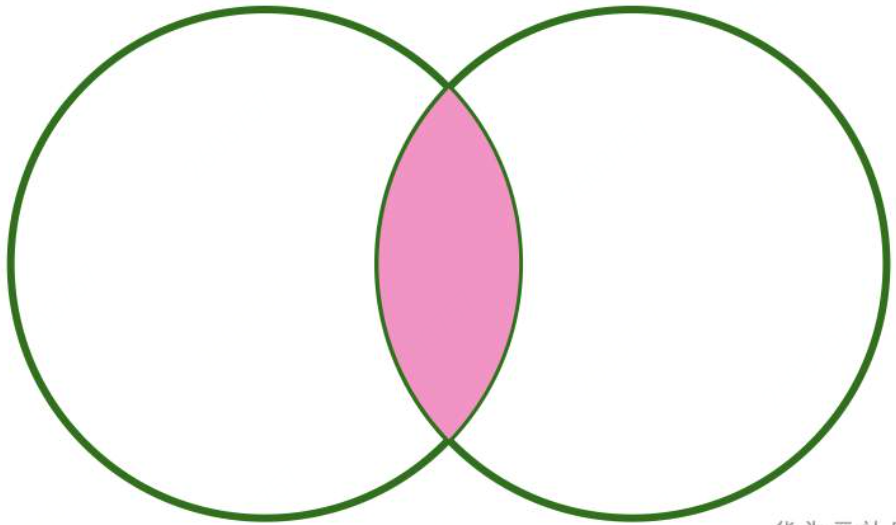
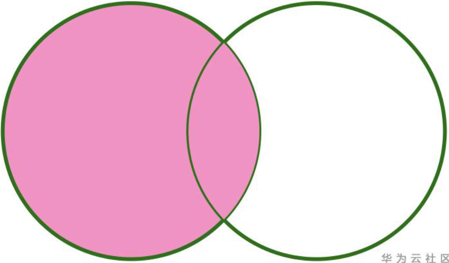
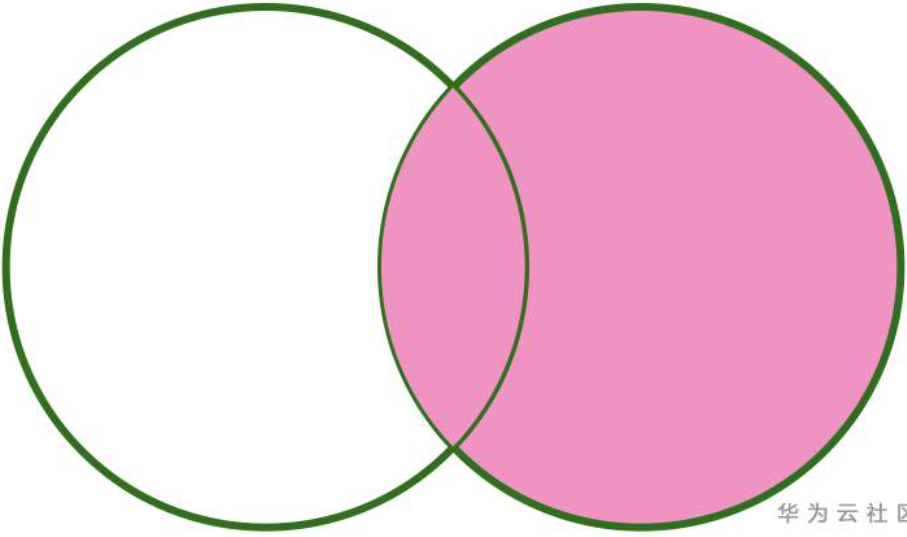
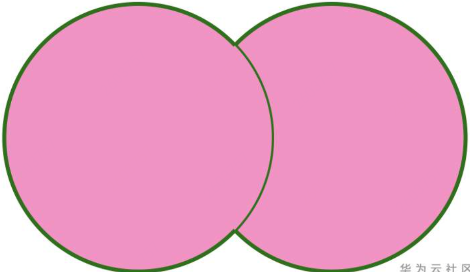
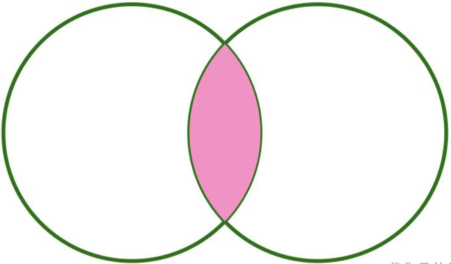
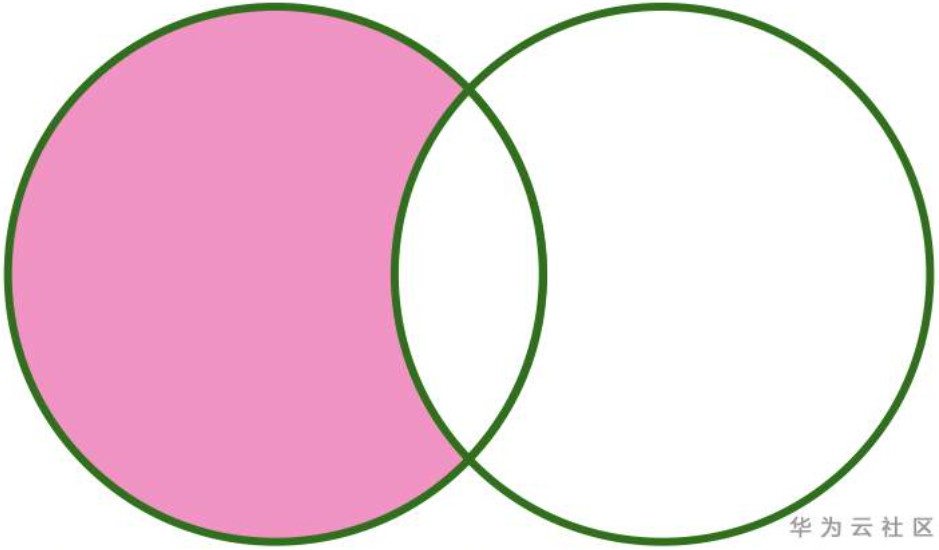
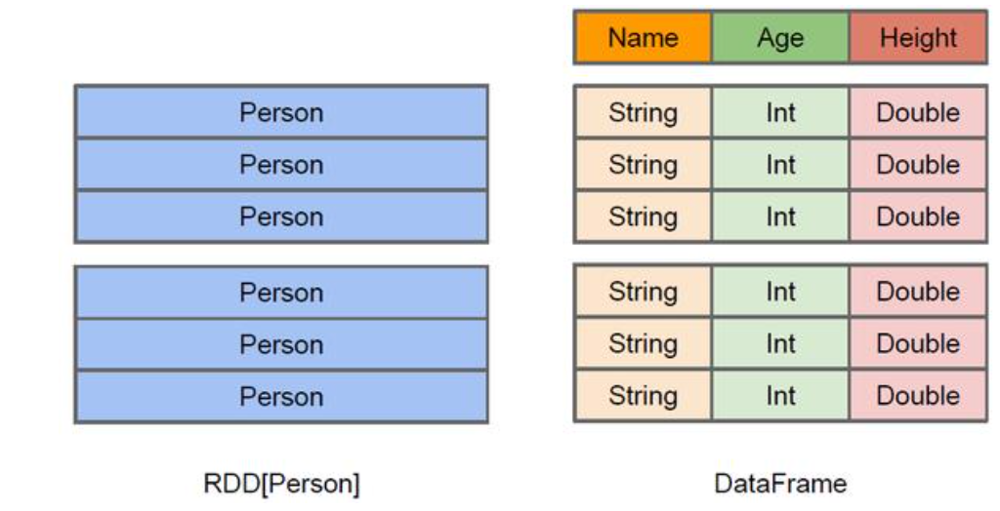
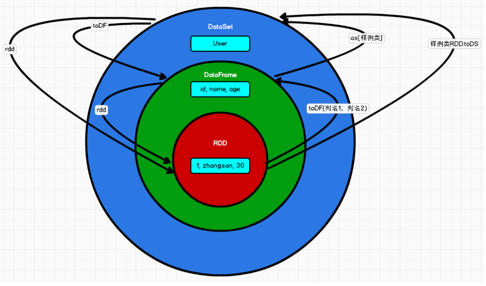

##### join

###### INNER JOIN

 在 Spark 中，如果没有指定任何 Join 类型，那么默认就是 INNER JOIN。INNER JOIN 只会返回满足 Join 条件（ join condition）的数据

```scala
val df = customer.join(order,"customerId")
```

在生成的结果中， Spark 自动为我们删除了两张表都存在的customerId。



###### CROSS JOIN

这种类型的 Join 也称为笛卡儿积，Join 左表的每行数据都会跟右表的每行数据进行 Join，产生的结果行数为$m \times n$

```scala
val df = customer.crossJoin(order)
```

###### LEFT OUTER JOIN

LEFT OUTER JOIN 等价于 LEFT JOIN

```scala
val leftJoinDf = customer.join(order,Seq("customerId"), "left_outer")

val leftJoinDf = customer.join(order,Seq("customerId"), "leftouter")

val leftJoinDf = customer.join(order,Seq("customerId"), "left")
```



###### RIGHT OUTER JOIN

RIGHT OUTER JOIN 等价于 RIGHT JOIN

```scala
val rightJoinDf = order.join(customer,Seq("customerId"), "right")
```



###### FULL OUTER JOIN

```scala
val fullJoinDf = order.join(customer,Seq("customerId"), "outer")

val fullJoinDf = order.join(customer,Seq("customerId"), "full")

val fullJoinDf = order.join(customer,Seq("customerId"), "full_outer")

val fullJoinDf = order.join(customer,Seq("customerId"), "fullouter")
```



###### LEFT SEMI JOIN

LEFT SEMI JOIN 只会返回匹配右表的数据，而且 LEFT SEMI JOIN 只会返回左表的数据，右表的数据是不会显示的

```scala
val leftSemiJoinDf = order.join(customer,Seq("customerId"), "leftsemi")

val leftSemiJoinDf = order.join(customer,Seq("customerId"), "left_semi")

val leftSemiJoinDf = order.join(customer,Seq("customerId"), "semi")
```



###### LEFT ANTI JOIN

LEFT ANTI JOIN 只会返回没有匹配到右表的左表数据。

```scala
val leftAntiJoinDf = customer.join(order,Seq("customerId"), "leftanti")

val leftAntiJoinDf = customer.join(order,Seq("customerId"), "left_anti")

val leftAntiJoinDf = customer.join(order,Seq("customerId"), "anti")
```



在对列数据做`concat_ws`时，子查询中`order by`排序好的顺序会发生错乱的问题。产生这个问题的根本原因自然在MapReduce，如果启动了多于一个mapper/reducer来处理数据，`select`出来的数据顺序就几乎肯定与原始顺序不同了。考虑把mapper数固定成1比较麻烦，也不现实，只使用`sort_array`如果不对列`lpad`补0的话容易出现排序混乱，所以要迂回地解决问题：把rank列加进来再进行一次排序，拼接完之后把rank列去掉。

```
select category_id,
       regexp_replace(
         concat_ws(',',
           sort_array(
             collect_list(
               concat_ws(':',lpad(cast(rank as string),5,'0'),cast(topic_id as string))
             )
           )
         ),
       '\\d+\:','')
from topic_recommend_score
where rank >= 1 and rank <= 1000
group by category_id;
```

```shell
#kill正在跑进程
yarn application -kill application_1450259063324_0001
```


##### 日期

以后记得日期比较都转为日期类型，或者采用日期函数来进行比较，以免出现为空或者格式不统一等情况造成不可预期的情况。

```python
spark.sql("""
select null<='2022-01-10 10:00:00'
""").show(10, False) # null

spark.sql("""
select ''<='2022-01-10 10:00:00'
""").show(10, False) # true
```

```python
spark.sql("""
select cast('' as int)
""").show(10, False) # null
spark.sql("""
select to_date('')
""").show(10, False) # null
```

| 函数                        | 作用         | 例子                    |
| --------------------------- | ------------ | ----------------------- |
| `current_date()`            | 获取当前日期 | 2022-02-16              |
| `current_timestamp()/now()` | 获取当前时间 | 2022-02-16 11:24:54.214 |

###### 从日期时间中提取字段

```sql
-- year,month,day/dayofmonth,hour,minute,second
SELECT day('2009-07-30'); -- 30
-- dayofmonth(CAST(2009-07-30 10:00:00 AS DATE))

-- dayofweek (1 = Sunday, 2 = Monday, ..., 7 = Saturday),dayofyear
SELECT dayofweek('2022-02-16'); -- 4 星期三 
-- weekofyear: Returns the week of the year of the given date.

-- trunc截取某部分的日期，其他部分默认为01
-- 第二个参数 ["year", "yyyy", "yy", "mon", "month", "mm"]
SELECT trunc('2009-02-12', 'MM'); -- 2009-02-01
SELECT trunc('2015-10-27', 'YEAR'); -- 2015-01-01

-- date_trunc ["YEAR", "YYYY", "YY", "MON", "MONTH", "MM", "DAY", "DD", "HOUR", "MINUTE", "SECOND", "WEEK", "QUARTER"]
SELECT date_trunc('hour','2009-07-30 10:00:00'); -- 2009-07-30 10:00:00

-- date_format将时间转化为某种格式的字符串
SELECT date_format('2016-04-08', 'y'); -- 2016
```

###### 日期时间转换

| 函数             | 作用                       |
| ---------------- | -------------------------- |
| `unix_timestamp` | 返回当前时间的`unix`时间戳 |
| `from_unixtime`  | 将时间戳换算成当前时间     |
| `to_date/date`   | 将字符串转化为日期格式     |
| `to_timestamp`   | 将字符串转化为时间         |
| `quarter `       | 将1年4等分                 |

```sql
SELECT unix_timestamp();　　-- 1476884637
SELECT unix_timestamp('2016-04-08', 'yyyy-MM-dd');　-- 2016-04-08的unix时间戳1460041200

SELECT from_unixtime(0, 'yyyy-MM-dd HH:mm:ss');　　-- 1970-01-01 00:00:00

SELECT to_date('2009-07-30 04:17:52');　　-- 2009-07-30
SELECT to_date('2016-12-31', 'yyyy-MM-dd');　　 -- 2016-12-31

SELECT to_timestamp('2016-12-31 00:12:00');　　 -- 2016-12-31 00:12:00

SELECT quarter('2016-08-31'); -3
```

###### 日期、时间计算

| 函数                                | 作用                                                      |
| ----------------------------------- | --------------------------------------------------------- |
| `months_between`                    | 两个日期之间的月数                                        |
| `add_months`                        | 返回日期后n个月后的日期                                   |
| `last_day(date)`                    |                                                           |
| `next_day(start_date, day_of_week)` |                                                           |
| `date_add(start_date, num_days)`    | Returns the date that is `num_days` after `start_date`.   |
| `date_sub`                          | Returns the date that is `num_days` before `start_date`.  |
| `datediff(endDate, startDate) `     | Returns the number of days from `startDate` to `endDate`. |

```sql
SELECT months_between('1997-02-28 10:30:00', '1996-10-30'); -- 3.94959677

SELECT add_months('2016-08-31', 1); -- 2016-09-30

SELECT last_day('2009-01-12');　　-- 2009-01-31

SELECT next_day('2015-01-14', 'TU');　　-- 2015-01-20

SELECT date_add('2016-07-30', 1);　　-- 2016-07-31

SELECT datediff('2009-07-31', '2009-07-30'); -- 1
```

###Spark SQL DataFrames and DataSets
DataFrame 与 RDD 的主要区别在于，前者带有 schema 元信息，即 DataFrame 所表示的二维表数据集的每一列都带有名称和类型。

DataFrame 是为数据提供了 Schema 的视图。可以把它当做数据库中的一张表来对待 DataFrame 也是懒执行的，但性能上比 RDD 要高，主要原因:优化的执行计划，即查询计 划通过 Spark catalyst optimiser 进行优化。

DataSet 是分布式数据集合。DataSet是 DataFrame 的一个扩展。它提供了 RDD 的优势(强类型，使用强大的 lambda 函数的能力)以及 Spark SQL 优化执行引擎的优点。
```scala
//注意:涉及到运算的时候, 每列都必须使用$, 或者采用引号表达式:单引号+字段名
df.select($"username",$"age" + 1).show
df.select('username, 'age + 1).show()
df.select('username, 'age + 1 as "newage").show()

```
如果需要 RDD 与 DF 或者 DS 之间互相操作，那么需要引入
`import spark.implicits._`. 这里的 spark 不是 Scala 中的包名，而是创建的 sparkSession 对象的变量名称，所以必 须先创建 SparkSession 对象再导入。这里的 spark 对象不能使用 var 声明，因为 Scala 只支持 val 修饰的对象的引入。
```scala
case class User(name:String, age:Int)
sc.makeRDD(List(("zhangsan",30), ("lisi",40))).map(t=>User(t._1, t._2)).toDF.show
```
DataFrame
➢ 与RDD和Dataset不同，DataFrame每一行的类型固定为Row，每一列的值没法直 接访问，只有通过解析才能获取各个字段的值
➢ DataFrame 与 DataSet 一般不与 spark mllib 同时使用
➢ DataFrame 与 DataSet 均支持 SparkSQL 的操作，比如 select，groupby 之类，还能 注册临时表/视窗，进行 sql 语句操作
➢ DataFrame与DataSet支持一些特别方便的保存方式，比如保存成csv，可以带上表 头，这样每一列的字段名一目了然(后面专门讲解)
3) DataSet
➢ Dataset和DataFrame拥有完全相同的成员函数，区别只是每一行的数据类型不同。
DataFrame 其实就是 DataSet 的一个特例 type DataFrame = Dataset[Row]
➢ DataFrame也可以叫Dataset[Row],每一行的类型是Row，不解析，每一行究竟有哪 些字段，各个字段又是什么类型都无从得知，只能用上面提到的 getAS 方法或者共 性中的第七条提到的模式匹配拿出特定字段。而 Dataset 中，每一行是什么类型是
不一定的，在自定义了 case class 之后可以很自由的获得每一行的信息
   


```scala
import org.apache.spark.sql.SparkSession

val spark = SparkSession
  .builder()
  .appName("Spark SQL basic example")
  .config("spark.some.config.option", "some-value")
  .getOrCreate()
```
With a SparkSession, applications can create DataFrames from an existing RDD, from a Hive table, or from Spark data sources.
```scala
val df = spark.read.json("examples/src/main/resources/people.json")
```
As mentioned above, in Spark 2.0, DataFrames are just Dataset of Rows in Scala and Java API. These operations are also referred as “untyped transformations” in contrast to “typed transformations” come with strongly typed Scala/Java Datasets.
```scala
// This import is needed to use the $-notation
import spark.implicits._
// Print the schema in a tree format
df.printSchema()
// root
// |-- age: long (nullable = true)
// |-- name: string (nullable = true)

// Select only the "name" column
df.select("name").show()

df.select($"name", $"age" + 1).show()

df.filter($"age" > 21).show()

df.groupBy("age").count().show()

```
Temporary views in Spark SQL are session-scoped and will disappear if the session that creates it terminates. If you want to have a temporary view that is shared among all sessions and keep alive until the Spark application terminates, you can create a global temporary view. Global temporary view is tied to a system preserved database global_temp, and we must use the qualified name to refer it, e.g. `SELECT * FROM global_temp.view1`.

###### Creating DataSets
```scala
case class Person(name: String, age: Long)

// Encoders are created for case classes
val caseClassDS = Seq(Person("Andy", 32)).toDS()
caseClassDS.show()
// +----+---+
// |name|age|
// +----+---+
// |Andy| 32|
// +----+---+

// Encoders for most common types are automatically provided by importing spark.implicits._
val primitiveDS = Seq(1, 2, 3).toDS()
primitiveDS.map(_ + 1).collect() // Returns: Array(2, 3, 4)

// DataFrames can be converted to a Dataset by providing a class. Mapping will be done by name
val path = "examples/src/main/resources/people.json"
val peopleDS = spark.read.json(path).as[Person]
peopleDS.show()
```
#####Interoperating with RDDs
######Inferring the Schema Using Reflection
The Scala interface for Spark SQL supports automatically converting an RDD containing case classes to a DataFrame. The case class defines the schema of the table. The names of the arguments to the case class are read using reflection and become the names of the columns. Case classes can also be nested or contain complex types such as Seqs or Arrays. This RDD can be implicitly converted to a DataFrame and then be registered as a table. 
```scala
// For implicit conversions from RDDs to DataFrames
import spark.implicits._

// Create an RDD of Person objects from a text file, convert it to a Dataframe
val peopleDF = spark.sparkContext
  .textFile("examples/src/main/resources/people.txt")
  .map(_.split(","))
  .map(attributes => Person(attributes(0), attributes(1).trim.toInt))
  .toDF()
// Register the DataFrame as a temporary view
peopleDF.createOrReplaceTempView("people")

// SQL statements can be run by using the sql methods provided by Spark
val teenagersDF = spark.sql("SELECT name, age FROM people WHERE age BETWEEN 13 AND 19")

// The columns of a row in the result can be accessed by field index
teenagersDF.map(teenager => "Name: " + teenager(0)).show()
// +------------+
// |       value|
// +------------+
// |Name: Justin|
// +------------+

// or by field name
teenagersDF.map(teenager => "Name: " + teenager.getAs[String]("name")).show()
// +------------+
// |       value|
// +------------+
// |Name: Justin|
// +------------+

// No pre-defined encoders for Dataset[Map[K,V]], define explicitly
implicit val mapEncoder = org.apache.spark.sql.Encoders.kryo[Map[String, Any]]
// Primitive types and case classes can be also defined as
// implicit val stringIntMapEncoder: Encoder[Map[String, Any]] = ExpressionEncoder()

// row.getValuesMap[T] retrieves multiple columns at once into a Map[String, T]
teenagersDF.map(teenager => teenager.getValuesMap[Any](List("name", "age"))).collect()
// Array(Map("name" -> "Justin", "age" -> 19))
```
######Programmatically Specifying the Schema
When case classes cannot be defined ahead of time (for example, the structure of records is encoded in a string, or a text dataset will be parsed and fields will be projected differently for different users), a DataFrame can be created programmatically with three steps.

1. Create an RDD of Rows from the original RDD;
2. Create the schema represented by a StructType matching the structure of Rows in the RDD created in Step 1.
3. Apply the schema to the RDD of Rows via createDataFrame method provided by SparkSession.

```scala
import org.apache.spark.sql.Row

import org.apache.spark.sql.types._

// Create an RDD
val peopleRDD = spark.sparkContext.textFile("examples/src/main/resources/people.txt")

// The schema is encoded in a string
val schemaString = "name age"

// Generate the schema based on the string of schema
val fields = schemaString.split(" ")
  .map(fieldName => StructField(fieldName, StringType, nullable = true))
val schema = StructType(fields)

// Convert records of the RDD (people) to Rows
val rowRDD = peopleRDD
  .map(_.split(","))
  .map(attributes => Row(attributes(0), attributes(1).trim))

// Apply the schema to the RDD
val peopleDF = spark.createDataFrame(rowRDD, schema)

// Creates a temporary view using the DataFrame
peopleDF.createOrReplaceTempView("people")

// SQL can be run over a temporary view created using DataFrames
val results = spark.sql("SELECT name FROM people")

```
####Data Sources
A DataFrame is a Dataset organized into named columns. It is conceptually equivalent to a table in 
a relational database or a data frame in R/Python, but with richer optimizations under the hood. 
In Scala and Java, a DataFrame is represented by a Dataset of Rows. In the Scala API, DataFrame is 
simply a type alias of `Dataset[Row]`. While, in Java API, users need to use `Dataset<Row>` to represent a DataFrame.


```scala
val peopleDF = spark.read.format("json").load("examples/src/main/resources/people.json")
peopleDF.select("name", "age").write.format("parquet").save("namesAndAges.parquet")

val peopleDFCsv = spark.read.format("csv")
  .option("sep", ";")
  .option("inferSchema", "true")
  .option("header", "true")
  .load("examples/src/main/resources/people.csv")

usersDF.write.format("orc")
  .option("orc.bloom.filter.columns", "favorite_color")
  .option("orc.dictionary.key.threshold", "1.0")
  .option("orc.column.encoding.direct", "name")
  .save("users_with_options.orc")

usersDF.write.format("parquet")
  .option("parquet.bloom.filter.enabled#favorite_color", "true")
  .option("parquet.bloom.filter.expected.ndv#favorite_color", "1000000")
  .option("parquet.enable.dictionary", "true")
  .option("parquet.page.write-checksum.enabled", "false")
  .save("users_with_options.parquet")
```
#####Save Modes
Save operations can optionally take a SaveMode, that specifies how to handle existing data if present. It is important to realize that these save modes do not utilize any locking and are not atomic. Additionally, when performing an Overwrite, the data will be deleted before writing out the new data.

|Scala/Java|	Any Language|	Meaning|
|----------|----------------|----------|
|SaveMode.ErrorIfExists (default)|	"error" or "errorifexists" (default)	|When saving a DataFrame to a data source, if data already exists, an exception is expected to be thrown.
|SaveMode.Append	|"append"	|When saving a DataFrame to a data source, if data/table already exists, contents of the DataFrame are expected to be appended to existing data.
|SaveMode.Overwrite	|"overwrite"|	Overwrite mode means that when saving a DataFrame to a data source, if data/table already exists, existing data is expected to be overwritten by the contents of the DataFrame.
|SaveMode.Ignore|	"ignore"	|Ignore mode means that when saving a DataFrame to a data source, if data already exists, the save operation is expected not to save the contents of the DataFrame and not to change the existing data. This is similar to a CREATE TABLE IF NOT EXISTS in SQL.
#####Generic File Source Options
These generic options/configurations are effective only when using file-based sources: parquet, orc, avro, json, csv, text.

pathGlobFilter is used to only include files with file names matching the pattern. The syntax follows org.apache.hadoop.fs.GlobFilter. It does not change the behavior of partition discovery.
```scala
val testGlobFilterDF = spark.read.format("parquet")
  .option("pathGlobFilter", "*.parquet") // json file should be filtered out
  .load("examples/src/main/resources/dir1")
testGlobFilterDF.show()
```
```python
df = spark.read.load("examples/src/main/resources/dir1",
                     format="parquet", pathGlobFilter="*.parquet")
```
recursiveFileLookup is used to recursively load files and it disables partition inferring. Its default value is false. If data source explicitly specifies the partitionSpec when recursiveFileLookup is true, exception will be thrown.

```python
recursive_loaded_df = spark.read.format("parquet")\
    .option("recursiveFileLookup", "true")\
    .load("examples/src/main/resources/dir1")
recursive_loaded_df.show()
# +-------------+
# |         file|
# +-------------+
# |file1.parquet|
# |file2.parquet|
# +-------------+
```
##### Parquet
All built-in file sources (including Text/CSV/JSON/ORC/Parquet) are able to discover and infer partitioning information automatically.
```
path
└── to
    └── table
        ├── gender=male
        │   ├── ...
        │   │
        │   ├── country=US
        │   │   └── data.parquet
        │   ├── country=CN
        │   │   └── data.parquet
        │   └── ...
        └── gender=female
            ├── ...
            │
            ├── country=US
            │   └── data.parquet
            ├── country=CN
            │   └── data.parquet
            └── ...
```
By passing path/to/table to either SparkSession.read.parquet or SparkSession.read.load, Spark SQL will automatically extract the partitioning information from the paths. Now the schema of the returned DataFrame becomes:
```
root
|-- name: string (nullable = true)
|-- age: long (nullable = true)
|-- gender: string (nullable = true)
|-- country: string (nullable = true)
```
Notice that the data types of the partitioning columns are automatically inferred. Currently, numeric data types, date, timestamp and string type are supported. Sometimes users may not want to automatically infer the data types of the partitioning columns. For these use cases, the automatic type inference can be configured by spark.sql.sources.partitionColumnTypeInference.enabled, which is default to true. When type inference is disabled, string type will be used for the partitioning columns.


#### Performance Tuning
##### Caching Data In Memory
Spark SQL can cache tables using an in-memory columnar format by calling `spark.catalog.cacheTable("tableName")` or `dataFrame.cache()`. Then Spark SQL will scan only required columns and will automatically tune compression to minimize memory usage and GC pressure. You can call `spark.catalog.uncacheTable("tableName")` or `dataFrame.unpersist()` to remove the table from memory.

Configuration of in-memory caching can be done using the setConf method on SparkSession or by running SET key=value commands using SQL.
##### Join Strategy Hints for SQL Queries
The join strategy hints, namely BROADCAST, MERGE, SHUFFLE_HASH and SHUFFLE_REPLICATE_NL, instruct Spark to use the hinted strategy on each specified relation when joining them with another relation.

When different join strategy hints are specified on both sides of a join, Spark prioritizes the BROADCAST hint over the MERGE hint over the SHUFFLE_HASH hint over the SHUFFLE_REPLICATE_NL hint. When both sides are specified with the BROADCAST hint or the SHUFFLE_HASH hint, Spark will pick the build side based on the join type and the sizes of the relations.

Note that there is no guarantee that Spark will choose the join strategy specified in the hint since a specific strategy may not support all join types.

```scala
spark.table("src").join(spark.table("records").hint("broadcast"), "key").show()
```
#####Adaptive Query Execution
Adaptive Query Execution (AQE) is an optimization technique in Spark SQL that makes use of the runtime statistics to choose the most efficient query execution plan, which is enabled by default since Apache Spark 3.2.0. Spark SQL can turn on and off AQE by spark.sql.adaptive.enabled as an umbrella configuration.
######Coalescing Post Shuffle Partitions
This feature coalesces the post shuffle partitions based on the map output statistics when both spark.sql.adaptive.enabled and spark.sql.adaptive.coalescePartitions.enabled configurations are true. This feature simplifies the tuning of shuffle partition number when running queries. You do not need to set a proper shuffle partition number to fit your dataset. Spark can pick the proper shuffle partition number at runtime once you set a large enough initial number of shuffle partitions via spark.sql.adaptive.coalescePartitions.initialPartitionNum configuration.
######Converting sort-merge join to broadcast join
AQE converts sort-merge join to broadcast hash join when the runtime statistics of any join side is smaller than the adaptive broadcast hash join threshold. This is not as efficient as planning a broadcast hash join in the first place, but it’s better than keep doing the sort-merge join, as we can save the sorting of both the join sides, and read shuffle files locally to save network traffic(if spark.sql.adaptive.localShuffleReader.enabled is true)
######Converting sort-merge join to shuffled hash join
AQE converts sort-merge join to shuffled hash join when all post shuffle partitions are smaller than a threshold, the max threshold can see the config spark.sql.adaptive.maxShuffledHashJoinLocalMapThreshold.
##### Optimizing Skew Join
Data skew can severely downgrade the performance of join queries. This feature dynamically handles skew in sort-merge join by splitting (and replicating if needed) skewed tasks into roughly evenly sized tasks. It takes effect when both spark.sql.adaptive.enabled and spark.sql.adaptive.skewJoin.enabled configurations are enabled.
|Property Name|Default|Meaning|Since Version|
|--|--|--|--|
|`spark.sql.adaptive.skewJoin.enabled`|true|When true and spark.sql.adaptive.enabled is true, Spark dynamically handles skew in sort-merge join by splitting (and replicating if needed) skewed partitions.|3.0.0|
|`spark.sql.adaptive.skewJoin.skewedPartitionFactor`|5|A partition is considered as skewed if its size is larger than this factor multiplying the median partition size and also larger than spark.sql.adaptive.skewJoin.skewedPartitionThresholdInBytes.|3.0.0|
|`spark.sql.adaptive.skewJoin.skewedPartitionThresholdInBytes	`|256MB|A partition is considered as skewed if its size in bytes is larger than this threshold and also larger than spark.sql.adaptive.skewJoin.skewedPartitionFactor multiplying the median partition size. Ideally this config should be set larger than spark.sql.adaptive.advisoryPartitionSizeInBytes.|3.0.0|

####NULL Semantics
#####Comparison Operators
The following table illustrates the behaviour of comparison operators when one or both operands are NULL
|Left Operand|Right Operand|>|>=|=|<|<=|<=>|
|--|--|--|--|--|--|--|--|
NULL|Any value|NULL|NULL|NULL|NULL|NULL|False|
Any value|NULL|NULL|NULL|NULL|NULL|NULL|False|
NULL|NULL|NULL|NULL|NULL|NULL|NULL|True|
#####Logical Operators 
The following tables illustrate the behavior of logical operators when one or both operands are NULL.
|Left Operand|Right Operand|OR|AND|
|--|--|--|--|
|True|NULL|True|NULL|
|False|NULL|NULL|False|
|NULL|True|True|NULL|
|NULL|Fasle|NULL|False|
|NULL|NULL|NULL|NULL|

|operand|NOT|
|--|--|
|NULL|NULL|

#####Expressions
The expressions in Spark can be broadly classified as :
- Null intolerant expressions
- Expressions that can process NULL value operands. The result of these expressions depends on the expression itself.
######Null Intolerant Expressions
Null intolerant expressions return NULL when one or more arguments of expression are NULL and most of the expressions fall in this category.
######Expressions That Can Process Null Value Operands
This class of expressions are designed to handle NULL values. The result of the expressions depends on the expression itself. Below is an incomplete list of expressions of this category.

COALESCE
NULLIF
IFNULL
NVL
NVL2
ISNAN
NANVL
ISNULL
ISNOTNULL
ATLEASTNNONNULLS
IN
#####Builtin Aggregate Expressions
Aggregate functions compute a single result by processing a set of input rows. Below are the rules of how NULL values are handled by aggregate functions.

- NULL values are ignored from processing by all the aggregate functions. Only exception to this rule is COUNT(*) function.
- Some aggregate functions return NULL when all input values are NULL or the input data set is empty.
The list of these functions is:
MAX
MIN
SUM
AVG
EVERY
ANY
SOME
##### Condition Expressions in WHERE, HAVING and JOIN Clauses 
WHERE, HAVING operators filter rows based on the user specified condition. A JOIN operator is used to combine rows from two tables based on a join condition. For all the three operators, a condition expression is a boolean expression and can return True, False or Unknown (NULL). **They are “satisfied” if the result of the condition is True**.

##### Aggregate Operator (GROUP BY, DISTINCT) 
As discussed in the previous section comparison operator, two NULL values are not equal. However, for the purpose of grouping and distinct processing, the two or more values with NULL dataare grouped together into the same bucket.
#####Sort Operator (ORDER BY Clause) 
Spark SQL supports null ordering specification in ORDER BY clause. Spark processes the ORDER BY clause by placing all the NULL values at first or at last depending on the null ordering specification. By default, all the NULL values are placed at first.
```sql
SELECT age, name FROM person ORDER BY age NULLS LAST;
```
#####Set Operators (UNION, INTERSECT, EXCEPT) 
NULL values are compared in a null-safe manner for equality in the context of set operations. That means when comparing rows, two NULL values are considered equal unlike the regular EqualTo(=) operator.

#####EXISTS/NOT EXISTS Subquery
These are boolean expressions which return either TRUE or FALSE. In other words, EXISTS is a membership condition and returns TRUE when the subquery it refers to returns one or more rows. Similarly, NOT EXISTS is a non-membership condition and returns TRUE when no rows or zero rows are returned from the subquery.

These two expressions are not affected by presence of NULL in the result of the subquery. They are normally faster because they can be converted to semijoins / anti-semijoins without special provisions for null awareness.

#####IN/NOT IN Subquery 
Unlike the EXISTS expression, IN expression can return a TRUE, FALSE or UNKNOWN (NULL) value. Conceptually a IN expression is semantically equivalent to a set of equality condition separated by a disjunctive operator (OR). For example, c1 IN (1, 2, 3) is semantically equivalent to (C1 = 1 OR c1 = 2 OR c1 = 3).

As far as handling NULL values are concerned, the semantics can be deduced from the NULL value handling in comparison operators(=) and logical operators(OR). To summarize, below are the rules for computing the result of an IN expression.

- TRUE is returned when the non-NULL value in question is found in the list
- FALSE is returned when the non-NULL value is not found in the list and the list does not contain NULL values
- UNKNOWN is returned when the value is NULL, or the non-NULL value is not found in the list and the list contains at least one NULL value

NOT IN always returns UNKNOWN when the list contains NULL, regardless of the input value. This is because IN returns UNKNOWN if the value is not in the list containing NULL, and because NOT UNKNOWN is again UNKNOWN.

#### SQL Syntax
##### DDL Statements
Data Definition Statements are used to create or modify the structure of database objects in a database.
```sql
ALTER TABLE table_identifier ADD COLUMNS ( col_spec [ , ... ] )
ALTER TABLE StudentInfo ADD columns (LastName string, DOB timestamp);

-- create function
CREATE [ OR REPLACE ] [ TEMPORARY ] FUNCTION [ IF NOT EXISTS ]
    function_name AS class_name [ resource_locations ]
    
CREATE FUNCTION simple_udf AS 'SimpleUdf'
    USING JAR '/tmp/SimpleUdf.jar';

#create view
CREATE [ OR REPLACE ] [ [ GLOBAL ] TEMPORARY ] VIEW [ IF NOT EXISTS ] view_identifier
    create_view_clauses AS query
-- Create a global temporary view `subscribed_movies` if it does not exist.
CREATE GLOBAL TEMPORARY VIEW IF NOT EXISTS subscribed_movies 
    AS SELECT mo.member_id, mb.full_name, mo.movie_title
        FROM movies AS mo INNER JOIN members AS mb 
        ON mo.member_id = mb.id;

#drop function
DROP [ TEMPORARY ] FUNCTION [ IF EXISTS ] function_name
#drop view
DROP VIEW [ IF EXISTS ] view_identifier
```
######REPAIR TABLE
MSCK REPAIR TABLE recovers all the partitions in the directory of a table and updates the Hive metastore. When creating a table using PARTITIONED BY clause, partitions are generated and registered in the Hive metastore. However, if the partitioned table is created from existing data, partitions are not registered automatically in the Hive metastore. User needs to run MSCK REPAIR TABLE to register the partitions. MSCK REPAIR TABLE on a non-existent table or a table without partitions throws an exception. Another way to recover partitions is to use ALTER TABLE RECOVER PARTITIONS.

If the table is cached, the command clears cached data of the table and all its dependents that refer to it. The cache will be lazily filled when the next time the table or the dependents are accessed.
```sql
MSCK REPAIR TABLE table_identifier [{ADD|DROP|SYNC} PARTITIONS]

-- create a partitioned table from existing data /tmp/namesAndAges.parquet
CREATE TABLE t1 (name STRING, age INT) USING parquet PARTITIONED BY (age)
    LOCATION "/tmp/namesAndAges.parquet";

-- SELECT * FROM t1 does not return results
SELECT * FROM t1;

-- run MSCK REPAIR TABLE to recovers all the partitions
MSCK REPAIR TABLE t1;
```
#####DML Statements
Data Manipulation Statements are used to add, change, or delete data. Spark SQL supports the following Data Manipulation Statements

The INSERT OVERWRITE statement overwrites the existing data in the table using the new values. The inserted rows can be specified by value expressions or result from a query.
```sql
INSERT OVERWRITE [ TABLE ] table_identifier [ partition_spec [ IF NOT EXISTS ] ] [ ( column_list ) ]
    { VALUES ( { value | NULL } [ , ... ] ) [ , ( ... ) ] | query }

INSERT OVERWRITE students PARTITION (student_id = 11215016) (address, name) VALUES
    ('Hangzhou, China', 'Kent Yao Jr.');
```
#####Data Retrieval Statements
Spark supports SELECT statement that is used to retrieve rows from one or more tables according to the specified clauses.
###### Common Table Expression
A common table expression (CTE) defines a temporary result set that a user can reference possibly multiple times within the scope of a SQL statement. A CTE is used mainly in a SELECT statement.

```sql
WITH common_table_expression [ , ... ]

--While common_table_expression is defined as
expression_name [ ( column_name [ , ... ] ) ] [ AS ] ( query )

-- CTE with multiple column aliases
WITH t(x, y) AS (SELECT 1, 2)
SELECT * FROM t WHERE x = 1 AND y = 2;

```
######CLUSTER BY Clause
The CLUSTER BY clause is used to first repartition the data based on the input expressions and then sort the data within each partition. This is semantically equivalent to performing a DISTRIBUTE BY followed by a SORT BY. This clause only ensures that the resultant rows are sorted within each partition and does not guarantee a total order of output.
```sql
SELECT age, name FROM person CLUSTER BY age;
```
######DISTRIBUTE BY Clause
The DISTRIBUTE BY clause is used to repartition the data based on the input expressions. Unlike the CLUSTER BY clause, this does not sort the data within each partition.
```sql
SELECT age, name FROM person DISTRIBUTE BY age;
```
######GROUP BY Clause
The GROUP BY clause is used to group the rows based on a set of specified grouping expressions and compute aggregations on the group of rows based on one or more specified aggregate functions. Spark also supports advanced aggregations to do multiple aggregations for the same input record set via GROUPING SETS, CUBE, ROLLUP clauses. The grouping expressions and advanced aggregations can be mixed in the GROUP BY clause and nested in a GROUPING SETS clause.
```sql
GROUP BY group_expression [ , group_expression [ , ... ] ] [ WITH { ROLLUP | CUBE } ]

GROUP BY { group_expression | { ROLLUP | CUBE | GROUPING SETS } (grouping_set [ , ...]) } [ , ... ]
--While aggregate functions are defined as

aggregate_name ( [ DISTINCT ] expression [ , ... ] ) [ FILTER ( WHERE boolean_expression ) ]
```
**ROLLUP**: Specifies multiple levels of aggregations in a single statement. This clause is used to compute aggregations based on multiple grouping sets. ROLLUP is a shorthand for GROUPING SETS. For example, GROUP BY warehouse, product WITH ROLLUP or GROUP BY ROLLUP(warehouse, product) is equivalent to GROUP BY GROUPING SETS((warehouse, product), (warehouse), ()). GROUP BY ROLLUP(warehouse, product, (warehouse, location)) is equivalent to GROUP BY GROUPING SETS((warehouse, product, location), (warehouse, product), (warehouse), ()). The N elements of a ROLLUP specification results in N+1 GROUPING SETS.

**CUBE**: CUBE clause is used to perform aggregations based on combination of grouping columns specified in the GROUP BY clause. CUBE is a shorthand for GROUPING SETS. For example, GROUP BY warehouse, product WITH CUBE or GROUP BY CUBE(warehouse, product) is equivalent to GROUP BY GROUPING SETS((warehouse, product), (warehouse), (product), ()). GROUP BY CUBE(warehouse, product, (warehouse, location)) is equivalent to GROUP BY GROUPING SETS((warehouse, product, location), (warehouse, product), (warehouse, location), (product, warehouse, location), (warehouse), (product), (warehouse, product), ()). The N elements of a CUBE specification results in 2^N GROUPING SETS.

```sql
-- Sum of only 'Honda Civic' and 'Honda CRV' quantities per dealership.
SELECT id, sum(quantity) FILTER (
            WHERE car_model IN ('Honda Civic', 'Honda CRV')
        ) AS `sum(quantity)` FROM dealer
    GROUP BY id ORDER BY id;
    
    
CREATE TABLE dealer (id INT, city STRING, car_model STRING, quantity INT);
INSERT INTO dealer VALUES
    (100, 'Fremont', 'Honda Civic', 10),
    (100, 'Fremont', 'Honda Accord', 15),
    (100, 'Fremont', 'Honda CRV', 7),
    (200, 'Dublin', 'Honda Civic', 20),
    (200, 'Dublin', 'Honda Accord', 10),
    (200, 'Dublin', 'Honda CRV', 3),
    (300, 'San Jose', 'Honda Civic', 5),
    (300, 'San Jose', 'Honda Accord', 8);

-- Aggregations using multiple sets of grouping columns in a single statement.
-- Following performs aggregations based on four sets of grouping columns.
-- 1. city, car_model
-- 2. city
-- 3. car_model
-- 4. Empty grouping set. Returns quantities for all city and car models.
SELECT city, car_model, sum(quantity) AS sum FROM dealer
    GROUP BY GROUPING SETS ((city, car_model), (city), (car_model), ())
    ORDER BY city;
+---------+------------+---+
|     city|   car_model|sum|
+---------+------------+---+
|     null|        null| 78|
|     null| HondaAccord| 33|
|     null|    HondaCRV| 10|
|     null|  HondaCivic| 35|
|   Dublin|        null| 33|
|   Dublin| HondaAccord| 10|
|   Dublin|    HondaCRV|  3|
|   Dublin|  HondaCivic| 20|
|  Fremont|        null| 32|
|  Fremont| HondaAccord| 15|
|  Fremont|    HondaCRV|  7|
|  Fremont|  HondaCivic| 10|
| San Jose|        null| 13|
| San Jose| HondaAccord|  8|
| San Jose|  HondaCivic|  5|
+---------+------------+---+

-- Group by processing with `ROLLUP` clause.
-- Equivalent GROUP BY GROUPING SETS ((city, car_model), (city), ())
SELECT city, car_model, sum(quantity) AS sum FROM dealer
    GROUP BY city, car_model WITH ROLLUP
    ORDER BY city, car_model;
+---------+------------+---+
|     city|   car_model|sum|
+---------+------------+---+
|     null|        null| 78|
|   Dublin|        null| 33|
|   Dublin| HondaAccord| 10|
|   Dublin|    HondaCRV|  3|
|   Dublin|  HondaCivic| 20|
|  Fremont|        null| 32|
|  Fremont| HondaAccord| 15|
|  Fremont|    HondaCRV|  7|
|  Fremont|  HondaCivic| 10|
| San Jose|        null| 13|
| San Jose| HondaAccord|  8|
| San Jose|  HondaCivic|  5|
+---------+------------+---+

-- Group by processing with `CUBE` clause.
-- Equivalent GROUP BY GROUPING SETS ((city, car_model), (city), (car_model), ())
SELECT city, car_model, sum(quantity) AS sum FROM dealer
    GROUP BY city, car_model WITH CUBE
    ORDER BY city, car_model;
+---------+------------+---+
|     city|   car_model|sum|
+---------+------------+---+
|     null|        null| 78|
|     null| HondaAccord| 33|
|     null|    HondaCRV| 10|
|     null|  HondaCivic| 35|
|   Dublin|        null| 33|
|   Dublin| HondaAccord| 10|
|   Dublin|    HondaCRV|  3|
|   Dublin|  HondaCivic| 20|
|  Fremont|        null| 32|
|  Fremont| HondaAccord| 15|
|  Fremont|    HondaCRV|  7|
|  Fremont|  HondaCivic| 10|
| San Jose|        null| 13|
| San Jose| HondaAccord|  8|
| San Jose|  HondaCivic|  5|
+---------+------------+---+
```
###### HAVING Clause
The HAVING clause is used to filter the results produced by GROUP BY based on the specified condition. It is often used in conjunction with a GROUP BY clause.
```sql
-- `HAVING` clause referring to column in `GROUP BY`.
SELECT city, sum(quantity) AS sum FROM dealer GROUP BY city HAVING city = 'Fremont';
+-------+---+
|   city|sum|
+-------+---+
|Fremont| 32|
+-------+---+
```
######Hints
Hints give users a way to suggest how Spark SQL to use specific approaches to generate its execution plan.
```sql
/*+ hint [ , ... ] */

```
Partitioning hints allow users to suggest a partitioning strategy that Spark should follow. COALESCE, REPARTITION, and REPARTITION_BY_RANGE hints are supported and are equivalent to coalesce, repartition, and repartitionByRange Dataset APIs, respectively. These hints give users a way to tune performance and control the number of output files in Spark SQL. When multiple partitioning hints are specified, multiple nodes are inserted into the logical plan, but the leftmost hint is picked by the optimizer.
- COALESCE: The COALESCE hint can be used to reduce the number of partitions to the specified number of partitions. 
  It takes a partition number as a parameter.

- REPARTITION: The REPARTITION hint can be used to repartition to the specified number of partitions using the specified partitioning expressions. It takes a partition number, column names, or both as parameters.

- REPARTITION_BY_RANGE: The REPARTITION_BY_RANGE hint can be used to repartition to the specified number of partitions using the specified partitioning expressions. It takes column names and an optional partition number as parameters.

- REBALANCE: The REBALANCE hint can be used to rebalance the query result output partitions, so that every partition is of a reasonable size (not too small and not too big). It can take column names as parameters, and try its best to partition the query result by these columns. 
  This is a best-effort: if there are skews, Spark will split the skewed partitions, to make these partitions not too big. This hint is useful when you need to write the result of this query to a table, to avoid too small/big files. This hint is ignored if AQE is not enabled.
```sql
SELECT /*+ COALESCE(3) */ * FROM t;

SELECT /*+ REPARTITION(3) */ * FROM t;

SELECT /*+ REPARTITION(c) */ * FROM t;

SELECT /*+ REPARTITION(3, c) */ * FROM t;

SELECT /*+ REPARTITION_BY_RANGE(c) */ * FROM t;

SELECT /*+ REPARTITION_BY_RANGE(3, c) */ * FROM t;

SELECT /*+ REBALANCE */ * FROM t;

SELECT /*+ REBALANCE(c) */ * FROM t;
```
Join hints allow users to suggest the join strategy that Spark should use. Prior to Spark 3.0, only the BROADCAST Join Hint was supported. MERGE, SHUFFLE_HASH and SHUFFLE_REPLICATE_NL Joint Hints support was added in 3.0. When different join strategy hints are specified on both sides of a join, Spark prioritizes hints in the following order: BROADCAST over MERGE over SHUFFLE_HASH over SHUFFLE_REPLICATE_NL. When both sides are specified with the BROADCAST hint or the SHUFFLE_HASH hint, Spark will pick the build side based on the join type and the sizes of the relations. Since a given strategy may not support all join types, Spark is not guaranteed to use the join strategy suggested by the hint.

- BROADCAST: Suggests that Spark use broadcast join. The join side with the hint will be broadcast regardless of autoBroadcastJoinThreshold. 
  If both sides of the join have the broadcast hints, the one with the smaller size (based on stats) will be broadcast. The aliases for BROADCAST are BROADCASTJOIN and MAPJOIN.

- MERGE: Suggests that Spark use shuffle sort merge join. The aliases for MERGE are SHUFFLE_MERGE and MERGEJOIN.

- SHUFFLE_HASH: Suggests that Spark use shuffle hash join. If both sides have the shuffle hash hints, Spark chooses the smaller side (based on stats) as the build side.

- SHUFFLE_REPLICATE_NL:Suggests that Spark use shuffle-and-replicate nested loop join.

```sql
-- Join Hints for broadcast join
SELECT /*+ BROADCAST(t1) */ * FROM t1 INNER JOIN t2 ON t1.key = t2.key;
SELECT /*+ BROADCASTJOIN (t1) */ * FROM t1 left JOIN t2 ON t1.key = t2.key;
SELECT /*+ MAPJOIN(t2) */ * FROM t1 right JOIN t2 ON t1.key = t2.key;

-- Join Hints for shuffle sort merge join
SELECT /*+ SHUFFLE_MERGE(t1) */ * FROM t1 INNER JOIN t2 ON t1.key = t2.key;
SELECT /*+ MERGEJOIN(t2) */ * FROM t1 INNER JOIN t2 ON t1.key = t2.key;
SELECT /*+ MERGE(t1) */ * FROM t1 INNER JOIN t2 ON t1.key = t2.key;

-- Join Hints for shuffle hash join
SELECT /*+ SHUFFLE_HASH(t1) */ * FROM t1 INNER JOIN t2 ON t1.key = t2.key;

-- Join Hints for shuffle-and-replicate nested loop join
SELECT /*+ SHUFFLE_REPLICATE_NL(t1) */ * FROM t1 INNER JOIN t2 ON t1.key = t2.key;

-- When different join strategy hints are specified on both sides of a join, Spark
-- prioritizes the BROADCAST hint over the MERGE hint over the SHUFFLE_HASH hint
-- over the SHUFFLE_REPLICATE_NL hint.
-- Spark will issue Warning in the following example
-- org.apache.spark.sql.catalyst.analysis.HintErrorLogger: Hint (strategy=merge)
-- is overridden by another hint and will not take effect.
SELECT /*+ BROADCAST(t1), MERGE(t1, t2) */ * FROM t1 INNER JOIN t2 ON t1.key = t2.key;

```
######JOIN
A SQL join is used to combine rows from two relations based on join criteria. The following section describes the overall join syntax and the sub-sections cover different types of joins along with examples.
```sql
relation { [ join_type ] JOIN relation [ join_criteria ] | NATURAL join_type JOIN relation }
```
Join Types
- Inner Join: The inner join is the default join in Spark SQL. It selects rows that have matching values in both relations.
```relation [ INNER ] JOIN relation [ join_criteria ]```

- Left Join: A left join returns all values from the left relation and the matched values from the right relation, or appends NULL if there is no match. It is also referred to as a left outer join.
Syntax: `relation LEFT [ OUTER ] JOIN relation [ join_criteria ]`

- Right Join: A right join returns all values from the right relation and the matched values from the left relation, or appends NULL if there is no match. It is also referred to as a right outer join.
Syntax:`relation RIGHT [ OUTER ] JOIN relation [ join_criteria ]`

- Full Join: A full join returns all values from both relations, appending NULL values on the side that does not have a match. It is also referred to as a full outer join.
Syntax:`relation FULL [ OUTER ] JOIN relation [ join_criteria ]`

- Cross Join:A cross join returns the Cartesian product of two relations.
Syntax:`relation CROSS JOIN relation [ join_criteria ]`

- Semi Join: A semi join returns values from the left side of the relation that has a match with the right. It is also referred to as a left semi join.
Syntax:`relation [ LEFT ] SEMI JOIN relation [ join_criteria ]`

- Anti Join: An anti join returns values from the left relation that has no match with the right. It is also referred to as a left anti join.
Syntax:`relation [ LEFT ] ANTI JOIN relation [ join_criteria ]`

######LIKE Predicate
A LIKE predicate is used to search for a specific pattern. This predicate also supports multiple patterns with quantifiers include ANY, SOME and ALL.
```sql
[ NOT ] { LIKE search_pattern [ ESCAPE esc_char ] | [ RLIKE | REGEXP ] regex_pattern }

[ NOT ] { LIKE quantifiers ( search_pattern [ , ... ]) }
```
`%` matches zero or more characters.
`_` matches exactly one character.
```sql
SELECT * FROM person WHERE name LIKE ALL ('%an%', '%an');
SELECT * FROM person WHERE name LIKE ANY ('%an%', '%an');
```
######ORDER BY Clause

The ORDER BY clause is used to return the result rows in a sorted manner in the user specified order. Unlike the SORT BY clause, this clause guarantees a total order in the output.
```sql
-- Sort rows in ascending manner keeping null values to be first.
SELECT name, age FROM person ORDER BY age DESC NULLS FIRST;
-- Sort rows based on more than one column with each column having different
-- sort direction.
SELECT * FROM person ORDER BY name ASC, age DESC;
```
######Sampling Queries
The TABLESAMPLE statement is used to sample the table. It supports the following sampling methods:

- TABLESAMPLE(x ROWS): Sample the table down to the given number of rows.
- TABLESAMPLE(x PERCENT): Sample the table down to the given percentage. Note that percentages are defined as a number between 0 and 100.
- TABLESAMPLE(BUCKET x OUT OF y): Sample the table down to a x out of y fraction.

##### 用户自定义函数
######UDF
```scala
spark.udf.register("addName",(x:String)=> "Name:"+x)
```