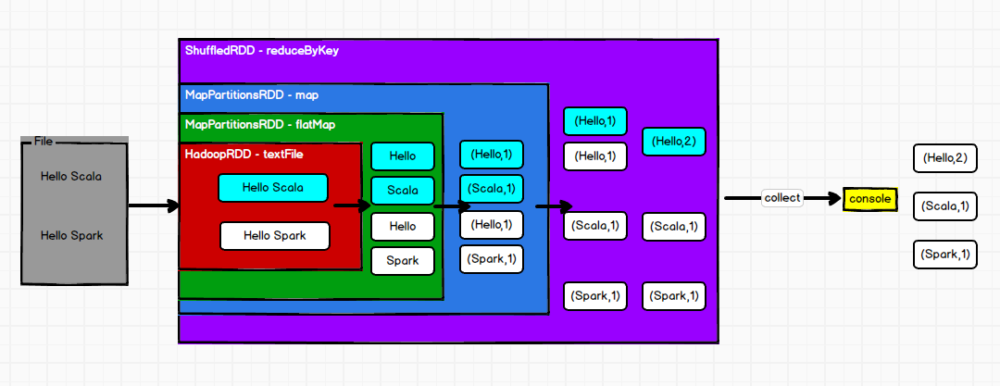

# Spark学习

## 入门

### 1.创建Maven项目

```xml
<?xml version="1.0" encoding="UTF-8"?>
<project xmlns="http://maven.apache.org/POM/4.0.0"
         xmlns:xsi="http://www.w3.org/2001/XMLSchema-instance"
         xsi:schemaLocation="http://maven.apache.org/POM/4.0.0 http://maven.apache.org/xsd/maven-4.0.0.xsd">
    <modelVersion>4.0.0</modelVersion>

    <groupId>com.atguigu</groupId>
    <artifactId>spark-study</artifactId>
    <packaging>pom</packaging>
    <version>1.0-SNAPSHOT</version>
    <modules>
        <module>spark-core</module>
    </modules>

    <dependencies>
        <dependency>
            <groupId>org.apache.spark</groupId>
            <artifactId>spark-core_2.12</artifactId>
            <version>3.0.0</version>
        </dependency>
    </dependencies>

    <build>
        <plugins>
            <!-- 该插件用于将 Scala 代码编译成 class 文件 -->
            <plugin>
                <groupId>net.alchim31.maven</groupId>
                <artifactId>scala-maven-plugin</artifactId>
                <version>3.2.2</version>
                <executions>
                    <execution>
                        <!-- 声明绑定到 maven 的 compile 阶段 -->
                        <goals>
                            <goal>testCompile</goal>
                        </goals>
                    </execution>
                </executions>
            </plugin>
            <plugin>
                <groupId>org.apache.maven.plugins</groupId>
                <artifactId>maven-assembly-plugin</artifactId>
                <version>3.1.0</version>
                <configuration>
                    <descriptorRefs>
                        <descriptorRef>jar-with-dependencies</descriptorRef>
                    </descriptorRefs>
                </configuration>
                <executions>
                    <execution>
                        <id>make-assembly</id>
                        <phase>package</phase>
                        <goals>
                            <goal>single</goal>
                        </goals>
                    </execution>
                </executions>
            </plugin>
        </plugins>
    </build>
</project>
```

### 2. 日志处理

执行过程中，会产生大量的执行日志，如果为了能够更好的查看程序的执行结果，可以在项目的 resources 目录中创建`log4j.properties` 文件，并添加日志配置信息：

~~~~properties
log4j.rootCategory=ERROR, console
log4j.appender.console=org.apache.log4j.ConsoleAppender
log4j.appender.console.target=System.err
log4j.appender.console.layout=org.apache.log4j.PatternLayout
log4j.appender.console.layout.ConversionPattern=%d{yy/MM/dd HH:mm:ss} %p %c{1}: %m%n

# Set the default spark-shell log level to ERROR. When running the spark-shell, the
# log level for this class is used to overwrite the root logger's log level, so that
# the user can have different defaults for the shell and regular Spark apps.
log4j.logger.org.apache.spark.repl.Main=ERROR

# Settings to quiet third party logs that are too verbose
log4j.logger.org.spark_project.jetty=ERROR
log4j.logger.org.spark_project.jetty.util.component.AbstractLifeCycle=ERROR
log4j.logger.org.apache.spark.repl.SparkIMain$exprTyper=ERROR
log4j.logger.org.apache.spark.repl.SparkILoop$SparkILoopInterpreter=ERROR
log4j.logger.org.apache.parquet=ERROR
log4j.logger.parquet=ERROR

# SPARK-9183: Settings to avoid annoying messages when looking up nonexistent UDFs in SparkSQL with Hive support
log4j.logger.org.apache.hadoop.hive.metastore.RetryingHMSHandler=FATAL
log4j.logger.org.apache.hadoop.hive.ql.exec.FunctionRegistry=ERROR
~~~~

### 3.搭建Local模式环境

将 [spark-3.0.0-bin-hadoop3.2.tgz](https://oss-blogs.oss-cn-hangzhou.aliyuncs.com/blogs/spark/spark-3.0.0-bin-hadoop3.2.tgz) 文件上传到Linux 并解压缩，放置在指定位置，路径中不要包含中文或空格。

~~~~shell
# 解压后放到/opt/module中
tar -zxvf spark-3.0.0-bin-hadoop3.2.tgz -C /opt/module 
# 进入到/opt/module目录中
cd /opt/module
# 改名
mv spark-3.0.0-bin-hadoop3.2 spark-local
~~~~

~~~~shell
# 进入解/压缩后的路径，执行如下指令，启动local环境
bin/spark-shell
~~~~

启动成功后，可以输入网址 http://hadoop:4040/jobs/ 进行 Web UI 监控页面访问

### 4.搭建Standalone模式环境

~~~~shell
# 解压后放到/opt/module中
tar -zxvf spark-3.0.0-bin-hadoop3.2.tgz -C /opt/module 
# 进入到/opt/module目录中
cd /opt/module
# 改名
mv spark-3.0.0-bin-hadoop3.2 spark-standalone

# 进入解压缩后路径的 conf 目录，修改 slaves.template 文件名为 slaves
cd /opt/module/spark-standalone/conf
mv slaves.template slaves
vim slaves
#添加以下内容
hadoop
hadoop101
hadoop102

#修改 spark-env.sh.template 文件名为 spark-env.sh
mv spark-env.sh.template spark-env.sh

#修改 spark-env.sh 文件，添加 JAVA_HOME 环境变量和集群对应的 master 节点
export JAVA_HOME=/opt/module/jdk1.8.0_212
SPARK_MASTER_HOST=hadoop
SPARK_MASTER_PORT=7077
#注意：7077 端口，相当于 hadoop3 内部通信的 8020 端口，此处的端口需要确认自己的 Hadoop 配置

#分发 spark-standalone 目录
xsync spark-standalone
~~~~

~~~~shell
# 执行脚本命令：启动集群
sbin/start-all.sh
~~~~

查看Master资源监控Web UI 界面: http://hadoop:8080

## spark核心编程

### RDD



1. RDD的数据处理方式类似于IO流，也有装饰者设计模式
2. RDD的数据只有在调用collect方法时，才会真正执行业务逻辑操作。之前的封装全部都是功能的扩展
3. RDD是不保存数据的，但是IO可以临时保存一部分数据

#### RDD执行原理

从计算的角度来讲，数据处理过程中需要计算资源（内存 & CPU）和计算模型（逻辑）。执行时，需要将计算资源和计算模型进行协调和整合。

Spark 框架在执行时，先申请资源，然后将应用程序的数据处理逻辑分解成一个一个的计算任务。然后将任务发到已经分配资源的计算节点上,  按照指定的计算模型进行数据计算。最后得到计算结果。

RDD 是 Spark 框架中用于数据处理的核心模型，接下来我们看看，在 Yarn 环境中，RDD 的工作原理：

##### 一、启动 Yarn 集群环境


##### 二、Spark 通过申请资源创建调度节点和计算节点


##### 三、Spark 框架根据需求将计算逻辑根据分区划分成不同的任务


##### 四、调度节点将任务根据计算节点状态发送到对应的计算节点进行计算


从以上流程可以看出 RDD 在整个流程中主要用于将逻辑进行封装，并生成 Task 发送给Executor 节点执行计算，接下来我们就一起看看 Spark 框架中RDD 是具体是如何进行数据处理的。

#### RDD转换算子

RDD 根据数据处理方式的不同将算子整体上`分为Value 类型、双 Value 类型和Key-Value类型`。

##### Value类型

map

`def map[U: ClassTag](f: T => U): RDD[U]`

将处理的数据逐条进行映射转换，这里的转换可以是类型的转换，也可以是值的转换。