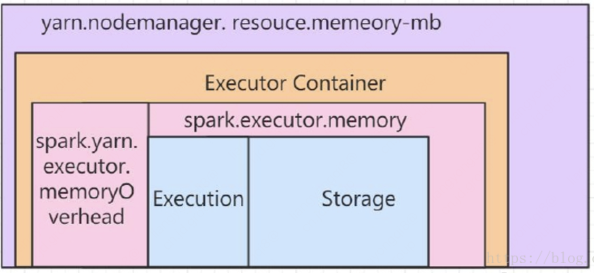
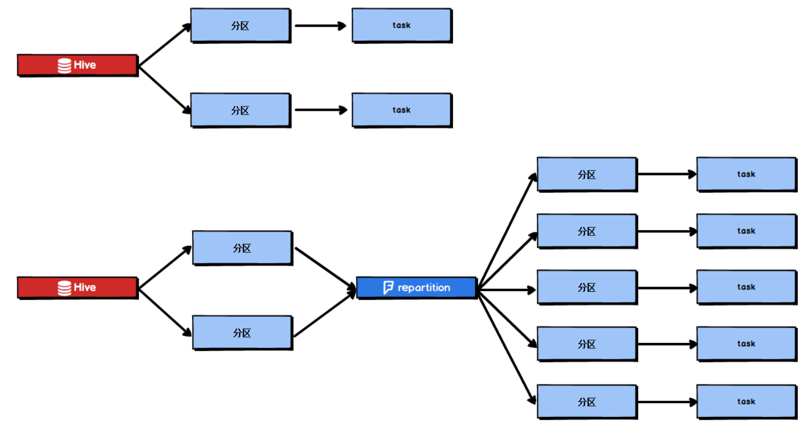
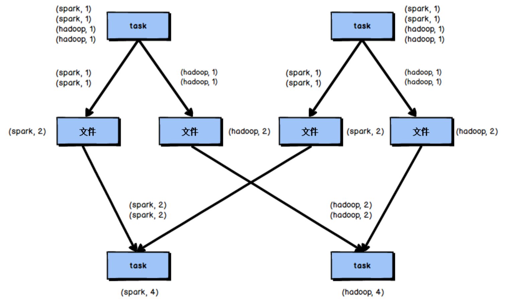
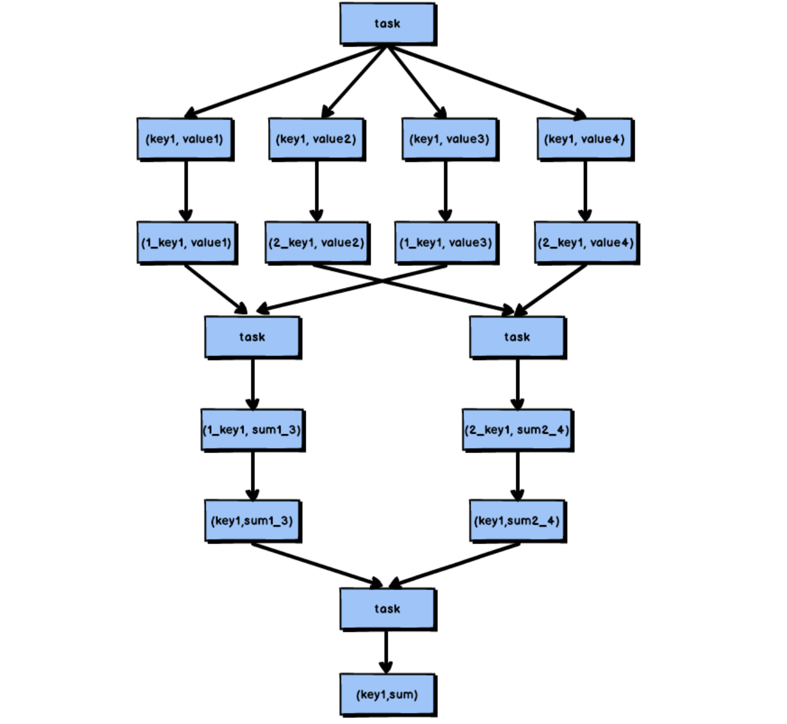
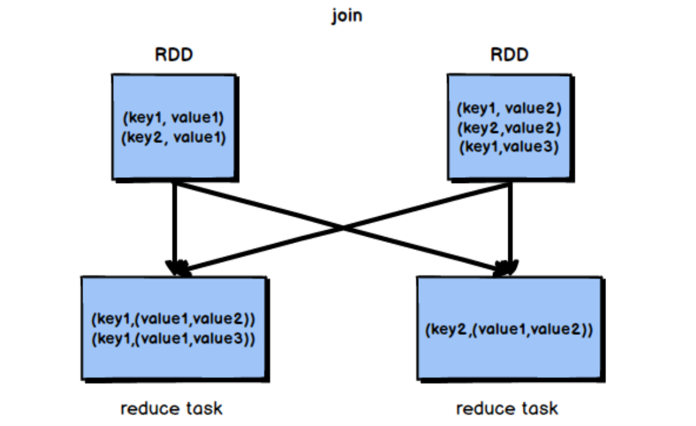
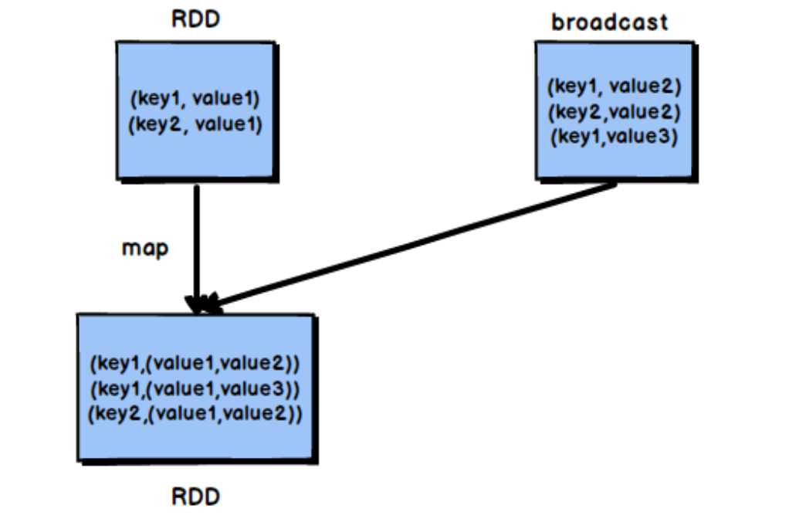
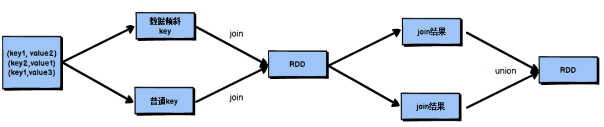
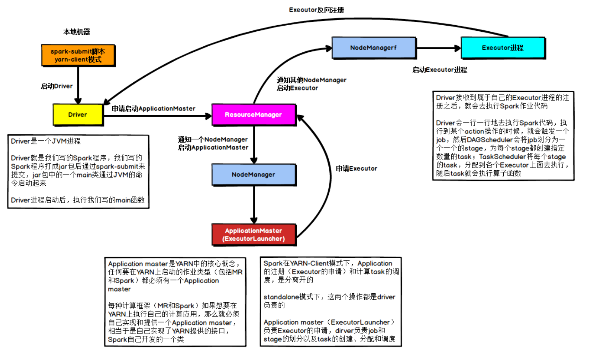

#### 常规性能调优

|参数名称|建议值|解释|
|--|--|--|
|spark.master|	yarn	|使用哪种资源调度器，一般使用yarn。本地调试可以用local
|spark.submit.deployMode|	cluster	|driver程序运行位置，调试可以用client，线上任务建议cluster。
|spark.driver.cores|	4	|driver最大使用cpu(线程)数
|spark.driver.memory|	4-10g	|driver申请内存大小
|spark.python.worker.memory|	spark.executor.memory/2	|一般使用默认值即可
|spark.yarn.executor.memoryOverhead	|3072	|单个executor申请堆外内存大小，
|spark.speculation|	默认值false	|推测执行机制默认为false（关闭），如果遇到作业偶尔卡住可以尝试开启。
|spark.default.parallelism|	3. Spark任务调优技巧|控制默认RDD的partithion数，读取hdfs文件时partition数以blocksize和是否合并输入为准。
|spark.sql.shuffle.partitions	|Spark任务调优技巧|执行sql或sql类算子时shuffle分区数，数据量大时应提高此值。
|spark.log.level	|默认值info	|ALL, TRACE, DEBUG, INFO, WARN, ERROR, FATAL, OFF，不区分大小写。
|spark.sql.hive.mergeFiles	|默认值false	|开启会自动合spark-sql产生的并小文件
|spark.hadoop.jd.bdp.streaming.monitor.enable	|默认值false	|是否开启streaming作业batch积压告警功能，默认为false，可通过--conf spark.hadoop.jd.bdp.streaming.monitor.enable=true 开启


NM是yarn的一个服务，它可以控制单个container( spark executor)的最大内存上限，由这个参数进行控制yarn.scheduler.maximum-allocation-mb。我们的集群中(10k、hope、tyrande等)设置是52G，后面称此值为(Max)MonitorMemory

② Container是NM中的一个服务，每个Spark Executor会单独占用一个Container，单个Container内存的上限，就是Spark Executor内存上限。后面称此值为MonitorMemory

③ MonitorMemory = spark.executor.memoryOverhead + spark.executor.memory。我们集群中，memoryOverhead设置成固定的3G。

④ spark.executor.memory 需要用户自己设置，建议 1 core 对应 2~4G executor.memory

|参数名称|建议值|解释|
|--|--|--|
|spark.dynamicAllocation.enabled|	true	|是否使用动态资源分配，根据工作负载对应用程序executor进行扩展
|spark.dynamicAllocation.initialExecutors|	2	|如果启用动态分配，要运行executor的初始数量。如果设置了“--num-executors”（或spark.executor.instances，最终的初始executor数量为：max(minExecutors, initialExecutor, num-executors/4)
|spark.dynamicAllocation.maxExecutors||	100	如果启用动态分配，executor的上限个数。
|spark.dynamicAllocation.minExecutors	|2	|如果启用动态分配，executor的下限个数。
|“--num-executors”（或“spark.executor.instances”）|2	|如果启用动态分配，该值会覆盖maxExecutors作为最大值，并且会影响initialExecutors

#####常规性能调优一:最优资源配置
Spark 性能调优的第一步，就是为任务分配更多的资源，在一定范围内，增加资源的分
配与性能的提升是成正比的，实现了最优的资源配置后，在此基础上再考虑进行后面论述的 性能调优策略。标准的 Spark 任务提交脚本如下
```shell
bin/spark-submit \
--class com.atguigu.spark.WordCount \
--master yarn\
--deploy-mode cluster\
--num-executors 80 \
--driver-memory 6g \
--executor-memory 6g \
--executor-cores 3 \
--queue root.default \
--conf spark.yarn.executor.memoryOverhead=2048 \ 
--conf spark.core.connection.ack.wait.timeout=300 \ 
/usr/local/spark/spark.jar
```
|名称 |说明|
|----|----|
|--num-executors|配置 Executor 的数量
|--driver-memory|配置 Driver 内存(影响不大)
|--executor-memory|配置每个 Executor 的内存大小
|--executor-cores |配置每个 Executor 的虚拟 CPU core 数量

调节原则:尽量将任务分配的资源调节到可以使用的资源的最大限度。

增加 Executor个数: 在资源允许的情况下，增加 Executor 的个数 可以提高执行 task 的并行度。并行度：spark.executor.cores * num-executors / spark.task.cpus

增加每个 Executor 的 CPU core 个数: 在资源允许的情况下，增加每个 Executor 的 Cpu core 个数，可以提高执行 task 的并行度。 

增加每个 Executor 的内存量: 在资源允许的情况下，增加每个 Executor 的 内存量以后，对性能的提升有三点:
1. 可以缓存更多的数据(即对 RDD 进行 cache)，写入磁盘的数据相应减少，甚至可以不写入磁盘，减少了可能的磁盘 IO;
2. 可以为 shuffle 操作提供更多内存，即有更多空间来存放 reduce 端拉取的数据，写入磁盘的数据相应减少，甚至可以不写入磁盘，减少了可能的磁盘 IO;
3. 可以为 task 的执行提供更多内存，在 task 的执行过程中可能创建很多对象，内存较小时会引发频繁的GC，增加内存后，可以避免频繁的GC，提升整体性能，每个task的内存：spark.executor.memory * spark.task.cpus / spark.executor.cores。
   

#####常规性能调优二:RDD 优化
1. 在对 RDD 进行算子时，要避免相同的算子和计算逻辑之下对 RDD 进行重复的计算
2. 在 Spark 中，当多次对同一个 RDD 执行算子操作时，必须对多次使用的 RDD 进行持久化，通过持久化将公共 RDD 的数据 缓存到内存/磁盘中。
3. RDD 尽可能早的 filter 操作。

#####常规性能调优三:并行度调节
Spark 作业中的并行度指各个 stage 的 task 的数量。 如果并行度设置不合理而导致并行度过低，会导致资源的极大浪费，Spark官方推荐，task 数量应该设置为 Spark 作业总CPU core 数量的 2~3 倍。task数量设置为CPU core总数的 2~3 倍，那么一个 task 执行完毕后，CPU core 会立刻执行下一个task，降低了资源的浪费，同时提升了 Spark 作业运行的效率。

#####常规性能调优四:广播大变量
广播变量在每个 Executor 保存一个副本，此 Executor 的所有 task 共用此广播变量，这让变 量产生的副本数量大大减少。

在初始阶段，广播变量只在 Driver 中有一份副本。task 在运行的时候，想要使用广播变 量中的数据，此时首先会在自己本地的 Executor 对应的 BlockManager 中尝试获取变量，如 果本地没有，BlockManager 就会从 Driver 或者其他节点的 BlockManager 上远程拉取变量的 复本，并由本地的 BlockManager 进行管理;之后此 Executor 的所有 task 都会直接从本地的 BlockManager 中获取变量。
#####常规性能调优五:Kryo 序列化
默认情况下，Spark 使用 Java 的序列化机制，Java 序列化机制的效率不高，序列化速度慢并且序列化后的数据所占用的空间依然较大。Kryo 序列化机制比 Java 序列化机制性能提高 10 倍左右，Spark之所以没有默认使用 Kryo 作为序列化类库，是因为它不支持所有对象的序列化，同时Kryo需要用户在使用前注册需要序列化的类型，不够方便，
```scala
conf.set("spark.serializer", "org.apache.spark.serializer.KryoSerializer"); //在 Kryo 序列化库中注册自定义的类集合，如果要使用 Java 序列化库，需要把该行屏蔽掉 
conf.set("spark.kryo.registrator", "atguigu.com.MyKryoRegistrator");
```
#####常规性能调优六:调节本地化等待时长
Spark 作业运行过程中，Driver 会对每一个 stage 的 task 进行分配。根据 Spark 的 task 分配算法，Spark 希望 task 能够运行在它要计算的数据算在的节点(数据本地化思想)，这样就可以避免数据的网络传输。通常来说，task 可能不会被分配到它处理的数据所在的节点， 因为这些节点可用的资源可能已经用尽，此时，Spark 会等待一段时间，默认3s，如果等待指定时间后仍然无法在指定节点运行，那么会自动降级，尝试将task分配到比较差的本地化级别所对应的节点上，

通过调节本地化等待时长，如果在等待时长这段时间内，目标节点处理完成了一部分task，那么当前的 task 将有机会得到执行，这样就能够改善 Spark 作业的整体性能。
|名称|解析|
|---|----|
|PROCESS_LOCAL|进程本地化，task和数据在同一个Executor中，性能最好。|
|NODE_LOCAL|节点本地化，task和数据在同一个节点中，但是 task 和数据不在同一个 Executor 中，数据需要在进程间进行传输。|
|RACK_LOCAL|机架本地化，task 和数据在同一个机架的两个节点上，数据需要通过网络在节点之间进行传输。|
|NO_PREF|对于 task 来说，从哪里获取都一样，没有好坏之分。|
|ANY|task 和数据可以在集群的任何地方，而且不在一个机架中，性能最差。|
```scala
val conf = new SparkConf()
  .set("spark.locality.wait", "6")
 
```
####算子优化
#####算子调优一:mapPartitions
普通的 map 算子对 RDD 中的每一个元素进行操作，而 mapPartitions 算子对 RDD 中每一个分区进行操作。如果是普通的 map 算子，假设一个 partition 有 1 万条数据，那么 map 算子中的 function 要执行 1 万次，也就是对每个元素进行操作。

如果是 mapPartition 算子，由于一个 task 处理一个 RDD 的 partition，那么一个 task 只 会执行一次 function，function 一次接收所有的 partition 数据，效率比较高。

mapPartitions 算子也存在一些缺点:对于普通的 map 操作，一次处理一条数据，如果在 处理了 2000 条数据后内存不足，那么可以将已经处理完的 2000 条数据从内存中垃圾回收 掉;但是如果使用 mapPartitions 算子，但数据量非常大时，function 一次处理一个分区的数 据，如果一旦内存不足，此时无法回收内存，就可能会 OOM，即内存溢出。
因此，mapPartitions 算子适用于数据量不是特别大的时候，此时使用 mapPartitions 算子 对性能的提升效果还是不错的。(当数据量很大的时候，一旦使用 mapPartitions 算子，就会 直接 OOM)

在项目中，应该首先估算一下 RDD 的数据量、每个 partition 的数据量，以及分配给每 个 Executor 的内存资源，如果资源允许，可以考虑使用 mapPartitions 算子代替 map。

#####算子调优三:filter 与 coalesce 的配合使用

#####算子调优四:repartition 解决 SparkSQL 低并行度问题
Spark SQL 的并行度不允许用户自己指定，Spark SQL 自己会默认根据 hive 表对应的
HDFS 文件的 split 个数自动设置 Spark SQL 所在的那个 stage 的并行度，用户自己通 spark.default.parallelism 参数指定的并行度，只会在没 Spark SQL 的 stage 中生效。

由于 Spark SQL 所在 stage 的并行度无法手动设置，如果数据量较大，并且此 stage 中 后续的 transformation 操作有着复杂的业务逻辑，而 Spark SQL 自动设置的 task 数量很少， 这就意味着每个 task 要处理为数不少的数据量，然后还要执行非常复杂的处理逻辑，这就 可能表现为第一个有 Spark SQL 的 stage 速度很慢，而后续的没有 Spark SQL 的 stage 运行 速度非常快。

为了解决 Spark SQL 无法设置并行度和 task 数量的问题，我们可以使用 repartition 算子。

Spark SQL 这一步的并行度和 task 数量肯定是没有办法去改变了，但是，对于 Spark SQL 查询出来的 RDD，立即使用 repartition 算子，去重新进行分区，这样可 以重新分区为多个 partition，从 repartition 之后的 RDD 操作，由于不再设计 Spark SQL，因此 stage 的并行度就会等于你手动设置的值，这样就避免了 Spark SQL 所在 的 stage 只能用少量的 task 去处理大量数据并执行复杂的算法逻辑。

#####算子调优五:reduceByKey 预聚合
reduceByKey 相较于普通的 shuffle 操作一个显著的特点就是会进行 map 端的本地聚合，
map 端会先对本地的数据进行 combine 操作，然后将数据写入给下个 stage 的每个 task 创建 的文件中，也就是在 map 端，对每一个 key 对应的 value，执行 reduceByKey 算子函数。 reduceByKey 算子的执行过程如图所示:


使用 reduceByKey 对性能的提升如下:
1. 本地聚合后，在map端的数据量变少，减少了磁盘IO，也减少了对磁盘空间的占用; 
2. 本地聚合后，下一个stage拉取的数据量变少，减少了网络传输的数据量;
3. 本地聚合后，在reduce端进行数据缓存的内存占用减少;
4. 本地聚合后，在reduce端进行聚合的数据量减少。

基于 reduceByKey 的本地聚合特征，我们应该考虑使用 reduceByKey 代替其他的 shuffle 算 子，例如 groupByKey。

####Shuffle调优
#####Shuffle 调优一:调节 map 端缓冲区大小
在 Spark 任务运行过程中，如果 shuffle 的 map 端处理的数据量比较大，但是 map 端缓
冲的大小是固定的，可能会出现 map 端缓冲数据频繁 spill 溢写到磁盘文件中的情况，使得 性能非常低下，通过调节 map 端缓冲的大小，可以避免频繁的磁盘 IO 操作，进而提升 Spark 任务的整体性能。

map端缓冲的默认配置是32KB，如果每个task处理640KB的数据，那么会发生640/32 = 20次溢写，如果每个task处理64000KB的数据，机会发生64000/32=2000此溢写，这对 于性能的影响是非常严重的。

```scala
val conf = new SparkConf()
  .set("spark.shuffle.file.buffer", "64")
```
#####Shuffle 调优二:调节 reduce 端拉取数据缓冲区大小
Spark Shuffle 过程中，shuffle reduce task 的 buffer 缓冲区大小决定了 reduce task 每次能
够缓冲的数据量，也就是每次能够拉取的数据量，如果内存资源较为充足，适当增加拉取数 据缓冲区的大小，可以减少拉取数据的次数，也就可以减少网络传输的次数，进而提升性能。 reduce 端数据拉取缓冲区的大小可以通过 spark.reducer.maxSizeInFlight 参数进行设置，默认 为 48MB
```scala
val conf = new SparkConf()
.set("spark.reducer.maxSizeInFlight", "96")
```
#####Shuffle 调优三:调节 reduce 端拉取数据重试次数
Spark Shuffle 过程中，reduce task 拉取属于自己的数据时，如果因为网络异常等原因导 致失败会自动进行重试。对于那些包含了特别耗时的 shuffle 操作的作业，建议增加重试最 大次数(比如 60 次)，以避免由于 JVM 的 full gc 或者网络不稳定等因素导致的数据拉取失 败。在实践中发现，对于针对超大数据量(数十亿~上百亿)的 shuffle 过程，调节该参数可 以大幅度提升稳定性。
reduce 端拉取数据重试次数可以通过 spark.shuffle.io.maxRetries 参数进行设置，该参数 就代表了可以重试的最大次数。如果在指定次数之内拉取还是没有成功，就可能会导致作业 执行失败，默认为 3
```scala
val conf = new SparkConf()
  .set("spark.shuffle.io.maxRetries", "6")
```
#####Shuffle 调优四:调节 reduce 端拉取数据等待间隔
Spark Shuffle 过程中，reduce task 拉取属于自己的数据时，如果因为网络异常等原因导
致失败会自动进行重试，在一次失败后，会等待一定的时间间隔再进行重试，可以通过加大 间隔时长(比如 60s)，以增加 shuffle 操作的稳定性。
reduce 端拉取数据等待间隔可以通过 spark.shuffle.io.retryWait 参数进行设置， 默认值为 5s
```scala
val conf = new SparkConf()
  .set("spark.shuffle.io.retryWait", "60s")
 
```
#####Shuffle 调优五:调节 SortShuffle 排序操作阈值
对于 SortShuffleManager，如果 shuffle reduce task 的数量小于某一阈值则 shuffle write 过
程中不会进行排序操作，而是直接按照未经优化的 HashShuffleManager 的方式去写数据，但 是最后会将每个 task 产生的所有临时磁盘文件都合并成一个文件，并会创建单独的索引文 件。
当你使用 SortShuffleManager 时，如果的确不需要排序操作，那么建议将这个参数调大 一些，大于 shuffle read task 的数量，那么此时 map-side 就不会进行排序了，减少了排序的 性能开销，但是这种方式下，依然会产生大量的磁盘文件，因此 shuffle write 性能有待提高。 SortShuffleManager 排序操作阈值的设置可以通过 spark.shuffle.sort. bypassMergeThreshold 这 一参数进行设置，默认值为 200
```scala
val conf = new SparkConf()
  .set("spark.shuffle.sort.bypassMergeThreshold", "400")
 
```
####JVM调优
#####JVM 调优一:降低 cache 操作的内存占比
根据 Spark 静态内存管理机制，堆内存被划分为了两块，Storage 和 Execution。Storage 主要用于缓存 RDD 数据和 broadcast 数据，Execution 主要用于缓存在 shuffle 过程中产生的 中间数据，Storage 占系统内存的 60%，Execution 占系统内存的 20%，并且两者完全独立。 在一般情况下，Storage 的内存都提供给了 cache 操作，但是如果在某些情况下 cache 操作内 存不是很紧张，而 task 的算子中创建的对象很多，Execution 内存又相对较小，这回导致频 繁的 minor gc，甚至于频繁的 full gc，进而导致 Spark 频繁的停止工作，性能影响会很大。 在 Spark UI 中可以查看每个 stage 的运行情况，包括每个 task 的运行时间、gc 时间等等，如 果发现 gc 太频繁，时间太长，就可以考虑调节 Storage 的内存占比，让 task 执行算子函数 式，有更多的内存可以使用。
Storage 内存区域可以通过 spark.storage.memoryFraction 参数进行指定，默认为 0.6，即 60%，可以逐级向下递减
```scala
val conf = new SparkConf()
  .set("spark.storage.memoryFraction", "0.4")
```
根据 Spark 统一内存管理机制，堆内存被划分为了两块，Storage 和 Execution。Storage
主要用于缓存数据，Execution 主要用于缓存在 shuffle 过程中产生的中间数据，两者所组成 的内存部分称为统一内存，Storage 和 Execution 各占统一内存的 50%，由于动态占用机制的 实现，shuffle 过程需要的内存过大时，会自动占用 Storage 的内存区域，因此无需手动进行 调节。

#####JVM 调优二:调节 Executor 堆外内存
如果你的 Spark 作业处理的数据量非常大，达到几亿的数据量，此时运行 Spark
作业会时不时地报错，例如 shuffle output file cannot find，executor lost，task lost，out of memory 等，这可能是 Executor 的堆外内存不太够用，导致 Executor 在运行的过程中内存溢出。

默认情况下，Executor 堆外内存上限大概为 300 多 MB，在实际的生产环境下，对海量 数据进行处理的时候，这里都会出现问题，导致 Spark 作业反复崩溃，无法运行，此时就会 去调节这个参数，到至少 1G，甚至于 2G、4G。
```shell
--conf spark.yarn.executor.memoryOverhead=2048
```
##### JVM 调优三:调节连接等待时长
在 Spark 作业运行过程中，Executor 优先从自己本地关联的 BlockManager 中获取某份
数据，如果本地 BlockManager 没有的话，会通过 TransferService 远程连接其他节点上 Executor 的 BlockManager 来获取数据。
如果 task 在运行过程中创建大量对象或者创建的对象较大，会占用大量的内存，这回 导致频繁的垃圾回收，但是垃圾回收会导致工作现场全部停止，也就是说，垃圾回收一旦执 行，Spark 的 Executor 进程就会停止工作，无法提供相应，此时，由于没有响应，无法建立 网络连接，会导致网络连接超时。
在生产环境下，有时会遇到 file not found、file lost 这类错误，在这种情况下，很有可能
是 Executor 的 BlockManager 在拉取数据的时候，无法建立连接，然后超过默认的连接等待
时长 60s 后，宣告数据拉取失败，如果反复尝试都拉取不到数据，可能会导致 Spark 作业的
崩溃。这种情况也可能会导致 DAGScheduler 反复提交几次 stage，TaskScheduler 返回提交
几次 task，大大延长了我们的 Spark 作业的运行时间。
此时，可以考虑调节连接的超时时长，连接等待时长需要在 spark-submit 脚本中进行设置，
```shell
--conf spark.core.connection.ack.wait.timeout=300
```

####Spark数据倾斜
要区分开数据倾斜与数据量过量这两种情况，数据倾斜是指少数 task 被分配了 绝大多数的数据，因此少数task运行缓慢;数据过量是指所有task被分配的数据量都很大， 相差不多，所有 task 都运行缓慢。

数据倾斜的表现:
1. Spark作业的大部分task都执行迅速，只有有限的几个task执行的非常慢，此时可能出 现了数据倾斜，作业可以运行，但是运行得非常慢;
2. Spark作业的大部分task都执行迅速，但是有的task在运行过程中会突然报出OOM， 反复执行几次都在某一个 task 报出 OOM 错误，此时可能出现了数据倾斜，作业无法正常运行。

定位数据倾斜问题:
1. 查阅代码中的 shuffle 算子，例如 reduceByKey、countByKey、groupByKey、join 等算 子，根据代码逻辑判断此处是否会出现数据倾斜;
2. 查看 Spark 作业的 log 文件，log 文件对于错误的记录会精确到代码的某一行，可以根 据异常定位到的代码位置来明确错误发生在第几个 stage，对应的 shuffle 算子是哪一个;

#####解决方案一:聚合原数据
1) 避免 shuffle 过程：如果 Spark 作业的数据来源于 Hive 表，那么可以先在 Hive 表中对数据进行聚合，例如 按照 key 进行分组，将同一 key 对应的所有 value 用一种特殊的格式拼接到一个字符串里去，这样，一个 key 就只有一条数据了;之后，对一个 key 的所有 value 进行处理时，只需要进 行 map 操作即可，无需再进行任何的 shuffle 操作。通过上述方式就避免了执行 shuffle 操作， 也就不可能会发生任何的数据倾斜问题。
2) 缩小 key 粒度(增大数据倾斜可能性，降低每个 task 的数据量) key 的数量增加，可能使数据倾斜更严重。
3) 增大 key 粒度(减小数据倾斜可能性，增大每个 task 的数据量) 如果没有办法对每个 key 聚合出来一条数据，在特定场景下，可以考虑扩大 key 的聚合
粒度。

#####解决方案二:过滤导致倾斜的 key
如果在 Spark 作业中允许丢弃某些数据，那么可以考虑将可能导致数据倾斜的 key 进行 过滤，滤除可能导致数据倾斜的 key 对应的数据，这样，在 Spark 作业中就不会发生数据倾 斜了。
#####

2.3 解决方案三:提高 shuffle 操作中的 reduce 并行度
当方案一和方案二对于数据倾斜的处理没有很好的效果时，可以考虑提高 shuffle 过程 中的reduce端并行度，reduce端并行度的提高就增加了reduce端task的数量，那么每个task 分配到的数据量就会相应减少，由此缓解数据倾斜问题。
######reduce端并行度的设置
在大部分的 shuffle 算子中，都可以传入一个并行度的设置参数，比如 reduceByKey(500)， 这个参数会决定 shuffle 过程中 reduce 端的并行度，在进行 shuffle 操作的时候，就会对应着 创建指定数量的 reduce task。对于 Spark SQL 中的 shuffle 类语句，比如 group by、join 等， 需要设置一个参数，即 spark.sql.shuffle.partitions，该参数代表了 shuffle read task 的并行度， 该值默认是 200

增加 shuffle read task 的数量，可以让原本分配给一个 task 的多个 key 分配给多个 task， 从而让每个 task 处理比原来更少的数据。

提高 reduce 端并行度并没有从根本上改变数据倾斜的本质和问题(方案一和方案二从
根本上避免了数据倾斜的发生)，只是尽可能地去缓解和减轻shufflereducetask的数据压力， 以及数据倾斜的问题，适用于有较多 key 对应的数据量都比较大的情况。

在理想情况下，reduce 端并行度提升后，会在一定程度上减轻数据倾斜的问题，甚至基 本消除数据倾斜;但是，在一些情况下，只会让原来由于数据倾斜而运行缓慢的 task 运行速 度稍有提升，或者避免了某些 task 的 OOM 问题，但是，仍然运行缓慢，此时，要及时放弃 方案三，开始尝试后面的方案。

#####解决方案四:使用随机 key 实现双重聚合
当使用了类似于 groupByKey、reduceByKey 这样的算子时，可以考虑使用随机 key 实
现双重聚合

首先，通过 map 算子给每个数据的 key 添加随机数前缀，对 key 进行打散，将原先一 样的 key 变成不一样的 key，然后进行第一次聚合，这样就可以让原本被一个 task 处理的数 据分散到多个 task 上去做局部聚合;随后，去除掉每个 key 的前缀，再次进行聚合。
此方法对于由 groupByKey、reduceByKey 这类算子造成的数据倾斜由比较好的效果， 仅仅适用于聚合类的 shuffle 操作，适用范围相对较窄。如果是 join 类的 shuffle 操作，还得 用其他的解决方案。
#####解决方案五:将 reduce join 转换为 map join
正常情况下，join 操作都会执行 shuffle 过程，并且执行的是 reduce join，也就是先将所 有相同的 key 和对应的 value 汇聚到一个 reduce task 中，然后再进行 join。普通 join 的过程 如下图所示:


普通的 join 是会走 shuffle 过程的，而一旦 shuffle，就相当于会将相同 key 的数据拉取 到一个 shuffle read task 中再进行 join，此时就是 reduce join。但是如果一个 RDD 是比较小 的，则可以采用广播小 RDD 全量数据+map 算子来实现与 join 同样的效果，也就是 map join， 此时就不会发生 shuffle 操作，也就不会发生数据倾斜。
(注意，RDD 是并不能进行广播的，只能将 RDD 内部的数据通过 collect 拉取到 Driver 内 存然后再进行广播)

不使用 join 算子进行连接操作，而使用 Broadcast 变量与 map 类算子实现 join 操作，进 而完全规避掉 shuffle 类的操作，彻底避免数据倾斜的发生和出现。将较小 RDD 中的数据直 接通过 collect 算子拉取到 Driver 端的内存中来，然后对其创建一个 Broadcast 变量;接着对 另外一个 RDD 执行 map 类算子，在算子函数内，从 Broadcast 变量中获取较小 RDD 的全量 数据，与当前 RDD 的每一条数据按照连接 key 进行比对，如果连接 key 相同的话，那么就 将两个 RDD 的数据用你需要的方式连接起来。
根据上述思路，根本不会发生 shuffle 操作，从根本上杜绝了 join 操作可能导致的数据 倾斜问题。
当 join 操作有数据倾斜问题并且其中一个 RDD 的数据量较小时，可以优先考虑这种方 式，效果非常好。

由于 Spark 的广播变量是在每个 Executor 中保存一个副本，如果两个 RDD 数据量都比较大， 那么如果将一个数据量比较大的 RDD 做成广播变量，那么很有可能会造成内存溢出。
#####解决方案六:sample 采样对倾斜 key 单独进行 join
在 Spark 中，如果某个 RDD 只有一个 key，那么在 shuffle 过程中会默认将此 key 对应 的数据打散，由不同的 reduce 端 task 进行处理。
当由单个 key 导致数据倾斜时，可有将发生数据倾斜的 key 单独提取出来，组成一个 RDD，然后用这个原本会导致倾斜的 key 组成的 RDD 根其他 RDD 单独 join，此时，根据 Spark 的运行机制，此 RDD 中的数据会在 shuffle 阶段被分散到多个 task 中去进行 join 操 作。倾斜 key 单独 join 的流程如图所示


####Spark故障排除
#####故障排除一:控制 reduce 端缓冲大小以避免 OOM
在Shuffle过程，reduce端task并不是等到map端task将其数据全部写入磁盘后再去拉 取，而是 map 端写一点数据，reduce 端 task 就会拉取一小部分数据，然后立即进行后面的 聚合、算子函数的使用等操作。

reduce 端 task 能够拉取多少数据，由 reduce 拉取数据的缓冲区 buffer 来决定，因为拉 取过来的数据都是先放在 buffer 中，然后再进行后续的处理，buffer 的默认大小为 48MB。 reduce 端 task 会一边拉取一边计算，不一定每次都会拉满 48MB 的数据，可能大多数时候 拉取一部分数据就处理掉了。

虽然说增大 reduce 端缓冲区大小可以减少拉取次数，提升 Shuffle 性能，但是有时 map 端的数据量非常大，写出的速度非常快，此时 reduce 端的所有 task 在拉取的时候，有可能 全部达到自己缓冲的最大极限值，即 48MB，此时，再加上 reduce 端执行的聚合函数的代 码，可能会创建大量的对象，这可难会导致内存溢出，即 OOM。

如果一旦出现 reduce 端内存溢出的问题，我们可以考虑减小 reduce 端拉取数据缓冲区 的大小，例如减少为 12MB。

在实际生产环境中是出现过这种问题的，这是典型的以性能换执行的原理。reduce 端拉 取数据的缓冲区减小，不容易导致 OOM，但是相应的，reudce 端的拉取次数增加，造成更 多的网络传输开销，造成性能的下降。

注意，要保证任务能够运行，再考虑性能的优化。
##### 故障排除二:JVM GC 导致的 shuffle 文件拉取失败
在 Spark 作业中，有时会出现 shuffle file not found 的错误，这是非常常见的一个报错， 有时出现这种错误以后，选择重新执行一遍，就不再报出这种错误。
出现上述问题可能的原因是 Shuffle 操作中，后面 stage 的 task 想要去上一个 stage 的 task 所在的 Executor 拉取数据，结果对方正在执行 GC，执行 GC 会导致 Executor 内所有的 工作现场全部停止，比如 BlockManager、基于 netty 的网络通信等，这就会导致后面的 task 拉取数据拉取了半天都没有拉取到，就会报出 shuffle file not found 的错误，而第二次再次执 行就不会再出现这种错误。
可以通过调整 reduce 端拉取数据重试次数和 reduce 端拉取数据时间间隔这两个参数来对 Shuffle 性能进行调整，增大参数值，使得 reduce 端拉取数据的重试次数增加，并且每次 失败后等待的时间间隔加长。
```scala
val conf = new SparkConf()
  .set("spark.shuffle.io.maxRetries", "60")
  .set("spark.shuffle.io.retryWait", "60s")
```
#####故障排除三:解决各种序列化导致的报错
当 Spark 作业在运行过程中报错，而且报错信息中含有 Serializable 等类似词汇，那么可 能是序列化问题导致的报错。
  序列化问题要注意以下三点:
- 作为RDD的元素类型的自定义类，必须是可以序列化的;
- 算子函数里可以使用的外部的自定义变量，必须是可以序列化的;
- 不可以在 RDD 的元素类型、算子函数里使用第三方的不支持序列化的类型，例如
Connection。

#####故障排除四:解决算子函数返回 NULL 导致的问题
在一些算子函数里，需要我们有一个返回值，但是在一些情况下我们不希望有返回值， 此时我们如果直接返回 NULL，会报错，例如 Scala.Math(NULL)异常。 如果你遇到某些情况，不希望有返回值，那么可以通过下述方式解决:
➢ 返回特殊值，不返回NULL，例如“-1”;
➢ 在通过算子获取到了一个RDD之后，可以对这个RDD执行filter操作，进行数据过滤， 将数值为-1 的数据给过滤掉;
➢ 在使用完filter算子后，继续调用coalesce算子进行优化。
#####故障排除五:解决 YARN-CLIENT 模式导致的网卡流量激增问
YARN-client 模式的运行原理如下图所示:



####参数调优
Application Properties 应用基本属性

spark.driver.cores  

driver端分配的核数，默认为1，thriftserver是启动thriftserver服务的机器，资源充足的话可以尽量给多。

spark.driver.memory

driver端分配的内存数，默认为1g，同上。

spark.executor.memory

每个executor分配的内存数，默认1g，会受到yarn CDH的限制，和memoryOverhead相加 不能超过总内存限制。

spark.driver.maxResultSize

driver端接收的最大结果大小，默认1GB，最小1MB，设置0为无限
这个参数不建议设置的太大，如果要做数据可视化，更应该控制在20-30MB以内。

过大会导致OOM。

spark.extraListeners

默认none，随着SparkContext被创建而创建，用于监听单参数、无参数构造函数的创建，并抛出异常。


③ Shuffle Behavior 

spark.reducer.maxSizeInFlight

默认48m。从每个reduce任务同时拉取的最大map数，每个reduce都会在完成任务后，需要一个堆外内存的缓冲区来存放结果，如果没有充裕的内存就尽可能把这个调小一点。。相反，堆外内存充裕，调大些就能节省gc时间。

spark.reducer.maxBlocksInFlightPerAddress

限制了每个主机每次reduce可以被多少台远程主机拉取文件块，调低这个参数可以有效减轻node manager的负载。（默认值Int.MaxValue）

spark.reducer.maxReqsInFlight

限制远程机器拉取本机器文件块的请求数，随着集群增大，需要对此做出限制。否则可能会使本机负载过大而挂掉。。（默认值为Int.MaxValue）

spark.reducer.maxReqSizeShuffleToMem

shuffle请求的文件块大小 超过这个参数值，就会被强行落盘，防止一大堆并发请求把内存占满。（默认Long.MaxValue）

spark.shuffle.compress

是否压缩map输出文件，默认压缩 true

spark.shuffle.spill.compress

shuffle过程中溢出的文件是否压缩，默认true，使用spark.io.compression.codec压缩。

spark.shuffle.file.buffer

在内存输出流中 每个shuffle文件占用内存大小，适当提高 可以减少磁盘读写 io次数，初始值为32k

spark.shuffle.memoryFraction

该参数代表了Executor内存中，分配给shuffle read task进行聚合操作的内存比例，默认是20%。
cache少且内存充足时，可以调大该参数，给shuffle read的聚合操作更多内存，以避免由于内存不足导致聚合过程中频繁读写磁盘。

spark.shuffle.manager

当ShuffleManager为SortShuffleManager时，如果shuffle read task的数量小于这个阈值（默认是200），则shuffle write过程中不会进行排序操作，而是直接按照未经优化的HashShuffleManager的方式去写数据，但是最后会将每个task产生的所有临时磁盘文件都合并成一个文件，并会创建单独的索引文件。

当使用SortShuffleManager时，如果的确不需要排序操作，那么建议将这个参数调大一些，大于shuffle read task的数量。那么此时就会自动启用bypass机制，map-side就不会进行排序了，减少了排序的性能开销。但是这种方式下，依然会产生大量的磁盘文件，因此shuffle write性能有待提高。

spark.shuffle.consolidateFiles

如果使用HashShuffleManager，该参数有效。如果设置为true，那么就会开启consolidate机制，会大幅度合并shuffle write的输出文件，对于shuffle read task数量特别多的情况下，这种方法可以极大地减少磁盘IO开销，提升性能。

如果的确不需要SortShuffleManager的排序机制，那么除了使用bypass机制，还可以尝试将spark.shuffle.manager参数手动指定为hash，使用HashShuffleManager，同时开启consolidate机制。

spark.shuffle.io.maxRetries

shuffle read task从shuffle write task所在节点拉取属于自己的数据时，如果因为网络异常导致拉取失败，是会自动进行重试的。该参数就代表了可以重试的最大次数。如果在指定次数之内拉取还是没有成功，就可能会导致作业执行失败。

对于那些包含了特别耗时的shuffle操作的作业，建议增加重试最大次数（比如60次），以避免由于JVM的full gc或者网络不稳定等因素导致的数据拉取失败。在实践中发现，对于针对超大数据量（数十亿~上百亿）的shuffle过程，调节该参数可以大幅度提升稳定性。

spark.shuffle.io.retryWait

同上，默认5s，建议加大间隔时长（比如60s），以增加shuffle操作的稳定性。
spark.io.encryption.enabled + spark.io.encryption.keySizeBits + spark.io.encryption.keygen.algorithm

io加密，默认关闭

⑤ Compression and Serialization

spark.broadcast.compress

广播变量前是否会先进行压缩。默认true （spark.io.compression.codec）

spark.io.compression.codec

压缩RDD数据、日志、shuffle输出等的压缩格式 默认lz4

spark.io.compression.lz4.blockSize

使用lz4压缩时，每个数据块大小 默认32k

spark.rdd.compress

rdd是否压缩 默认false，节省memory_cache大量内存 消耗更多的cpu资源（时间）。

spark.serializer.objectStreamReset

当使用JavaSerializer序列化时，会缓存对象防止写多余的数据，但这些对象就不会被gc，可以输入reset 清空缓存。默认缓存100个对象，修改成-1则不缓存任何对象。

⑥ Memory Management

spark.memory.fraction

执行内存和缓存内存（堆）占jvm总内存的比例，剩余的部分是spark留给用户存储内部源数据、数据结构、异常大的结果数据。

默认值0.6，调小会导致频繁gc，调大容易造成oom。

spark.memory.storageFraction

用于存储的内存在堆中的占比，默认0.5。调大会导致执行内存过小，执行数据落盘，影响效率；调小会导致缓存内存不够，缓存到磁盘上去，影响效率。

值得一提的是在spark中，执行内存和缓存内存公用java堆，当执行内存没有使用时，会动态分配给缓存内存使用，反之也是这样。如果执行内存不够用，可以将存储内存释放移动到磁盘上（最多释放不能超过本参数划分的比例），但存储内存不能把执行内存抢走。

spark.memory.offHeap.enabled

是否允许使用堆外内存来进行某些操作。默认false

spark.memory.offHeap.size

允许使用进行操作的堆外内存的大小，单位bytes 默认0
spark.memory.useLegacyModes

默认false，不开启，在spark1.5之后就被废弃了，下面三个参数也是。。就不做更多的介绍了：

spark.shuffle.memoryFraction

spark.storage.memoryFraction

spark.storage.unrollFraction

spark.storage.replication.proactive

针对失败的executor，主动去cache 有关的RDD中的数据。默认false

spark.cleaner.periodicGC.interval

控制触发gc的频率，默认30min

spark.cleaner.referenceTracking

是否进行context cleaning，默认true

spark.cleaner.referenceTracking.blocking

清理线程是否应该阻止清理任务，默认true

spark.cleaner.referenceTracking.blocking.shuffle

清理线程是否应该阻止shuffle的清理任务，默认false

spark.cleaner.referenceTracking.cleanCheckpoints

清理线程是否应该清理依赖超出范围的检查点文件（checkpoint files不知道怎么翻译。。）默认false
⑦ Executor behavior

spark.broadcast.blockSize

TorrentBroadcastFactory中的每一个block大小，默认4m

过大会减少广播时的并行度，过小会导致BlockManager 产生 performance hit.

（暂时没懂这是干啥用的）

spark.executor.cores

每个executor的核数，默认yarn下1核，standalone下为所有可用的核。

spark.default.parallelism

默认RDD的分区数、并行数。

像reduceByKey和join等这种需要分布式shuffle的操作中，最大父RDD的分区数；像parallelize之类没有父RDD的操作，则取决于运行环境下得cluster manager：

如果为单机模式，本机核数；集群模式为所有executor总核数与2中最大的一个。

spark.executor.heartbeatInterval

executor和driver心跳发送间隔，默认10s，必须远远小于spark.network.timeout

spark.files.fetchTimeout

从driver端执行SparkContext.addFile() 抓取添加的文件的超时时间，默认60s

spark.files.useFetchCache

默认true，如果设为true，拉取文件时会在同一个application中本地持久化，被若干个executors共享。这使得当同一个主机下有多个executors时，执行任务效率提高。

spark.files.overwrite

默认false，是否在执行SparkContext.addFile() 添加文件时，覆盖已有的内容有差异的文件。

spark.files.maxPartitionBytes

单partition中最多能容纳的文件大小，单位Bytes 默认134217728 (128 MB)

spark.files.openCostInBytes

小文件合并阈值，小于该参数就会被合并到一个partition内。

默认4194304 (4 MB) 。这个参数在将多个文件放入一个partition时被用到，宁可设置的小一些，因为在partition操作中，小文件肯定会比大文件快。

spark.storage.memoryMapThreshold

从磁盘上读文件时，最小单位不能少于该设定值，默认2m，小于或者接近操作系统的每个page的大小。


⑧ Networking

spark.rpc.message.maxSize

executors和driver间消息传输、map输出的大小，默认128M。map多可以考虑增加。

spark.driver.blockManager.port和spark.driver.bindAddress

driver端绑定监听block manager的地址与端口。

spark.driver.host和spark.driver.port

driver端的ip和端口。

spark.network.timeout

网络交互超时时间，默认120s。如果

spark.core.connection.ack.wait.timeout

spark.storage.blockManagerSlaveTimeoutMs

spark.shuffle.io.connectionTimeout

spark.rpc.askTimeout orspark.rpc.lookupTimeout

没有设置，那么就以此参数为准。

spark.port.maxRetries

设定了一个端口后，在放弃之前的最大重试次数，默认16。 会有一个预重试机制，每次会尝试前一次尝试的端口号+1的端口。如 设定了端口为8000，则最终会尝试8000~(8000+16)范围的端口。

spark.rpc.numRetries

rpc任务在放弃之前的重试次数，默认3，即rpc task最多会执行3次。

spark.rpc.retry.wait

重试间隔，默认3s

spark.rpc.askTimeout

rpc任务超时时间，默认spark.network.timeout

spark.rpc.lookupTimeout

rpc任务查找时长


⑨ Scheduling

spark.scheduler.maxRegisteredResourcesWaitingTime

在执行前最大等待申请资源的时间，默认30s。

spark.scheduler.minRegisteredResourcesRatio

实际注册的资源数占预期需要的资源数的比例，默认0.8

spark.scheduler.mode

调度模式，默认FIFO 先进队列先调度，可以选择FAIR。

spark.scheduler.revive.interval

work回复重启的时间间隔，默认1s

spark.scheduler.listenerbus.eventqueue.capacity

spark事件监听队列容量，默认10000，必须为正值，增加可能会消耗更多内存


spark.blacklist.enabled

是否列入黑名单，默认false。如果设成true，当一个executor失败好几次时，会被列入黑名单，防止后续task派发到这个executor。可以进一步调节spark.blacklist以下相关的参数：

（均为测试参数 Experimental）

spark.blacklist.timeout

spark.blacklist.task.maxTaskAttemptsPerExecutor

spark.blacklist.task.maxTaskAttemptsPerNode

spark.blacklist.stage.maxFailedTasksPerExecutor

spark.blacklist.application.maxFailedExecutorsPerNode

spark.blacklist.killBlacklistedExecutors

spark.blacklist.application.fetchFailure.enabled

spark.speculation

推测，如果有task执行的慢了，就会重新执行它。默认false，

详细相关配置如下：

spark.speculation.interval

检查task快慢的频率，推测间隔，默认100ms。

spark.speculation.multiplier

推测比均值慢几次算是task执行过慢，默认1.5
spark.speculation.quantile

在某个stage，完成度必须达到该参数的比例，才能被推测，默认0.75

spark.task.cpus

每个task分配的cpu数，默认1

spark.task.maxFailures

在放弃这个job前允许的最大失败次数，重试次数为该参数-1，默认4

spark.task.reaper.enabled

赋予spark监控有权限去kill那些失效的task，默认false

(原先有 job失败了但一直显示有task在running，总算找到这个参数了)

其他进阶的配置如下：

spark.task.reaper.pollingInterval

轮询被kill掉的task的时间间隔，如果还在running，就会打warn日志，默认10s。

spark.task.reaper.threadDump

线程回收是是否产生日志，默认true。

spark.task.reaper.killTimeout

当一个被kill的task过了多久还在running，就会把那个executor给kill掉，默认-1。
spark.stage.maxConsecutiveAttempts

在终止前，一个stage连续尝试次数，默认4。

⑩ Dynamic Allocation 动态分配
如果启用dynamicAllocation则spark.shuffle.service.enable必须设置为true，此选项用于启动外部的shuffle服务，免得在executor释放时造成数据丢失。外部的shuffle服务运行在NodeManager节点中，独立于spark的executor，在spark配置中通过spark.shuffle.service.port指定其端口，默认为7337。
spark.dynamicAllocation.minExecutors和spark.dynamicAllocation.maxExecutors分别为分配的最小及最大值，spark.dynamicAllocation.initialExecutors为初始分配的值，默认取值为minExecutors。在--num-executors参数设置后，将使用此设置的值作为动态分配executor数的初始值。

spark.dynamicAllocation.enabled

是否开启动态资源配置，根据工作负载来衡量是否应该增加或减少executor，默认false

以下相关参数：

spark.dynamicAllocation.minExecutors

动态分配最小executor个数，在启动时就申请好的，默认0

spark.dynamicAllocation.maxExecutors

动态分配最大executor个数，默认infinity

spark.dynamicAllocation.initialExecutors

动态分配初始executor个数默认值=spark.dynamicAllocation.minExecutors

spark.dynamicAllocation.executorIdleTimeout

当某个executor空闲超过这个设定值，就会被kill，默认60s

spark.dynamicAllocation.cachedExecutorIdleTimeout

当某个缓存数据的executor空闲时间超过这个设定值，就会被kill，默认infinity

spark.dynamicAllocation.schedulerBacklogTimeout

任务队列非空，资源不够，申请executor的时间间隔，默认1s
spark.dynamicAllocation.sustainedSchedulerBacklogTimeout

同schedulerBacklogTimeout，是申请了新executor之后继续申请的间隔，默认=schedulerBacklogTimeout


When running Spark on YARN, each Spark executor runs as a YARN container. [...]

This means the number of containers will always be the same as the executors created by a Spark application 

Set by the yarn.scheduler.minimum-allocation-mb every container always allocates at least this amount of memory. This means if parameter --executor-memory is set to e.g. only 1g but yarn.scheduler.minimum-allocation-mb is e.g. 6g, the container is much bigger than needed by the Spark application.

The other way round, if the parameter --executor-memory is set to somthing higher than the yarn.scheduler.minimum-allocation-mb value, e.g. 12g, the Container will allocate more memory dynamically, but only if the requested amount of memory is smaller or equal to yarn.scheduler.maximum-allocation-mb value.

The value of yarn.nodemanager.resource.memory-mb determines, how much memory can be allocated in sum by all containers of one host!

=> So setting yarn.scheduler.minimum-allocation-mb allows you to run smaller containers e.g. for smaller executors (else it would be waste of memory).

=> Setting yarn.scheduler.maximum-allocation-mb to the maximum value (e.g. equal to yarn.nodemanager.resource.memory-mb) allows you to define bigger executors (more memory is allocated if needed, e.g. by --executor-memory parameter).

$$
P_1 = P_0+(1-P_0)\times\exp^{-i}\times\mathbb{I}(x=\text{treatment}) , i\ge 0
$$

$\alpha$