LLM的多模态模型根据侧重不同，通常有以下多种称呼：VLM`Vision-Language Model，视觉语言模型`; MLLM`Multimodal Large Language Model，多模态大语言模型`; VLA`Vision-Language-Action Model，视觉语言动作模型`

### LLM模型基础

将序列$x_{1:L}$的联合分布$p(x_{1:L})$的常见写法是使用概率的链式法则：
$$
p(x_{1:L}) = p(x_1)p(x_2|x_1)\cdots p(x_L|x_{1:L-1}) = \prod_{i=1}^T p(x_i|x_{1:i-1})\\
x_i \sim p(x_i|x_{1:i-1})^{\frac{1}{T}}
$$
其中$T\ge 0$是一个控制我们希望从语言模型中得到多少随机性的温度参数：

- $T=0$：确定性地在每个位置$i$选择最可能的令牌$x_i$
- $T=1$：从纯语言模型“正常（normally）”采样
- $T=\infin$：从整个词汇表上的均匀分布中采样

具体来说，这个**温度参数**会应用于每一步的条件概率分布$p(x_i|x_{i-1})$，将其幂变为$\frac{1}{T}$。这意味着当$T$值较高时，我们会获得更平均的概率分布，生成的结果更具随机性；反之，当 $T$值较低时，模型会更倾向于生成概率较高的令牌。

#### 注意力机制


注意力机制的计算可以分为两步：

- 一是在所有输入信息上计算注意力分布，用$X = [x_1, · · · , x_N ]$表示$N $个输入信息，给定一个和任务相关的查询向量$\mathbf{q}$，我们用注意力变量 $z ∈ [1, N]$来表示被选择信息的索引位置。我们采用一种“软性”的信息选择机制，首先计算在给定$\mathbf{q} $和$X $下，选择第$i$个输入信息的概率$α_i$
    $$
    \begin{aligned} \alpha_{i} &=p(z=i | X, \mathbf{q}) \\ &=\operatorname{softmax}\left(s\left(\mathbf{x}_{i}, \mathbf{q}\right)\right) \\ &=\frac{\exp \left(s\left(\mathbf{x}_{i}, \mathbf{q}\right)\right)}{\sum_{j=1}^{N} \exp \left(s\left(\mathbf{x}_{j}, \mathbf{q}\right)\right)} \end{aligned}
    $$

其中$α_i$ 称为注意力分布，$s(\mathbf{x}_i, \mathbf{q})$为注意力打分函数。下面的$W, U, \mathbf{v}$为可学习的网络参数，$d$为输入信息的维度。

| 模型         | 公式                                                         |
| ------------ | ------------------------------------------------------------ |
| 加性模型     | $s\left(\mathbf{x}_{i}, \mathbf{q}\right)=\mathbf{v}^{\mathrm{T}} \tanh \left(W \mathbf{x}_{i}+U \mathbf{q}\right)$ |
| 点积模型     | $s\left(\mathbf{x}_{i}, \mathbf{q}\right)=\mathbf{x}_{i}^{\mathrm{T}} \mathbf{q}$ |
| 缩放点积模型 | $s\left(\mathbf{x}_{i}, \mathbf{q}\right)=\frac{\mathbf{x}_{i}^{\mathrm{T}} \mathbf{q}}{\sqrt{d}}$ |
| 双线性模型   | $s\left(\mathbf{x}_{i}, \mathbf{q}\right)=\mathbf{x}_{i}^{\mathrm{T}} W \mathbf{q}$ |

- 二是根据注意力分布来计算输入信息的加权平均。加权平均注意力分布$α_i$可以解释为在给定任务相关的查询$\mathbf{q}$时，第$i$个信息受关注的程度。我们采用一种“软性”的信息选择机制对输入信息进行汇总。

$$
\begin{aligned} \operatorname{att}(X, \mathbf{q}) &=\sum_{i=1}^{N} \alpha_{i} \mathbf{x}_{i} \\ &=\mathbb{E}_{z \sim p(z | X, \mathbf{q})}[\mathbf{x}] \end{aligned}
$$

硬性注意力有两种实现方式：
$$
\operatorname{att}(X, \mathbf{q})=\mathbf{x}_{j}
$$
其中$j$为概率最大的输入信息的下标，即$j=\arg _{i=1}^{N} \max \alpha_{i}$。另一种硬性注意力可以通过在注意力分布式上随机采样的方式实现。硬性注意力的一个缺点是基于最大采样或随机采样的方式来选择信息。因此最终的损失函数与注意力分布之间的函数关系不可导，因此无法使用在反向传播算法进行训练。

##### 键值对注意力

键值对注意力用键值对格式来表示输入信息，其中“键”用来计算注意力分布$α_i$，“值”用来计算聚合信息。用$(K, V ) = [(\mathbf{k}_1, \mathbf{v}_1), · · · ,(\mathbf{k}_N , \mathbf{v}_N )]$表示$N$ 个输入信息，给定任务相关的查询向量$\mathbf{q} $时，注意力函数为

$$
\begin{aligned} \operatorname{att}((K, V), \mathbf{q}) &=\sum_{i=1}^{N} \alpha_{i} \mathbf{v}_{i} \\ &=\sum_{i=1}^{N} \frac{\exp \left(s\left(\mathbf{k}_{i}, \mathbf{q}\right)\right)}{\sum_{j} \exp \left(s\left(\mathbf{k}_{j}, \mathbf{q}\right)\right)} \mathbf{v}_{i} \end{aligned}
$$
其中$s(\mathbf{k}_i, \mathbf{q})$为打分函数。

##### 多头注意力机制

多头注意力是利用多个查询$Q = [q_1, · · · , q_M]$，来平行地计算从输入信息中选取多个信息。每个注意力关注输入信息的不同部分。
$$
\operatorname{att}((K, V), Q)=\operatorname{att}\left((K, V), \mathbf{q}_{1}\right) \oplus \cdots \oplus \operatorname{att}\left((K, V), \mathbf{q}_{M}\right)
$$
其中$⊕$表示向量拼接。

##### Self-Attention

假设输入**序列**为$X = [\vec{\mathbf{x}}_1, · · · , \vec{\mathbf{x}}_N ] ∈ R^{d_k×N}$，输出序列为$H = [\vec{\mathbf{h}}_1, · · · , \vec{\mathbf{h}}_N ] ∈R^{d_v×N}$，深度学习框架输入形式是`[batch, seq_length, embed_size]`，下面使用$\mathbf{X}^T$表示序列输入，线性变换得到三组向量序列，$W_Q\in \mathbf{R}^{d_k\times d_q}, W_K\in \mathbf{R}^{d_k\times d_q}, W_V\in \mathbf{R}^{d_k\times d_v}$ 分别为可学习的参数矩阵，则有：
$$
\mathbf{X}=\left[\begin{array}{cccc}\vec{\mathbf{x}}_1^T\\\vec{\mathbf{x}}_2^T\\
\cdot\\
\cdot\\
\vec{\mathbf{x}}_N^T\end{array}\right]\in\mathbb{R}^{N\times d_k},
\mathbf{Q}=XW_{Q} =\left[\begin{array}{cccc}\vec{\mathbf{q}}_1^T\\\vec{\mathbf{q}}_2^T\\
\cdot\\
\cdot\\
\vec{\mathbf{q}}_N^T\end{array}\right]\in\mathbb{R}^{N\times d_q},\mathbf{K}=XW_{K}=\left[\begin{array}{cccc}\vec{\mathbf{k}}_1^T\\\vec{\mathbf{k}}_2^T\\
\cdot\\
\cdot\\
\vec{\mathbf{k}}_T^T\end{array}\right]\in\mathbb{R}^{N\times d_q},\mathbf{V}=XW_{V}=\left[\begin{array}{cccc}\vec{\mathbf{v}}_1^T\\\vec{\mathbf{v}}_2^T\\
\cdot\\
\cdot\\
\vec{\mathbf{v}}_T^T\end{array}\right]\in\mathbb{R}^{N\times d_v},\mathbf{H}=\left[\begin{array}{cccc}\vec{\mathbf{h}}_1^T\\\vec{\mathbf{h}}_2^T\\
\cdot\\
\cdot\\
\vec{\mathbf{h}}_N^T\end{array}\right]\in\mathbb{R}^{N\times d_v}
$$

其中$Q, K, V$分别为查询向量序列，键向量序列和值向量序列。可以得到输出向量$\mathbf{h}_i$，

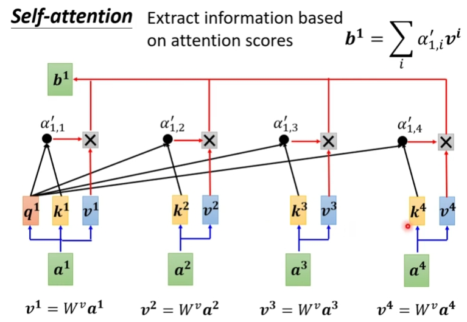
$$
\begin{aligned} \mathbf{h}_{i} &=\operatorname{att}\left((K, V), \mathbf{q}_{i}\right) \\ &=\sum_{j=1}^{N} \alpha_{i j} \mathbf{v}_{j} \\ &=\sum_{j=1}^{N} \operatorname{softmax}\left(s\left(\mathbf{k}_{j}, \mathbf{q}_{i}\right)\right) \mathbf{v}_{j} \end{aligned}
$$
其中$\alpha_{i,j}$表示位置$i$与位置$j$之间的权重：
$$
\text{score}_{i,j}=s\left(\mathbf{k}_{j}, \mathbf{q}_{i}\right)=\frac{\vec{\mathbf{q}}_i\cdot \vec{\mathbf{k}}_j}{\sqrt{d_k}},\alpha_{i,j}=\frac{\exp(\text{score}_{i,j})}{\sum_{j=1}^N\text{score}_{i,j}},i=1,2,\cdots,N
$$
除以$\sqrt{d_k}$是为了降低$\text{score}_{i,j}$的数值，防止它落入到 `softmax` 函数的饱和区间。因为 `softmax` 函数的饱和区梯度几乎为 0 ，容易发生梯度消失。其中$i, j ∈ [1, N]$为输出和输入向量序列的位置，连接权重$α_{ij}$由注意力机制动态生成。矩阵计算方式如下所示
$$
\mathbf{QK}^T=\left[\begin{array}{cccc}\vec{\mathbf{q}}_1\cdot \vec{\mathbf{k}}_1&\vec{\mathbf{q}}_1\cdot \vec{\mathbf{k}}_2&\cdots&\vec{\mathbf{q}}_1\cdot \vec{\mathbf{k}}_N\\\vec{\mathbf{q}}_2\cdot \vec{\mathbf{k}}_1&\vec{\mathbf{q}}_2\cdot \vec{\mathbf{k}}_2&\cdots&\vec{\mathbf{q}}_2\cdot \vec{\mathbf{k}}_N\\
\cdot&\cdot&\cdots&\cdot\\
\cdot&\cdot&\cdots&\cdot\\
\vec{\mathbf{q}}_N\cdot \vec{\mathbf{k}}_1&\vec{\mathbf{q}}_N\cdot \vec{\mathbf{k}}_2&\cdots&\vec{\mathbf{q}}_N\cdot \vec{\mathbf{k}}_N\end{array}\right]\in\mathbb{R}^{N\times N}
$$
令：$\mathbf{S}=\text{softmax}(\frac{\mathbf{QK}^T}{\sqrt{d_k}})$。则有：$\mathbf{H}=\mathbf{S}\mathbf{V}$。

``` python
def attention(query, key, value, mask=None, dropout=None):
    """
    query: [batch, seq_length, emb_size]
    key: [batch, seq_length, emb_size]
    value: [batch, seq_length, emb_size]
    """
    d_k = query.size(-1)  # emb_size
    scores = torch.matmul(query, key.transpose(-2, -1)) / math.sqrt(d_k)
    if mask is not None:
        scores = scores.masked_fill(mask == 0, -1e9)
    p_attn = scores.softmax(dim=-1) # 计算softmax
    if dropout is not None:
        p_attn = dropout(p_attn)
    return torch.matmul(p_attn, value), p_attn
```

##### Multi-Head Attention

在Transformer的Multi-Head Attention中，对每个head进行降维是**为了增加模型的表达能力和效率**。每个head是独立的注意力机制，它们可以学习不同类型的特征和关系。通过使用多个注意力头，Transformer可以并行地学习多种不同的特征表示，从而增强了模型的表示能力。然而，使用h个注意力头，计算复杂度将增加到$O(hd^2)$。这可能会导致Transformer在处理大规模输入时变得非常耗时。**为了缓解计算复杂度的问题**，Transformer中在每个head上进行降维。在每个注意力头中，输入向量通过线性变换被映射到一个较低维度的空间。通过降低每个head的维度，Transformer可以在保持较高的表达能力的同时，大大减少计算复杂度。

给定 `query` 矩阵$\mathbf{Q}$、`key` 矩阵$\mathbf{K}$、`value` 矩阵$\mathbf{V}$，`multi-head attention` 的 `head i` 先通过一个线性映射然后再经过 `attention`，得到 `head i` 的输出$\mathbf{H}_i$：
$$
\mathbf{H}_i=\text{Attention}(\mathbf{Q}\mathbf{W}^Q_i,\mathbf{K}\mathbf{W}_i^K,\mathbf{V}\mathbf{W}^V_i)\in \mathbb{R}^{N\times d_{v}}
$$
其中：$\mathbf{W}^Q_i\in\mathbb{R}^{d_k\times d_{q}}$将$N$个 `query` 向量$\vec{\mathbf{q}}_t$从$d_k$维降低到$d_{q}$维；$\mathbf{W}^K_i\in\mathbb{R}^{d_k\times d_{q}}$将$N$个 `key` 向量$\vec{\mathbf{k}}_t$从$d_k$维降低到$d_{q}$维；$\mathbf{W}^V_i\in\mathbb{R}^{d_v\times d_{v}}$将$N$个 `value` 向量$\vec{\mathbf{v}}_t$从$d_v$维降低到$d_{v}$维。将多个 `head i` 的输出 进行拼接，并再经过一个线性映射即可得到多头`attention` 的结果：

$$
\text{MultiHead}(\mathbf{Q},\mathbf{K},\mathbf{V})=\text{Concat}(\mathbf{H}_1,\cdots,\mathbf{H}_a)\mathbf{W}^O
$$
其中：`a` 为 `head` 的数量，$\mathbf{W}^O\in \mathbf{R}^{(ad_{v})\times d_v}$是为了确保`multi-head attention` 前后的输入输出维度一致。`concate` 操作在 `M` 个向量上进行：
$$
\text{Concat}(\mathbf{H}_1,\cdots,\mathbf{H}_a)=\left[\begin{array}{cccc}\vec{\mathbf{h}}_{1,1}^T&\vec{\mathbf{h}}_{2,1}^T&\cdots&\vec{\mathbf{h}}_{a,1}^T\\\vec{\mathbf{h}}_{1,2}^T&\vec{\mathbf{h}}_{2,2}^T&\cdots&\vec{\mathbf{h}}_{a,2}^T\\
\cdot&\cdot&\cdots&\cdot\\
\cdot&\cdot&\cdots&\cdot\\
\vec{\mathbf{h}}_{1,N}^T&\vec{\mathbf{h}}_{2,N}^T&\cdots&\vec{\mathbf{h}}_{a,N}^T\end{array}\right] \in \mathbf{R}^{N\times ad_v}
$$
其中$\vec{\mathbf{h}}_{i,j}$为第$i$个 `head` 的第$j$个输出向量。`multi-head attention` 将整个 `attention` 空间拆分成多个 `attention` 子空间，其表达能力更强。从原理上看，`multi-head` 相当于在整体计算代价几乎保持不变的条件下，引入了更多的非线性从而增强了模型的表达能力。多头注意力，在多个不同的投影空间中捕捉不同的交互信息。

``` python
class MultiHeadedAttention(nn.Module):
    def __init__(self, h, d_model, dropout=0.1):
        "Take in model size and number of heads."
        super(MultiHeadedAttention, self).__init__()
        assert d_model % h == 0
        # We assume d_v always equals d_k
        self.d_k = d_model // h
        self.h = h
        self.linears = clones(nn.Linear(d_model, d_model), 4)
        self.attn = None
        self.dropout = nn.Dropout(p=dropout)

    def forward(self, query, key, value, mask=None):
        if mask is not None:
            # Same mask applied to all h heads.
            mask = mask.unsqueeze(1)  #[a,b] -> [a, 1, b]
        nbatches = query.size(0)

        # 1) Do all the linear projections in batch from d_model => h x d_k
        query, key, value = [
            lin(x).view(nbatches, -1, self.h, self.d_k).transpose(1, 2) 
            for lin, x in zip(self.linears, (query, key, value))
        ]

        # 2) Apply attention on all the projected vectors in batch.
        x, self.attn = attention(
            query, key, value, mask=mask, dropout=self.dropout
        )

        # 3) "Concat" using a view and apply a final linear.
        x = (
            x.transpose(1, 2)
            .contiguous()
            .view(nbatches, -1, self.h * self.d_k)
        )
        del query
        del key
        del value
        return self.linears[-1](x)
```

### LLM结构

LLM主要有三类架构：Encoder-only`BERT`；Decoder-only`GPT`；Encoder-decoder`T5`。解码器架构`Decoder-only`已经成为了目前大语言模型的主流架构。解码器架构还可以细分为两个变种架构，包括因果解码器`causal Decoder`架构和前缀解码器`Prefix Decoder`架构。

- Causal LM是因果语言模型，使用的是单向注意力掩码，以确保每个输入token只能注意到过去的token和它本身，输入和输出的token通过Decoder以相同的方式进行处理。"survery"可以看到前面的"A”，但是看不到后面的“of”。Causal Decoder的sequence mask矩阵是一种典型的下三角矩阵。
- Prefix Decoder 架构和因果解码器一样，仅仅使用了解码器组件。Prefix Decoder 对于输入和输出部分进行了特定处理。前缀解码器对于输入(前缀)部分使用双向注意力进行编码，而对于输出部分利用单向的掩码注意力利用该词元本身和前面的词元进行自回归地预测。与编码器-解码器不同的是，前缀解码器在编码和解码过程中是共享参数的，并没有划分为独立的解码器和编码器。
- Encoder-Decoder 架构组合了两个分别担任编码器和解码器的Transformer 模块。此架构在编码器端采用了双向自注意力机制对输入信息进行编码处理，而在解码器端则使用了交叉注意力与掩码自注意力机制，进而通过自回归的方式对输出进行生成。

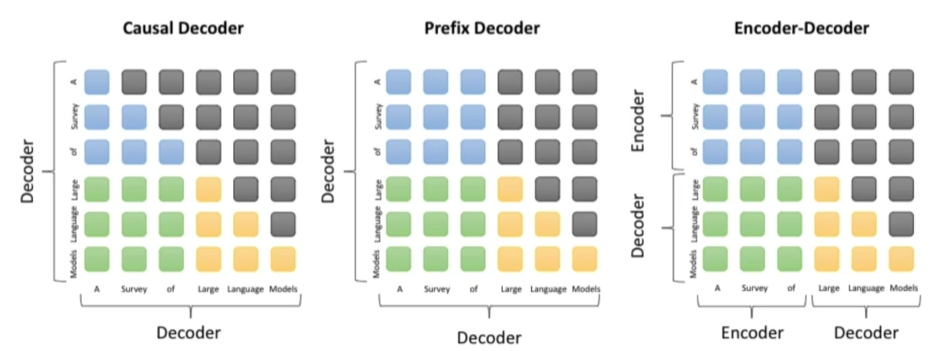

LLM主要有`Decoder-Only`或`MoE`两种形式，两者在整体架构上较为相似，主要区别为`MoE`在`FFN`部分引入了多个专家网络。一个典型的LLM结构，可分为三部分——输入层、多层Decoder堆叠结构和输出层

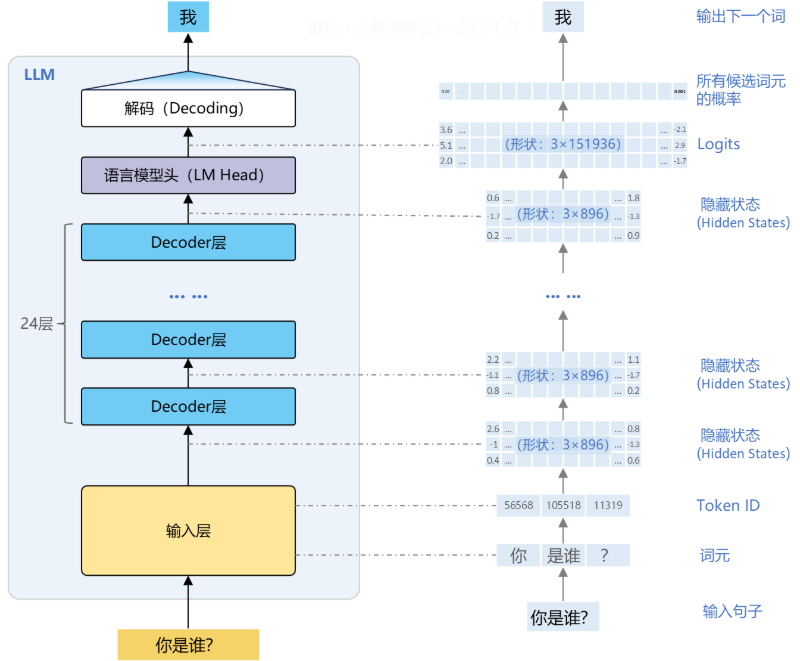

输入层将输入文本转换为多维数值矩阵，以便送往模型主体结构进行计算。

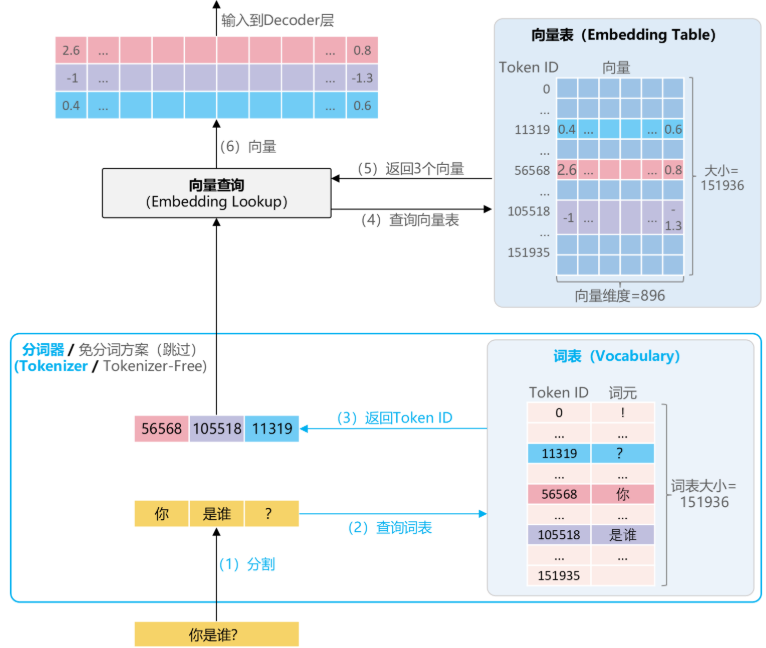

输出层负责根据概率分布，应用解码算法确定最终预测的下一个/N个词元。根据概率分布，应用解码策略确定最终预测的下一个词元。每一个token的生成都需要重新走一遍所有层Transformer结构。

- 输入隐藏状态：Decoder最后一层的隐藏状态作为LLM输出层的输入。如图中所示维度为3×896的数值矩阵，包含了前缀序列的所有语义信息。
- 语言模型头`LM Head`：通常是一个全连接层，用于将隐藏状态转换为`Logits`（推理时只计算最后一个位置的Logits）。
- 提取最后位置的Logits：预测下一个词元仅依赖于前缀序列最后一个位置的Logits，因此需要从所有位置的Logits中提取最后一个位置的Logits。
- 转换为概率分布`Softmax`：通过`Softmax`函数将`Logits`转换为概率分布，得到词表中每个词元的概率。
- 解码`Decoding`：根据概率分布，应用解码策略确定最终预测的下一个词元。

> 解码策略是决定最终输出文本流畅性、多样性及整体表现的核心因素。常见的解码算法包括：贪婪搜索、波束搜索`Beam Search`及其衍生算法、多项式采样、Top-K采样、Top-P采样、对比搜索`Contrastive Search`、投机解码`Speculative Decoding`、前瞻解码`Lookahead Decoding`、`DoLa`解码等。
>
> - **贪婪搜索**`Greedy Search`在生成下一个Token（词元）时，每次都会选择当前**概率最高**的一个Token，不考虑生成序列的全局最优性或多样性，然后继续对下一个Token位置执行相同的操作。尽管这种方法简单快速，但生成的内容可能过早陷入局部最优，**缺乏多样性**。
>
> - **Beam Search**`波束搜索`在每一步生成时，不仅仅选择一个最优Token（词元），而是保留**多个候选**序列，其余的路径则被剪枝。这些候选序列会在后续步骤中继续扩展，直到生成结束。最终，从所有候选序列中选择得分**最高**的一条作为最终输出。Beam的数量（num_beams参数）越大，搜索空间越广，生成结果越**接近全局最优**，但计算成本也随之增加。
>
>     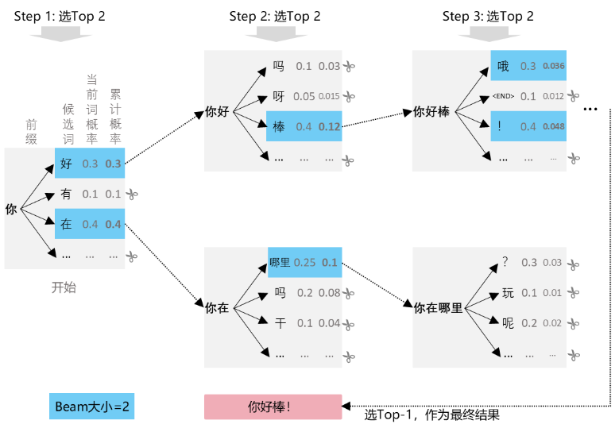

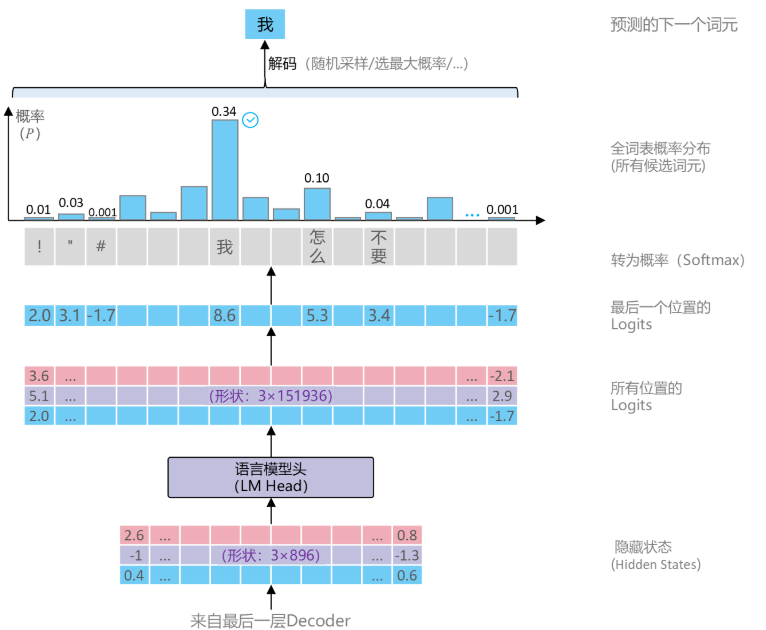

> - **多项式采样**（Multinomial Sampling）是生成式模型中一种常见的**随机采样**方法，生成下一个Token时，以模型预测的概率分布为依据，在概率分布中“按概率大小”随机抽取Token（而非等概率随机抽样）。包含Top-K、Top-P等
> - **Top-K采样**（Top-K Sampling）是一种在生成任务中常用的策略，类似于**多项式采样**，但其采样候选池经过限制。使用Top-K采样时，每一步生成Token时仅保留模型预测概率最高的**前K个**词，并从中按概率分布进行随机抽样。
> - **Top-P采样**（Top-P Sampling），又称**核采样**（Nucleus Sampling），该方法通过动态选择一个最小候选集合，使得候选词的概率和达到设定的概率阈值P，然后，在该候选集合中随机采样。与Top-K采样相比，Top-P采样能够根据概率累积**动态调整**候选集的大小。

大模型的训练主要分为两个阶段——预训练`Pre-Training`和后训练`Post-Training`。在每个阶段，所使用的训练数据、训练范式、训练目标和超参数均有所不同。

- 预训练阶段包括初期训练（基于海量数据的短上下文训练）、中期训练（长文本/长上下文训练）以及退火`Annealing`训练等。此阶段以自监督学习为主，使用的数据量最大，同时也是最消耗算力的环节。

    > 目前，LLM常用的预训练任务主要分为三类，包括语言建模`Language Modeling,LM`、去噪自编码`Denoising Autoencoding, DAE`以及混合去噪器`Mixture-of-Denoisers,MoD`
    >
    > 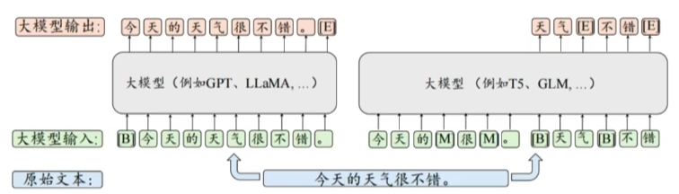
    > 在去噪自编码任务中，输入文本经过一系列随机替换或删除操作，形成损坏的文本$u_{|\tilde{u}}$。模型的目标是根据这些损坏的文本恢复出被替换或删除的词元片段$\tilde{u}$。去噪自编码器的训练目标可以用以下数学公式表示:
    > $$
    > \mathcal{L}({u}) = \log P(\tilde{u}|u_{|\tilde{u}})
    > $$
    > 与语言建模相比，去噪自编码任务的实现更为复杂，需要设定额外的优化策略，如词元替换策略、替换片段长度、替换词元比例等。这些策略的选择会直接影响模型的训练效果。尽管去噪自编码任务在许多预训练语言模型中得到了广泛应用。
    >
    > 混合去噪器，通过将语言建模和去噪自编码的目标均视为不同类型的去噪任务，对于预训练任务进行了统一建模。
- 后训练阶段则包含多种可选的训练范式，包括但不限于SFT（监督微调）、蒸馏、RSFT（拒绝采样微调）、RLHF（基于人类反馈的强化学习）、DPO（直接偏好优化），以及其他强化学习方法，例如GRPO（群体相对策略优化）、PPO（近端策略优化）等。其中，某些环节也可进行多轮迭代训练，例如多轮拒绝采样微调（Rejection Sampling Fine-Tuning, RSFT）。

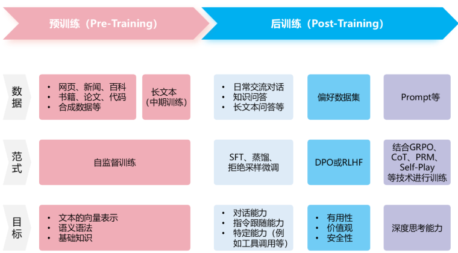

### 模型微调

可用于SFT的微调技术种类多样，如下图的分类图所示：前两种方法仅需基于预训练模型主体进行微调；并联低秩微调和Adapter Tuning则需要引入额外的新模块，基于Prompt的微调则另辟蹊径，从模型的输入着手进行微调。

- Adapter类通过在预训练模型的各层之间插入较小的神经网络模块，这些新增的神经模块被称为“适配器"，在进行下游任务的微调时，只需对适配器参数进行训练便能实现高效微调的目标。
- Prefix Tuning类通过在模型的输入或隐层添加k个额外可训练的前缀标记，模型微调时只训练这些前缀参数便能实现高效微调的目标。
- LORA类通过学习小参数的低秩矩阵来近似模型权重矩阵 W 的参数更新，微调训练时只需优化低秩矩阵参数便能实现高效微调的目标。

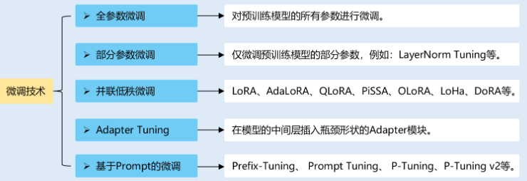

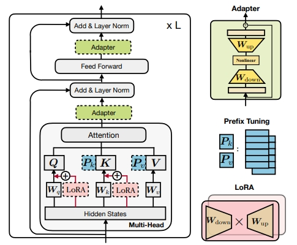

具体来说，当以下场景出现时，可以考虑对大型语言模型进行微调:

- 任务复杂度高，情境学习效果不足。情境学习`in-contextLearning`是通过在提示(Prompt)中加入任务示例，让模型更好理解任务需求。虽然这种方法灵活且不需要更新模型权重，但有时模型对复杂任务的理解力不足。如果单靠调整提示(Prompt Engineering)不能显著提升性能，就需要进一步优化模型。
- 零样本或少样本推理效果欠佳。零样本推理(Zero-hot Inference):模型仅根据问题上下文和提示进行推理，不依赖任何示例。虽然适合通用任务，但对于专业任务，模型可能难以理解语境或任务逻辑。
- 领域或任务需求高度专业化。预训练的大型语言模型(LLM)设计通用，覆盖广泛领域。但在以下情况下，模型可能需要微调以提升特定任务表现:涉及专业术语、领域知识(如法律、医学、工程)。需要模型对高度特定的输出格式或逻辑规则保持一致性。某些任务需要高精度、低错误率，例如客户服务、医学诊断、自动化文档处理
- 输出结果不符合用户需求。即使通用模型输出具有一定准确性，但在用户偏好或特定任务中可能不够符合要求。例如:输出风格、语气不匹配。需要更个性化或品牌化的结果。

与预训练阶段类似，SFT的Loss也是基于交叉熵

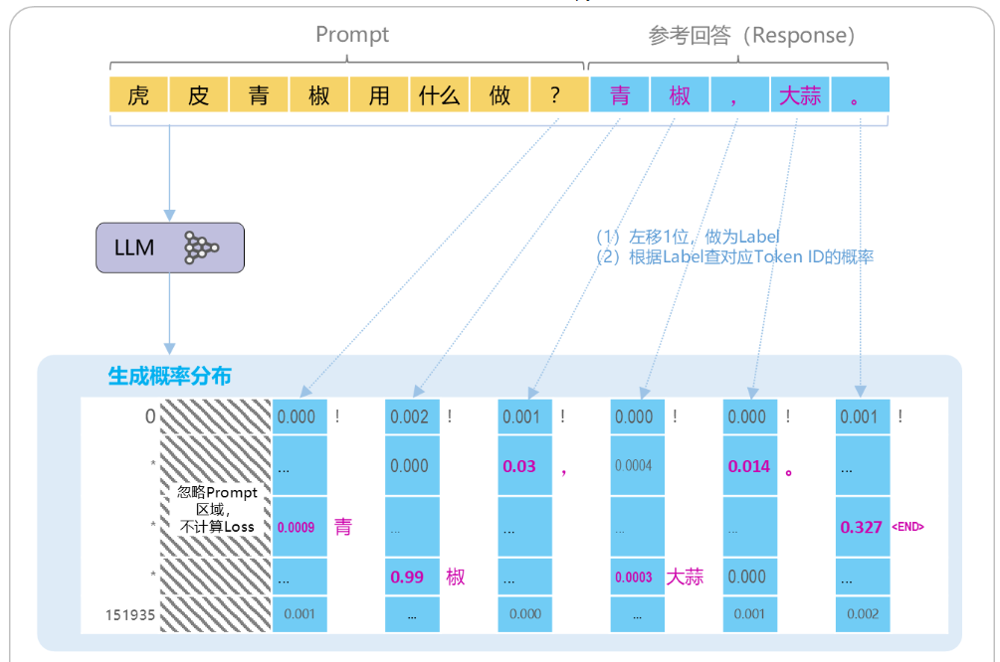

模型训练时通常使用固定长度的输入。当输入的数据长度不一致时，对于短序列，会在其末尾填充（padding）以匹配最大序列长度，这会导致计算资源的浪费。因此，常见的做法是将多条数据拼接（Packing）在一起，填充到一个固定长度的输入序列中。为了确保计算过程中不同数据之间互不干扰，通常需要**重设**位置编号和注意力掩码，以在计算Attention时保持各条数据的语义独立性。

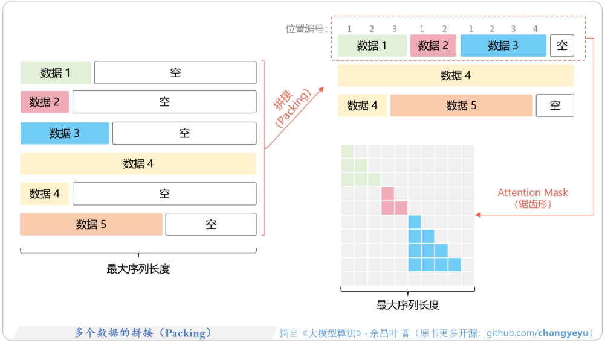

#### Adapter Tuning

Adapter Tuning 的主要是想是:

- 作者设计了一种新的Adapter结构，并将其嵌入Transformer的结构里面，
- 针对每一个Transformer层，增加了两个Adapter结构(分别是多头注意力的投影之后和第二个feed-forward层之后),
- 在训练时，固定住原来预训练模型的参数不变，只对新增的 Adapter 结构和 Laver Norm 层进行微调，从而保证了训练的高效性
- 每当出现新的下游任务，通过添加Adapter模块来产生一个易于扩展的下游模型，从而<span style="color: red;">避免全量微调与灾难性遗忘的问题</span>。

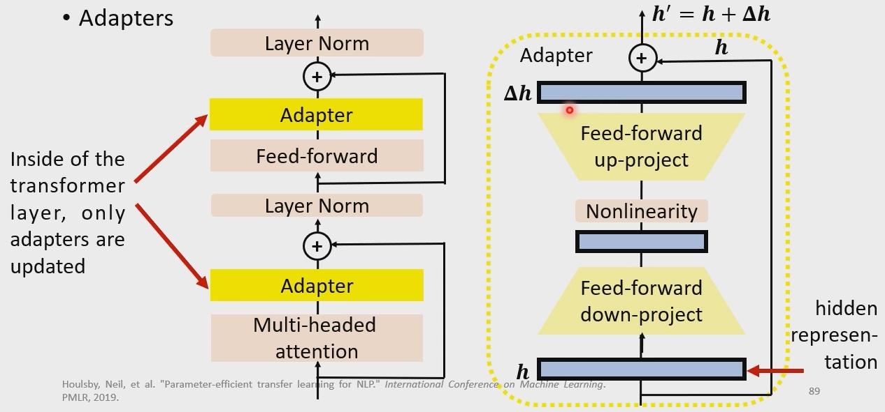

同时，通过一个跳跃连接`skip·connection`来将Adapter的输入重新加到最终的输出中去，这样可以保证，即便 Adapter 一开始的参数初始化接近0，Adapter也由于skip connection的设置而接近于一个恒等映射，从而确保训练的有效性。

#### 基于prompt的微调

##### Prefix tuning 

Prefix Tuning，在输入token之前构造一段任务相关的virtual tokens作为Prefix $\mathbf{P}$，然后训练的时候只更新Prefix部分的参数，而PLM中的其他部分参数固定。根据经验，<span style="color: red;">直接更新$\mathbf{P}$参数会导致不稳定的优化和性能的轻微下降</span>。因此，我们通过一个由大型前馈神经网络$\text{MLP}_{\theta}$组成的较小的矩阵$\mathbf{P}^{\prime}$来<span style="color: red;">重参数化</span>矩阵$\mathbf{P}=\text{MLP}(\mathbf{P}^{\prime})$。注意，$\mathbf{P}$和$\mathbf{P}^{\prime}$有相同的行维度（即前缀长度），但有不同的列维度。一旦训练完成，这些 `reparametrization parameters` 可以被放弃，只有前缀$\mathbf{P}$需要保存。

> 这在每一层都添加了相同的 `prefix`，包括输入层。是否可以对不同的层采用不同的 `prefix`，使得表达能力更强？这就是 `P-Tuning V2` 的思想。

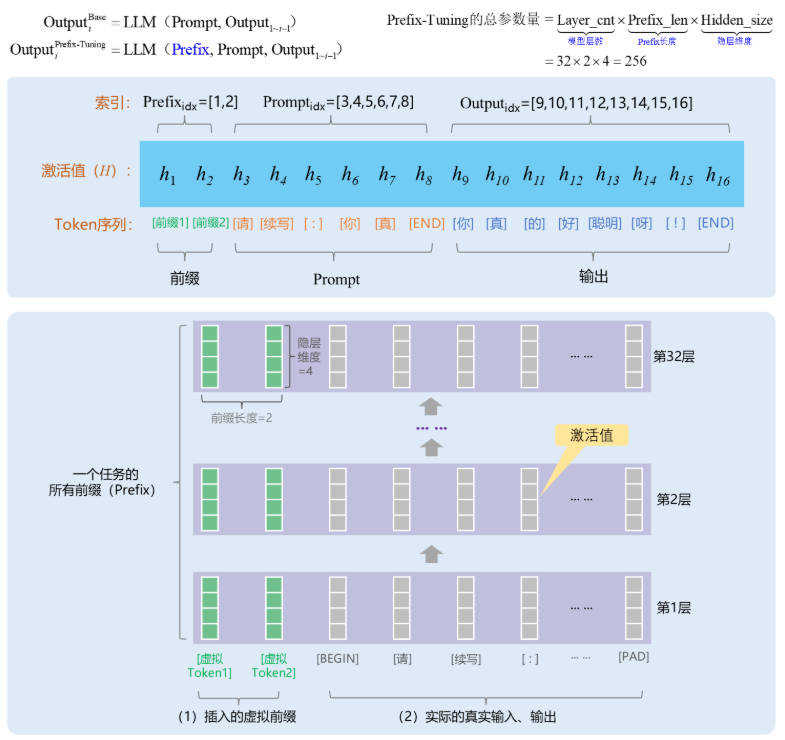

##### Prompt Tuning

<span style="color: red;">冻结了整个 `pre-trained` 模型，只允许每个下游任务有额外的 k 个 `tunable tokens` 被添加到 `input text` 之前</span>。具体而言，给定$n$个 `tokens` 组成的序列$\{x_1,x_2,⋯,x_n\}$，`T5` 做的第一件事是嵌入 `tokens` ，形成一个矩阵$\mathbf{X}_e\in \mathbb{R}^{n×e}$，其中$e$是 `embedding`空间的尺寸。我们的`soft-prompts`被表示为一个参数$\mathbf{P}_e\in \mathbb{R}^{p×e}$，其中$p$是`prompt`的长度。然后，我们的 `prompt` 被拼接到 `embedded input` ，形成单个矩阵$[\mathbf{P}_e;\mathbf{X}_e]\in \mathbb{R}^{(p+n)×e}$，然后像正常一样馈入 `encoder-decoder` 。我们的模型被训练成最大化$\mathbf{Y}$的概率，但只有 `promp` 参数$\mathbf{P}_e$被更新。

Prompt Tuning可以看作是Prefix Tuning的简化版本，它给每个任务定义了自己的prompt，然后拼接到数据上作为输入，但只在输入层加入prompt tokens，<span style="color: red;">并且不需要加入多层感知器(MLP)进行调整来解决难训练的问题</span>。

> 这是 `Prefix-tuning` 在仅有输入被添加 `prefix` 的特殊情况，根据 `prefix-tuning` 的论文，这种情况的效果不佳。猜测原因是：`Prefix-tuning` 中的模型规模不够大；`Prefix-tuning` 采用了重参数化技巧的影响。

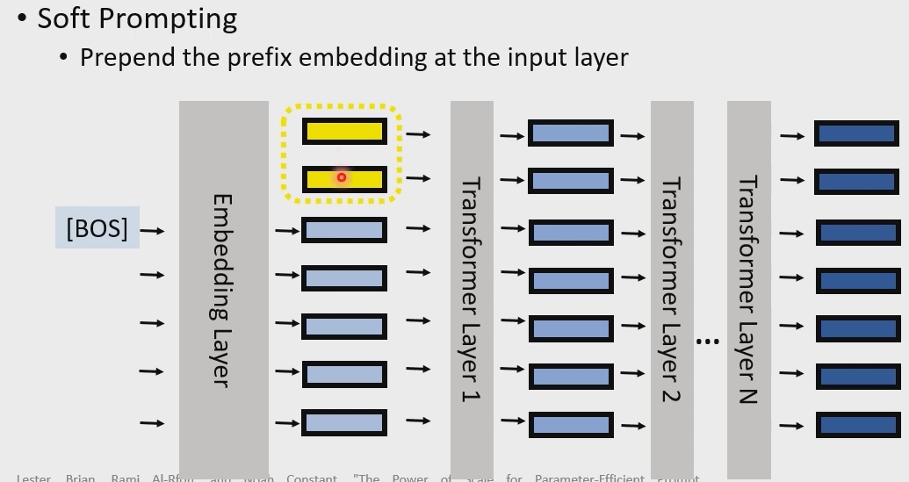

#### p-tuning

 `prefix-tuning` 采用了 `P-tuning` 类似的策略来训练 `continuous prompt` 。然而，它们在几个方面是不同的。

- 首先，`prefix-tuning` 是为自然语言生成任务和 `GPT` 设计的，而 `P-tuning` 则针对自然语言理解任务和所有类型的语言模型。

    > 事实上，`prefix-tuning` 也可以用于所有类型的任务、所有类型的模型。

- 第二，`prefix-tuning` 只允许在输入序列的开头添加 `prompt tokens` ，而 `P-tuning` 可以在任何地方插入 `tokens`。

- 第三，`prefix-tuning` 在 `transformer` 的每一层都侵入性地拼接了 `continuous prompt tokens` ，因为作者发现仅仅在输入中 `prompting` 并没有效果；相反，`P-tuning` 非侵入性地只在输入中添加 `continuous prompts` 从而工作良好。

- 最后，`P-tuning` 还介绍了如何使用 `anchor prompts` 来进一步改进。

    > 即，添加类似于 `"?"` 这样的 `token` 在 `prompts` 中。

虽然训练 `continuous prompts` 的想法很直接，但在实践中，它面临着两个优化挑战：

- 离散性：$\mathcal{M}$的原始 `word embedding`$\mathbf{e}$在预训练后已经变得高度离散。如果$\mathbf{h}$被初始化为随机分布，然后用随机梯度下降法进行优化，已经被证明只在小范围内改变参数，优化器将很容易陷入局部最小值。
- `association` ：另一个担忧是，从直觉上讲，我们认为 `prompt embeddings`$\mathbf{h}_i$的值应该是相互依赖的，而不是独立的。我们需要一些机制来将 `prompt embeddings` 相互关联起来。

鉴于这些挑战，在 `P-tuning` 中，我们建议使用一个由非常简单的神经网络组成的 `prompt encoder` 将$\mathbf{h}_i$建模为一个序列，以解决离散性和关联问题。而在实践中，<span style="color: red;">我们选择了一个双向的 `LSTM` ，具有 `ReLU` 激活的双层 `MLP`</span>，从而鼓励离散性。正式地，语言模型$\mathcal{M}$的 `input embeddings`$\mathbf{h}_i^{\prime}$为：

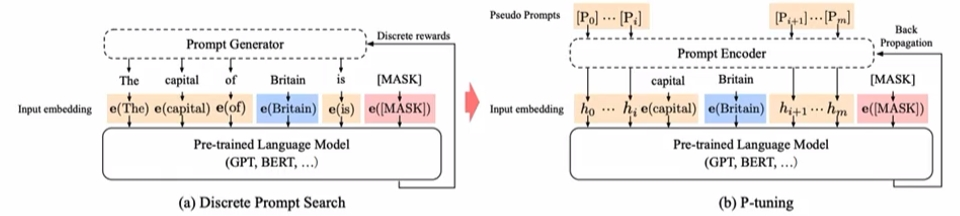

虽然 `LSTM head` 的使用确实给 `continuous prompts` 的训练增加了一些参数，但 `LSTM head` 比 `pre-trained` 模型要小几个数量级。而且，在推理中，我们只需要输出 `embedding`$\mathbf{h}^{\prime}$，可以舍弃 `LSTM head` 。

> `Prefix-Tuning` 直接采用简单的 `MLP` ，那么它采用这里的 `LSTM + MLP` 是否也能提升效果？这种优化$\mathbf{h}$的方式也不太优雅，与 `Prefix-Tuning` 一样都是采用了参数化技巧。此外，为什么这里要用 `LSTM`？论文没有进行消融研究。

##### `p-tuningv2`

`Prompt Tuning`和`P-tuning`在许多 `NLP` 应用中被证明相当有效，但由于缺乏普遍性，在取代微调方面仍有不足，如下所述。

- 缺少跨尺度的普遍性：`prompt tuning`表明，当模型规模超过 `10B` 参数时，`prompt tuning` 可以与微调相媲美。然而，对于被广泛使用的中型模型（从 `100M` 到 `1B` ），`prompt tuning` 的表现比微调差很多。
- 缺少跨任务的普遍性：尽管`prompt tuning`、`p-tuning`在一些自然语言理解基准上表现出了优越性，但 `prompt tuning` 在困难的序列标注任务上的有效性并没有得到验证。

为了解决这些挑战，`P-tuning v2` 采用了 `deep prompt tuning` 。在不同的层中，`prompts` 视为 `prefix tokens` 而被加入。

- 一方面，`P-tuning v2` 有更多可调优的 `task-specific` 参数（从 `0.01%` 到 `0.1%-3%` ），从而允许更多的 `per-task` 容量，同时具有`parameter-efficient`。

- 另一方面，被添加到更深的层的`prompts` 对模型预测有更加直接的影响。

    > `P-tuning v2` 与 `P-tuning` 的核心变化是：`P-tuning v2` 不仅在输入层插入 `continues prompts`，而且在每个 `layer` 插入了 `continues prompts`。这似乎就是 `Prefix-Tuning` 的思想？与 `Prefix-Tuning` 的区别在于实现细节不同：
    >
    > - `P-Tuning v2` 直接采用 `Classification Head`，这类似于 `BERT` 。
    > - `P-Tuning v2` 发现某些任务上，重参数化技巧导致效果下降。

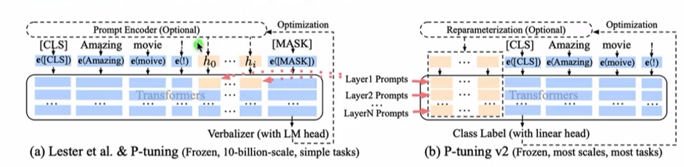

#### Lora

之前的研究发现模型在针对特定任务进行调整时，参数矩阵往往是过参数化的，其存在冗余。为了解决这一问题，LORA提出在预测的参数矩阵上添加低秩分解矩阵来近似每层参数更新。从而减少下游所需训练的参数。将所有微调参数都放到attention的某一个参数矩阵的效果并不好，将可微调参数分配到$\mathbf{W}_q$和$\mathbf{W}_v$的效果更好，即使是秩仅取4也能在$\Delta \mathbf{W}$中获得足够的信息，因此在实际操作中，应当将可微调参数分配到多种类型权重矩阵中，而不应该用更大的秩单独微调某种类型的权重矩阵。

在LORA矩阵初始化中：降维矩阵$\mathbf{A}$采用高斯分布(正态分布)来初始化，以赋予其随机特性；而升维矩阵$\mathbf{B}$初始化为零矩阵，这样开始训练时不会影响原有模型的输出，确保训练稳定性。更新方式为
$$
\mathbf{W} = \mathbf{W}_0 + A\cdot B^T
$$
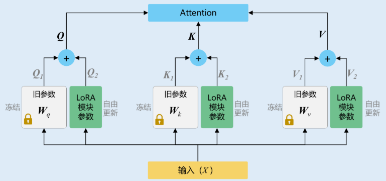

如果同时将 A和 B都初始化为零：

- 可能出现梯度消失和对称性问题：所有神经元的初始状态和更新方向都相同，导致网络无法打破对称性，这样一来，神经元无法学习到多样化的特征，影响模型的表达能力。
- 训练困难：梯度更新可能会因为缺乏初始扰动而过于缓慢，导致训练过程收敛速度变慢，甚至无法收敛。

如果同时将 A和 B都采用高斯分布(正态分布)来初始化

- 初始扰动过大:过大的$\Delta W$会在训练开始时对原有的预训练模型参数造成过大的扰动。这可能导致模型的输出偏离预期，导致训练不稳定
- 收敛困难:过大的初始噪声可能导致梯度爆炸，模型难以找到正确的优化方向，从而影响训练效果。

是否可以把A初始化为零矩阵，B初始化为高斯分布(正态分布)，在理论上，LORA的矩阵初始化方式是可以对调的。

- 优化过程:将B初始化为随机高斯分布，而A初始化为零，并不会改变预训练权重的初始状态。但在优化中，梯度如何影响B和A的学习方向可能会略有不同。
- 数值稳定性:文中推荐的方式可能经过了实验验证，确保在实际应用中具有较好的数值稳定性。如果对调初始化，可能需要重新调试超参数(如学习率)。

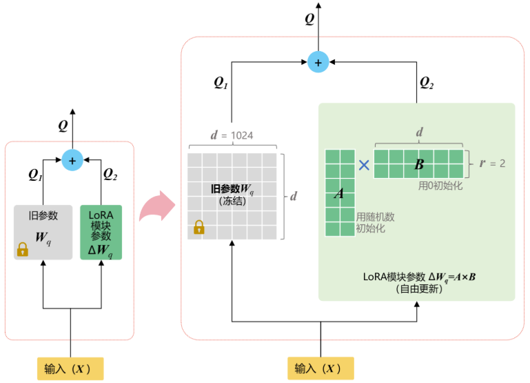

在使用LORA进行微调时，过拟合是一个常见的问题。如何避免过拟合

- 减小r(秩)值：在LORA中，低秩矩阵的秩(即r值)决定了新增参数的数量。较大的r值意味着更多的参数，模型的容量增大，可能导致过拟合。通过减小r值，减少了模型需要学习的参数数量，从而降低模型的复杂度，使其不易过度拟合训练数据中的噪声
- 增加数据集大小：更多的训练数据可以提供更全面的样本分布，使模型学习到更一般化的特征。增加数据集大小可以使模型在更广泛的数据上进行训练，减少因数据不足导致的过拟合。
- 增加优化器的<span style="color: red;">权重衰减率</span>(weight decay)：权重衰减是一种正则化方法，通过在损失函数中添加权重的L2正则化项，防止模型参数过大。增加权重衰减率可以限制模型参数的大小，防止参数过大导致的过拟合。它鼓励模型学习到更简单的参数配置。
- 增加LORA层的dropout值：Dropout是一种防止过拟合的技术，通过在训练过程中随机忽略部分神经元，使模型不依赖于特定的神经元。在LORA层增加dropout，可以随机屏蔽部分LORA层的参数，使模型更具鲁棒性，减少对特定参数的过度依赖，从而降低过拟合的风险。

### 免训练的优化技术

#### `CoT`

我们探讨了如何通过一种简单的方法来解锁大型语言模型的推理能力。我们的方法由两个想法驱动：

- 首先，用于算术推理的技术可以从自然语言的理由（这些理由导致最终正确答案）中获益。
- 其次，大型语言模型提供了令人振奋的前景，即通过 `prompting` 进行 `in-context few-shot learning` 。。

在给定一个 `prompt` 的条件下，我们探索了语言模型对推理任务进行 `few-shot prompting` 的能力，其中给定的 `prompt` 由三要素组成：`<input, chain of thought, output>`。`chain of thought: COT` 是一系列中间的自然语言推理步骤（这些中间步骤导致了最终输出），我们把这种方法称为 `chain-of-thought prompting` 。

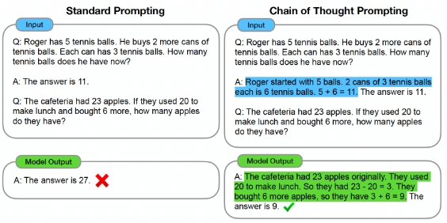

在CoT展现其潜力后，迅速**衍生**出多种相关技术，例如ToT、GoT、Self-consistency CoT、Zero-shot-CoT、Auto-CoT、MoT、XoT等

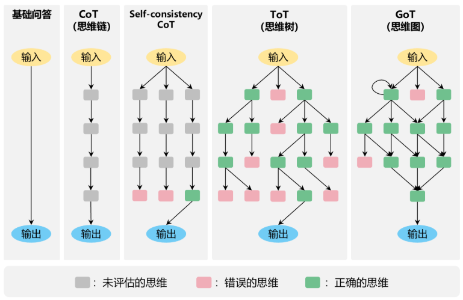

#### Auto `CoT`

`CoT prompting` 可以分为两个主要范式：

- 一种范式是：在 `test question` 后添加一个类似于 `"Let’s think step by step"` 的单个 `prompt` ，以促进 `LLM` 中的 `reasoning chains`。被称为 `Zero-Shot-CoT`。

    > `Zero-Shot-CoT` 其实也拼接了 `reasoning demonstrations` ，只是它的 `demonstrations` 是由模型自动生成的（而不是人工生成的）。

- 另一种范式是具有一个接一个的人工 `reasoning demonstrations` 的 `few-shot prompting`。每个 `demonstration` 都有一个问题和一个 `reasoning chain` 。称为 `Manual-CoT`。

为了缓解来自 `Zero-Shot-CoT` 的 `reasoning chain mistakes` 的影响，我们的分析表明，`demonstration questions` 的多样性是关键所在。基于这一洞察，我们提出了一种自动构建 `demonstrations` 的 `Auto-CoT` 方法。`Auto-CoT` 包括两个主要步骤：

- 首先，将一个给定的数据集的所有问题划分为几个 `clusters` 。

    > 聚类通过一个 `pre-trained sentence encoder` 来进行，如 `SBERT` 。

- 其次，从每个 `cluster` 中选择一个有代表性的问题，并使用简单启发式的 `Zero-Shot-CoT` 生成它的 `reasoning chain` 。

> 核心思想有两个：
>
> - 通过 `Zero-Shot-CoT` 来人工构造 ”伪“ `examples` ，从而进行 `Few-Shot-CoT` 。
> - 构造的时候选择多样化的样本，并且过滤掉不满足条件的样本（这个条件是人工定义的规则）。

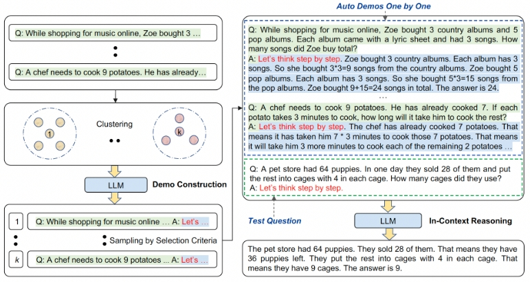

#### Least-To-Most Prompting

`chain-of-thought prompting` 有一个关键的局限性：它在需要泛化到解决比 `demonstration examples` 更难的问题的任务上往往表现不佳。为了解决这种从易到难的泛化问题，我们提出了 `least-to-most prompting` 。它包括两个阶段：

- 首先将一个复杂的问题分解成一系列较容易的子问题。
- 然后依次解决这些子问题，其中，解决一个给定的子问题是由以前所解决的子问题的答案来推动的。

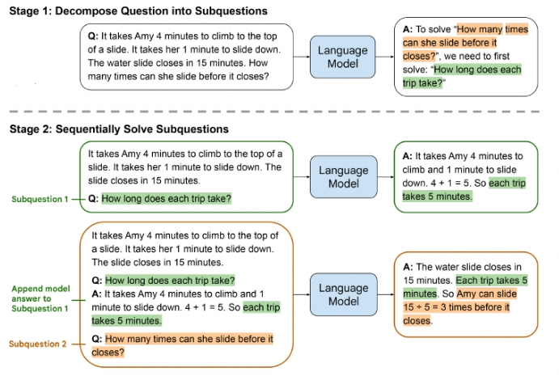

在上图所示的例子中，语言模型首先被要求将原始问题分解为子问题。传递给模型的 `prompt` 包括：说明如何分解复杂问题的 `examples` （图中没有显示），然后是要分解的具体问题。语言模型发现，原始问题可以通过解决一个中间问题来回答 `"How long does each trip take?"` 。在下一个阶段，我们要求语言模型依次解决 `problem decomposition` 阶段所得到的子问题。

- 原始问题被附加为最后的子问题。
- 求解过程以向语言模型传递一个 `prompt` 而开始，这个 `prompt` 包括：说明问题如何解决的例子（图中未显示），然后是第一个子问题 `"How long does each trip take?"` 。
- 然后，我们采用语言模型所生成的答案（`"... each trip takes 5 minutes."` ），并通过将所生成的答案附加到前一个 `prompt` 中来构建下一个 `prompt` ，然后是下一个子问题（在这个例子中，这恰好是原始问题）。
- 然后，新的 `prompt` 被传回语言模型，由该模型返回最终答案。

## Transformer

序列到序列是一种条件的序列生成问题，给定一个序列$\mathbf{x}_{1:S}$，生成另一个序列$\mathbf{y}_{1:T}$。输入序列的长度$S $和输出序列的长度$T $可以不同。 序列到序列模型的目标是估计条件概率

$$
p_{\theta}\left(\mathbf{y}_{1 : T} | \mathbf{x}_{1 : S}\right)=\prod_{t=1}^{T} p_{\theta}\left(y_{t} | \mathbf{y}_{1 :(t-1)}, \mathbf{x}_{1 : S}\right)
$$
给定一组训练数据$\left\{\left(\mathbf{x}_{S_{n}}, \mathbf{y}_{T_{n}}\right)\right\}_{n=1}^{N}$，我们可以使用最大似然估计来训练模型参数。
$$
\max _{\theta} \sum_{n=1}^{N} \log p_{\theta}\left(\mathbf{y}_{1 : T_{n}} | \mathbf{x}_{1 : S_{n}}\right)
$$
一旦训练完成，模型就可以根据一个输入序列$\mathbf{x}$来生成最可能的目标序列，
$$
\hat{\mathbf{y}}=\underset{\mathbf{y}}{\arg \max } p_{\theta}(\mathbf{y} | \mathbf{x})
$$

`Transformer`应用在序列到序列任务中，其整个网络结构可以分为两部分：

- 编码器只包含多层的自注意力模块，每一层都接受前一层的输出作为输入。编码器的输入为序列$\mathbf{x}_{1:S}$，输出为一个向量序列$H_e = [\mathbf{h}^e_1, · · · , \mathbf{h}^e_S]$

- 解码器依是通过自回归的方式来生成目标序列。和编码器不同，解码器可以由以下三个模块构成：

  - 自注意力模块：第$t$步时，先使用自注意力模型对已生成的前缀序列$\mathbf{y}_{1:t−1}$进行编码得到$H_d = [\mathbf{h}^d_1, · · · , \mathbf{h}^d_{t−1}]$。在训练时，解码器的输入为整个目标序列，这时可以通过一个掩码来阻止每个位置选择其后面的输入信息。


  - 解码器到编码器注意力模块：使用$\mathbf{h}^d_{t−1}$作为查询向量，通过注意力机制来从输入序列$H_e $中选取有用的信息。


  - 逐位置的前馈神经网络：使用一个前馈神经网络来综合得到所有信息。将上述三个步骤重复多次，最后通过一个全连接前馈神经网络来计算输出概率。


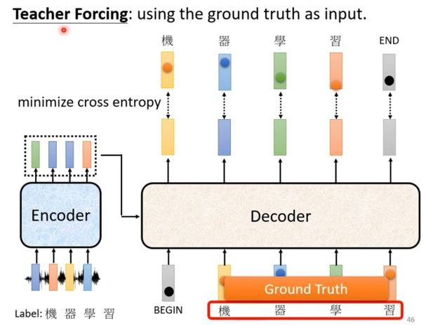

### 模型结构

#### position-encoder


对于一个序列$\mathbf{x}_{1:T}$，我们可以构建一个多层的多头自注意力来对其进行编码。由于自注意力模型忽略了输入信息的位置信息，因此初始的输入序列中加入位置编码信息来进行修正。对于一个输入序列$\mathbf{x}_{1:T}$，
$$
H^{(0)}=\left[\mathbf{e}_{x_{1}} \oplus \mathbf{p}_{1}, \cdots, \mathbf{e}_{x_{T}} \oplus \mathbf{p}_{T}\right]
$$
其中$\mathbf{e}_{x_t }$为词$x_t $的嵌入向量表示，$\mathbf{p}_t $为位置$t$的向量表示。

位置编码有两种选择：

- 可以作为参数来学习，即：将 `encoder` 的每个输入的位置`embedding` 、`decoder` 的每个输入的位置`embedding` 作为网络的参数，这些参数都从训练中学得。
- 也可以人工设定固定值。论文中使用：

$$
\vec{\mathbf{p}}_i=(p_{i,1},\cdots,p_{i,d_{\text{model}}})^T\\
p_{i,2j}=\sin\left(\frac{i}{10000^{2j/d_{\text{model}}}}\right),p_{i,2j+1}=\cos\left(\frac{i}{10000^{2j/d_{\text{model}}}}\right)
$$

其中$i=1,2\cdots$表示位置编号，$j=0,1,\cdots,d_{\text{model}}/2$表示向量的维度。

> 1. 选择正弦和余弦函数是因为我们假设它可以让模型通过相对位置来轻松地学习关注 `attend`，因为对于任意固定的偏移量$k$，$\vec{\mathbf{p}}_{j+k}$可以表示为$\vec{\mathbf{p}}_j$线性函数。可以让模型推断出比训练期间遇到的序列长度更长的序列。
> 2. 我们还尝试使用可学习的 `positional embedding`，发现这两个版本产生了几乎相同的结果。

使用学到的 `embedding` 将 `input token` 和 `output token` 转换为维度$d_m$的向量。我们还使用学到的线性变换和 `softmax` 函数将 `decoder output` 转换为 `next-token` 的预测概率。在我们的模型中，我们在两个 `embedding layer` （输入层）和 `pre-softmax` 线性变换（输出层）之间（共计三个权重矩阵）共享相同的权重矩阵。在 `embedding` 层中，我们将这些权重乘以$\sqrt{d_m}$。

> 这里有两个输入层，分别来自于 `encoder input` 和 `decoder input`。而输出层来自于 `decoder` 。三个 `embedding` 矩阵共享的前提是：`input symbol` 空间和 `output symbol` 空间是相同的，例如，输入是中文的文本，输出是中文摘要，那么`input symbol` 和 `output symbol` 都是中文单词。否则，`encoder` 的 `embedding` 矩阵无法和 `decoder` 的 两个 `embedding` 矩阵共享。但是无论如何，`decoder` 的两个 `embedding` 矩阵之间可以共享。
>
> 为什么要把 `embedding` 矩阵乘以$\sqrt{d_m}$？论文并未说明原因。有一种解释说是放大 `embedding` 使得它的量级和 `positional embedding` 的量级相同。可以通过实验来验证。

#### Encoder

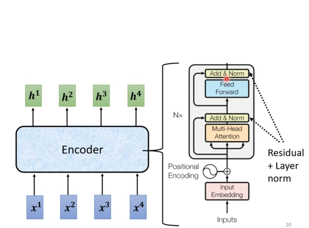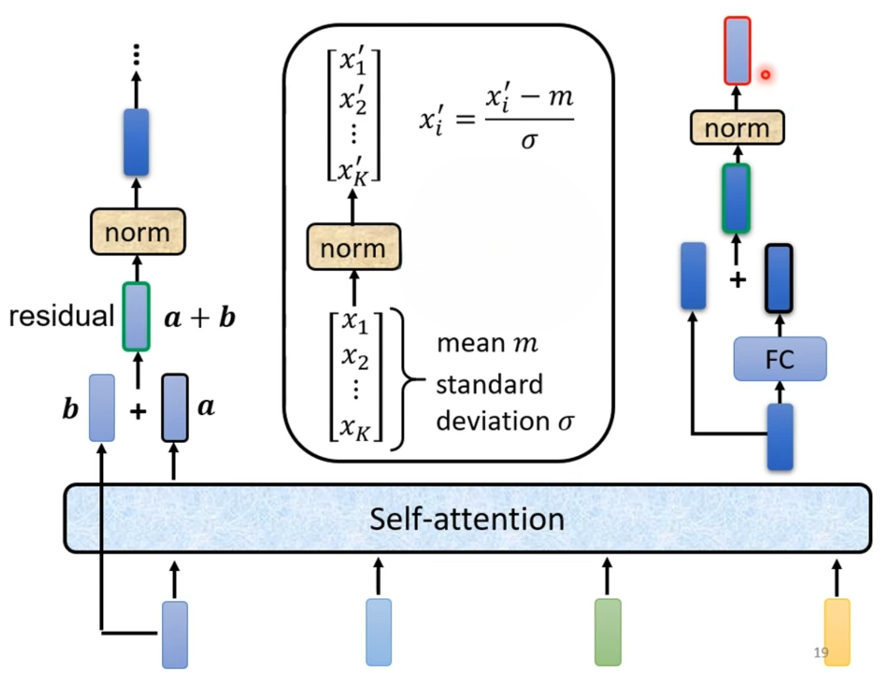

编码器 `encoder` 包含一组 6 个相同的层 `Layer` ，每层包含两个子层 `SubLayer`。

- 第一个子层是一个多头自注意力 `multi-head self-attention` 层，第二个子层是一个简单的全连接层。

- 每个子层都使用残差直连，并且残差直连之后跟随一个`layer normalization:LN` 。假设子层的输入为$\vec{\mathbf{h}}$，则经过 `LN` 之后整体的输出为：$\text{LN}(\vec{\mathbf{h}}+\text{Sublayer}(\vec{\mathbf{h}}))$。

    > $\text{Sublayer}(\cdot)$为`attention`函数或者`FFN`，第$l $层的隐状态$H_l $为
    > $$
    > \begin{aligned} Z_{l} &=\operatorname{LN}\left(H_{l-1}+\text { MultiHead }\left(H_{l-1}\right)\right) \\ H_{l} &=\operatorname{LN}\left(\mathbf{Z}_{l}+\operatorname{FFN}\left(Z_{l}\right)\right) \end{aligned}
    > $$
    > $\text{FFN}(·)$表示逐位置的前馈神经网络，`encoder` 和 `decoder` 中的每一层还包含一个全连接的前馈神经网络，该网络分别且相同地应用于每个位置。该网络包含两个线性变换，中间有一个 `ReLU` 激活函数
    > $$
    > \text{FFN}(\vec{\mathbf{x}})=\max(\vec{\mathbf{0}},\vec{\mathbf{x}}\mathbf{W}_1+\vec{\mathbf{b}}_1)\mathbf{W}_2+\vec{\mathbf{b}}_2
    > $$
    > 虽然线性变换在不同位置上是共享的（即，相同的参数），但是它们在层与层之间使用不同的参数，其中$W_1, W_2, b_1, b_2 $为网络参数。


#### Decoder

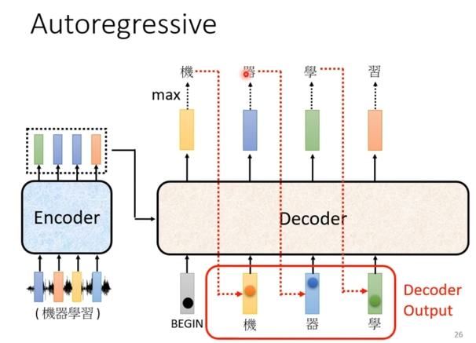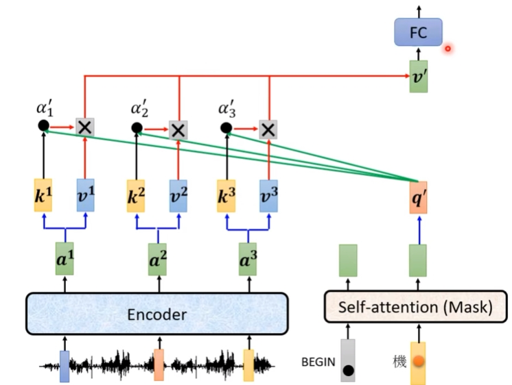

解码器 `decoder` 也包含一组 6 个相同的层 `Layer`，但是每层包含三个子层 `SubLayer` 

- 第一个子层也是一个多头自注意力 `masked multi-head self-attention` 层。

    >  `masked multi-head self-attention`在计算位置$i$的 `self-attention` 时屏蔽掉了位置$i$之后的序列值，这意味着：位置$i$的 `attention` 只能依赖于它之前的结果，不能依赖它之后的结果。
    > $$
    > \text{score}_{i,j}=\left\{ \begin{array}{ll}\frac{\vec{\mathbf{q}}_i\cdot \vec{\mathbf{k}}_j}{\sqrt{d_k}},&j=1,2,\cdots,i\\
    > -\infin,&j=i+1,\cdots,N\end{array}\right.
    > $$
    >
- 第二个子层`encoder-decoder attention`, `query` 来自前一个 `decoder` 层的输出，`keys,values` 来自 `encoder` 的输出。其意义是： `decoder` 的每个位置去查询它与 `encoder` 的哪些位置相关，并用 `encoder` 的这些位置的 `value` 来表示。

    > 在解码过程的第$t$步时，先用上一步的隐状态$\mathbf{h}^d_{t−1 }$作为查询向量，利用注意力机制从所有输入序列的隐状态$H^e = [\mathbf{h}^e_1, · · · , \mathbf{h}^e_S]$中选择相关信息。
    > $$
    > \begin{aligned} \mathbf{c}_{t} &=\operatorname{att}\left(H^{e}, \mathbf{h}_{t-1}^{d}\right)=\sum_{i=1}^{S} \alpha_{i} \mathbf{h}_{i}^{e} \\ &=\sum_{i=1}^{S} \operatorname{softmax}\left(s\left(\mathbf{h}_{i}^{e}, \mathbf{h}_{t-1}^{d}\right)\right) \mathbf{h}_{i}^{e} \end{aligned}
    > $$
    > 其中$s(·)$为注意力打分函数。解码器第$t$步的隐状态
    > $$
    > \mathbf{h}_{t}^{d}=f_{\operatorname{dec}}\left(\mathbf{h}_{t-1}^{d},\left[\mathbf{e}_{y_{t-1}} ; \mathbf{c}_{t}\right], \theta_{\operatorname{dec}}\right)
    > $$
- 第三个子层是一个简单的全连接层，和 `encoder` 一样：每个子层都使用残差直连，并且残差直连之后跟随一个`LN` 。

### 模型训练

句子使用 `byte-pair encoding: BPE` 进行编码，该编码有一个共享的 `source-target vocabulary`，词典规模大约 `37000` 个 `token` 。

> `BPE` 算法：
>
> - 语料库中每个单词表示为字符的拼接，其中 `</w>` 表示词尾。
> - 将每个单词拆分为字符，并计算字符出现的次数。这些字符添加到词表 `vocabulary` 。
> - 寻找出现频次最高的 `character pair`，合并它们并添加到词表。这些合并的 `character pair` 称作 `word-piece` 。
> - 重复执行上一步（即，“寻找--合并”），直到词表达到指定的规模。

## `Bert`系列

### `Bert`

#### 解决问题

目前的技术严重限制了 `pre-trained representation` 的能力，特别是对于微调 `fine-tuning` 方法。主要的限制是：标准的语言模型是单向的，这就限制了在预训练中可以使用的架构。例如，在 `GPT` 中，作者使用了一个从左到右的架构，其中在 `Transformer` 的`self-attention layer` 中每个 `token` 只能关注前面的 `token` 。

- 对于`sentence-level` 的任务，这样的限制是次优的。
- 对于 `token-level` 的任务（如 `SQuAD` 问答任务），当应用基于微调的方法时，这样的限制可能是毁灭性的。因为在这种情况下，从两个方向融合上下文是至关重要的

标准的 `conditional language model` 只能从左到右或从右到左进行训练，因为双向条件会让每个词在`multi-layered context` 中间接地 "看到自己" 。

#### 解决方法

`BERT` 通过提出一个新的预训练目标来解决前面提到的单向约束：`masked language model: MLM` 任务。 `MLM` 从输入中随机掩码一些 `token` ，任务的目标是仅根据上下文来预测被掩码单词的原始 `vocabulary id` 。与从左到右的语言模型预训练不同的是，`MLM` 目标允许`representation` 同时融合左侧和右侧的上下文，这使得我们可以预训练一个深度的双向 `Transformer` 。除了`MLM` ，论文还引入了一个 `next sentence prediction: NSP` 任务来联合预训练 `text-pair representation` 。

#### 模型相关

`BERT Transformer` 使用的是双向自注意力，而`GPT Transformer` 使用的是受约束的自注意力（每个`token` 只能关注其左侧的上下文）。在文献中，双向 `Transformer` 通常被称为 `Transformer encoder` ，而只关注左侧上下文的 `Transformer` 被称为 `Transformer decoder` （因为它可以用于文本生成）。

BERT 的注意力计算过程和 Transformer 的唯一差异在于，在完成注意力分数的计算之后，先通过 Position Embedding 层来融入相对位置信息。这里的 Position Embedding 层，其实就是一层线性矩阵。通过可训练的参数来拟合相对位置，相对而言比 Transformer 使用的绝对位置编码 Sinusoidal 能够拟合更丰富的相对位置信息，但是，这样也增加了不少模型参数，同时完全无法处理超过模型训练长度的输入

#### 输入

对于一个给定的`token` ，它的 `input representation` 是由相应的`token embedding`、`segment emebdding` 和 `position embedding` 相加而成的。

- 我们使用具有 `30k` 个 `token` 的`vocabulary` 的 `WordPiece embedding` 
- 我们使用学到的 `positional embedding`。
- 每个序列的第一个 `token` 总是特殊的 `classification embedding` ，即 `[CLS]`。与这个 `token` 相对应的 `final hidden state` （即 `Transformer` 的输出）被用作分类任务的 `aggregate sequence representation`。对于非分类任务，这个向量被忽略。
- `sentence pair` 被打包成一个单一的序列。我们以两种方式区分这些句子。
  - 首先，我们用一个特殊的 `token`（即，`[SEP]`）将这两个句子分开。（注意，每个句子的结尾都有一个 `[SEP]` ）
  - 其次，我们在第一句的每个 `token` 上添加一个学到的 `segment A Embedding` ，在第二句的每个 `token` 上添加一个学到的 `segment B Embedding` 。

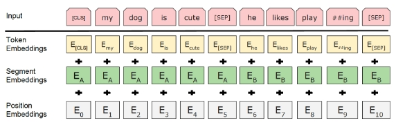

#### 预训练任务

##### Masked LM

为了训练深度双向 `representation` ，我们采取了一种直接的方法，即随机掩码一定比例的 `input token` ，然后只预测那些被掩码的 `token`。在这种情况下，对应于 `mask token` 的 `final hidden vector` 被馈入 `output softmax` （输出空间为整个 `vocabulary`）。在我们所有的实验中，对于每个序列我们随机掩码 `15%` 的 `WordPiece token` 。被掩码的 `token` 填充以 `[MASK]` 。尽管这确实允许我们获得一个双向的预训练模型，但这种方法有两个缺点：

- 首先，我们在预训练和微调之间产生了不匹配 `mismatch`，因为在微调过程中从来没有看到 `[MASK]` 这个 `token` 。

  为了缓解这一问题，我们并不总是用实际的 `[MASK] token` 来替换被掩码的 `token`。相反，训练数据生成器随机选择 `15%` 的 `token` （例如，在句子 `"my dog is hairy"` 中它选择了`hairy` ），然后它将执行以下程序：

  - `80%` 的情况下用 `[MASK] token` 替换该词，例如，`"my dog is hairy" --> "my dog is [MASK]"`。
  - `10%` 的情况下用一个随机的词来替换这个词，例如，`"my dog is hairy" --> "my dog is apple"`。
  - `10%` 的情况下保持该词不变，例如，`"my dog is hairy" --> "my dog is hairy"`。这样做的目的是为了使 `representation` 偏向于实际观察到的单词。

  `Transformer encoder` 不知道哪些单词会被要求预测、哪些单词已经被随机词所取代，所以它被迫保持每个 `input token` 的 `distributional contextual representation` 。

- 其次，每个 `batch` 中只有 `15%` 的`token` 被预测，这表明可能需要更多的 `pre-training step` 来使模型收敛。在实验部分，我们证明了 `MLM` 的收敛速度确实比`left-to-right` 的模型（预测每个 `token` ）稍慢

##### Next Sentence Prediction

许多重要的下游任务，如 `Question Answering: QA` 和 `Natural Language Inference: NLI` ，都是基于对两个文本句子之间关系的理解，而语言建模并没有直接捕获到这一点。为了训练一个能够理解句子关系的模型，我们预训练了一个二元化的 `next sentence prediction task` ，该任务可以从任何单语种的语料库中简单地生成。具体而言，在为每个预训练样本选择句子 `A` 和句子 `B` 时：

- `50%` 的情况下句子 `B` 是紧随句子 `A` 的实际的下一句。
- `50%` 的情况下句子 `B` 是语料库中的一个随机句子。

> 实际上后续的论文表明：`NSP` 预训练任务是没什么作用甚至是有害的。

#### 微调`fine-tune`

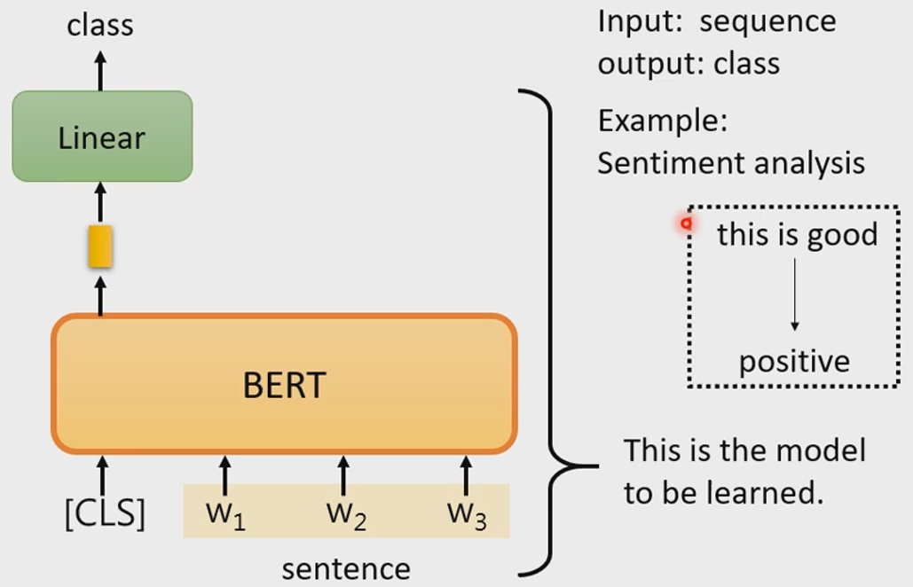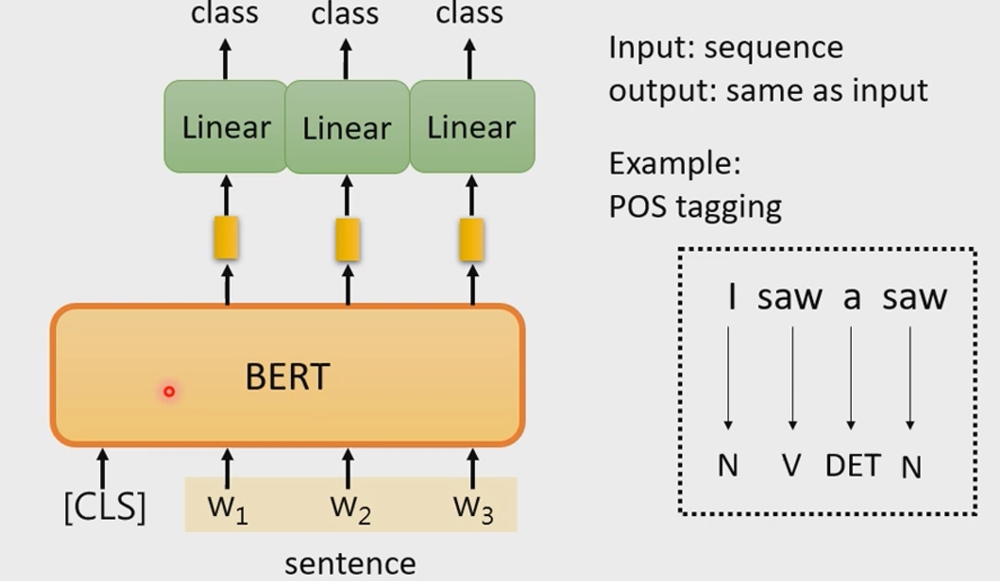

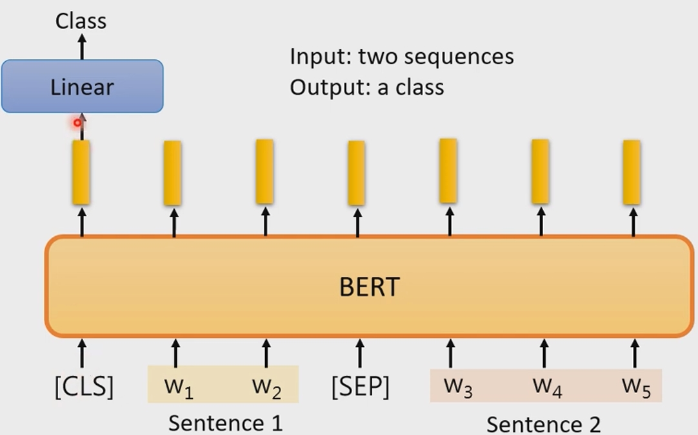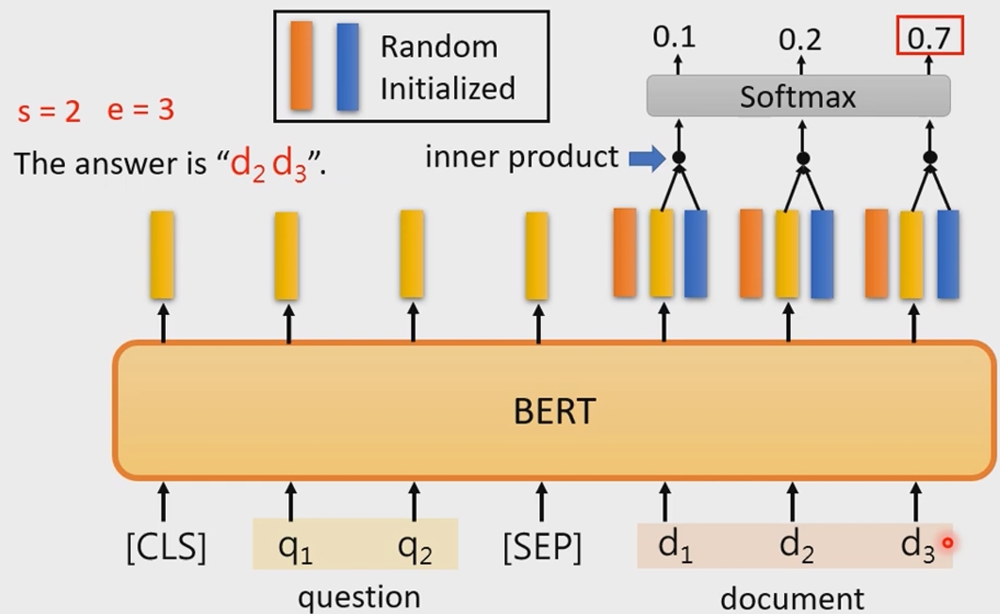

### `RoBERTa`

RoBERTa 的模型架构与 BERT 完全一致，

- `RoBERTa`在预训练中去掉了 NSP，只使用 MLM 任务。
- `RoBERTa`对 MLM 任务本身也做出了改进。在 BERT 中，Mask 的操作是在数据处理的阶段完成的，因此后期预训练时同一个 sample 待预测的 `<MASK>` 总是一致的。由于 BERT 共训练了 40 个 Epoch，为使模型的训练数据更加广泛，BERT 将数据进行了四次随机 Mask，也就是每 10个 Epoch 模型训练的数据是完全一致的。而 RoBERTa 将 Mask 操作放到了训练阶段，也就是动态遮蔽策略，从而让每一个 Epoch 的训练数据 Mask 的位置都不一致。在实验中，动态遮蔽仅有很微弱的优势优于静态遮蔽，但由于动态遮蔽更高效、易于实现，后续 MLM 任务基本都使用了动态遮蔽。
- RoBERTa 认为更大的 batch size 既可以提高优化速度，也可以提高任务结束性能。
- RoBERTa 不再采用 BERT 在 256 长度上进行大部分训练再在 512 长度上完成训练的策略，而是全部在 512 长度上进行训练。
- BERT 原始的 BPE 词表大小为 30K，RoBERTa 选择了 50K 大小的词表来优化模型的编码能力。

### `ALBERT`

ALBERT 对 Embedding 层的参数矩阵进行了分解，让 Embedding 层的输出维度和隐藏层维度解绑，也就是在 Embedding 层的后面加入一个线性矩阵进行维度变换。ALBERT 设置了 Embedding 层的输出为128，因此在 Embedding 层后面加入了一个$128\times 768$的线性矩阵来将 Embedding 层的输出再升维到隐藏层大小。也就是说，Embedding 层的参数从$V\times H$降低到了$V\times E + E\times H$，当 E 的大小远小于 H 时，该方法对 Embedding 层参数的优化就会很明显。

通过对 BERT 的参数进行分析，ALBERT 发现各个 Encoder 层的参数出现高度一致的情况。由于 24个 Encoder 层带来了巨大的模型参数，因此，ALBERT 提出，可以让各个 Encoder 层共享模型参数，来减少模型的参数量。在具体实现上，其实就是 ALBERT 仅初始化了一个 Encoder 层。在计算过程中，仍然会进行 24次计算，但是每一次计算都是经过这一个 Encoder 层。因此，虽然是 24个 Encoder 计算的模型，但只有一层 Encoder 参数，从而大大降低了模型参数量。

类似于 RoBERTa，ALBERT 也同样认为 NSP 任务过于简单，在预训练中无法对模型效果的提升带来显著影响。但是不同于 RoBERTa 选择直接去掉 NSP，ALBERT 选择改进 NSP，增加其难度，来优化模型的预训练。SOP 任务提出的改进是，正例同样由两个连续句子组成，但负例是将这两个的顺序反过来。也就是说，模型不仅要拟合两个句子之间的关系，更要学习其顺序关系，这样就大大提升了预训练的难度。ALBERT 通过实验证明，SOP 预训练任务对模型效果有显著提升。使用 MLM + SOP 预训练的模型效果优于仅使用 MLM 预训练的模型更优于使用 MLM + NSP 预训练的模型。

## GPT系列

### `GPT1`

#### 解决问题

从原始文本中有效学习的能力，可以大大缓解 `NLP` 中对监督学习的依赖。大多数深度学习方法需要大量手动标记的数据，这限制了它们应用于许多缺乏标注资源的领域。在这些情况下，那些可以利用语言信息（这些语言信息来自于未标记数据）的模型，它们提供了一种有价值的替代方法从而免于收集更多标注数据。此外，即使在有大量监督数据可用的情况下，以无监督的方式学习良好的 `representation` 也可以显著提高性能。然而，利用来自未标记文本的 `word-level` 信息以外的信息具有挑战性，主要有两个原因：

- 首先，尚不清楚哪种类型的优化目标在学习对迁移有用的 `text representation` 方面最有效。

  > 即，如何获得 `text representation`？

- 其次，对于将这些学到的 `repersentation` 迁移到目标任务的最有效方法没有达成共识。

  > 即，如何迁移 `text representation`？

#### 解决方法

本文探索出一种结合无监督预训练`unsupervised pre-training` 和监督微调`supervised fine-tuning`的半监督方法，即`Generative Pre-Training: GPT`。`GPT` 的目标是学习一种通用 `representation` ，该 `representation` 只需要很少的适配 `adaption` 就可以迁移到广泛的任务。`GPT` 采用两阶段的训练过程：

- 首先，`GPT` 对未标记的数据使用语言建模目标 `language modeling objective` 来学习神经网络模型的初始参数。
- 然后，`GPT` 使用相应的监督目标使这些参数适配目标任务。

作者使用 `Transformer` 来作为`GPT` 的模型架构，在迁移过程中，作者利用源自 `traversal-style` 方法的 `task-specific` 的输入适配 `input adaption` ，将结构化的文本输入处理为 `token` 的一个连续序列。

#### 模型相关

无监督预训练：给定 `token` 集合为$\mathcal{U}=\{u_1,\cdots,u_n\}$的一个无监督语料库，我们使用标准的语言建模目标来最大化似然 `likelihood`：
$$
\mathcal{L}_1(\mathcal{U}) = \sum_i\log P(u_i|u_{i-k},\cdots,u_{i-1};\Theta)
$$
其中：$k$为上下文窗口 `context window` 的大小，Θ 为模型参数。条件概率$P$是采用带参数 Θ 的神经网络来建模的。这些参数通过随机梯度下降进行训练。

`GPT`使用 `multi-layer Transformer decoder` 作为语言模型，这是 `transformer` 的一种变体。该模型对输入的 `context tokens` 应用多头自注意力操作`multi-head self-attention operation`，然后应用 `position-wise feed-forward` 层从而在目标 `token` 上生成输出分布
$$
\begin{aligned} \mathbf{H}_{0} &=\mathbf{U}\mathbf{W}_e+\mathbf{W}_p \\ \mathbf{H}^{l} &=\operatorname{transformer-block}(\mathbf{H}_{l-1}), l=1,\cdots,n\\ P(u) &=\operatorname{softmax}(\vec{\mathbf{h}}_{n,-1}\mathbf{W}_e^T)\end{aligned}
$$
其中：$\mathbf{U} = (\vec{\mathbf{u}}_{-k},\cdots,\vec{\mathbf{u}}_{-1})^T\in\mathbb{R}^{k\times |\mathcal{V}|}$为 `contect vector`，$|\mathcal{V}|$为词表大小，$\vec{\mathbf{u}}_i$为$u_i$的 `one-hot` 向量。$n$为网络的层数。$\mathbf{W}_e\in\mathbb{R}^{|\mathcal{V}|\times d}$为 `token embedding` 矩阵，$\mathbf{W}_p\in\mathbb{R}^{|\mathcal{V}|\times d}$为 `positional embedding matrix` ，$d$为 `embedding` 维度。$\vec{\mathbf{h}}_{n,-1}\in\mathbb{R}^d$表示$\mathbf{H}_n\in\mathbb{R}^{k\times d}$的最后一行$u_{-1}$上的 `representation`。

监督微调：使用$\mathcal{L}_1(\mathcal{U})$目标来训练模型之后，我们适配参数到监督的目标任务。我们假设有一个带标签的数据集$\mathcal{C}$，其中每个样本由输入 `token` 的一个序列$\mathbf{x}=\{x_1,\cdots,x_m\}$、以及一个标签$y$来组成。`input` 经过我们的预训练模型获得 `final transformer` 块的激活$\vec{\mathbf{h}}_{n,m}$，然后它被馈入一个线性输出层$\mathbf{W}_y$来预测$y$：$p(y|x_1,\cdots,x_m) = \operatorname{softmax}(\vec{\mathbf{h}}_{n,m}\mathbf{W}_y)$。这为我们提供了以下最大化目标：
$$
\mathcal{L}_2(\mathcal{C}) = \sum_{(\mathbf{x},y)\in\mathcal{C}}\log P(y|x_1, \cdots,x_m)
$$
具体而言，我们优化了以下目标: $\mathcal{L}_3(\mathcal{C})=\mathcal{L}_2(\mathcal{C})+\lambda \times \mathcal{L}_1(\mathcal{C})$

`Task-specific`输入转换`input transformation`：对于某些任务（如文本分类），我们可以如上所述直接微调我们的模型。某些其它任务（如问答或文本蕴含）具有结构化输入，例如有序的 `sentence pair` 、或者 `(document, question, answers)` 三元组。由于我们的预训练模型是针对连续的文本序列进行训练的，因此我们需要进行一些修改才能将预训练模型应用于这些任务。所有转换都包括添加随机初始化的 `start token` `<s>`和 `end token` `<e> `。

- 文本蕴含`textual entailment` ：对于文本蕴含任务，我们拼接前提 `premise` （ `p` ） 和假设 `hypothesis` （`h` ）的 `token` 序列，中间用 `delimiter token`（ `$`） 来分隔。

- 相似性`Similarity` ：对于相似性任务，被比较的两个句子之间没有固有的顺序。为了反映这一点，我们修改输入序列从而同时包含两种可能的句子排序（中间有一个 `delimiter token` ），并独立处理每个输入序列从而得到两个 `sequence representation` 。然后我们将这两个 `sequence representation` 执行逐元素相加，并馈入到线性输出层。

  > `sum` 池化等价于均值池化，这里是否可以选择 `max` 池化？可以通过实验来验证。

- 问答和常识推理`Question Answering and Commonsense Reasoning`：对于这些任务，我们被给定一个上下文的 `document` （`z`）、一个问题 `q`、一组可能的回答$\{a_k\}$。我们将上下文文档、问题与每个可能的答案拼接起来，在答案之前添加一个 `delimiter token` 从而得到序列$[z;q;\$;a_k]$。 这些序列中的每个都使用我们的模型独立处理，然后通过 `softmax` 层进行归一化，从而在可能的答案上生成输出分布。

  > 注意：这里直接拼接了上下文文档和问题，并没有在它们之间添加 `delimiter token`。个人猜测这是为了区分问题和答案，而没必要区分问题和文档，因为问题可以作为文档的最后一句话。

  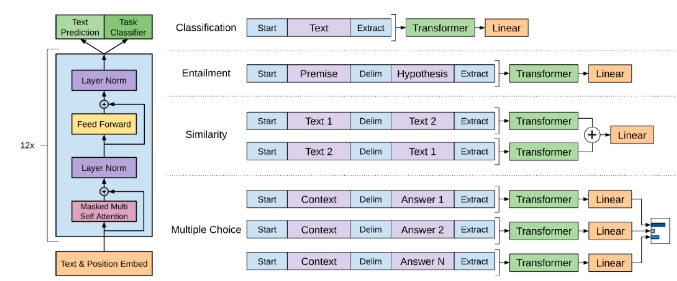

使用可学习的 `positional embedding` 而不是原始工作中提出的正弦版本

### `GPT2`

语言提供了一种灵活的方式来指定 `task, input, output` 都是符号的一个序列`in context learning`。例如，一个翻译任务的训练样本可以写成序列 `(translate to french, english text, french text)`。同样地，一个阅读理解的训练样本可以写成 `(answer the question, document, question, answer)` 。

> 因为将监督学习任务改写成 `(task, input, output)` 格式的符号序列之后，监督目标就变成了无监督目标。但是，在所有的序列中，仅有从监督任务改写而来的序列才可以构成验证集（或测试集）。不需要单独的有监督微调，有监督任务通过转换变成无监督学习。

该模型大体上遵循 `OpenAI GPT` 模型的细节，并作了一些修改：

- `layer normalization` 被移到每个子块的 `input` ，类似于一个 `pre-activation residual network` 。并且在 `final self-attention block` 之后增加了一个额外的 `layer normalization` 。

  > 即：$\vec{\mathbf{x}} + \text{Sublayer}(\text{LN}(\vec{\mathbf{x}}))$，先`layer normalization`再做`multi-head attention`

- 使用了修改过的初始化，它考虑了随着模型深度的增加时残差路径`residual path`上的累积 `accumulation` 。我们在初始化时将残差层的权重按照 1N 的系数进行缩放，其中 N 为残差层的数量。

- `vocabulary` 扩大到 `50257` 个。

- 我们还将上下文窗口大小从 `512` 增加到 `1024` ，并使用更大的 `batch size = 512` 。

### `GPT3`

最近出现的是预训练的 `RNN` 或 `transformer` 语言模型，它们被直接微调从而消除了对特定任务`task-specific` 架构的需求。然而，这种方法的一个主要局限性是，虽然它的架构是任务无关的，但是仍然需要特定任务的微调 `fine-tunning`：要在目标任务上获得强大的性能，通常需要在特定于该任务的、具有数千到数十万个样本的数据集上进行微调。

> 如何构建更加通用的模型，只需要少量样本，甚至不需要样本就可以扩展到新任务中

我们 `basic` 的预训练方法，包括模型、数据、以及训练，与 `GPT-2` 相似，模型大小、数据集大小和多样性、训练 `epoch` 都直接 `scaling up` 。我们对 `in-context learning` 的使用也类似于 `GPT-2` ，但是在这项工作中，我们系统地探索了 `in-context learning` 的不同 `setting` 。

- 微调 `Fine-Tuning: FT`：微调是近年来最常用的方法，它包括通过对所需任务的特定监督数据集进行训练来更新预训练模型的权重。通常情况下，会使用几千到几十万个标记样本。我们没有对 `GPT-3` 进行微调，因为我们的重点是任务无关`task-agnostic`的性能。
- `Few-Shot: FS`：`Few-Shot` 是我们在这项工作中使用的术语，指的是在推断时给模型一些任务的演示 `demonstration` 作为条件，但不允许权重更新。
- `One-Shot: 1S`：`One-Shot` 与 `few-shot` 相同，只是除了任务的自然语言描述之外，只允许一个示范，如下图所示。将 `one-shot` 与 `few-shot` 和 `zero-shot` 区分开的原因是，它与一些人类交流的任务的方式最接近。
- `Zero-Shot: 0S`：`Zero-Shot` 与 `one-shot` 相同，只是没有任何示范，只给模型一个描述任务的自然语言指令。

我们使用与 `GPT-2` 相同的模型和架构，包括其中描述的`modified initialization`、`pre-normalization`、`reversible tokenization` ，不同的是我们在 `transformer` 的层中使用交替的 `dense` 和 `locally banded sparse` 的注意力模式，类似于 `Sparse Transformer` 。

> `locally banded sparse` 注意力：每个位置的注意力仅依赖于附近的 k 个位置。

### `InstructGPT`

我们以一个词表$\mathbb{V}$和一个语言模型$\rho(\cdot)$来开始，其中$\rho(\cdot)$在一个长度为$n$的 `token` 序列$\mathbf{x}=(x_0,\cdots,x_{n−1})$上定义了分布概率
$$
\rho(x_0,\cdots,x_{n-1}) = \prod_{0\le k < n}\rho(x_k|x_0,\cdots, x_{k-1})
$$
我们将$\rho(\cdot)$应用到一个任务，该任务的输入空间$\mathbf{X}$为所有长度小于等于$m$的 `token` 序列、输出空间$\mathbf{Y}$为长度等于$n$的 `token` 序列。定义$\mathcal{D}$为该任务在输入空间$\mathbf{X}$上的数据分布。$\rho(\cdot)$通过$p(\mathbf{y}|\mathbf{x})=\frac{p(\mathbf{y},\mathbf{x})}{p(\mathbf{x})}$为该任务定义了一个概率性的策略 `policy` ：将样本的开头固定为$\mathbf{x}$，然后使用$\rho(\cdot)$生成后续的 `token` 。

> 这是一个强化学习策略，其中每个 `action` 可以视为生成一个 `token`，总的奖励等于 y 的 `human preference` （即，人工标注是好、还是坏）。

我们初始化一个策略$\pi_{\theta}=\rho$，然后使用强化学习微调$\pi_{\theta}$从而顺利执行该任务。如果我们通过一个奖励函数来定义该任务，其中奖励函数为$r:\mathbf{X}\times\mathbf{Y}\to \mathbb{R}$，那么我们可以使用强化学习来直接优化期望的奖励 `expected reward` ：
$$
\mathbb{E}_{\pi_{\theta}}[r] = \mathbb{E}_{\mathbf{x}\sim\mathcal{D}, \mathbf{y}\sim\pi_{\theta}(\cdot|\mathbf{x})}[r(\mathbf{x},\mathbf{y})]
$$
然而，我们希望执行由 `human judgments` 定义的任务，在这种情况下，我们只能通过询问人类来了解奖励的情况。为了做到这一点，我们将首先使用 `human labels` 来训练奖励模型，然后优化该奖励模型。

我们要求 `human labelers` 针对给定的输入$\mathbf{x}$从若干个输出$\{\mathbf{y}_0,\cdots,\}$中挑选出最佳的 `response` 。我们要求人类在四个选项$\{\mathbf{y}_0,\mathbf{y}_1,\mathbf{y}_2,\mathbf{y}_3\}$中做出选择。考虑更多的选项可以使人类摊薄阅读和理解 `prompt`$\mathbf{x}$的成本。令$b\in\{0, 1, 2, 3\}$为 `human labelers` 的选择结果。在收集了一个由$(\mathbf{x},\mathbf{y}_0,\mathbf{y}_1,\mathbf{y}_2,\mathbf{y}_3,b)$的元组成的数据集$\mathbb{S}$后，我们使用如下的损失函数来训练一个奖励模型$r:\mathbf{X}\times\mathbf{Y}\to \mathbb{R}$：
$$
\text{loss}(r) = \mathbb{E}_{(\mathbf{x},\mathbf{y}_0,\mathbf{y}_1,\mathbf{y}_2,\mathbf{y}_3,b)\sim \mathbb{S}}\left[\log \frac{\exp(r(\mathbf{x}, \mathbf{y}_b))}{\sum_{i=0}^3\exp(r(\mathbf{x}, \mathbf{y}_i))}\right]
$$
由于奖励模型需要理解语言，我们遵从 `GPT-1` 的做法，将奖励模型初始化为语言模型策略$\rho$的 `final embedding output` 的随机线性函数（对于为什么从$\rho$而不是$\pi_{\theta}$来初始化，参考后面的内容）。为了使奖励模型的 `scale` 在整个训练中保持一致，我们将其归一化为：针对$\mathbf{x}\sim\mathcal{D}, \mathbf{y}\sim\pi_{\theta}(\cdot|\mathbf{x})$，奖励模型的输出的均值为零、方差为 `1`。

> 为什么从$\rho$而不是$\pi_{\theta}$来初始化？因为训练过程中会周期性重新训练奖励模型，每次重新训练奖励模型都需要对它进行初始化。如果选择$\pi_{\theta}$来初始化奖励模型$r(\mathbf{x}, \mathbf{y})$，那么由于$\pi_{\theta}$在训练过程中不断更新、且$\pi_{\theta}$的更新过程依赖于$r(\mathbf{x}, \mathbf{y})$的结果，因此造成一个 `feedback loop`，这不利于训练。

注：读者猜测模型结构为 `GPT-1` 中的 `Multiple Choice` 。每个输入都添加了 `start token` `<s>` 和 `extract token` `<e>` （也叫做 `end token` ）。

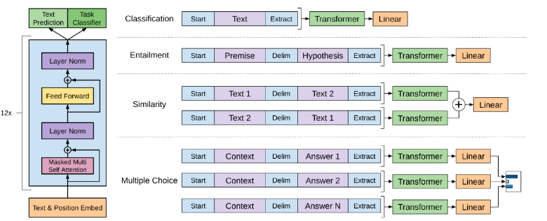

现在我们强化学习微调$\pi_{\theta}$从而优化奖励模型$r$。为了防止$\pi_{\theta}$离$r$太远，我们增加了一个惩罚项$\beta\text{KL}(\pi_{\theta}, \rho)$，其中 `KL` 为 `KL` 散度。我们在修改后的奖励上执行强化学习：
$$
R(\mathbf{x}, \mathbf{y})= r(\mathbf{x}, \mathbf{y}) - \beta\log\frac{\pi_{\theta}(\mathbf{y}|\mathbf{x})}{\rho(\mathbf{y}|\mathbf{x})}
$$
我们要么选择一个常数$\beta$，要么动态地改变$\beta$以达到一个特定的$\text{KL}$值。这个惩罚项有几个目的：

- 它起到了熵的作用。

- 它可以防止策略$\pi_{\theta}$离$\rho$有效的范围太远。

    > 因为奖励模型是通过$\rho(\cdot)$来初始化的，因此如果策略$\pi_{\theta}(\mathbf{y}|\mathbf{x})$距离$\rho(\cdot)$太远，则奖励模型的评估结果可能失效。

整体训练过程是：

- 通过$\mathbf{x}\sim\mathcal{D}, \mathbf{y}\sim \rho(\cdot|\mathbf{x})$来收集样本$(\mathbf{x},\mathbf{y}_0,\mathbf{y}_1, \mathbf{y}_2, \mathbf{y}_3)$，并要求人类从每个样本中挑选出最好的$\mathbf{y}_i$。

    > 注意，前提是必须有一个预训练好的语言模型$\rho(\cdot|\mathbf{x})$。这里的$\mathcal{D}$不是预训练数据集，而是下游的目标任务数据集。
    >
    > 注意，这里应该是$\mathbf{y}\sim\pi_{\theta}(\cdot|\mathbf{x})$，因为奖励模型要对策略进行打分，而不是对预训练模型进行打分。但是，初始的策略$\pi_{\theta}$就是语言模型$\rho(\cdot|\mathbf{x})$。

- 初始化奖励模型$r(\mathbf{x}, \mathbf{y})$为$\rho(\mathbf{y}|\mathbf{x})$，对$r$的 `final linear layer` 使用随机初始化，使用损失$\text{loss}(r)$在 `human samples` 上训练$r(\mathbf{x}, \mathbf{y})$。

    > 注意，这里的 `label` 来自于人工标注，即 `human labelers` 的选择结果$b\in \{0, 1, 2, 3\}$。

- 在$\mathbf{x}\sim\mathcal{D}$上采用奖励$R(\mathbf{x}, \mathbf{y}) = r(\mathbf{x}, \mathbf{y}) - \beta\log\frac{\pi_{\theta}(\mathbf{y}|\mathbf{x})}{\rho(\mathbf{y}|\mathbf{x})}$通过 `Proximal Policy Optimization: PPO` 来训练， $R(\mathbf{x},\mathbf{y})$起到相对优势函数的作用。

    > 根据 `InstructGPT` ，`PPO` 的损失函数为：
    > $$
    > J(\theta) = \mathbb{E}_{(\mathbf{x}, \mathbf{y})\in\mathcal{D}}\left[r(\mathbf{x}, \mathbf{y}) - \beta\log\frac{\pi_{\theta}(\mathbf{y}|\mathbf{x})}{\rho(\mathbf{y}|\mathbf{x})}\right]
    > $$
    > 
    >
    > 其中：$\pi_{\theta}$为学到的 `RL` 策略，$\theta$为策略的参数；$\rho$为预训练好的语言模型。$\mathcal{D}$为强化学习的数据分布，$\beta$为 `KL` 系数。

- 在`online data collection` 的情况下，继续收集更多的样本（样本来自于更新后的策略$\pi_{\theta}$），并周期性重新训练奖励模型$r(\mathbf{x}, \mathbf{y})$。

整体框架如下图所示。注意，根据下图所示，奖励模型的样本由 `policy` 函数 生成，而不是预训练模型 生成。这是讲得通的，因为奖励模型要对策略进行打分，而不是对预训练模型进行打分。

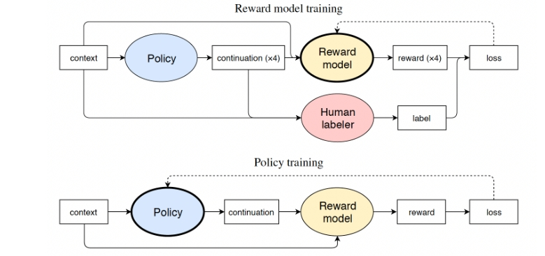

### 其他模型系列

#### `T5`

我们的 `encoder-decoder Transformer` 的实现密切遵循`《Attention is all you need》` 中的原始形式：

- 首先，一个关于 `token` 的输入序列被映射成一个 `embedding sequence` ，然后被馈入到编码器。
- 解码器的结构与编码器相似，只是它在每个 `self-attention layer` 之后包括一个标准的注意力机制，这个注意力机制关注编码器的输出。解码器中的自注意力机制使用一种自回归或因果的 `self-attention`，它只允许模型关注 `past outputs` 。
- `final decoder block` 的输出被馈入一个具有 `softmax output` 的 `dense layer` ，其权重与 `input embedding matrix` 共享。

最初的 `Transformer` 使用正弦的 `position signal` 、或 `learned position embeddings` ，但最近使用 `relative position embeddings` 变得更加普遍。`relative position embeddings` 不是为每个位置使用一个 `fixed embedding` ，而是根据自注意力机制中正在比较的 `"key"` 和 `"query"` 之间的 `offset` 产生不同的 `learned embedding`。

我们使用 `relative position embeddings` 的简化形式，其中每个 `"embedding"` 只是一个标量，被添加到用于计算注意力权重的相应 `logit` 中。为了提高效率，我们还在模型的所有层中共享 `position embedding parameters` ，尽管在同一个给定的层中每个 `attention head` 使用不同的 `learned position embedding` 。

> positional embedding 向量的维度为1维，因此用法是：$\text{softmax}\left(\frac{\mathbf{Q}\mathbf{K}^T + \mathbf{P}}{\sqrt{d}}\right)\mathbf{V}$
>
> 其中：$\mathbf{P}\in\mathbb{P}^{n\times n}$为不同位置之间的 `relative position embedding` 组成的矩阵，$n$为序列长度。

我们的模型与`《Attention is all you need》`提出的原始 `Transformer` 大致相当，只是去掉了 `Layer Norm bias` 、将 `layer normalization` 置于 `residual path` 之前、并使用不同的 `position embedding` 方案。

为了在上述不同的任务上训练一个单一的模型，我们把所有我们考虑的任务都变成了`"text-to-text"` 的形式，即：一些文本馈入模型作为上下文或条件，然后要求模型产生一些输出文本。这个框架同时为预训练和微调提供了一个一致的 `training objective` 。具体而言，不管是什么任务，模型都是用最大似然 `objective` 来训练的。为了为模型指定需要执行的任务，我们在把原始输入序列馈入模型之前，给`input` 添加一个 `task-specific` 的前缀。

例如，如果要求模型将句子 `"That is good."` 从英语翻译成德语，模型将被馈入序列 `"translate English to German: That is good."`，并被训练从而输出 `"Das ist gut."` 。

#### `LlaMa`

`Tokenizer`：我们用 `bytepair encoding: BPE` 算法对数据进行 `tokenize` ，使用 `Sentence-Piece` 的实现。值得注意的是，我们将所有的 `numbers` 拆分为单个`digits` ，并通过退回到字节来分解未知的 `UTF-8` 字符。

架构：遵从最近的大型语言模型的工作，我们的网络是基于 `transformer` 架构的。我们利用了后来提出并使用的各种改进。以下是与原始 `transformer` 架构的主要区别，以及我们发现这种变体的灵感所在：

- `Pre-normalization [GPT3]`：为了提高训练的稳定性，我们对每个 `transformer sub-layer` 的输入进行归一化，而不是对输出进行归一化。我们使用 `RMSNorm` 归一化函数，其中 `RMSNorm` 由引入。

    > $$
    > \text{RMS}(\vec{\mathbf{x}}) = \sqrt{\frac{1}{d}\sum_{i=1}^dx_i^2}\\
    > \hat{x}_i = \frac{x_i}{\text{RMS}(\vec{\mathbf{x}}) + \epsilon}\\
    > y_i = \gamma\hat{x}_i
    > $$
- `SwiGLU activation function [PaLM]`：我们用 `SwiGLU` 激活函数取代 `ReLU` 非线性激活函数以提高性能。

    >$$
    >\text{SwiGLU}(x) = \text{Linear}_{1}(x)\otimes \text{Swish}(\text{Linear}_2(x))\\
    >\text{Swish}(x) = x\cdot\sigma(\beta(x))
    >$$
    >
    >$\otimes$ 表示逐元素乘法
- Rotary Embeddings：我们删除了`absolute positional embedding` ，而是使用 `rotary positional embedding: RoPE`

#### `GLM-130B`

##### 架构

`GLM` 是一个基于 `transformer` 的语言模型，利用 `autoregressive blank infilling` 作为其 `training objective` 。简而言之，对于一个文本序列$\mathbf{x}=[x_1,x_2,\cdots, x_n]$，我们随机采样一些 `text span`$\{\mathbf{s}_1,\cdots,\mathbf{s}_m\}$，其中每个$\mathbf{s}_i$表示一段连续的 `token` ：$\mathbf{s}_i=[sI{i,1},\cdots,s_{i,l_i}]$，$l_i$表示$\mathbf{s}_i$的长度。然后我们将$\mathbf{s}_i$替换为单个 `mask token` ，从而获得被破坏的文本序列$\mathbf{x}_c$。模型被要求以自回归的方式从$\mathbf{x}_c$中恢复原始文本序列。为了允许 `corrupted spans` 之间的交互，它们之间的可见性是由对它们的顺序进行随机抽样的 `permutation` 来决定的。`pre-training objective` 被定义为：
$$
\mathcal{L} = \max_{\theta}\mathbb{E}_{\mathbf{z}\sim \mathcal{Z}_m}\left[\sum_{i=1}^m\log\sum_{j=1}^{l_i}p(s_{i,j}|\mathbf{x}_c, \mathbf{s}_{\mathbf{z}< i}, \mathbf{s}_{i,<j}\right]
$$

-  $\mathcal{Z}_m$表示序列 $\{1,2,⋯,m\}$的所有 `permutation` 的集合，$m$为 `span` 数量。
- $\mathbf{s}_{\mathbf{z}< i}$表示$[\mathbf{s}_{z_1},\cdots,\mathbf{s}_{z_{i-1}}]$，表示在排列$\mathbf{z}$中，所有排在$\mathbf{s}_{i}$之前的 `text span` 。
- $\mathbf{s}_{i,<j}$表示$[s_{i,1},\cdots,s_{i,j-1}$，表示在当前 `text span` 中，所有位于$s_{i,j}$之前的 `token` 。

`GLM` 对 `unmasked contexts` 的双向注意力使 `GLM-130B` 区别于使用单向注意力的 `GPT-style LLMs` 。为了同时支持 `understanding` 和 `generation` ，它混合了两种 `corruption objective` ，每种 `objective` 由一个 `special mask token` 来标识：

- `[MASK]`：句中的 `short blank` ，它们的长度加起来等于输入句子长度的某个比例（这个比例是一个超参数）。
- `[gMASK]`：随机长度的 `long blank`，它们出现在句子末尾并且具有所提供的 `prefix context` 。

我们通过以下技术实现 `autoregressive blank infilling objective` 。输入$\mathbf{x}$被分为两部分： `Part A`是 `corrupted text`$\mathbf{x}_c$，`Part B`由 `masked span` 组成。

- `Part A`的 `token` 可以相互关注，但不能关注 `Part B`的任何 `token`。
- `Part B`的 `token` 可以关注 `Part A`的所有 `token`、以及 `Part B`的前序 `token` ，但不能关注 `Part B`的任何后续 `token` 。

为了开启 `autoregressive generation` ，每个 `span` 都被填充了 `special token`，即 `[START]` （记做 `[S]`）和 `[END]` （记做`[E]`），分别用于输入和输出。通过这种方式，我们的模型在一个统一的模型中自动学习双向编码器（用于 `Part A`）和单向解码器（用于 `Part B`）。

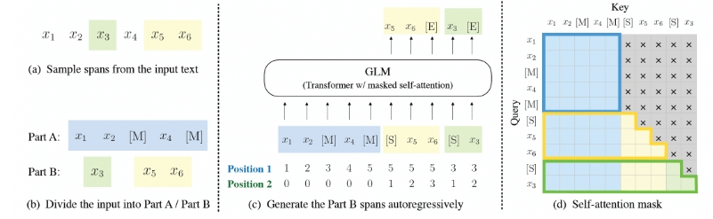

我们考虑以下两个目标：

- `document-level`：我们采样一个 `span` ，其长度从原始输入文本长度的 `50%-100%` 的均匀分布中抽取。该目标旨在生成长文本。
- `sentence-level`：我们限制 `masked span` 必须是完整的句子。我们采样多个 `span`（每个 `span` 也是一个完整的句子）以覆盖`15%` 的原始 `token` 。这个目标是针对 `seq2seq` 任务，其预测往往是完整的句子或段落。

这两个新目标的定义与 `blank infilling objective` 相同，唯一的区别是 `span` 的数量和 `span` 的长度。

> `blank infilling objective` 采样多个 `span`，平均 `span` 长度最短；`document-level` 采样一个 `span`，`span` 长度最长；`sentence-level` 采样多个 `span`，平均 `span` 长度适中。

`Positional Encoding` 和 `FFN`：我们在训练稳定性和下游性能方面对位置编码（`positional encoding: PE` ）和 `FFN improvement` 的不同方案。

- 对于 `GLM-130B` 中的 `PE` ，我们采用旋转位置编码，而不是 `ALiBi`。

- 相对位置编码比绝对位置编码能更好地捕获 `word relevance` 。旋转位置嵌入`RoPE` 是以绝对位置编码的形式实现的相对位置编码，其核心思想表现为以下公式：
    $$
    (\mathbf{R}_m\vec{\mathbf{q}})^T(\mathbf{R}_n\vec{\mathbf{k}}) = \vec{\mathbf{q}}^T\mathbf{R}_m^T\mathbf{R}_n\vec{\mathbf{k}} = \vec{\mathbf{q}}^T\mathbf{R}_{n-m}\vec{\mathbf{k}}
    $$
    其中：$\vec{\mathbf{q}}$在位置$m$、以及$\vec{\mathbf{k}}$在位置$n$之间的内积，与它们之间的距离$n-m$相关，这反映了位置编码的相对性（ `relativity` ）。

#### Embedding

##### Sentence-BERT

`Sentence-BERT: SBERT` ，这是一种使用 `siamese network` 和 `triplet network` 来针对 `BERT` 网络的修改，能够得出有语义的 `sentence embedding` 。这使得 `BERT` 能够用于某些新的任务，而这些任务到现在为止还不适用于 `BERT` 。这些任务包括大规模的语义相似性比较、聚类、以及通过语义搜索 `semantic search` 进行信息检索 `information retrieval`

解决聚类和语义搜索的一个常见方法是，将每个句子映射到一个向量空间，使得在这个向量空间中，语义相似的句子就会很接近。研究人员已经开始将单个句子输入 `BERT` ，并得出固定尺寸的 `sentence embedding` 。最常用的方法是对 `BERT` 输出层（即，`BERT embedding` ）进行均值池化、或者使用第一个 `token`（即，`[CLS] token`）的输出。正如论文将展示的，这种常见的做法产生了相当糟糕的 `sentence embedding` ，往往比 `GloVe embedding` 的均值池化更糟糕。

`SBERT` 在 `BERT/RoBERTa` 的输出上增加了一个池化操作，从而获得一个固定尺寸的 `sentence embedding` 。我们试验了三种池化策略：使用 `CLS-token` 的输出、均值池化策略`MEAN-strategy` （计算所有输出向量的平均值）、最大池化策略`MAX-strategy` （沿着`position` 维度计算输出向量的最大值）。默认配置是均值池化策略。

为了微调 `BERT/RoBERTa` ，我们创建了 `siamese network` 和 `triplet network` 来更新权重，使得产生的 `sentence embedding` 具有语义，并可以用余弦相似度进行比较。网络结构取决于可用的训练数据。我们试验了以下网络结构和目标函数：

- `Classification Objective Function`：我们将 `sentence embedding` $\vec{\mathbf{u}}$、$\vec{\mathbf{v}}$、以及它们之间的逐元素差进行拼接，然后乘以权重矩阵$\mathbf{W}_t\in\mathbb{R}^{K\times 3d}$：
    $$
    \vec{\mathbf{o}} = \text{softmax}\left(\mathbf{W}_t[\vec{\mathbf{u}}, \vec{\mathbf{v}},|\vec{\mathbf{u}}-\vec{\mathbf{v}}|]\right)
    $$
    其中：$d$为 `sentence embedding` 维度，$K$为 `label` 的数量，$[\cdot]$为向量拼接。我们优化交叉熵损失。整体结构如下图所示。

    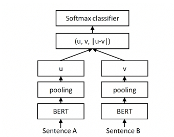

`Regression Objective Function`：我们计算 `sentence embedding`$\vec{\mathbf{u}}$、$\vec{\mathbf{v}}$之间的余弦相似度，如下图所示。我们使用`mean-squared-error:MSE loss` 作为目标函数。

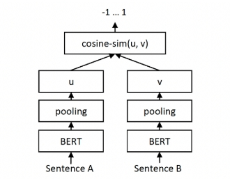

`Triplet Objective Function`：给定一个锚点句子`anchor sentence`$a$，一个 `positive sentence`$p$和一个 `negative sentence`$n$， `triplet loss` 使得$a$和$p$之间的距离小于$a$和$n$之间的距离。在数学上讲，我们最小化以下损失函数：
$$
\max(||\vec{\mathbf{s}}_a-\vec{\mathbf{s}}_p||-||\vec{\mathbf{s}}_a-\vec{\mathbf{s}}_n|| + \epsilon, 0)
$$


## 模型幻觉

在传统任务里，幻觉大都是指的是FaithfuIness:

- Intrinsic Hallucination(信息冲突):LMs在生成回复时，与输入信息产生了冲突，例如摘要问题里，abstract和document的信息不一致;
- Extrinsic Hallucination无中生有):LMs在生成回复时，输出一些并没有体现在输入中的额外信息，比如邮箱地址、电话号码、住址，并且难以验证其真假

而面向LLMs，我们通常考虑的幻觉则是Factualness:

- 因为我们应用LLM的形式是open-domain Chat，而不是局限于特定任务，所以数据源可以看做任意的世界知识。LLMs如果生成了不在input source里的额外信息，但是符合事实的，这种情况也可能是对我们有帮助的

在数据构建过程中，由于以下问题，导致模型幻觉的发生:

- 训练数据可信度问题。
  由于大模型的训练数据都是通过众包/爬虫检索方式收集得到的，这种数据构建方式的优点是量比较大，但是缺点是包含大量虚假信息。这种虚假信息直接导致的问题就是使模型出现错误认知;
- 重复数据问题。过多的重复信息也可能导致模型的知识记忆出现bias，从而导致幻觉;

不止是数据角度问题，大模型幻觉问题出现的原因还表现在模型角度。

- 解码算法:研究表明，如果使用不确定性较高的采样算法(top-p)会诱导LMs出现更严重的幻觉问题。甚至可以故意在解码算法中加入一些随机性，进一步让LMs胡编乱造(可以用该方法生成一些 negative samples)

  > top-p采样的原理是:模型从预测概率最高的词语开始累加，当这些词的概率总和达到一个设定的阈值(p值)后停止，从而在这些候选词中随机选取一个词生成。这种算法能够避免仅生成概率最高的词，进而提升文本的流畅性和丰富度。

- 暴露偏差:训练和测试阶段不匹配的 exposure bias问题可能导致LLMs出现幻觉，特别是生成 long-form response 的时候。

  > 在训练阶段，模型是根据真实的、人工标注的文本片段生成内容。每一步生成时，模型会接收到真实的前文内容作为输入。然而，在实际生成(测试阶段)，模型只能依赖自己之前生成的文本，而不再是完全可靠的真实数据。

- 参数知识:LMS在预训练阶段记忆的错误的知识，将会严重导致幻觉问题

## RAG

RAG可分为5个基本流程:知识文档的准备；嵌入模型(embedding model)；向量数据库；查询检索和生产回答

鉴于文档可能存在过长的问题，我们还需执行一项关键步骤:文档切片。我们需要将长篇文档分割成多个文本块，以便更高效
地处理和检索信息。这不仅有助于减轻模型的负担，还能提高信息检索的准确性。

嵌入模型的核心任务是将文本转换为向量形式，我们使用的日常语言中充满歧义和对表达词意无用的助词，而向量表示则更加密集。
精确，能够捕捉到句子的上下文关系和核心含义。这种转换使得我们能够通过简单计算向量之间的差异来识别语义上相似的句子。嵌入模型是连接用户查询和知识库的桥梁，确保了系统回答的准确性和相关性。

向量数据库是专门设计用于存储和检索向量数据的数据库系统在RAG系统中，通过嵌入模型生成的所有向量都会被存储在这样的数据库中。

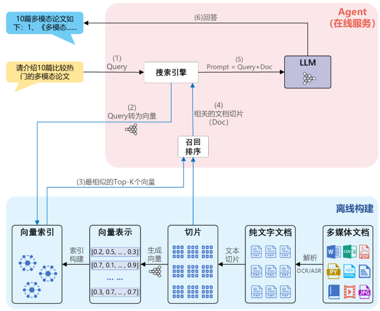

前k项中，包含正确信息的项的数目占比。RAG评估：检索环节评估（MRR平均倒数排名、hits Rate 命中率：前k项中，包含正确信息的项的数目占比、NDCG）；生成环节的评估：非量化（完整性、准确性、相关性）；量化（Rouge-L)

基本思想为由多个专家分别生成人工摘要，构成标准摘要集，将系统生成的自动摘要与人工生成的标准摘要相对比，通过统计二者之间重叠的基本单元(n元语法、词序列和词对)的数目，来评价摘要的质量。Rouge-L的计算主要包括两个方面:

- 召回率 (Recall):参考文本中与生成文本匹配的最长公共子序列的长度，与参考文本的总长度之比。
- 精确率(Precision):生成文本中与参考文本匹配的最长公共子序列的长度，与生成文本的总长度之比。

然后计算 F1 分数，即在召回率和精确率之间的调和平均，来作为 Rouge-L的最终分数

### RAG 优化

#### 知识文档准备阶段

高性能RAG系统依赖于准确且清洁的原始知识数据。一方面为了保证数据的准确性，我们需要优化文档读取器和多模态模型。特别是处理如CSV表格等文件时，单纯的文本转换可能会丢失表格原有的结构。因此，我们需引入额外的机制以在文本中恢复表格结构，比如使用分号或其他符号来区分数据。另一方面我们也需要对知识文档做一些基本数据清洗其中可以包括:

- 基本文本清理:规范文本格式，去除特殊字符和不相关信息。去除重复文档或冗余信息。
- 实体解析:消除实体和术语的歧义以实现一致的引用。例如，将“LLM"、“大语言模型"和“大模型”标准化为通用术语。
- 文档划分:合理地划分不同主题的文档，不同主题是集中在一处还是分散在多处?如果作为人类都不能轻松地判断出需要查阅哪个文档才能来回答常见的提问，那么检索系统也无法做到。
- 数据增强:使用同义词、释义甚至其他语言的翻译来增加语料库的多样性，
- 用户反馈循环:基于现实世界用户的反馈不断更新数据库，标记它们的真实性。
- 时间敏感数据:对于经常更新的主题，删除过期的文档、或者对过期的文档更新

在RAG系统中，文档需要分割成多个文本块再进行向量嵌入。在不考虑大模型输入长度限制和成本问题情况下，其目的是在保持语义上的连贯性的同时，尽可能减少嵌入内容中的噪声，从而更有效地找到与用户查询最相关的文档部分。

- 如果分块太大，可能包含太多不相关的信息，从而降低了检索的准确性。相反，
- 分块太小可能会丢失必要的上下文信息，导致生成的回应缺乏连贯性或深度。

在RAG系统中实施合适的文档分块策略，旨在找到这种平衡，确保信息的完整性和相关性，分块方法的选择

- 固定大小的分块：这是最简单和直接的方法，我们直接设定块中的字数，并选择块之间是否重复内容。通常，我们会保持块之间的一些重叠，以确保语义上下文不会在块之间丢失。与其他形式的分块相比，固定大小分块简单易用且不需要很多计算资源。

- 内容分块，根据文档的具体内容进行分块，例如根据标点符号(如句号)分割。或者直接使用更高级的NLTK或者spaCy库提供的句子分割功能。

- 递归分块：在大多数情况下推荐的方法，其通过重复地应用分块规则来递归地分解文本。

    > 例如，在langchain中会先通过段落换行符(\n\n)进行分割。然后，检查这些块的大小。如果大小不超过一定阈值，则该块被保留。对于大小超过标准的块，使用单换行符(\n)再次分割。以此类推，不断根据块大小更新更小的分块规则(如空格，句号)。这种方法可以灵活地调整块的大小。例如，对于文本中的密集信息部分，可能需要更细的分割来捕捉细节;而对于信息较少的部分，则可以使用更大的块。而它的挑战在于，需要制定精细的规则来决定何时和如何分割文本。

- 从小到大分块，既然小的分块和大的分块各有各的优势，一种更为直接的解决方案是把同一文档进行从大到小所有尺寸的分割，然后把不同大小的分块全部存进向量数据库，并保存每个分块的上下级关系，进行递归搜索。这种方案的缺点就是需要更大的储存空间。
- 特殊结构分块，针对特定结构化内容的专门分割器。这些分割器特别设计来处理这些类型的文档，以确保正确地保留和理解其结构。

分块大小的选择，实际场景中，我们可能还是需要不断实验调整，在一些测试中，128大小的分块往往是最佳选择，在无从下手时，可以从这个大小作为起点进行测试。

- 首先不同的嵌入模型有其最佳输入大小。比如Openai的text-embedding-ada-002的模型在256或 512大小的块上效果更好。
- 其次，文档的类型和用户查询的长度及复杂性也是决定分块大小的重要因素。处理长篇文章或书籍时，较大的分块有助于保留更多的上下文和主题连贯性;而对于社交媒体帖子，较小的分块可能更适合捕捉每个帖子的精确语义。如果用户的查询通常是简短和具体的，较小的分块可能更为合适;相反，如果查询较为复杂，可能需要更大的分块。

https://huggingface.co/spaces/mteb/leaderboard 嵌入模型排行榜，嵌入模型如何选择？

#### 查询索引阶段

多级索引，元数据无法充分区分不同上下文类型的情况下，我们可以考虑进一步尝试多重索引技术。多重索引技术的核心思想是将庞大的数据和信息需求按类别划分，并在不同层级中组织，以实现更有效的管理和检索。这意味着系统不仅依赖于单一索引，而是建立了多个针对不同数据类型和查询需求的索引。

> 如，可能有一个索引专门处理摘要类问题，另一个专门应对直接寻求具体答案的问题，还有一个专门针对需要考虑时间因素的问题。这种多重索引策略使RAG系统能够根据查询的性质和上下文，选择最合适的索引进行数据检索，从而提升检索质量和响应速度。

不过为了引入多重索引技术，我们还需配套加入多级路由机制。多级路由机制确保每个查询被高效引导至最合适的索引。查询根据其特点(如复杂性、所需信息类型等)被路由至一个或多个特定索引。这不仅提升了是理效率，还优化了资源分配和使用，确保了对各类查询的精确匹配。

> 例如，对于查询“最新上映的科幻电影推荐"，RAG系统可能首先将其路由至专门处理当前热点话题的索引，然后利用专注于娱乐和影视内容的索引来生成相关推荐。

总的来说，多级索引和路由技术可以进一步帮助我们对大规模数据进行高效处理和精准信息提取，从而提升用户体验和系统的整体性能。


查询转换，在RAG系统中，用户的查询问题被转化为向量，然后在向量数据库中进行匹配。不难想象，查询的措辞会直接影响搜索结果。如果搜索结果不理想，可以尝试以下几种方法对问题进行重写，以提升召回效果:

- 结合历史对话的重新表述，在向量空间中，对人类来说看似相同的两个问题其向量大小并不一定很相似。我们可以直接利用LLM 重新表述问题来进行尝试。此外，在进行多轮对话时，用户的提问中的某个词可能会指代上文中的部分信息，因此可以将历史信息和用户提问一并交给LLM重新表述。

- 假设文档嵌入，的核心思想是:。接收用户提问后，先让LLM在没有外部知识的情况下生成一个假设性的回复。然后，将这个假设性回复和原始查询一起用于向量检索。设回复可能包含虚假信息，但蕴含着LLM认为相关的信息和文档模式，有助于在知识库中寻找类似的文档。主要关注点:通过为传入查询生成一个假想文档，从而增强和改善相似性搜索。

- 退后提示，如果原始查询太复杂或返回的信息太广泛，可以选择生成一个抽象层次更高的“退后”问题，与原始问题一起用于检索，以增加返回结果的数量。这就是退后提示(Step BackPrompting)的思想。

    > 例如，原问题是“张三 在 1954年8月至 1954年 11月期间去了哪所学校?"，这类问题对于 LLM 来说很容易答错,。但是如果后退一步，站在更高层次对问题进行抽象，提出一个新的问题:“张三的教育历史是怎样的?"

- 多查询检索/多路召回，多查询检索/多路召回(Multi Query Retrieval)也是一种不错的方法。使用LLM生成多个搜索查询，特别适用于一个问题可能需要依赖多个子问题的情况。

在具体的检索过程中，我们可以根据向量数据库的特定设置来优化些检索参数，以下是一些常见的可设定参数:

- 稀疏和稠密搜索权重，稠密搜索即通过向量进行搜索。然而，在某些场景下可能存在限制，此时可以尝试使用原始字符串进行关键字匹配的稀疏搜索。一种有效的稀疏搜索算法是最佳匹配25(BM25)，它基于统计输入短语中的单词频率，频繁出现的单词得分较低，而稀有的词被视为关键词，得分会较高。我们可以结合稀疏和稠密搜索得出最终结果。向量数据库通常允许设定两者对最终结果评分的权重比例，如0.6表示40%的得分来自稀疏搜索，60%来自稠密搜索。
- 结果数量(topK)，检索结果的数量是另一个关键因素。足够的检索结果可以确保系统覆盖到用户查询的各个方面。在回答多方面或复杂问题时，更多的结果提供了丰富的语境，有助于RAG系统更好地理解问题的上下文和隐含细节。但需注意，结果数量过多可能导致信息过载，降低回答准确性并增加系统的时间和资源成本
- 相似度度量方法，计算两个向量相似度的方法也是一个可选参数。这包括使用欧式距离和jaccard距离计算两个向量的差异，以及利用余弦相似度衡量夹角的相似性。通常，余弦相似度更受青睐。

高级检索策略

- 上下文压缩，我们提到过当文档文块过大时，可能包含太多不相关的信息，传递这样的整个文档可能导致更昂贵的LLM调用和更差的响应。上下文压缩的思想就是通过LLM的帮助根据上下文对单个文档内容进行压缩，或者对返回结果进行一定程度的过滤仅返回相关信息。
- 句子窗口搜索，相反，文档文块太小会导致上下文的缺失。其中一种解决方案就是窗口搜索，该方法的核心思想是当提问匹配好分块后，将该分块周围的块作为上下文一并交给LLM进行输出,来增加LLM对文档上下文的理解。
- 父文档搜索，无独有偶，父文档搜索也是一种很相似的解决方案，父文档搜索先将文档分为尺寸更大的主文档，再把主文档分割为更短的子文档两个层级，用户问题会与子文档匹配，然后将该子文档所属的主文档和用户提问发送给LLM。
- 自动合并，自动合并是在父文档搜索上更进一步的复杂解决方案。同样地，我们先对文档进行结构切割，比如将文档按三层树状结构进行切割，顶层节点的块大小为1024，中间层的块大小为512，底层的叶子节点的块大小为128。而在检索时只拿叶子节点和问题进行匹配，当某个父节点下的多数叶子节点都与问题匹配上则将该父节点作为结果返回
- 多向量检索，多向量检索同样会给一个知识文档转化成多个向量存入数据库，不同的是，这些向量不仅包括文档在不同大小下的分块，还可以包括该文档的摘要，用户可能提出的问题等，有助于检索的信息。
- 多代理检索，简而言之就是选取我们提及的12大优化策略中的部分交给一个智能代理合并使用。就比如使用子问题查.，多级索引和多向量查询结合，先让子问题查询代理把用户提问拆解为多个小问题，再让文档代理对每个字问题进行多向量或多索引检索，最后排名代理将所有检索的文档总结再交给LLM。

## `DeepSeek`

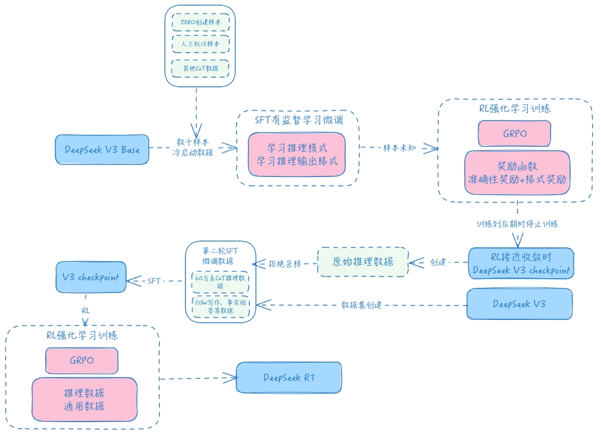
`DeepSeek-R1`训练方式

- 冷启动数据引入：通过引小数千条高质量的冷启动数据进行初始微调，解决了DeepSeek-R1-Zero的可读性和语言混杂问题，显著提升了模型的可读性和多语言处理能力。

    > 冷启动数据用于解决`DeepSeek-R1-Zero`的可读性和语言混合问题。具体来说，冷启动数据包含数千条高质量的长思维链(CoT)示例，通过人工标注和格式过滤(如使用<reasoning>和<summary>标签)，强制模型生成结构清晰、语言一致的内容。

- 推理导向的强化学习：在冷启动数据上微调`DeepSeek-V3-Base`后，应用与 DeepSeek-R1-Zero 中相同的 RL 方法训练。

    > 本阶段侧重于增强模型的推理能力，尤其是在编码、数学、科学和逻辑推理等推理密集型任务中，这些任务涉及具有明确解决方案的明确定义的问题。
    > 当 RL 提示涉及多种语言时，`CoT`经常表现出语言混合现象。为了减轻语言混合问题，在RL 训练过程中引入了一种语言一致性奖励。

- 拒绝采样与监督微调：当RL过程趋于收敛时，利用训练出的临时模型生产用于下一轮训练的SFT数据(60W 推理数据)与冷启动数据区别在于，此阶段既包含用于推理能力提升的 60W 数据，也包含 20W 推理无关的数据。使用这 80W 样本的精选数据集对 DeepSeek-V3-Base 进行了两个epoch的微调,

- 全场景强化学习：在微调模型的基础上，使用全场景的强化学习数据提升模型回复的有用性和无害性。

    > 对于推理数据，遵循 DeepSeek-R1-Zero 的方法，利用基于规则的奖励来指导数学、代码和逻辑推理领域的学习过程。
    > 对于通用数据，采用基于模型的奖励来捕捉复杂和细微场景中的人类偏好。

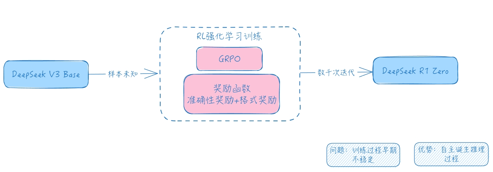
`DeepSeek-R1 Zero`训练方式是首个完全基于强化学习的推理模型，直接在基础模型上应用强化学习，跳过了监督微调阶段。训练中主要有两种奖励:

- 准确性奖励：一种是只看最终答案是否正确，如数学题看最终结果，编程题看测试用例结果;
- 格式奖励：另一种是格式奖励，要求模型将思考内容写在“草稿纸”上，即`CoT`标签内，不要混杂思考内容和给用户呈现的内容。

DeepSeek-R1-Zero摒弃了传统大语言模型(LLM)训练中依赖监督微调(SFT)的步骤，完全通过强化学习进行训练。传统方法认为:

- 大模型需先通过SFT获得基础能力，再通过RL优化性能。
- 而DeepSeek-R1-Zero的实验证明，仅通过RL即可直接激励模型发展出强大的推理能力，例如在数学、编程等任务中生成长思维链并自我验证。

具体而言，在推理任务中强调“规则化奖励”而非神经奖励模型的原因如下:

- 避免奖励黑客(Reward Hacking)，神经奖励模型可能被模型通过非预期方式(如利用模型漏洞)获得高奖励，而实际推理能力未真正提升。
- 降低训练复杂性和资源消耗，使用神经奖励模型需要额外训练和维护，而规则化奖励(如准确性验证、格式检查)可直接通过预设规则计算奖励，无需额外模型支持。
- 奖励信号更清晰可靠，规则化奖励基于确定性逻辑，这种奖励机制直接关联任务目标，避免了神经奖励模型可能引入的评估偏差。

根据文档内容，避免模型在RL训练中过度拟合评测任务的方法如下:

- 采用多样化的训练数据分布，混合推理与非推理数据：在监督微调(SFT)阶段，通过收集涵盖推理任务(如数学、编码)和通用任务(写作、事实问答等)的多样化数据。这种数据多样性迫使模型适应不同场景，降低对单一评测任务的依赖。
- 多阶段训练流程，冷启动与多阶段RL训练使用 (SFT)冷启动 -->(RL)推理导向的强化学习-->(SFT)拒绝采样与监督微调 -->(RL)全场景强化学习四阶段训练。分阶段训练逐步扩展模型能力，避免过早过拟合。
- 组合多类型奖励信号，规则化奖励与人类偏好奖励结合，在最终RL阶段，对推理任务使用规则化奖励(如答案准确性、格式要求)对通用任务引入人类偏好奖励模型
-  拒绝采样筛选高质量响应，过滤低质量与重复内容，在生成SFT数据时，通过拒绝采样排除语言混杂、冗长或重复的推理过程。确保训练数据的多样性和可读性，减少模型对噪声或特定模式的依赖。
- 全场景提示分布训练，覆盖广泛用户需求场景，在最终RL阶段，使用涵盖数学、编码、写作、问答等多场景的提示分布，

### `DeepSeek`创新点

#### `MoE`架构

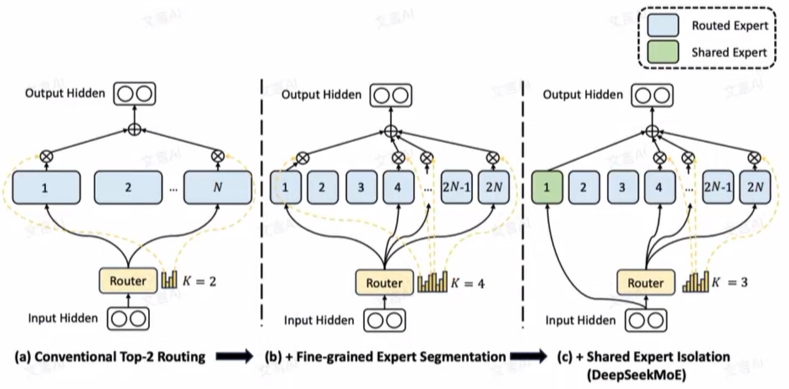

- 传统的MoE 模块包含 N 个前馈神经网络(Feed-Forward Network)专家，每个专家在处理特定类型的数据上具有独特的优势。

    > MoE 模块通过路由机制，根据输入数据的特征动态选择最合适的 区个专家进行处理，而不是激活所有专家。所有专家的参数总和构成了整个 MoE 模块的参数量，在前向计算过程中，由于只激活了部分专家，实际参与计算的参数量被称为激活参数量，例如，Mixtral8*7B 模型包含8个专家，每次选择其中的2个专家进行计算，模型的总参数量为46.7B，而激活参数量为12B左右。

- Deepseek把 N个专家做更细粒度的划分降低每一个专家的参数量，增大专家数量。

    > 将$N$个专家拆分为$m \times N$个，每一个专家的隐层维度变为原来的$frac{1}{m}$，相应地激活$m\times K$个专家。如此`MoE`模块的参数量以及激活参数量均保持不变，同时还可以更加灵活地组合多个专家。

- 把激活专家区分为共享专家(Shared Experts)和路由专家(Routed Experts)。对于共享专家，输入数据无需经过路由模块的计算，所有数据都会直接通过共享专家进行处理。对于路由专家，输入数据会先经过路由模块，该模块根据输入数据的特征选择最合适的专家进行计算。在这种架构中，路由模块通过计算输入数据与各个专家的匹配概率，选择概率最高的专家进行处理，最终，将路由专家和共享专家的计算结果相加，形成 MoE 模块的最终输出。

    > 通过这种方式，模型能够在处理不同输入数据时，既能捕捉到输入数据的共性，也能关注到输入数据的差异性。这种设计能够提高模型的泛化能力和适应性。

DeepSeek-V3 针对MoE 中常见的**负载不均衡**问题，提出了一种新的负载均衡策略。在用于选择专家的 Gate 模块中引入了一个可学习的偏置项,在计算路由得分时，这个**偏置项会被动态地加到每个路由专家的得分上**。
$$
\text{score}_i^{\prime}(x) = \text{score}_i(x) + b_i
$$
该方式的主要特点在于:

- 动态调整路由倾向：通过学习偏置项，模型可以动态地调整对不同路由专家的偏好。如果某个专家的负载过重，其对应的偏置项可0能会被学习为负值，从而降低其被选择的概率。反之，对于负载较轻的专家，其偏置项可能会被学习为正值，提高其被选择的概率。
- 无额外损耗：该偏置项是直接通过模型的训练目标进行优化的，而不是通过一个独立的负载均衡损失函数。这意味着，模型在努力提高主要任务性能的同时，也会自然而然地学习到一种更均衡的路由策略，而不会因为额外的负载均衡损失而影响性能。

`deepseek`负载均衡计算公式：
$$
g^{\prime}_{i,t}=\left\{ \begin{array}{ll}s_{i,t} &s_{i,t} + b_i \in \text{Top}_k(\cdot, K_r)\\
0\end{array}\right.
$$
下面解释该公式中各部分的含义：$s_{i,t}$表示第$i$个专家的得分，$b_i$一个动态调整的偏置项，用于帮助平衡专家负载。$\text{Top}_k(\cdot, Kr)$表示包含针对第$t$个 token 和所有路由专家计算出的分数中K个最高分数的集合。$g^{\prime}_{i,t}$是调整后的第$i$个专家的得分，用于决定该专家是否被激活。


大语言模型在中文评测：https://github.com/jeinlee1991/chinese-llm-benchmark

Scaling Law 定义:用计算量、数据集规模和模型规模，来预测模型最终能力。

该团队的研究结论总结如下:
1.影响模型性能的三个要素之间，每个参数会受到另外两个参数的影响。当没有其他两个瓶颈时，性能会急剧上升，影响程度为计算量>参数 >>数据集大小。
2.在固定计算预算下进行训练时，最佳性能可以通过训练参数量非常大的族型并在远离收敛前停止(Early Stopping)来实现
3.更大的模型在样本效率方面表现更好，能以更少的优化步骤和使用更少的数据量达到相同的性能水平。在实际应用中，应该优先考虑
训练较大的模型。

该团队的研究结论总结如下:
1.对于给定的FLOP预算，损失函数有明显的谷底值:
a.模型太小时，在较少数据上训练较大模型将是一种改进;
b.模型太大时，在更多数据上训练的较小模型将是一种改进。
也就是说，在给定的计算量下，数据量和模型参数量之间的选择平衡存在一个最优解。
在计算成本达到最优情况下，模型大小和训练数据(token)的数量应该等比例进行缩放，即:如果模型的大小加倍，那么训练数据的。数量也应该加倍。对于给定参数量的模型，最佳的训练数据集大小约为模型中参数量的20倍。比如，对于一个7B的模型，理想的训练数据集大小应该约为140B tokens。
3、大模型训练需要更加关注数据集的扩展，但是只有数据是高质量的时候，更大数据集的益处才能体现出来,


### 模型评估

对于给定的语言模型和一个测试数据集，困惑度被定义为：
$$
P(\mathbf{X}) = P(x_1, \cdots,x_N)^{-1/N}
$$
其中，$\mathbf{X}=x_1,\cdots,x_N$是测试集中的词序列，$N$是测试集中的总词数。困惑度与语言模型的质量紧密相关。一个优秀的语言模型应能准确预测测试数据中的词序列，因此它的困惑度应较低。相反，如果语言模型经常做出错误的预测，那么它的困惑度将较高。

在几何平均中，每个词标记的概率都被同等看待，并且一个极低的概率（如0）将会导致整个几何平均大幅度下降。因此，通过计算几何平均，我们可以更好地衡量模型在处理所有可能的词标记时的性能，特别是在处理那些模型可能会出错的情况。

$$P(x_{1:L})=\exp \left(\frac{1}{L} \sum_{i=1}^L \log \frac{1}{p\left(x_i \mid x_{1: i-1}\right)}\right) $$


`BPE`整个过程可以表示为：

- Input(输入)：训练语料库（字符序列）`I = [['the car','the cat','the rat']]`。 算法步骤

- Step1. 初始化词汇表 V 为字符的集合。

    > ```
    > [['t', 'h', 'e', '$\space$', 'c', 'a', 'r'],
    > ['t', 'h', 'e', '$\space$', 'c', 'a', 't'],
    > ['t', 'h', 'e', '$\space$', 'r', 'a', 't']]
    > 
    > V = ['t','h','e',' ','c','a','r','t']
    > ```

- while(当我们仍然希望V继续增长时)： Step2. 找到$V$中共同出现次数最多的元素对$x,x'$。

    > 我们发现't'和'h'按照'th'形式一起出现了三次，'h'和'e'按照'he'形式一起出现了三次，我们可以随机选择其中一组，假设我们选择了'th'。

- Step3. 用一个新的符号$xx'$ 替换所有$x,x'$ 的出现。

    > ```text
    > [[th, e, $\sqcup$, c, a, r], 
    > [th, e, $\sqcup$, c, a, t],
    > [th, e, $\sqcup$, r, a, t]] 
    > ```

- Step4. 将$xx'$ 添加到V中。

    > `V=['t','h','e',' ','c','a','r','t','th']`

Unicode（统一码）是当前主流的一种编码方式。其中这种编码方式对BPE分词产生了一个问题（尤其是在多语言环境中），Unicode字符非常多（共144,697个字符）。在训练数据中我们不可能见到所有的字符。 为了进一步减少数据的稀疏性，我们可以对字节而不是Unicode字符运行BPE算法。 以中文为例：`今天⇒[x62, x11, 4e, ca]`

BPE算法在这里的作用是为了进一步减少数据的稀疏性。通过对字节级别进行分词，可以在多语言环境中更好地处理Unicode字符的多样性，并减少数据中出现的低频词汇，提高模型的泛化能力。通过使用字节编码，可以将不同语言中的词汇统一表示为字节序列，从而更好地处理多语言数据。

`SentencePiece`给定一个序列$x_{1:L}$，一个分词器$T$是$p(x_{1:L}) = \prod_{(i,j)\in T}p(x_{i:j})$的一个集合。这边给出一个实例：

- 训练数据（字符串）： 𝖺𝖻𝖺𝖻𝖼
- 分词结果`T=(1,2),(3,4),(5,5)` （其中`V=𝖺𝖻,𝖼`）
- 似然值： $p(x_{1:L})=2/3⋅2/3⋅1/3=4/27$

似然值$p(x_{1:L})$是根据 unigram 模型计算得出的概率，表示训练数据的似然度。这个值代表了根据 unigram 模型，将训练数据分词为所给的分词结果$T$的概率。似然值的计算是 unigram 模型中重要的一部分，它用于评估分词结果的质量。较高的似然值表示训练数据与分词结果之间的匹配程度较高，这意味着该分词结果较为准确或合理。


下面提供使用预训练语言模型（LM）的参数来适配（adapt）下游任务的一般设置。下面我将这个过程分为相关且逐渐递进的各个部分：

1. **预训练语言模型（Pre-trained LM）**: 在适配阶段的开始，我们已经有了一个预训练的语言模型，用参数$θ_{LM}$表示。这个模型被训练来理解和生成语言，但不是特别针对任何特定任务。
2. **下游任务数据集（Downstream Task Dataset）**: 我们获得了一组来自下游任务分布$P_{task}$的样本数据。这些数据可以是文本分类、情感分析等任务的特定实例，每个样本由输入x和目标输出y组成，如：$\left(x^{(1)}, y^{(1)}\right), \ldots,\left(x^{(n)}, y^{(n)}\right)$。
3. **适配参数（Adaptation Parameters）**: 为了使预训练的LM适合特定的下游任务，我们需要找到一组参数$\gamma$，这组参数可以来自现有参数的子集或引入的新的参数$\Gamma$。这些参数将用于调整模型，以便它在特定任务上的表现更好。
4. **任务损失函数（Task Loss Function）**: 我们需要定义一个损失函数$\ell_{\text {task }}$来衡量模型在下游任务上的表现。例如，交叉熵损失是一种常见的选择，用于衡量模型预测的概率分布与真实分布之间的差异。
5. **优化问题（Optimization Problem）**: 我们的目标是找到一组适配参数$\gamma_{\text {adapt }}$，使得任务损失在整个下游数据集上最小化。数学上，这可以通过以下优化问题表示： $$ \gamma_{\text {adapt }}=\operatorname{argmin}_{\gamma \in \Gamma} \frac{1}{n} \sum_{i=1}^n \ell_{\text {task }}\left(\gamma, \theta_{\mathrm{LM}}, x_i, y_i\right) . $$

通过这个过程，我们可以取得一组适配参数$\gamma_{\text {adapt }}$，用于参数化适配后的模型$p_{adapt}$。这样，我们就可以将通用的、任务无关的预训练语言模型适配到特定的下游任务上，以实现更好的性能。


我们想要理解大型语言模型在有毒性方面可能带来的伤害。有两类可能的受害者：基于语言模型系统的用户，以及用户生成内容的接收者。对于前者，聊天机器人可能会回复有毒的响应，或者自动完成系统可能会提出有毒的建议。对于后者，用户可能会在社交媒体上发布有毒内容，无论他们是否有恶意。


### DPO

不同于RLHF，DPO以监督学习的训练方式，大幅简化了对齐训练：

- **流程简洁**：DPO直接对策略模型进行优化，不需要预先训练Reward模型（奖励函数）。DPO只需要基于预先给定的偏好数据进行训练，**无需**中途采样。
- **稳定性**：DPO是一种监督学习方法，摆脱了强化学习训练的不稳定性。
- 
- **低开销**：DPO在训练过程中只需要加载**一个模型**（只需加载策略模型，而对于参考模型，可以将参考模型的输出结果预先录制好，然后在训练时就不需要加载），算力开销更低，更易于落地实践。

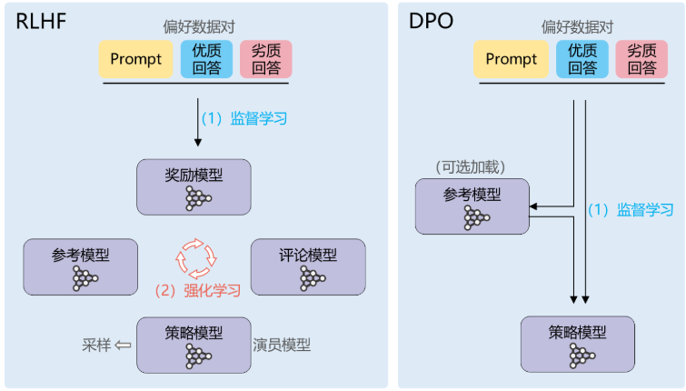

DPO算法跳过了训练奖励模型这一中间过程，直接优化策略模型。 DPO的训练涉及2个模型：策略模型和参考模型。它们的**初始化**方法如下：

- **策略模型**：直接复制SFT模型作为初始化。
- **参考模型**：通常也从SFT模型复制。但在某些情况下，可能会选择从一个比SFT模型更强的模型进行复制。此时，需特别关注参考模型与策略模型的匹配性，主要涉及两者的KL距离及训练数据分布等方面。

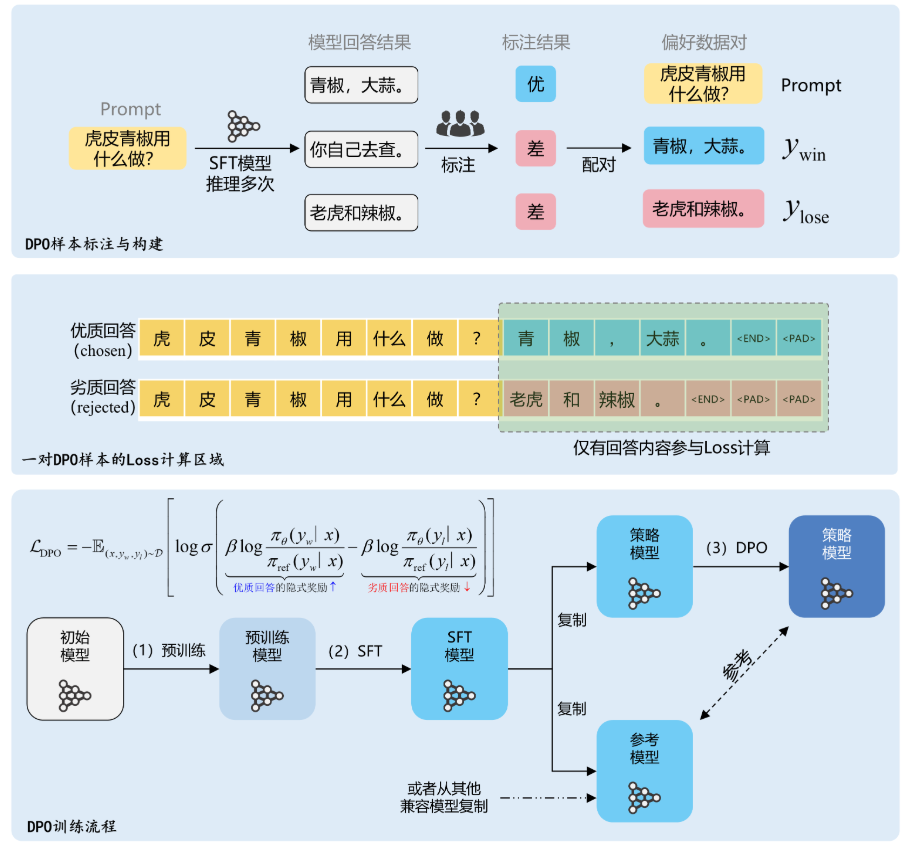

DPO训练时，可以选择**加载**2个模型（策略模型 和参考模型 ），也可以只加载1个模型（策略模型 ）。DPO的整体训练流程如图所示（**蓝色**色块代表偏好数据对中的“优质回答” 及其对应的中间计算结果；**粉色**色块代表偏好数据对中的“劣质回答” 及其对应的中间计算结果）。

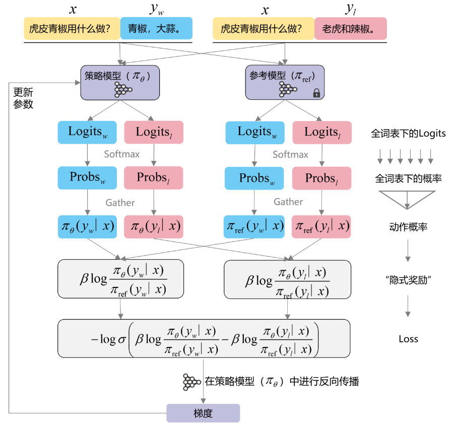

在DPO中， 参数的作用类似于其在RLHF中的作用。$\beta$很小，策略模型和偏好数据分布更接近，$\beta$​很大，策略模型和参考模型更接近。DPO的梯度更新旨在**增加**优质回答的概率，同时**减少**劣质回答的概率。更重要的是，梯度中包含一个**动态系数**——优质和劣质回答的隐式奖励差异。换言之，这个动态系数反映了隐式“奖励模型”在对偏好顺序的判断上有多大误差。

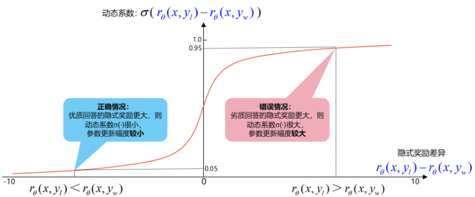
