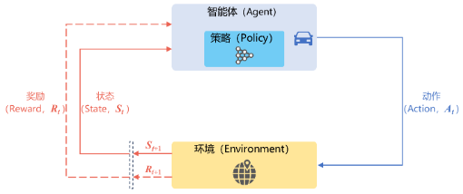
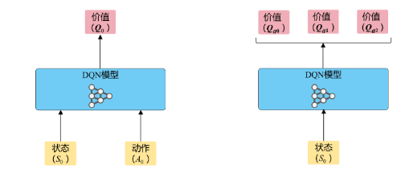
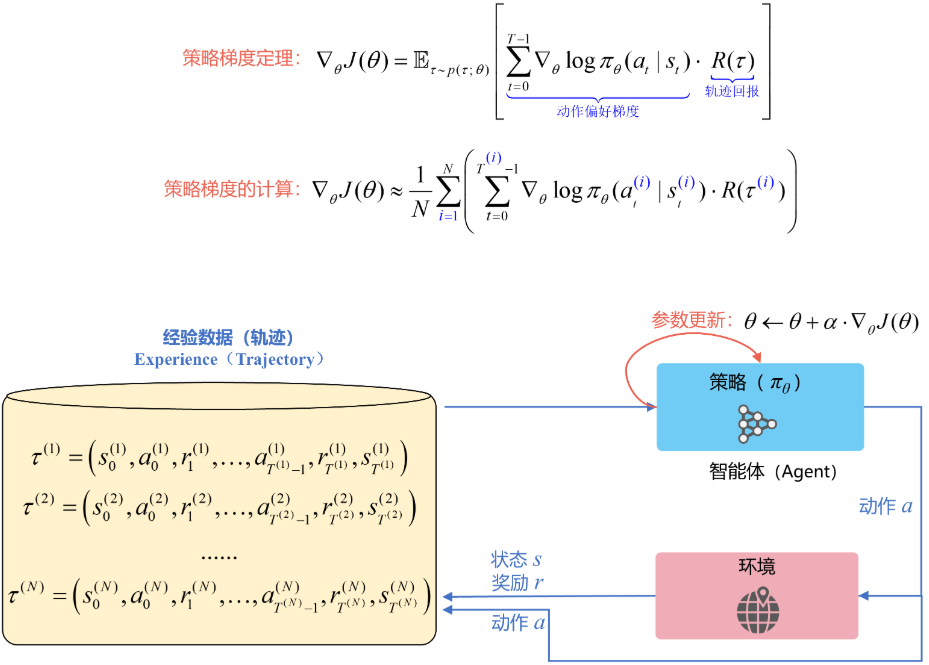
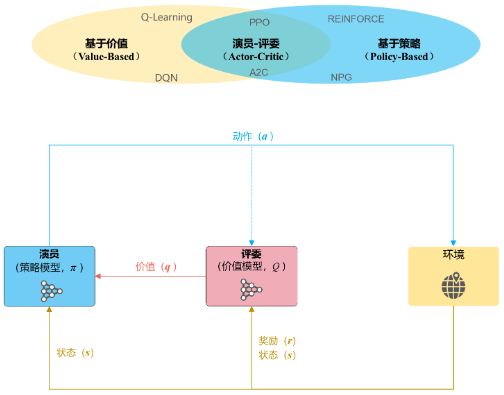
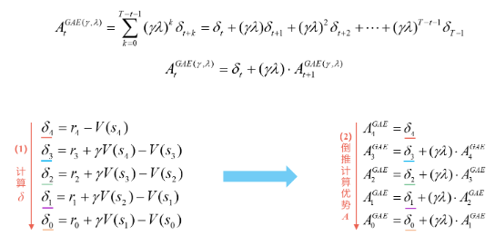
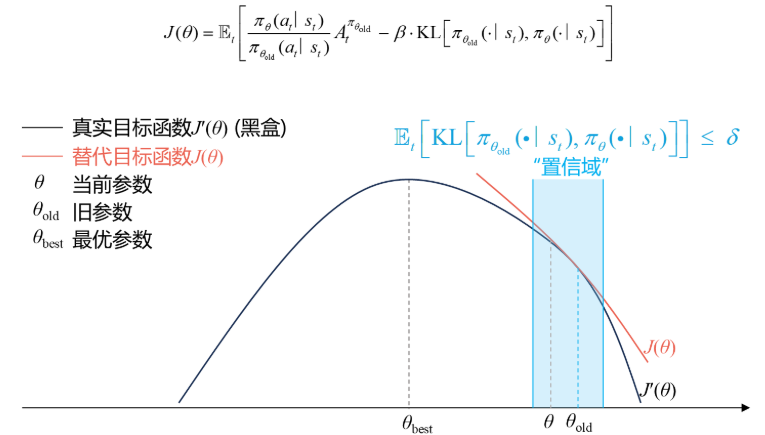
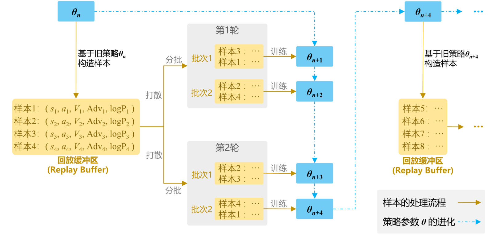
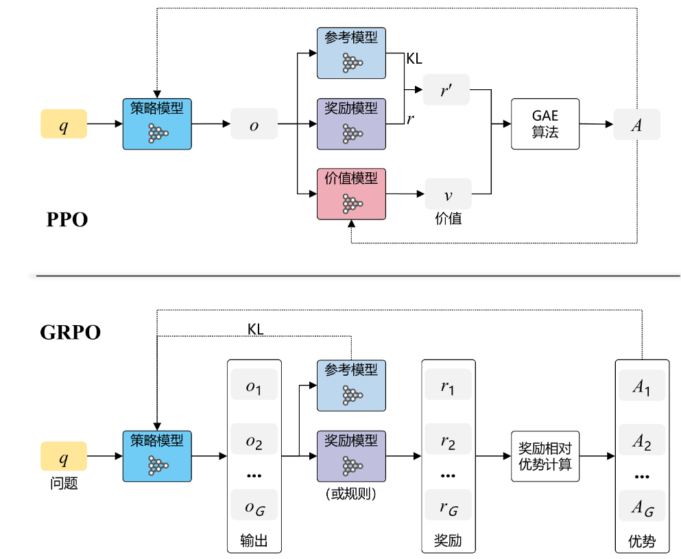
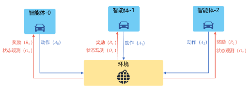

## 深度强化学习

在强化学习中，有两个可以进行交互的对象：智能体和环境。



- 智能体$\text{agent}$可以感知外界环境的状态$\text{state}$和反馈的奖励$\text{reward}$，并进行学习和决策。智能体的决策功能是指根据外界环境的状态来做出不同的动作$\text{action}$，而学习功能是指根据外界环境的奖励来调整策略。

    > - 感知。智能体在某种程度上感知环境的状态，从而知道自己所处的现状。例如，下围棋的智能体感知当前的棋盘情况；无人车感知周围道路的车辆、行人和红绿灯等情况
    > - 智能体根据当前的状态计算出达到目标需要采取的动作的过程叫作决策。例如，针对当前的棋盘决定下一颗落子的位置；针对当前的路况，无人车计算出方向盘的角度和刹车、油门的力度。

- 环境$\text{environment}$是智能体外部的所有事物，并受智能体动作的影响而改变其状态，并反馈给智能体相应的奖励。

    > 奖励。环境根据状态和智能体采取的动作，产生一个标量信号作为奖励反馈。这个标量信号衡量智能体这一轮动作的好坏。例如，围棋博弈是否胜利；无人车是否安全、平稳且快速地行驶。最大化累积奖励期望是智能体提升策略的目标，也是衡量智能体策略好坏的关键指标。

在强化学习中的基本要素包括：

- 状态$s$是对环境的描述，可以是离散的或连续的，其状态空间为$\mathcal{S}$；
- 动作$a$是对智能体行为的描述，可以是离散的或连续的，其动作空间为$\mathcal{A}$；
- 策略$π(a|s)$是智能体根据环境状态$s$来决定下一步的动作$a$的函数；
- 状态转移概率 $p(s^{\prime}|s, a)$是在智能体根据当前状态$s$做出一个动作$a$之后，环境在下一个时刻转变为状态$s′ $的概率；
- 即时奖励$r(s, a, s^{\prime})$是一个标量函数，即智能体根据当前状态$s$做出动作$a$之后，环境会反馈给智能体一个奖励，这个奖励也经常和下一个时刻的状态$s^{\prime}$有关。

### 马尔可夫过程

马尔可夫过程$\text{Markov Process}$是具有马尔可夫性的随机变量序列$s_0, s_1, · · · ，s_t ∈\mathcal{S}$，其下一个时刻的状态$s_{t+1} $只取决于当前状态$s_t$，
$$
p\left(s_{t+1} | s_{t}, \cdots, s_{0}\right)=p\left(s_{t+1} | s_{t}\right)
$$
其中$p(s_{t+1}|s_t)$称为状态转移概率，$\sum_{s_{t+1} \in \mathcal{S}} p\left(s_{t+1} | s_{t}\right)=1$

#### 马尔可夫奖励过程

在马尔可夫过程的基础上加入奖励函数$r$和折扣因子$\gamma$，就可以得到马尔可夫奖励过程`Markov reward process`。一个马尔可夫奖励过程由构成$<\mathcal{S},\mathcal{P}, r, \gamma>$

- $\mathcal{S}$是有限状态的集合。
- $\mathcal{P}$是状态转移矩阵。
- $r$是奖励函数，某个状态$s$的奖励$r(s)$指转移到该状态时可以获得奖励的期望。
- $\gamma$是折扣因子。引入折扣因子的理由为远期利益具有一定不确定性，有时我们更希望能够尽快获得一些奖励，所以我们需要对远期利益打一些折扣。

在一个马尔可夫奖励过程中，从第$t$时刻状态$S_t$开始，直到终止状态时，所有奖励的衰减之和称为回报$G_t$`Return`，公式如下：
$$
G_t = R_t + \gamma R_{t+1} + \cdots = \sum_{k=0}^{\infin}\gamma^kR_{t + k}
$$
其中，$R_t$表示在时刻$t$获得的奖励。

```python
def compute_return(start_index, chain, gamma, rewards):
    """给定一个行为序列计算回报。"""
    G = 0
    for i in reversed(range(start_index, len(chain))):
        G = gamma * G + rewards[chain[i] - 1]
    return G

# s1->s2->s3->s6
rewards = [-1, -2, -2, 10, 1, 0]  # 定义奖励函数
gamma = 0.5  # 定义折扣因子
start_index = 0
# G = -1 + 0.5 *(-2) + 0.5^2 * (-2) + 0.5^3 * 0
```

在马尔可夫奖励过程中，一个状态的期望回报**即从这个状态出发的未来累积奖励的期望**被称为这个状态的价值`value`。所有状态的价值就组成了价值函数`value function`，价值函数的输入为某个状态，输出为这个状态的价值。我们将价值函数写成
$$
V(s) = \mathbb{E}[G_t|S_t = s] = \mathbb{E}[R_t + \gamma G_{t+1}|S_t = s] = \mathbb{E}[R_t + \gamma V(S_{t+1})|S_t = s]
$$
一方面，即时奖励的期望正是奖励函数的输出，即$\mathbb{E}[R_t|S_t = s]=r(s)$；另一方面，等式中剩余部分$\mathbb{E}[\gamma V(S_{t+1})|S_t = s]$可以根据从状态出发的转移概率得到，即可以
$$
V(s) = r(s) + \gamma\sum_{s^{\prime} \in S}p(s^{\prime}|s)V(s^{\prime})
$$
上式就是马尔可夫奖励过程中非常有名的贝尔曼方程，对每一个状态都成立。若一个马尔可夫奖励过程一共有$n$个状态，即$\mathcal{S} = \{s_1, \cdots, s_n\}$，我们将所有状态的价值表示成一个列向量$\mathcal{V} = [V(s_1),\cdots, V(s_n)]^T$，同理，将奖励函数写成一个列向量$\mathcal{R} = [r(s_1),\cdots, r(s_n)]^T$。于是我们可以将贝尔曼方程写成矩阵的形式：
$$
\mathcal{V} = \mathcal{R} + \gamma\mathcal{P}\mathcal{V}
$$

#### 马尔可夫决策过程

在马尔可夫奖励过程`MRP`的基础上加入动作，就得到了马尔可夫决策过程`MDP`。马尔可夫决策过程由元组构成$<\mathcal{S},\mathcal{A},\mathcal{P}, r, \gamma>$，$\mathcal{S}$是有限状态的集合。

- $\mathcal{A}$是动作的集合。
- $\gamma$是折扣因子。
- $r(s, a)$是奖励函数，此时奖励可以同时取决于状态和动作，在奖励函数只取决于状态$s$时，则退化为$r(s)$。
- $P(s^{\prime}|s, a)$是状态转移函数，表示在状态$s$执行动作$a$之后到达状态$s^{\prime}$的概率。


不同于马尔可夫奖励过程，在马尔可夫决策过程中，通常存在一个智能体来执行动作。智能体根据当前状态$S_t$选择动作$A_t$；对于状态$S_t$和动作$A_t$，`MDP`根据奖励函数和状态转移函数得到$S_{t+1}$和$R_t$并反馈给智能体。智能体的目标是最大化得到的累计奖励。智能体根据当前状态从动作的集合中选择一个动作的函数，被称为策略。


智能体的策略`Policy`通常用字母$\pi$表示。策略$\pi(a|s) = P(A_t = a|S_t = s)$是一个函数，表示在输入状态$s$情况下采取动作$a$的概率。当

- 一个策略是确定性策略时，它在每个状态时只输出一个确定性的动作，即只有该动作的概率为 1，其他动作的概率为 0；
- 当一个策略是随机性策略时，它在每个状态时输出的是关于动作的概率分布，然后根据该分布进行采样就可以得到一个动作。

马尔可夫决策过程$\text{Markov Decision Process}$在马尔可夫过程中加入一个额外的变量：动作$\mathbf{a}$，即下一个时刻的状态$ s_{t+1} $和当前时刻的状态$ s_t$以及动作$a_t $相关，
$$
p\left(s_{t+1} | s_{t}, a_{t}, \cdots, s_{0}, a_{0}\right)=p\left(s_{t+1} | s_{t}, a_{t}\right)
$$
其中$p(s_{t+1}|s_t, a_t)$为状态转移概率。
给定策略$π(a|s)$，马尔可夫决策过程的一个轨迹$\tau=s_{0}, a_{0}, s_{1}, r_{1}, a_{1}, \cdots, s_{T-1}, a_{T-1}, s_{T}, r_{T}$的概率为
$$
\begin{aligned} p(\tau) &=p\left(s_{0}, a_{0}, s_{1}, a_{1}, \cdots\right) \\ &=p\left(s_{0}\right) \prod_{t=0}^{T-1} \pi\left(a_{t} | s_{t}\right) p\left(s_{t+1} | s_{t}, a_{t}\right) \end{aligned}
$$
我们用$V^{\pi}(s)$表示在 MDP 中基于策略的状态价值函数`state-value function`，定义为从状态$s$出发遵循策略$\pi$能获得的期望回报，数学表达为
$$
V^{\pi}(s) = \mathbb{E}_{\pi}[G_t|S_t = s]
$$
在 MDP 中，由于动作的存在，我们额外定义一个动作价值函数`action-value function`。我们用$Q^{\pi}(s, a)$表示在 MDP 遵循策略$\pi$时，对当前状态$s$执行动作$a$得到的期望回报
$$
Q^{\pi}(s, a) = \mathbb{E}_{\pi}[G_t|S_t = s, A_t = a]
$$
状态价值函数和动作价值函数之间的关系：在使用策略$\pi$中，状态$s$的价值等于在该状态下基于策略$\pi$采取所有动作的概率与相应的价值相乘再求和的结果：
$$
V^{\pi}(s) = \sum_{a\in A}\pi(a|s)Q^{\pi}(s, a)
$$
使用策略时，状态下采取动作的价值等于即时奖励加上经过衰减后的所有可能的下一个状态的状态转移概率与相应的价值的乘积：
$$
Q^{\pi}(s, a) = r(s, a) + \gamma\sum_{s^{\prime}\in S}P(s^{\prime}|s, a)V^{\pi}(s^{\prime})
$$
通过简单推导就可以分别得到两个价值函数的贝尔曼期望方程
$$
V^{\pi}(s) = \sum_{a\in A}\pi(a|s)\left(r(s, a) + \gamma \sum_{s^{\prime} \in S}p(s^{\prime}|s, a)V^{\pi}(s^{\prime}) \right)\\
Q^{\pi}(s, a) = r(s, a) + \gamma\sum_{s^{\prime} \in S}p(s^{\prime}|s, a)\sum_{a^{\prime}\in A}\pi(a^{\prime}|s^{\prime})Q^{\pi}(s^{\prime}, a^{\prime})
$$

用蒙特卡洛方法来估计一个策略在一个马尔可夫决策过程中的状态价值函数。回忆一下，一个状态的价值是它的期望回报，那么一个很直观的想法就是用策略在 MDP 上采样很多条序列，计算从这个状态出发的回报再求其期望就可以了，公式如下：
$$
V^{\pi}(s)  = \mathbb{E}[G_t|S_t=s] \approx \frac{1}{N}\sum_{i=1}^N G_t^i
$$
在一条序列中，可能没有出现过这个状态，可能只出现过一次这个状态，也可能出现过很多次这个状态。我们介绍的蒙特卡洛价值估计方法会在该状态每一次出现时计算它的回报。还有一种选择是一条序列只计算一次回报，也就是这条序列第一次出现该状态时计算后面的累积奖励，而后面再次出现该状态时，该状态就被忽略了。假设我们现在用策略$\pi$从状态$s$开始采样序列，据此来计算状态价值。我们为每一个状态维护一个计数器和总回报，计算状态价值的具体过程如下所示。

- 使用策略$\pi$采样若干条序列。
- 对每一条序列中的每一时间步$t$的状态$s$进行以下操作：
    - 更新状态$s$的计数器$N(s) \leftarrow N(s) + 1$；
    - 更新状态$s$的总回报$M(s)\leftarrow M(s) + G_t$；
- 每一个状态的价值被估计为回报的平均值$V(s) = \frac{M(s)}{N(s)}$。

计算回报的期望时，除了可以把所有的回报加起来除以次数，还有一种增量更新的方法。对于每个状态$s$和对应回报$G$，进行如下计算：
$$
N(s) \leftarrow N(s) + 1 \\
V(s) \leftarrow V(s) + \frac{1}{N(s)}\left(G - V(s)\right)
$$

``` python
# 对所有采样序列计算所有状态的价值
def MC(episodes, V, N, gamma):
    for episode in episodes:
        # episodes 给定策略下，采样得到的行为轨迹序列
        G = 0
        for i in range(len(episode) - 1, -1, -1):  #一个序列从后往前计算
            (s, a, r, s_next) = episode[i]  # 当前状态，行动，奖励，下一刻状态
            G = r + gamma * G  # 基于贝尔曼期望方程。
            N[s] = N[s] + 1
            V[s] = V[s] + (G - V[s]) / N[s]
```

不同策略的价值函数是不一样的。这是因为对于同一个 MDP，不同策略会访问到的状态的概率分布是不同的。首先我们定义 MDP 的初始状态分布为$\nu_0(s)$，在有些资料中，初始状态分布会被定义进`MDP`的组成元素中。我们用$P^{\pi}_t(s)$表示采取策略$\pi$使得智能体在时刻$t$状态$s$为的概率，所以我们有$P^{\pi}_0(s) = \nu_0(s)$，然后就可以定义一个策略的状态访问分布
$$
\nu^{\pi}(s) = (1-\gamma) \sum_{t=0}^\infin \gamma^tP^{\pi}_t(s)
$$
其中，$1-\gamma$是用来使得概率加和为1的归一化因子。状态访问概率表示一个策略和 MDP 交互会访问到的状态的分布。还可以定义策略的占用度量
$$
\rho^{\pi}(s, a) = (1 - \gamma)\sum_{t=0}^{\infin}\gamma^tP_t^{\pi}(s)\pi(a|s)
$$
它表示动作状态对$(s, a)$被访问到的概率。二者之间存在如下关系：
$$
\rho^{\pi}(s, a) = \nu^{\pi}(s)\pi(a|s)
$$

#### 最优策略

强化学习的目标通常是找到一个策略，使得智能体从初始状态出发能获得最多的期望回报。首先定义**策略**之间的偏序关系：当且仅当对于任意的状态$s$都有$V^{\pi}(s)\ge V^{\pi^{\prime}}(s)$，记$\pi \ge \pi^{\prime}$。于是在有限状态和动作集合的 MDP 中，至少存在一个策略比其他所有策略都好或者至少存在一个策略不差于其他所有策略，这个策略就是最优策略`optimal policy`。最优策略可能有很多个，我们都将其表示为$\pi^{*}(s)$。最优策略都有相同的状态价值函数，我们称之为最优状态价值函数，表示为：
$$
V^*(s) =\max_{\pi}V^{\pi}(s), \forall s\in\mathcal{S}
$$
同理，我们定义最优动作价值函数:
$$
Q^*(s, a) = \max_{\pi}Q^{\pi}(s, a), \forall s\in\mathcal{S}, a\in\mathcal{A}
$$
为了使最大$Q^{\pi}(s, a)$，我们需要在当前的状态动作对$(s, a)$之后都执行最优策略。于是我们得到了最优状态价值函数和最优动作价值函数之间的关系：
$$
Q^{*}(s, a) = r(s, a) + \gamma\sum_{s^{\prime}\in S}P(s^{\prime}|s, a)V^{*}(s^{\prime})
$$
这与在普通策略下的状态价值函数和动作价值函数之间的关系是一样的。另一方面，最优状态价值是选择此时使最优动作价值最大的那一个动作时的状态价值：
$$
V^*(s) = \max_{a\in\mathcal{A}}Q^{*}(s, a)
$$
根据$V^*(s)$和$Q^{*}(s, a)$的关系，我们可以得到贝尔曼最优方程`Bellman optimality equation`：
$$
V^*(s)= \max_{a\in \mathcal{A}}\{r(s, a) + \gamma\sum_{s^{\prime}\in\mathcal{S}}p(s^{\prime}|s, a)V^*(s^{\prime})\}\\
Q^*(s, a) = r(s, a) + \gamma\sum_{s^{\prime}\in\mathcal{S}}p(s^{\prime}|s, a)\max_{a^{\prime}\in\mathcal{A}}Q^*(s^{\prime}, a^{\prime})
$$

### 动态规划算法

基于动态规划的强化学习算法主要有两种：一是策略迭代`policy iteration`，二是价值迭代`value iteration`。其中，策略迭代由两部分组成：策略评估`policy evaluation`和策略提升`policy improvement`。具体来说，策略迭代中的策略评估使用贝尔曼期望方程来得到一个策略的状态价值函数，这是一个动态规划的过程；而价值迭代直接使用贝尔曼最优方程来进行动态规划，得到最终的最优状态价值。

#### 策略迭代算法

##### 策略评估

策略迭代是策略评估和策略提升不断循环交替，直至最后得到最优策略的过程。策略评估这一过程用来计算一个策略的状态价值函数。回顾一下之前学习的贝尔曼期望方程：
$$
V_{\pi}(s) = \sum_{a\in A}\pi(a|s)\left(R(s, a) + \gamma \sum_{s^{\prime} \in S}p(s^{\prime}|s, a)V_{\pi}(s^{\prime}) \right)
$$
当知道奖励函数和状态转移函数时，我们可以根据下一个状态的价值来计算当前状态的价值。因此，根据动态规划的思想，可以把计算下一个可能状态的价值当成一个子问题，把计算当前状态的价值看作当前问题。在得知子问题的解后，就可以求解当前问题。更一般的，考虑所有的状态，就变成了用上一轮的状态价值函数来计算当前这一轮的状态价值函数，即
$$
V^{k+1}(s) = \sum_{a\in A}\pi(a|s)\left(R(s, a) + \gamma \sum_{s^{\prime} \in S}p(s^{\prime}|s, a)V^{k}(s^{\prime}) \right)
$$
我们可以选定任意初始值$V^0$。根据贝尔曼期望方程，可以得知$V^k = V^{\pi}$是以上更新公式的一个不动点。事实上，可以证明当时$k\to \infin$，序列$\{V^k\}$会收敛到$V^{\pi}$，所以可以据此来计算得到一个策略的状态价值函数。可以看到，由于需要不断做贝尔曼期望方程迭代，策略评估其实会耗费很大的计算代价。在实际的实现过程中，如果某一轮$\max_{s\in\mathcal{S}}|V^{k+1}(s)-V^k(s)|$的值非常小，可以提前结束策略评估。

##### 策略提升

假设智能体在状态$s$下采取动作$a$，之后的动作依旧遵循策略$\pi$，此时得到的期望回报其实就是动作价值$Q^{\pi}(s, a)$。如果我们有$Q^{\pi}(s, a) > V^{\pi}(s)$，则说明在状态$s$下采取动作$a$会比原来的策略$\pi(a|s)$得到更高的期望回报。以上假设只是针对一个状态，现在假设存在一个确定性策略$\pi^{\prime}$，在任意一个状态$s$下，都满足
$$
Q^{\pi}(s, \pi^{\prime}(s))\ge V^{\pi}(s)
$$
于是在任意状态$s$下，我们有
$$
V^{\pi^{\prime}}(s)\ge V^{\pi}(s)
$$
这便是策略提升定理。于是我们可以直接贪心地在每一个状态选择动作价值最大的动作，也就是
$$
\pi^{\prime}(s) = \arg\max_{a}Q^{\pi}(s, a) = \arg\max_a\{r(s, a) +  \gamma \sum_{s^{\prime} \in S}P(s^{\prime}|s, a)V_{\pi}(s^{\prime})\}
$$
我们发现构造的贪心策略$\pi^{\prime}$满足策略提升定理的条件，所以策略$\pi^{\prime}$能够比策略$\pi$更好或者至少与其一样好。这个根据贪心法选取动作从而得到新的策略的过程称为策略提升。当策略提升之后得到的策略$\pi^{\prime}$和之前的策略$\pi$一样时，说明策略迭代达到了收敛，此时$\pi$和$\pi^{\prime}$就是最优策略。

总体来说，策略迭代算法的过程如下：当我们得到上一时刻的$V^t$的时候，就可以通过递推的关系推出下一时刻的值。 反复迭代，最后$V$的值就是从$V_1$、$V_2$到最后收敛之后的值 $V_{\pi}$。$V_{\pi}$就是当前给定的策略$\pi$对应的价值函数。

$$
V^{t+1}(s) = \sum_{a\in A}\pi(a|s)\left(R(s, a) + \gamma \sum_{s^{\prime} \in S}p(s^{\prime}|s, a)V^{t}(s^{\prime}) \right)
$$


#### 价值迭代算法

策略迭代中的策略评估需要进行很多轮才能收敛得到某一策略的状态函数，这需要很大的计算量，尤其是在状态和动作空间比较大的情况下。确切来说，价值迭代可以看成一种动态规划过程，它利用的是贝尔曼最优方程：
$$
V^*(s)= \max_{a\in \mathcal{A}}\{r(s, a) + \gamma\sum_{s^{\prime}\in\mathcal{S}}p(s^{\prime}|s, a)V^*(s^{\prime})\}
$$
将其写成迭代更新的方式为
$$
V^{k+1}(s)= \max_{a\in \mathcal{A}}\{r(s, a) + \gamma\sum_{s^{\prime}\in\mathcal{S}}p(s^{\prime}|s, a)V^k(s^{\prime})\}
$$
价值迭代便是按照以上更新方式进行的。等到$V^{k+1}$和$V^k$相同时，它就是贝尔曼最优方程的不动点，此时对应着最优状态价值函数$V^*$。然后我们利用$\pi(s)= \arg\max_a\{r(s, a) +  \gamma \sum_{s^{\prime} \in S}P(s^{\prime}|s, a)V^{k+1}(s^{\prime})\}$，从中恢复出最优策略即可。


### 时序差分算法

对于大部分强化学习现实场景，其马尔可夫决策过程的状态转移概率是无法写出来的，也就无法直接进行动态规划。在这种情况下，智能体只能和环境进行交互，通过采样到的数据来学习，这类学习方法统称为无模型的强化学习。不同于动态规划算法，无模型的强化学习算法不需要事先知道环境的奖励函数和状态转移函数，而是直接使用和环境交互的过程中采样到的数据来学习，这使得它可以被应用到一些简单的实际场景中

####  时序差分方法

回顾一下蒙特卡洛方法对价值函数的增量更新方式：
$$
V(s_t) \leftarrow V(s_t) + \alpha(G_t - V(s_t))
$$
蒙特卡洛方法必须要等整个序列结束之后才能计算得到这一次的回报$G_t$，而时序差分方法只需要当前步结束即可进行计算。具体来说，时序差分算法用当前获得的奖励加上下一个状态的价值估计来作为在当前状态会获得的回报，即：
$$
V(s_t)\leftarrow V(s_t) + \alpha[r_{t} + \gamma V(s_{t + 1}) - V(s_t)]
$$
估计回报$r_{t}+\gamma V(s_{t+1})$被称为时序差分目标， 时序差分目标是带衰减的未来奖励的总和。时序差分目标由两部分组成：

- 我们走了某一步后得到的实际奖励$r_{t}$；
- 我们利用了自举的方法，通过之前的估计来估计$V(s_{t+1})$，并且加了折扣因子，即$\gamma V(s_{t+1})$。

时序差分误差`TD-error`$\delta = r_{t} + \gamma V(s_{t + 1}) - V(s_t)$。

#### `Sarsa`算法

可以直接用时序差分算法来估计动作价值函数$Q$：
$$
Q(s_t, a_t)\leftarrow Q(s_t,a_t) +\alpha [r_t + \gamma Q(s_{t+1}, a_{t+1}) - Q(s_t, a_t)]
$$
然后我们用贪婪算法来选取在某个状态下动作价值最大的那个动作，即$\arg\max_{a}Q(s, a)$。这样似乎已经形成了一个完整的强化学习算法：用贪婪算法根据动作价值选取动作来和环境交互，再根据得到的数据用时序差分算法更新动作价值估计。然而这个简单的算法存在两个需要进一步考虑的问题。

- 第一，如果要用时序差分算法来准确地估计策略的状态价值函数，我们需要用极大量的样本来进行更新。但实际上我们可以忽略这一点，直接用一些样本来评估策略，然后就可以更新策略了。

- 第二，如果在策略提升中一直根据贪婪算法得到一个确定性策略，可能会导致某些状态动作对$(s, a)$永远没有在序列中出现，以至于无法对其动作价值进行估计，进而无法保证策略提升后的策略比之前的好。

    > 简单常用的解决方案是不再一味使用贪婪算法，而是采用一个$\epsilon$-贪婪策略：有$1-\epsilon$的概率采用动作价值最大的那个动作，另外有$\epsilon$的概率从动作空间中随机采取一个动作

这个算法被称为`Sarsa`，因为它的动作价值更新用到了当前状态$s$、当前动作$a$、获得的奖励$r$、下一个状态$s^{\prime}$和下一个动作$a^{\prime}$，将这些符号拼接后就得到了算法名称。`Sarsa`的具体算法如下：


蒙特卡洛方法是无偏的，但是具有比较大的方差，因为每一步的状态转移都有不确定性，而每一步状态采取的动作所得到的不一样的奖励最终都会加起来，这会极大影响最终的价值估计；时序差分算法具有非常小的方差，因为只关注了一步状态转移，用到了一步的奖励，但是它是有偏的，因为用到了下一个状态的价值估计而不是其真实的价值。

#### `Q-learning`算法

`Q-learning`和`Sarsa`的最大区别在于`Q-learning`的时序差分更新方式为
$$
Q(s_t, a_t) \leftarrow Q(s_t, a_t) + \alpha[r_t + \gamma\max_a Q(s_{t+1}, a) - Q(s_t, a_t)]
$$


我们称采样数据的策略为行为策略`behavior policy`，称用这些数据来更新的策略为目标策略`target policy`。在线策略`on-policy`算法表示行为策略和目标策略是同一个策略；而离线策略`off-policy`算法表示行为策略和目标策略不是同一个策略。`Sarsa`是典型的在线策略算法，而`Q-learning`是典型的离线策略算法。

- 对于`Sarsa`，它的更新公式必须使用来自当前策略采样得到的五元组$(s, a, r, s^{\prime}, a^{\prime})$，因此它是在线策略学习方法；
- 对于`Q-learning`，它的更新公式使用的是四元组$(s, a, r, s^{\prime})$来更新当前状态动作对的价值$Q(s, a)$，数据中的$s$和$a$是给定的条件，$r$和$s^{\prime}$皆由环境采样得到，该四元组并不需要一定是当前策略采样得到的数据，也可以来自行为策略，因此它是离线策略算法。

### `DQN`算法

用一个神经网络来表示函数$Q$。

- 若动作是连续（无限）的，神经网络的输入是状态$s$和动作$a$，然后输出一个标量，表示在状态$s$下采取动作$a$能获得的价值。
- 若动作是离散（有限）的，除了可以采取动作连续情况下的做法，我们还可以只将状态$s$输入到神经网络中，使其同时输出每一个动作的$Q$值。

通常`DQN`只能处理动作离散的情况，因为在函数$Q$的更新过程中有$\max_a$这一操作。假设神经网络用来拟合函数的参数是$w$，即每一个状态$s$下所有可能动作$a$的$Q$值我们都能表示为$Q_w(s, a)$。我们将用于拟合函数函数的神经网络称为$Q$网络。



 Q-learning 的更新规则：
$$
Q(s, a) \leftarrow Q(s, a) + \alpha[r + \gamma\max_{a^{\prime}} Q(s^{\prime}, a^{\prime}) - Q(s, a)]
$$
上述公式用时序差分`TD`学习目标$r + \gamma\max_{a^{\prime}} Q(s^{\prime}, a^{\prime})$来增量式更新$Q(s, a)$，也就是说要使$Q(s,  a)$和`TD`目标$r + \gamma\max_{a^{\prime}} Q(s^{\prime}, a^{\prime})$靠近。于是，对于一组数据$\{(s_i, a_i, r_i, s^{\prime}_i)\}$，我们可以很自然地将`Q`网络的损失函数构造为均方误差的形式：
$$
w^* = \arg\min_{w}\frac{1}{2N}\sum_{i=1}^N\left[Q_w(s_i, a_i) - \left(r_i + \gamma\max_{a^{\prime}} Q(s^{\prime}_i, a^{\prime})\right) \right]
$$
至此，我们就可以将`Q-learning`扩展到神经网络形式——深度 Q 网络`DQN`算法。由于 DQN 是离线策略算法，因此我们在收集数据的时候可以使用一个$\epsilon$-贪婪策略来平衡探索与利用，将收集到的数据存储起来，在后续的训练中使用。DQN 中还有两个非常重要的模块——经验回放和目标网络，它们能够帮助 DQN 取得稳定、出色的性能。

#### 经验回放

DQN 算法采用了经验回放方法，具体做法为维护一个回放缓冲区，将每次从环境中采样得到的四元组数据（状态、动作、奖励、下一状态）存储到回放缓冲区中，训练$Q$网络的时候再从回放缓冲区中随机采样若干数据来进行训练。这么做可以起到以下两个作用。

- 使样本满足独立假设。在 MDP 中交互采样得到的数据本身不满足独立假设，因为这一时刻的状态和上一时刻的状态有关。非独立同分布的数据对训练神经网络有很大的影响，会使神经网络拟合到最近训练的数据上。采用经验回放可以打破样本之间的相关性，让其满足独立假设。
- 提高样本效率。每一个样本可以被使用多次，十分适合深度神经网络的梯度学习。


根据经验收集与策略训练的方式，主要可以划分为四个核心概念：同策略`On-policy`、异策略`Off-policy`、在线强化学习`Online RL`和离线强化学习`Offline RL`。

- 同策略`On-policy`：当行为策略与目标策略相同时，称为同策略学习。也就是说，智能体根据当前策略选择动作，并利用这些经验来更新当前策略，两者是同一个版本的策略。如图所示，在同策略下，行为策略和目标策略都是$\pi_n$。本质上是同一个策略`模型`，例如，策略梯度方法和SARSA算法都是典型的同策略算法。
- 异策略`Off-policy`：当行为策略与目标策略不同时，称为异策略学习。智能体可以使用某种策略进行探索，但学习`训练`和优化的是另一种策略，两者属于不同版本（或不同类型）的策略。例如，Q-learning、DQN等算法是典型的异策略算法，尽管可能使用Ɛ-贪婪策略进行探索，但最终学习的是最优策略。
- 在线强化学习`Online RL`：在训练过程中，策略持续与环境交互并收集经验，训练数据源源不断地动态生成，目标策略也在通过训练不断进化。
- 离线强化学习`Offline RL`：在训练过程中，智能体完全不与环境交互，而是在一个与线上环境隔离的环境中进行训练，仅依赖预先收集的数据。这些数据可能来源于历史记录、其他策略的积累，或是模拟环境生成的样本。


#### 目标网络

DQN 算法最终更新的目标是让$Q_w(s, a)$逼近$r + \gamma\max_{a^{\prime}} Q_w(s^{\prime}, a^{\prime})$，由于`TD`误差目标本身就包含神经网络的输出，因此在更新网络参数的同时目标也在不断地改变，这非常容易造成神经网络训练的不稳定性。为了解决这一问题，DQN 便使用了目标网络`target network`的思想：既然训练过程中`Q`网络的不断更新会导致目标不断发生改变，不如暂时先将`TD`目标中的`Q`网络固定住。为了实现这一思想，我们需要利用两套`Q`网络。

- 原来的训练网络$Q_w(s, a)$，用于计算原来的损失函数$\frac{1}{2}[Q_w(s, a)-(r + \gamma\max_{a^{\prime}} Q_{w^{\prime}}(s^{\prime}, a^{\prime}))]^2$中的$Q_w(s, a)$项，并且使用正常梯度下降方法来进行更新。
- 目标网络$Q_{w^{\prime}}(s, a)$，用于计算原先损失函数$\frac{1}{2}[Q_w(s, a)-(r + \gamma\max_{a^{\prime}} Q_{w^{\prime}}(s^{\prime}, a^{\prime}))]^2$中的$r + \gamma\max_{a^{\prime}} Q_{w^{\prime}}(s^{\prime}, a^{\prime})$项，其中${w^{\prime}}$表示目标网络中的参数。如果两套网络的参数随时保持一致，则仍为原先不够稳定的算法。为了让更新目标更稳定，目标网络并不会每一步都更新。具体而言，目标网络使用训练网络的一套较旧的参数，训练网络$Q_w(s, a)$在训练中的每一步都会更新，而目标网络的参数每隔$C$步才会与训练网络同步一次，即${w^{\prime}}\leftarrow w$。这样做使得目标网络相对于训练网络更加稳定。


#### `Double DQN`

普通的 DQN 算法通常会导致对$Q$值的过高估计。传统 DQN 优化的`TD`误差目标为
$$
r + \gamma\max_{a^{\prime}} Q_{w^{\prime}}(s^{\prime}, a^{\prime})
$$
其中$\max_{a^{\prime}} Q_{w^{\prime}}(s^{\prime}, a^{\prime})$由目标网络$\omega^{\prime}$计算得出，我们还可以将其写成如下形式：
$$
Q_{w^{\prime}}(s^{\prime}, \arg\max_{a^{\prime}}Q_{w^{\prime}}(s^{\prime}, a^{\prime}))
$$
换句话说，$\max$操作实际可以被拆解为两部分：首先选取状态$s^{\prime}$下的最优动作$a^*=\arg\max_{a^{\prime}}Q_{w^{\prime}}(s^{\prime}, a^{\prime})$，接着计算该动作对应的价值$Q_{w^{\prime}}(s^{\prime}, a^*)$。 当这两部分采用同一套$Q$网络进行计算时，每次得到的都是神经网络当前估算的所有动作价值中的最大值。考虑到通过神经网络估算的$Q￥值本身在某些时候会产生正向或负向的误差，在 DQN 的更新方式下神经网络会将正向误差累积。因此，当我们用 DQN 的更新公式进行更新时，也就会被过高估计了。对于动作空间较大的任务，DQN 中的过高估计问题会非常严重，造成 DQN 无法有效工作的后果。

为了解决这一问题，Double DQN 算法提出利用两个独立训练的神经网络估算$\max_{a^{\prime}} Q_*(s^{\prime}, a^{\prime})$。具体做法是将原有的$\max_{a^{\prime}} Q_{w^{\prime}}(s^{\prime}, a^{\prime})$更改为$Q_{w^{\prime}}(s^{\prime}, \arg\max_{a^{\prime}}Q_{w}(s^{\prime}, a^{\prime}))$，即利用一套神经网络$Q_w$的输出选取价值最大的动作，但在使用该动作的价值时，用另一套神经网络$Q_{w^{\prime}}$计算该动作的价值。在传统的 DQN 算法中，本来就存在两套函数的神经网络——目标网络和训练网络，只不过的计算$\max_{a^{\prime}} Q_{w^{\prime}}(s^{\prime}, a^{\prime})$只用到了其中的目标网络，那么我们恰好可以直接将训练网络作为 Double DQN 算法中的第一套神经网络来选取动作，将目标网络作为第二套神经网络计算值，这便是 Double DQN 的主要思想。
$$
r + \gamma Q_{w^{\prime}}(s^{\prime}, \arg\max_{a^{\prime}}Q_{w}(s^{\prime}, a^{\prime}))
$$

#### `Dueling DQN`

`Dueling DQN`是`DQN`另一种的改进算法，它在传统`DQN`的基础上只进行了微小的改动，但却能大幅提升`DQN`的表现。在强化学习中，我们将状态动作价值函数$Q$减去状态价值函数$V$的结果定义为优势函数$A$，即$A(s, a)=Q(s, a) - V(s)$。在同一个状态下，所有动作的优势值之和为 0，因为所有动作的动作价值的期望就是这个状态的状态价值。据此，在`Dueling DQN`中，`Q`网络被建模为：
$$
Q_{\eta,\alpha, \beta}(s, a) = V_{\eta, \alpha}(s) + A_{\eta, \beta}(s, a)
$$
其中，$V_{\eta,\alpha}(s)$为状态价值函数，而$A_{\eta, \beta}(s, a)$则为该状态下采取不同动作的优势函数，表示采取不同动作的差异性；$\eta$是状态价值函数和优势函数共享的网络参数，一般用在神经网络中，用来提取特征的前几层；$\alpha$而$\beta$和分别为状态价值函数和优势函数的参数。

对于 Dueling DQN 中的公式$Q_{\eta,\alpha, \beta}(s, a) = V_{\eta, \alpha}(s) + A_{\eta, \beta}(s, a)$，它存在对于值和值建模不唯一性的问题。为了解决这一问题，Dueling DQN 强制最优动作的优势函数的实际输出为 0，即：
$$
Q_{\eta,\alpha, \beta}(s, a) = V_{\eta, \alpha}(s) + A_{\eta, \beta}(s, a) - \max_{a^{\prime}}A_{\eta, \beta}(s, a^{\prime})
$$
此时$V(s)=\max_{a}Q(s, a)$，可以确保值建模的唯一性。在实现过程中，我们还可以用平均代替最大化操作，即：
$$
Q_{\eta,\alpha, \beta}(s, a) = V_{\eta, \alpha}(s) + A_{\eta, \beta}(s, a) - \frac{1}{\mathcal{A}}A_{\eta, \beta}(s, a^{\prime})
$$
此时，虽然它不再满足贝尔曼最优方程，但实际应用时更加稳定。

### 策略梯度

基于策略的方法首先需要将策略参数化。假设目标策略$\pi_{\theta}$是一个随机性策略，并且处处可微，其中$\theta$是对应的参数。我们可以用一个线性模型或者神经网络模型来为这样一个策略函数建模，输入某个状态，然后输出一个动作的概率分布。我们的目标是要寻找一个最优策略并最大化这个策略在环境中的期望回报。我们将策略学习的目标函数定义为
$$
J(\theta) = \mathbb{E}_{s_0}[V^{\pi_{\theta}}(s_0)]
$$
其中，$s_0$表示初始状态。现在有了目标函数，我们将目标函数对策略$\theta$求导，得到导数后，就可以用梯度上升方法来最大化这个目标函数，从而得到最优策略。
$$
\begin{align}
\nabla_\theta J(\theta) &\propto \sum_{s \in \mathcal{S}} \nu^{\pi_{\theta}}(s) \sum_{a \in \mathcal{A}} Q^{\pi_\theta}(s, a) \nabla_\theta \pi_\theta(a|s) \\
&= \sum_{s \in \mathcal{S}} \nu^{\pi_{\theta}}(s) \sum_{a \in \mathcal{A}} \pi_\theta(a|s) Q^{\pi_\theta}(s, a) \frac{\nabla_\theta \pi_\theta(a|s)}{\pi_\theta(a|s)} \\
&= \mathbb{E}_{\pi_\theta} \left[ Q^{\pi_\theta}(s, a) \nabla_\theta \log \pi_\theta(a|s) \right]
\end{align}
$$
这个梯度可以用来更新策略。需要注意的是，因为上式中期望$\mathbb{E}$的下标是$\pi_{\theta}$，所以策略梯度算法为在线策略`on-policy`算法，即必须使用当前策略采样得到的数据来计算梯度。在计算策略梯度的公式中，我们需要用到$Q^{\pi_\theta}(s, a)$，可以用多种方式对它进行估计。接下来要介绍` REINFORCE`算法便是采用了蒙特卡洛方法来估计$Q^{\pi_\theta}(s, a)$，对于一个有限步数的环境来说，`REINFORCE`算法中的策略梯度为：




#### 详细版

$$
\begin{aligned}\nabla f(x) &= \nabla \exp^{\log f(x)} = \exp^{\log f(x)} \nabla \log f(x) = f(x)\nabla \log
f(x)\\
H(Q, P) &= -\sum_{x}Q(y|x)\log p_{\theta}(y|x) \approx \sum_{n=1}^N Q(y|x_n)\log(p_{\theta}(y|x_n)) \\
\nabla H(Q, P) & \approx \sum_{n=1}^N Q(y|x_n) \nabla \log(p_{\theta}(y|x_n))
\end{aligned}
$$

策略一般记作$\pi$。假设我们使用深度学习来做强化学习，策略就是一个网络。网络里面有一些参数，我们用$\theta$来代表$\pi$的参数。网络的输入是智能体看到的东西。在一场游戏里面，我们把环境输出的$s$与演员输出的动作$a$全部组合起来，就是一个轨迹$\tau$，即

$$
\tau = \{s_1, a_1, s_2, a_2, \cdots, s_t, a_t\}
$$
给定演员的参数$\theta$，我们可以计算某个轨迹$\tau$发生的概率为
$$
p_{\theta}(\tau) = p(s_1) \prod_{t = 1}^Tp_{\theta}(a_t|s_t)p(s_{t+1}|s_t, a_t)
$$
 我们把轨迹所有的奖励$r$都加起来，就得到了$R(\tau)$，其代表某一个轨迹$\tau$的奖励。


$$
R(\tau) = \sum_{t = 1}^T r_t 
$$
给定一个参数，我们可以计算期望值为
$$
\overline{R}_{\theta} = \sum_{\tau}R(\tau)p_{\theta}(\tau) = \mathbb{E}_{\tau \sim p_{\theta}(\tau)}\left[R(\tau)\right]
$$
因为我们要让奖励越大越好，所以可以使用梯度上升（gradient ascent）来最大化期望奖励。要进行梯度上升，采样的方式采样$N$个$\tau$并计算每一个的值，把每一个的值加起来，就可以得到梯度，即
$$
\begin{aligned}
\nabla\overline{R}_{\theta} &= \sum_{\tau}R(\tau)\nabla{p_{\theta}(\tau)}=\sum_{\tau}R(\tau)p_{\theta}(\tau)\frac{\nabla{p_{\theta}(\tau)}}{p_{\theta}(\tau)}\\
&=\sum_{\tau}R(\tau)p_{\theta}(\tau)\nabla{\log p_{\theta}(\tau)}\\
&=\mathbb{E}_{\tau\sim p_{\theta}(\tau)}\left[R(\tau)\nabla{\log p_{\theta}(\tau)}\right] \approx \frac{1}{N}\sum_{n = 1}^{N}R(\tau^{n}) \nabla{\log p_{\theta}(\tau^{n})}\\
&=\frac{1}{N}\sum_{n = 1}^{N}\sum_{t = 1}^{T_n} R(\tau^{n})\nabla{\log p_{\theta}(a_t^n|s_t^n)}
\end{aligned}
$$
就是在我们采样到的数据里面，采样到在某一个状态$ s_t$要执行某一个动作$a_t $，$(s_t, a_t)$是在整个轨迹$\tau$的里面的某一个状态和动作的对。假设我们在$ s_t$执行$a_t $，最后发现$\tau$的奖励是正的，我们就要增加在$ s_t$执行$a_t $的概率。反之，如果在$ s_t$执行$a_t $会导致$\tau$的奖励变成负的， 我们就要减少在$ s_t$执行$a_t $的概率。原来有一个参数$\theta$，把$\theta$加上梯度$\nabla\overline{R}_{\theta}$ ，当然我们要有一个学习率$\eta$，学习率也是要调整的
$$
\theta \longleftarrow \theta + \nabla\overline{R}_{\theta}
$$
我们要用参数为$\theta$的智能体与环境交互， 也就是拿已经训练好的智能体先与环境交互，交互完以后，就可以得到大量游戏的数据，我们会记录在第一场游戏里面，我们在状态$s_1$采取动作$a_1$，在状态$s_2$采取动作$a_2$。 智能体本身是有随机性的，在同样的状态$s_1$下，不是每次都会采取动作$a_1$的，所以我们要记录，在状态$s_1^1$采取$a_1^1$、在状态$s_2^1$采取$a_2^1$等，游戏结束以后，得到的奖励是$R(\tau_1)$。我们会采样到另外一些数据，也就是另外一场游戏。在另外一场游戏里面，在状态$s_1^2$采取$a_1^2$，在状态$s_2^2$采取$a_2^2$，我们采样到的就是$\tau_2$，得到的奖励是$R(\tau_2)$。


我们可以把强化学习想成一个分类问题，这个分类问题就是输入一个图像，输出某个类。在解决分类问题时，我们要收集一些训练数据，数据中要有输入与输出的对。在实现的时候，我们把状态当作分类器的输入，就像在解决图像分类的问题，只是现在的类不是图像里面的东西，而是看到这张图像我们要采取什么样的动作，每一个动作就是一个类。比如第一个类是向左，第二个类是向右，第三个类是开火。

在解决分类问题时，我们要有输入和正确的输出，要有训练数据。但在强化学习中，我们通过采样来获得训练数据。我们通过采样来获得训练数据。假设在采样的过程中，在某个状态下，我们采样到要采取动作$a$， 那么就把动作$a$当作标准答案（ground truth）。在一般的分类问题里面，我们在实现分类的时候，目标函数都会写成最小化交叉熵（cross entropy），最小化交叉熵就是最大化对数似然


在解决分类问题的时候，目标函数就是最大化或最小化的对象，因为我们现在是最大化似然（likelihood），所以其实是最大化，我们要最大化
$$
\frac{1}{N}\sum_{n = 1}^{N}\sum_{t = 1}^{T_n} \nabla{\log p_{\theta}(a_t^n|s_t^n)}
$$
强化学习与分类问题唯一不同的地方是损失前面乘一个权重————整场游戏得到的总奖励$R(\tau)$，而不是在状态$s$采取动作$a$的时候得到的奖励，我们要把每一笔训练数据，都使用$R(\tau)$进行加权。
$$
\frac{1}{N}\sum_{n = 1}^{N}\sum_{t = 1}^{T_n} R(\tau^{n})\nabla{\log p_{\theta}(a_t^n|s_t^n)}
$$


### `Actor-Critic`算法



在`REINFORCE`算法中，目标函数的梯度中有一项轨迹回报，用于指导策略的更新。`REINFOCE`算法用蒙特卡洛方法来估计$Q(s,a)$，能不能考虑拟合一个值函数来指导策略进行学习呢？这正是 Actor-Critic 算法所做的。在策略梯度中，可以把梯度写成下面这个更加一般的形式：
$$
g = \mathbb{E}\left[\sum_{t=0}^T\psi_t\nabla_{\theta}\log \pi_{\theta}(a_t|s_t)\right]
$$
其中，$\psi_t$可以有很多种形式：


`REINFORCE`通过蒙特卡洛采样的方法对策略梯度的估计是无偏的，但是方差非常大。我们可以用`形式3`引入基线函数$b(s_t)$来减小方差。此外，我们也可以采用 Actor-Critic 算法估计一个动作价值函数$Q$，代替蒙特卡洛采样得到的回报，这便是`形式4`。这个时候，我们可以把状态价值函数$V$作为基线，从$Q$函数减去这个$V$函数则得到了$A$函数，我们称之为优势函数`advantage function`，这便是`形式5`。更进一步，我们可以利用等式$Q=r+\gamma V$得到`形式6`。

我们将 Actor-Critic 分为两个部分：Actor`策略网络`和 Critic`价值网络`。

- Actor 要做的是与环境交互，并在`Critic`价值函数的指导下用策略梯度学习一个更好的策略。
- `Critic`要做的是通过`Actor`与环境交互收集的数据学习一个价值函数，这个价值函数会用于判断在当前状态什么动作是好的，什么动作不是好的，进而帮助 Actor 进行策略更新。

Actor 的更新采用策略梯度的原则，那 Critic 如何更新呢？我们将 Critic 价值网络表示为$V_w$，参数为$w$。于是，我们可以采取时序差分残差的学习方式，对于单个数据定义如下价值函数的损失函数：
$$
\mathcal{L}(w)=\frac{1}{2}\left(r + \gamma V_{w}(s_{t+1}) - V_w(s_t)\right)^2
$$
与 DQN 中一样，我们采取类似于目标网络的方法，将上式中$r + \gamma V_{w}(s_{t+1})$作为时序差分目标，不会产生梯度来更新价值函数。因此，价值函数的梯度为：
$$
\nabla_w\mathcal{L}(w) = -(r + \gamma V_{w}(s_{t+1}) - V_w(s_t))\nabla_w V_w(s_t)
$$


#### 广义优势估计

估计优势函数目前比较常用的一种方法为广义优势估计`GAE`，接下来我们简单介绍一下`GAE`的做法。首先，用$\delta_t = r_{t} + \gamma V(s_{t + 1}) - V(s_t)$表示时序差分误差，其中$V$是一个已经学习的状态价值函数。于是，根据多步时序差分的思想，有
$$
A_t^{\text{GAE}} = \sum_{l = 0}^{\infin}(\gamma\lambda)^l\delta_{t + l}
$$
其中，$\lambda\in [0, 1]$是在 GAE 中额外引入的一个超参数。当时$\lambda = 0$，也即是仅仅只看一步差分得到的优势；当时$\lambda = 1$，则是看每一步差分得到优势的完全平均值。



```python
import numpy as np

def compute_gae(rewards, values, gamma=0.99, lambda_=0.95):
    """
    参数:
        rewards (list 或 np.ndarray): 每个时间步收集到的奖励 r，形状为 (T,)
        values  (list 或 np.ndarray): 每个状态的价值估计 V，形状为 (T+1,)
        gamma   (float): 折扣因子 γ
        lambda_ (float): GAE 的衰减参数 λ
    返回:
        np.ndarray: 优势估计 A，形状为 (T,)。例如对于 T=5，A=[A0, A1, A2, A3, A4]
    """
    T = len(rewards)            # 时间步数 T，终止时间步为 t=T-1
    advantages = np.zeros(T)    # 优势估计数组，例如 [A0, A1, A2, A3, A4]
    gae = 0                     # 初始化 GAE 累计值为 0

    # 反向从时间步 t=T-1 到 t=0 进行迭代计算，总共迭代 T 次
    for t in reversed(range(T)):
        # δ_t = r_t + γ * V(s_{t+1}) - V(s_t)
        delta = rewards[t] + gamma * values[t + 1] - values[t]
        # A_t = δ_t + γ * λ * A_{t+1}
        gae = delta + gamma * lambda_ * gae
        advantages[t] = gae

    return advantages
```

#### `TRPO`算法

基于策略的方法包括策略梯度算法和 Actor-Critic 算法。这些方法虽然简单、直观，但在实际应用过程中会遇到训练不稳定的情况。一个明显的缺点：当策略网络是深度模型时，沿着策略梯度更新参数，很有可能由于步长太长，策略突然显著变差，进而影响训练效果。针对以上问题，我们考虑在更新时找到一块信任区域`trust region`，在这个区域上更新策略时能够得到某种策略性能的安全性保证，这就是信任区域策略优化`trust region policy optimization`，TRPO算法的主要思想。

假设当前策略为$\pi_{\theta}$，参数为$\theta$。我们考虑如何借助当前的$\theta$找到一个更优的参数$\theta^{\prime}$，使得$J(\theta^{\prime})\ge J(\theta)$。具体来说，由于初始状态$s_0$的分布和策略无关，因此上述策略$\pi_{\theta}$下的优化目标$J(\theta)$可以写成在新策略$\pi_{\theta^{\prime}}$的期望形式：



##### 重要性采样

一旦更新了参数，从$\theta$变成$\theta^{\prime}$，概率$p_{\theta}(\tau)$就不对了，之前采样的数据也不能用了。智能体与环境交互以后，接下来就要更新参数。我们只能更新参数一次，然后就要重新采样数据， 才能再次更新参数。这显然是非常花时间的，所以我们想要从同策略变成异策略，这样就可以用另外一个策略$\pi_{\theta^{\prime}}$、另外一个演员$\theta^{\prime}$与环境交互，用$\theta^{\prime}$采样到的数据去训练$\theta$。假设我们可以用$\theta^{\prime}$采样到的数据去训练$\theta^{\prime}$，我们可以多次使用$\theta^{\prime}$采样到的数据，可以多次执行梯度上升（gradient ascent），可以多次更新参数， 都只需要用同一批数据。

假设我们有一个函数$f(x)$，要计算从分布$p$采样$x$，假设我们不能对分布$p$做积分，但可以从分布$p$采样一些数据$x_i$。把$x_i$代入$f(x_i)$，取它的平均值，就可以近似$f(x)$的期望值。
$$
\mathbb{E}_{x\sim p}\left[f(x)\right] \approx \frac{1}{N}\sum_{i=1}^Nf(x_i)
$$
现在有另外一个问题，假设我们不能从分布$p$采样数据，只能从另外一个分布$q$采样数据$x$，$q$可以是任何分布。如果我们从$q$采样$x_i$，所以我们做一个修正，我们对其做如下的变换：
$$
\mathbb{E}_{x\sim p}\left[f(x)\right] = \int f(x)p(x) dx = \int f(x)\frac{p(x)}{q(x)}dx = \mathbb{E}_{x\sim q}\left[f(x)\frac{p(x)}{q(x)}\right]
$$
因为是从$q$采样数据，所以我们从$q$采样出来的每一笔数据，都需要乘一个**重要性权重（importance weight）** $\frac{p(x)}{q(x)}$来修正这两个分布的差异。$q(x)$可以是任何分布。重要性采样有一些问题。虽然我们可以把$p$换成任何的$q$。但是在实现上，$p$和$q$的差距不能太大。差距太大，会有一些问题。如果不是计算期望值，而是计算方差，是不一样的。两个随机变量的平均值相同，并不代表它们的方差相同。
$$
\begin{aligned} \mathbf{Var}_{x\sim p}[f(x)] &= \mathbb{E}_{x\sim p}\left[f(x)^2\right] - \left(\mathbb{E}_{x\sim p}\left[f(x)\right]\right)^2\\
\mathbb{E}_{x\sim q}\left[f(x)\frac{p(x)}{q(x)}\right] &= \mathbb{E}_{x\sim p}\left[f(x)^2\frac{p(x)}{q(x)}\right] - \left(\mathbb{E}_{x\sim p}\left[f(x)\right]\right)^2


\end{aligned}
$$
如果$\frac{p(x)}{q(x)}$差距很大，$f(x)\frac{p(x)}{q(x)}$的方差就会很大。所以理论上它们的期望值一样，也就是，我们只要对分布$p$采样足够多次，对分布$q$采样足够多次，得到的结果会是一样的。但是如果我们采样的次数不够多，因为它们的方差差距是很大的，所以我们就有可能得到差别非常大的结果。

同策略训练的算法用策略$\pi_{\theta}$与环境交互，采样出轨迹$\tau$，计算$R(\tau)\nabla{\log p_{\theta}(\tau)}$。异策略训练的算法不用$\theta$与环境交互，假设有另外一个策略$\pi_{\theta^{\prime}}$，它就是另外一个演员，它的工作是做示范（demonstration）。
$$
\nabla\overline{R}_{\theta} = \mathbb{E}_{\tau \sim p_{\theta^{\prime}}(x)}\left[\frac{p_{\theta}(\tau)}{p_{\theta^{\prime}}(\tau)}R(\tau)\nabla{\log p_{\theta}(\tau)}\right]
$$
$\theta^{\prime}$的工作是为$\theta$做示范。它与环境交互，告诉$\theta$它与环境交互会发生什么事，借此来训练$\theta$。我们要训练的是$\theta$，$\theta^{\prime}$只负责做示范，负责与环境交互。异策略训练可以让$\theta^{\prime}$与环境交互采样大量的数据，$\theta$可以多次更新参数，一直到$\theta$训练到一定的程度。更新多次以后，$\theta^{\prime}$再重新做采样。

实际在做策略梯度的时候，我们并不是给整个轨迹$\tau$一样的分数，而是将每一个状态-动作对分开计算。实际更新梯度的过程可写为
$$
\mathbb{E}_{(s_t, a_t) \sim \pi_{\theta}}\left[A^{\theta}(s_t, a_t)\nabla\log p_{\theta}(a_t|s_t)\right]
$$

我们用演员$\theta$采样出$ s_t$与$a_t $，采样出状态-动作的对，我们会计算这个状态-动作对的优势$A^{\theta}(s_t, a_t)$， 就是它有多好。$A^{\theta}(s_t, a_t)$即用累积奖励减去基线，这一项就是估测出来的。它要估测的是，在状态$ s_t$采取动作$a_t $是好的还是不好的。接下来在后面乘$\nabla\log p_{\theta}(a_t|s_t)$，也就是如果$A^{\theta}(s_t, a_t)$是正的，就要增大概率；如果是负的，就要减小概率。

通过重要性采样把同策略变成异策略，从$\theta$变成$\theta^{\prime}$。所以现在$(s_t, a_t)$是$\theta^{\prime}$与环境交互以后所采样到的数据。 但是训练时，要调整的参数是模型$\theta$。因为$\theta^{\prime}$与$\theta$是不同的模型，所以我们要有一个修正的项。这个修正的项，就是用重要性采样的技术，把$(s_t, a_t)$用$\theta$采样出来的概率除以$(s_t, a_t)$用$\theta^{\prime}$采样出来的概率。
$$
\mathbb{E}_{(s_t,a_{t})\sim\pi_{\theta^{\prime}}}\left[{\frac{p_{\theta}\left(s_{t,}a_{t}\right)}{p_{\theta^{\prime}}\left(s_{t,}a_{t}\right)}}A^{\theta^{\prime}}\left(s_{t},a_{t}\right)\nabla\log p_{\theta}\left(a_{t}|s_{t}\right)\right]
$$
$A^{\theta^{\prime}}\left(s_{t},a_{t}\right)$之前是$\theta$与环境交互，所以我们观察到的是$\theta$可以得到的奖励。但现在是$\theta^{\prime}$与环境交互，所以我们得到的这个优势是根据$\theta^{\prime}$所估计出来的优势。
$$
\begin{array}{c}{{p_{\theta}\left(s_{t},a_{t}\right)=p_{\theta}\left(a_{t}|s_{t}\right)p_{\theta}(s_{t})}}\\ {{p_{\theta^{\prime}}\left(s_{t},a_{t}\right)=p_{\theta^{\prime}}\left(a_{t}|s_{t}\right)p_{\theta^{\prime}}(s_{t})}}\\
\mathbb{E}_{(s_{t},a_{t})\sim\pi_{\theta^{\prime}}}\left[{\frac{p_{\theta}\,{\left(a_{t}|s_t\right)}}{p_{\theta^{\prime}}\,{\left(a_{t}|s_t\right)}}}{\frac{p_{\theta}\,{\left(s_{t}\right)}}{p_{\theta^{\prime}}\left(s_{t}\right)}}A^{\theta^{\prime}}\left(s_{t},a_{t}\right)\nabla\log p_{\theta}\left(a_{t}|s_t\right)\right]
\end{array}
$$
假设模型是$\theta$的时候，我们看到$ s_t$的概率，与模型是$\theta^{\prime}$的时候，我们看到$ s_t$的概率是一样的，即$p_{\theta}\,{\left(s_{t}\right)}=p_{\theta^{\prime}}\left(s_{t}\right)$。所以我们可得
$$
\mathbb{E}_{(s_{t},a_{t})\sim\pi_{\theta^{\prime}}}\left[{\frac{p_{\theta}\,{\left(a_{t}|s_t\right)}}{p_{\theta^{\prime}}\,{\left(a_{t}|s_t\right)}}}A^{\theta^{\prime}}\left(s_{t},a_{t}\right)\nabla\log p_{\theta}\left(a_{t}|s_t\right)\right]
$$
我们可以从梯度反推原来的目标函数，当我们使用重要性采样的时候，要去优化的目标函数为
$$
\mathcal{J}^{\theta^{\prime}}(\theta) =\mathbb{E}_{(s_{t},a_{t})\sim\pi_{\theta^{\prime}}}\left[{\frac{p_{\theta}\,{\left(a_{t}|s_t\right)}}{p_{\theta^{\prime}}\,{\left(a_{t}|s_t\right)}}}A^{\theta^{\prime}}\left(s_{t},a_{t}\right)\right]
$$

#### `PPO`算法 

PPO 基于 TRPO 的思想，但是其算法实现更加简单。并且大量的实验结果表明，与 TRPO 相比，PPO 能学习得一样好，这使得 PPO 成为非常流行的强化学习算法。回忆一下 TRPO 的优化目标：
$$
\begin{align}
\max_\theta \quad & \mathbb{E}_{s \sim \nu^{\pi_{\theta_k}}} \mathbb{E}_{a \sim {\pi_{\theta_k}}(\cdot | s)} \left[ \frac{\pi_\theta(a|s)}{\pi_{\theta_k}(a|s)} A^{{\pi_{\theta_k}}}(s, a) \right] \\
\text{s.t.} \quad & \mathbb{E}_{s \sim \nu^{\pi_{\theta_k}}} [ D_{KL} (\pi_\theta(\cdot | s), \pi_{\theta_k}(\cdot | s)) ] \leq \delta
\end{align}
$$
PPO 需要优化目标函数$\mathcal{J}^{\theta^{\prime}}(\theta)$。但是这个目标函数又牵涉到重要性采样。在做重要性采样的时候，$p_{\theta}\,{\left(a_{t}|s_t\right)}$不能与$p_{\theta^{\prime}}\,{\left(a_{t}|s_t\right)}$相差太多。在训练的时候，应多加一个约束（constrain）。这个约束是$\theta$与$\theta^{\prime}$输出的动作的 KL 散度，这一项用于衡量$\theta$与$\theta^{\prime}$的相似程度。所以在 PPO 里面有两项：一项是优化本来要优化的$\mathcal{J}^{\theta^{\prime}}(\theta)$，另一项是一个约束。这个约束就好像正则化的项。**注意，虽然 PPO 的优化目标涉及到了重要性采样，但其只用到了上一轮策略$\theta^{\prime}$的数据。PPO 目标函数中加入了 KL 散度的约束，行为策略$\theta^{\prime}$和目标策略$\theta$非常接近，PPO的行为策略和目标策略可认为是同一个策略，因此 PPO 是同策略算法。**
$$
\mathcal{J}^{\theta^{\prime}}_{\text{PPO}}(\theta) = \mathcal{J}^{\theta^{\prime}}(\theta) -\beta \text{KL}(\theta, \theta^{\prime})
$$
PPO-惩罚`PPO-Penalty`用拉格朗日乘数法直接将`KL`散度的限制放进了目标函数中，这就变成了一个无约束的优化问题，在迭代的过程中不断更新 KL 散度前的系数。即：
$$
\arg\max_{\theta}\mathbb{E}_{s \sim \nu^{\pi_{\theta_k}}} \mathbb{E}_{a \sim {\pi_{\theta_k}}(\cdot | s)} \left[ \frac{\pi_\theta(a|s)}{\pi_{\theta_k}(a|s)} A^{{\pi_{\theta_k}}}(s, a) - \beta D_{KL} (\pi_\theta(\cdot | s), \pi_{\theta_k}(\cdot | s)) \right]
$$
PPO 的另一种形式 PPO-截断`PPO-Clip`更加直接，它在目标函数中进行限制，以保证新的参数和旧的参数的差距不会太大，即：
$$
\arg\max_{\theta}\mathbb{E}_{s \sim \nu^{\pi_{\theta_k}}} \mathbb{E}_{a \sim {\pi_{\theta_k}}(\cdot | s)} \left[ \min\left(\frac{\pi_\theta(a|s)}{\pi_{\theta_k}(a|s)} A^{{\pi_{\theta_k}}}(s, a),\text{clip}\left(\frac{\pi_\theta(a|s)}{\pi_{\theta_k}(a|s)}, 1-\epsilon, 1 + \epsilon\right)A^{{\pi_{\theta_k}}}(s, a)\right) \right]
$$
通用场景下PPO的训练流程及策略模型`Actor`参数$\theta$的更新过程，其中价值模型`Critic`未在图中展示。PPO的训练流程主要包括以下两个阶段：

- 样本收集：基于旧策略收集样本，生成多条轨迹，并存入回放缓冲区，供后续训练使用。
- 多轮PPO训练：将回放缓冲区中的所有样本随机打散，并划分为多个小批次，以便进行小批次训练。针对每个小批次，分别进行一次训练与参数更新。如果设置的`ppo_epochs > 1`，则重复利用回放缓冲区中的所有样本，再次随机打散并切分为小批次，重复上述训练过程`ppo_epochs`轮。通过对这一大批次样本的多轮训练，显著提升了样本的重复利用率。在第二阶段中，总计完成`ppo_epochs * mini_batch`次训练与参数更新。
- 以上两个阶段不断**循环**运行，每一次循环称为一个迭代`iteration`。经过多次迭代，直至完成所有PPO训练任务。



``` python
# 简写 R:rewards, V:values, Adv:advantages, J:objective, P:probability
for iteration in range(num_iterations):  # 进行num_iterations个训练迭代
    #【1/2】收集样本(prompt, response_old, logP_old, Adv, V_target)
    prompt_batch, response_old_batch = [], []
    logP_old_batch, Adv_batch, V_target_batch = [], [], []
    for _ in range(num_examples):
        logP_old, response_old  = actor_model(prompt)
        V_old    = critic_model(prompt, response_old)
        R        = reward_model(prompt, response_old)[-1]
        logP_ref = ref_model(prompt, response_old)
        
        # KL距离惩罚。注意：上面的R只取了最后一个token对应的奖励分数
        KL = logP_old - logP_ref
        R_with_KL = R - scale_factor * KL

        # 通过GAE算法计算优势Adv
        Adv = GAE_Advantage(R_with_KL, V_old, gamma, λ)
        V_target = Adv + V_old

        prompt_batch        += prompt
        response_old_batch  += response_old
        logP_old_batch      += logP_old
        Adv_batch           += Adv
        V_target_batch      += V_target

    # 【2/2】多轮PPO训练，多次参数更新
    for _ in range(ppo_epochs):
        mini_batches = shuffle_split( (prompt_batch, response_old_batch, 
            logP_old_batch, Adv_batch, V_target_batch), mini_batch_size )
        
        for prompt, response_old, logP_old, Adv, V_target in mini_batches:
            logits, logP_new = actor_model(prompt, response_old)
            V_new            = critic_model(prompt, response_old)

            # 策略概率比: ratio(θ) = π_θ(a|s) / π_θ_old (a|s)
            ratios = exp(logP_new - logP_old)

            # 计算策略模型Loss
            L_clip = -mean( min( ratios * Adv,
                                clip(ratios, 1 - ε, 1 + ε) * Adv ) )
            
            S_entropy = mean( compute_entropy(logits) )  # 计算策略的熵

            Loss_V = mean((V_new - V_target) ** 2)   # 计算价值模型Loss

            Loss = L_clip + C1 * Loss_V - C2 * S_entropy # 总损失
            backward_update(Loss, L_clip, Loss_V) # 反向传播; 更新模型参数
```

#### `GRPO`

`PPO`除了训练策略模型外，还需额外构建一个规模相近的价值网络，这会显著增加计算和显存的开销。GRPO摒弃了单独的价值网络，并通过多项改进，在保留PPO核心思想的基础上，显著降低了训练所需资源，同时确保了策略更新的高效性和稳定性。

GRPO的核心思想在于利用群体相对优势估计来取代传统的价值模型。具体来说，GRPO通过采样一组候选输出，并将这些输出的平均奖励作为基线，来计算各个输出的优势值。这种方法不仅避免了对额外价值模型的依赖，同时也充分发挥了奖励模型的比较特性，从而提高了训练的效率和稳定性。



### 模仿学习

虽然强化学习不需要有监督学习中的标签数据，但它十分依赖奖励函数的设置。有时在奖励函数上做一些微小的改动，训练出来的策略就会有天差地别。在很多现实场景中，奖励函数并未给定，或者奖励信号极其稀疏，此时随机设计奖励函数将无法保证强化学习训练出来的策略满足实际需要。

假设存在一个专家智能体，其策略可以看成最优策略，我们就可以直接模仿这个专家在环境中交互的状态动作数据来训练一个策略，并且不需要用到环境提供的奖励信号。模仿学习`imitation learning`研究的便是这一类问题，在模仿学习的框架下，专家能够提供一系列状态动作对$\{(s_t, a_t)\}$，表示专家在$ s_t$环境下做出了$a_t $的动作，而模仿者的任务则是利用这些专家数据进行训练，无须奖励信号就可以达到一个接近专家的策略。目前学术界模仿学习的方法基本上可以分为 3 类：行为克隆`behavior cloning`; 逆强化学习`inverse RL`; 生成式对抗模仿学习`generative adversarial imitation learning`

#### 行为克隆

行为克隆`BC`就是直接使用监督学习方法，将专家数据中$(s_t, a_t)$的$ s_t$看作样本输入，$a_t $视为标签，学习的目标为
$$
\theta^* = \arg\min_{\theta}\mathbb{E}_{(s, a)\sim B}[\mathcal{L}(\pi_{\theta}(s), a)]
$$
其中，$B$是专家的数据集，$\mathcal{L}$是对应监督学习框架下的损失函数。若动作是离散的，该损失函数可以是最大似然估计得到的。若动作是连续的，该损失函数可以是均方误差函数。

#### 生成式对抗模仿学习

`GAIL`算法中有一个判别器和一个策略，策略$\pi$就相当于是生成式对抗网络中的生成器，给定一个状态，策略会输出这个状态下应该采取的动作，而判别器$D$将状态动作对作为输入，输出一个 0 到 1 之间的实数，表示判别器认为该状态动作对$(s, a)$是来自智能体策略而非专家的概率。判别器$D$的目标是尽量将专家数据的输出靠近 0，将模仿者策略的输出靠近 1，这样就可以将两组数据分辨开来。于是，判别器$D$的损失函数为
$$
\mathcal{L}(\phi) = - \mathbb{E}_{\rho_{\pi}}[\log D_{\phi}(s, a)] - \mathbb{E}_{\rho_E}[\log(1 - D_{\phi}(s, a))]
$$
其中$\phi$是判别器$D$的参数。有了判别器$D$之后，模仿者策略的目标就是其交互产生的轨迹能被判别器误认为专家轨迹。于是，我们可以用判别器$D$的输出来作为奖励函数来训练模仿者策略。具体来说，若模仿者策略在环境中采样到状态$s$，并且采取动作$a$，此时该状态动作对$(s, a)$会输入到判别器中$D$，输出的值$D(s, a)$，然后将奖励设置为$r(s, a) = -\log D(s, a)$。于是，我们可以用任意强化学习算法，使用这些数据继续训练模仿者策略。最后，在对抗过程不断进行后，模仿者策略生成的数据分布将接近真实的专家数据分布，达到模仿学习的目标。

### 离线强化学习

离线强化学习`offline reinforcement learning`的目标是，在智能体不和环境交互的情况下，仅从已经收集好的确定的数据集中，通过强化学习算法得到比较好的策略。


外推误差，是指由于当前策略可能访问到的状态动作对与从数据集中采样得到的状态动作对的分布不匹配而产生的误差。一般来说，离线强化学习算法要想办法尽可能地限制外推误差的大小，从而得到较好的策略。为了减少外推误差，当前的策略需要做到只访问与数据集中相似的$(s, a)$数据。满足这一要求的策略称为批量限制策略。具体来说，这样的策略在选择动作时有 3 个目标：

- 最小化选择的动作与数据集中数据的距离；
- 采取动作后能到达与离线数据集中状态相似的状态；
- 最大化函数$Q$。

### 多智能体强化学习



​             
