# CTR模型

假设有$F$个 `field`，`one-hot`向量为$\vec{\mathbf{x}}$，`field i`在向量中的起始位置为$s_i$、终止位置为$e_i$（包含）。每个 `field` 生成一个 `embedding` 向量。即 `field i` 生成$\vec{\mathbf{z}}_i=(v_1^i,\cdots,v_K^i)\in \mathbb{R}^{K}$。

模型包含以下几层：

- 第 0 层输入层：`categorical` 经过 `one-hot` 编码之后作为输入

- 第1层`embedding` 层：模型从每个 `field` 中学得各 `field` 的 `embedding` 表示。
  $$
  \vec{\mathbf{z}}_i = \mathbf{W}_0^i(x_{s_i},\cdots,x_{e_i})^T
  $$
  其中$\mathbf{W}^i_0\in\mathbb{R}^{K\times(e_i-s_i+1)}$为映射参数，它由$\mathbf{W}_0$的第$s_i$到第$e_i$列组成。

模型的损失函数为 `logloss`：
$$
\mathcal{L} = -\frac{1}{N}\sum_{i=1}^N\left[y_i\log\hat{y}_i+(1-y_i)\log(1-\hat{y}_i)\right]
$$

## DSSM

DSSM使用深度神经网络 `DNN` 对给定 `query` 的一组 `document` 进行排序，如下所示：

- 首先，执行非线性投影从而将 `query` 和 `document` 映射到公共语义空间。
- 然后，每个 `document` 和给定 `query` 的相关性计算为它们在这个公共语义空间中的向量之间的余弦相似度。

此外为了处理大型词表`vocabulary`，作者提出了所谓的哈希方法 `hashing method`，通过该方法将 `query` 或 `document` 的高维 `term vectors` 投影到低维的 `letter based n-gram vectors` ，信息损失很小。

- `DNN` 的输入（原始文本特征）是一个高维稀疏的 `term vector` ，如 `query` 或 `document` 中 `term` 未归一化的原始计数。输入层 `500k` 表示采用 `500k` 个单词的大型词表。
- `DNN` 的第一个隐层有 `30k` 个单元，从而完成 `word hashing`。
- 然后通过多层非线性投影来映射经过 `word hashed` 的特征。
- `DNN` 的输出是低维语义特征空间中的概念向量 `concept vector` 。

`DSSM` 模型将原始的文本特征映射到低维的语义空间。

- 首先将 `query` 和 `document` 表示为词频向量，该向量由每个单词出现的词频组成。

- 然后将$\vec{\mathbf{q}}$和$\vec{\mathbf{d}}$映射到低维语义空间，得到 `query` 语义向量$\vec{\mathbf{y}}_q$和 `document` 语义向量$\vec{\mathbf{y}}_d$。

- 计算$\vec{\mathbf{y}}_q$和$\vec{\mathbf{y}}_d$的相似度：
  $$
  R(\vec{\mathbf{q}},\vec{\mathbf{d}})=\cos(\vec{\mathbf{y}}_q,\vec{\mathbf{y}}_d)=\frac{\vec{\mathbf{y}}_q\cdot\vec{\mathbf{y}}_d}{||\vec{\mathbf{y}}_q||\times||\vec{\mathbf{y}}_d||}
  $$

- 给定 `query i` ，计算所有`document` 与它的相似度，并截取 `top K` 个 `document` 即可得到排序结果：
  $$
  \mathbb{L}_i=\{\vec{\mathbf{d}}|\max_{\text{topK}}R(\vec{\mathbf{q}}_i,\vec{\mathbf{d}})\text{ and } \vec{\mathbf{d}}\in\mathcal{D}_i\}
  $$
  其中$\mathbb{L}_i$​是 `query i` 的排序结果，$\mathcal{D}_i$​​是所有与 `query i` 有关的文档。

假设输入向量为$\vec{\mathbf{x}}$​​​，输出向量为$\vec{\mathbf{y}}$​​​，网络一共有$L$​​​层。对于 `query`，输入就是$\vec{\mathbf{q}}$​​​，输出就是$\vec{\mathbf{y}}_q$​​​；对于 `document`，输入就是$\vec{\mathbf{d}}$​​​，输出就是$\vec{\mathbf{y}}_d$​​​ 。第$l$层的隐向量为：
$$
\begin{array}{cc}\vec{\mathbf{h}}_1=\mathbf{W}_1\vec{\mathbf{x}}\\
\vec{\mathbf{h}}_l=\sigma(\mathbf{W}_i\vec{\mathbf{h}}_{i-1}+\vec{\mathbf{b}}_i),&i=2,3,\cdots,L\\
\vec{\mathbf{y}}=\vec{\mathbf{h}}_L

\end{array}
$$
给定 `query`$\vec{\mathbf{q}}$和 `document`$\vec{\mathbf{d}}$，用户点击该文档的概率为：
$$
p(\vec{\mathbf{d}}|\vec{\mathbf{q}})=\frac{\exp\left(\gamma\times R(\vec{\mathbf{q}},\vec{\mathbf{d}})\right)}{\sum_{\vec{\mathbf{d}}^{\prime}\in\mathcal{D}}\exp\left(\gamma\times R(\vec{\mathbf{q}},\vec{\mathbf{d}}^{\prime})\right)}
$$

其中$\gamma$为平滑因子，它是一个超参数，需要根据验证集来执行超参数搜索。$\mathcal{D}$是候选的文档集合。

实际应用中，给定一对点击样本$(\vec{\mathbf{q}},\vec{\mathbf{d}}^{+})$，我们从曝光但是未点击的文档中随机选择 篇文档作为负样本$(\vec{\mathbf{q}},\vec{\mathbf{d}}^{-}),k=1,\cdots,K$，则$\mathcal{D}=\{\vec{\mathbf{d}}^{+},\vec{\mathbf{d}}^{-}_1,\cdots,\vec{\mathbf{d}}^{-}_K\}$。模型训练的目标是：最大化点击样本的对数似然：
$$
\mathcal{L}=-\log\prod_{(\vec{\mathbf{q}},(\vec{\mathbf{q}},\vec{\mathbf{d}}^{+}))}p(\vec{\mathbf{d}}^{+}|\vec{\mathbf{q}})
$$
然后基于随机梯度下降优化算法来求解该最优化问题。注意：这里并没有计算负样本的概率$p(\vec{\mathbf{d}}^{-}|\vec{\mathbf{q}})$，负样本的信息在计算概率$p(\vec{\mathbf{d}}^{+}|\vec{\mathbf{q}})$时被使用。

### `word hash`

`word hash` 技术用于降低输入向量的维度。给定一个单词，如：`good`，`word hash` 的步骤为：

- 首先添加开始标记、结束标记：`#good#`
- 然后将其分解为字符级的 `n-gram` 格式：`#go,goo,ood,od#` （`n=3` 时）
- 最后将文本中的单词 `good` 用一组 `char-level n-gram` 替代。

除此之外，`word-hash` 技术还有以下优点：

- 它能够将同一个单词的不同形态变化映射到 `char-level n-gram` 空间中彼此接近的点。
- 它能够有效缓解 `out-of-vocabulary:OOV` 问题。在推断期间，虽然有些词汇未出现在训练集中，但是当拆解未 `char-level n-gram` 之后，每个 `n-gram` 都在训练集中出现过。
- 从单词到 `char-level n-gram` 的映射关系是固定的线性映射，不需要学习

## PNN

先前的工作表明，可以通过特征向量 `product` 操作而不是 `add` 操作来有效地探索来自不同`field` 的特征之间的局部依赖关系。`Product-based Neural Network: PNN`，它具有以下特点：

- 使用没有预训练的 `embedding` 层。
- 基于 `embedding` 的特征向量构建一个 `product layer`，从而建模 `inter-field` 特征交互。
- 使用全连接的 `MLP` 进一步提取高阶特征模式。

  

### 模型结构

`product` 层：由`embedding` 特征的一阶特征和二阶交叉特征拼接而成。其中$\mathbf{z}$​部分表示一阶特征，$\mathbf{p}$​部分表示二阶特征。为统一生成方式，$\mathbf{z}$​由常数 `1` 和一阶特征交叉生成。

$$
\begin{array}{c}\mathbf{z} = \left[\vec{\mathbf{z}}_1,\cdots,\vec{\mathbf{z}}_F\right]\in\mathbb{R}^{K\times F}\\
\mathbf{p}={p_{i,j}},i=1,\cdots,F;j=1,2,\cdots,F\\
p_{i,j} = g(\vec{\mathbf{z}}_i,\vec{\mathbf{z}}_j)
\end{array}
$$

$g(\cdot,\cdot)$表示成对特征交叉，当定义不同的$g$函数时，就定义了不同的 `PNN` 实现。该层的输出为：
$$
\begin{array}{c}h_z^i = \mathbf{W}_z^i\odot\mathbf{z},h_p^i=\mathbf{W}_p^i\odot\mathbf{p}\\
\vec{\mathbf{h}}_z = (h_z^1,\cdots,h_z^{d_1})^T,\vec{\mathbf{h}}_p = (h_p^1,\cdots,h_p^{d_1})^T\\
\vec{\mathbf{h}}_2 = \text{relu}(\vec{\mathbf{h}}_z+\vec{\mathbf{h}}_p+\vec{\mathbf{b}}_1)\end{array}
$$
其中$d_1$表示对提取的一阶特征和二阶特征通过$\mathbf{W}_z$和$\mathbf{W}_p$各自分别进行进一步的特征抽取的数量。$\mathbf{W}_z^i,\mathbf{W}_p^i$类似于 `CNN` 的卷积核，其尺寸为整个图片大小，$d_1$为卷积核的数量，$i$表示第$i$个卷积核。$\odot$表示张量的内积，定义为：$\mathbf{A}\odot\mathbf{B}=\sum_{i,j}A_{i,j}\times B_{i,j}$

- 第3层到第 层：全连接层。

- 最后一层：`sigmoid` 输出层。$\hat{y}=\text{sigmoid}(\vec{\mathbf{h}}_L)$

`IPNN` 的特征交叉函数为：$p_{i,j} = g(\vec{\mathbf{z}}_i,\vec{\mathbf{z}}_j)=\vec{\mathbf{z}}_i\cdot\vec{\mathbf{z}}_j$

`OPNN` 的特征交叉函数为：$p_{i,j} = g(\vec{\mathbf{z}}_i,\vec{\mathbf{z}}_j)=\vec{\mathbf{z}}_i\vec{\mathbf{z}}_j^T$与内积产生标量不同，这里的外积产生一个矩阵。则$\mathbf{p}\in\mathbb{R}^{F\times F\times K\times K},\mathbf{W}_p^i\in\mathbb{R}^{F\times F\times K\times K}$

## `DeepCross`

### 模型结构

`DeepCrossing` 模型的输入是原始特征，模型有四种类型的`Layer`：

- `Embedding Layer`：将原始特征映射成 `embedding` 向量。

- `Stacking Layer`：所有 `embedding` 特征和部分原始特征拼接成一个向量：

$$
\vec{\mathbf{h}}_1=<\vec{\mathbf{z}}^1,\cdots,\vec{\mathbf{z}}^F>
$$

其中$<\cdot>$表示特征拼接，$F$为原始特征的数量，$\vec{\mathbf{z}}$为 `embedding` 向量。如果是直接输入的原始特征，则$\vec{\mathbf{z}}$表示该原始特征的 `one-hot` 向量。

- `Residual Unit Layer`：基于残差单元 `Residual Unit` 构建的残差层，其输出为：$\vec{\mathbf{h}}_l=\mathcal{F}(\vec{\mathbf{h}}_{l-1};\mathbf{W}_0^{l},\mathbf{W}_1^l,\vec{\mathbf{b}}_0^l,\vec{\mathbf{b}}_1^l)+\vec{\mathbf{h}}_{l-1}$其中$\mathcal{F}(\cdot)$为残差单元：

$$
\mathcal{F}(\vec{\mathbf{h}}_{l-1};\mathbf{W}_0^{l},\mathbf{W}_1^l,\vec{\mathbf{b}}_0^l,\vec{\mathbf{b}}_1^l)=\text{relu}\left[\mathbf{W}_1^l\left(\text{relu}(\mathbf{W}_0^{l}\vec{\mathbf{h}}_{l-1}+\vec{\mathbf{b}}_0^l)\right)+\vec{\mathbf{b}}_1^l\right]
$$

- `Scoring Layer`：`sigmoid` 输出层。其输出为：$\hat{y}=\text{sigmoid}(\vec{\mathbf{w}}\cdot\vec{\mathbf{h}}_{L-1}+b)$。其中$\vec{\mathbf{w}},b$为参数，$\vec{\mathbf{h}}_{L-1}$为前一层的隐向量，$L$为总的层数。

## Wide&Deep

推荐系统可以被视为搜索排序系统`search ranking system`，其中输入 `query` 是用户和上下文信息的集合，输出是 `item` 的 `ranked list`。给定一个 `query`，推荐任务是在数据库中找到相关 `relevant` 的 `item` ，然后根据某些指标（如点击或购买）对 `item` 进行排序。

推荐系统中的一个挑战是实现记忆 `memorization` 和泛化 `generalization` 。`memorization` 可以大概定义为学习 `item` 之间或特征之间频繁的共现 `co-occurrence` ，并利用历史数据中可用的相关性 `correlation` 。而 `generalization` 基于相关性的传递性`transitivity of correlation` ，并探索历史从未发生或很少发生的新的特征组合`new feature combination` 。

`wide` 线性模型可以使用叉积特征变换有效地记住稀疏特征交互，而 `deep` 神经网络可以通过低维 `embedding` 泛化到以前未见过的特征交互。

- 广义线性模型表达能力不强，容易欠拟合；深度神经网络模型表达能力太强，容易过拟合。二者结合就能取得平衡。

### 模型结构

`Wide & Deep` 模型包含一个 `linear model:LM` 部分和一个 `neural network:NN` 部分。设模型的输入特征向量为$\vec{\mathbf{x}}=(x_1,\cdots,x_d)^T$是一个$d$维的特征向量（经过 `one-hot` ），仅包含原始特征。$\phi(\cdot)$表示特征交叉转换函数，$\phi(\vec{\mathbf{x}})$包含转换后的特征。

`Wide & Deep` 模型包含一个 `wide` 组件和一个 `deep` 组件，模型架构如下图所示。

- `wide` 组件：`wide` 组件是一个广义线性模型：
  $$
  y = \vec{\mathbf{w}}\cdot \vec{\mathbf{x}} + \mathbf{b}
  $$
  其中$\vec{\mathbf{x}}$为输入的$d$维特征向量，这里的输入特征包括原始输入特征、以及特征变换之后的特征。最重要的特征变换之一是叉积变换 `cross-product transformation`，定义为：
  $$
  \phi_k(\vec{\mathbf{x}}) = \prod_{i=1}^dx_i^{c_{k,i}}, c_{k,i}\in\{0, 1\}
  $$
  

  其中$c_{k_i}$是一个布尔变量，其取值表示第$k$个特征变换$\phi_k$是否包含第$i$个原始特征。对于二元特征，叉积变换（例如 `AND(gender=female, language=en)`）当且仅当构成特征（如 `gender=femal` 以及 `language=en`）全部为 `1` 时才取值为 `1`，否则取值为 `0`。这捕获了二元特征之间的交互`interaction` ，并给广义线性模型增加了非线性。

- `deep` 组件：`deep` 组件是一个前馈神经网络。$\vec{\mathbf{h}}^{l+1}=\sigma(\mathbf{W}\vec{\mathbf{h}}^{l}+\vec{\mathbf{b}}^{l})$

模型联合了 `wide` 和 `deep` 的输出：
$$
\hat{y} = p(y=1|\vec{\mathbf{x}})=\text{sigmoid}(\vec{\mathbf{w}}_{\text{wide}}\cdot<\vec{\mathbf{x}},\phi(\vec{\mathbf{x}})>+\vec{\mathbf{w}}_{\text{deep}}\cdot\vec{\mathbf{h}}^L+b)
$$

## `DCN`

交叉特征`cross features` 已被证明在提高模型的表达能力方面具有重要意义。不幸的是，交叉特征通常需要手动特征工程或详尽的搜索`exhaustive search` 来识别 。此外，泛化到未见过`unseen` 的特征交互 `feature interactions` 是困难的。`DNN` 模型能够自动学习特征交互`feature interactions`，然而它们隐式地生成所有交互，并且在学习某些类型的交叉特征`cross features` 时不一定有效。

 `cross network` ，以自动方式显式应用特征交叉 `feature crossing` ，从而避免特定于任务的特征工程。交叉网络由多个交叉层组成，其中交互的最高阶 `highest-degree` 由层的深度决定。每一层在现有阶次交互的基础上产生更高阶的交互，并保留来自前一层的交互。

论文的主要贡献包括：

- 提出了一种新颖的交叉网络，它在每一层显式地应用特征交叉，有效地学习有界阶次的、预测性的交叉特征，并且无需手动特征工程或详尽的搜索。
- 交叉网络简单而有效。根据设计，多项式最高阶次在每一层都增加，并且由层的深度来决定。网络由最低阶到最高阶的所有阶次的、系数不同的交叉项`cross terms` 来组成

### 模型结构

`embedding and stacking` 层：假设输入包含 `sparse` 特征和 `dense` 特征。设原始特征为向量$\vec{\mathbf{x}}$，首先将 `field i` 的特征映射到 `embedding` 向量$\vec{\mathbf{z}}_i$。然后将 `embedding` 向量和归一化的 `dense` 特征拼接成向量：
$$
\vec{\mathbf{x}}_0=<\vec{\mathbf{z}}^1,\cdots,\vec{\mathbf{z}}^F,\vec{\mathbf{x}}_{\text{dense}}>\in\mathbb{R}^{e_i+\cdots+e_F+d_s}
$$
其中$d_s$为数值特征的向量长度。`embedding and stacking` 层就是将$\vec{\mathbf{x}}$转换为$\vec{\mathbf{x}}^0$。

`cross network`：`cross network` 核心思想是以高效的方式显式应用特征交叉。`cross network` 由交叉层构成，每层的输入输出为：
$$
\vec{\mathbf{x}}_{l+1}=\vec{\mathbf{x}}_0\vec{\mathbf{x}}_l^T\vec{\mathbf{w}}_{l+1}+\vec{\mathbf{b}}_{l+1}+\vec{\mathbf{x}}_l=f(\vec{\mathbf{x}}_l,\vec{\mathbf{w}}_{l+1},\vec{\mathbf{b}}_{l+1})+\vec{\mathbf{x}}_l
$$
其中$\vec{\mathbf{x}}_l$为第$l$层的输出，$\vec{\mathbf{w}}_{l},\vec{\mathbf{b}}_{l}\in\mathbb{R}^d$为第$l$层的参数。 其中$d=e_1+\cdots+e_K+d_s$。每一层的输出都包含两个部分：该层的输入$\vec{\mathbf{x}}_l$、交叉特征$f$ 。

`cross network` 的本质是用$\vec{\mathbf{x}}_0\vec{\mathbf{x}}_l^T$来捕获所有的特征交叉，这种方式避免了存储整个矩阵以及矩阵乘法运算。高阶特征交互：交叉网络的特殊结构导致交叉特征的阶次随着层的深度而增加。$L$层交叉网络的最高多项式阶次（就输入$\vec{\mathbf{x}}_0$而言）是$L+1$。交叉网络的参数太少从而限制了模型的容量。为了捕获高度非线性交互，我们引入了一个并行的深度网络 `Deep Network`。

`deep network`：`deep network` 部分是一个简单的全连接前馈神经网络：
$$
\vec{\mathbf{h}}_{l+1}=\sigma(\vec{\mathbf{W}}_{l}\vec{\mathbf{h}}_{l}+\vec{\mathbf{b}}_{l})
$$
`DCN` 通过拼接层 `combination layer` 来拼接 `cross network` 和 `deep network` 两个网络的输出向量，然后输出到标准的 `sigmoid` 输出层：
$$
\hat{y}=\text{sigmoid}(\mathbf{W}_{\text{logits}}<\vec{\mathbf{x}}_{L1},\vec{\mathbf{h}}_{L2}>+\vec{\mathbf{b}}_{\text{logits}})
$$
其中$\hat{y}$为预测的点击概率，$\vec{\mathbf{x}}_{L1}$为 `cross network` 的输出向量，$\vec{\mathbf{h}}_{L2}$为 `deep network` 的输出向量，$\mathbf{W}_{\text{logits}},\vec{\mathbf{b}}_{\text{logits}}$为模型参数。

`cross network` 可以理解为：多项式逼近 `polynomial approximation`、`FM` 泛化`generalization to FM` 、或者有效投影`efficient projection` 。

## `DCNV2`

发现：`DNN` 甚至对二阶特征交叉或三阶特征交叉进行近似建模都是低效的。为了更准确地捕捉有效的特征交叉，常见的补救措施是通过更宽或更深的网络进一步提高模型容量。最近的许多工作试图解决这一挑战。共同的思想是：利用那些从`DNN` 学到的隐式高阶交叉、以及显式的和有界的特征交叉（在线性模型中已经发现，显式的和有界的特征交叉是有效的）。隐式交叉是指通过端到端的函数来学习交互，而没有任何明确的公式来建模这种交叉。另一方面，显式交叉是通过一个具有可控交互阶次的显式公式来建模的。

`DCN-V2` 首先通过 `cross layer` 学习输入（通常是 `embedding layer` ）的显式特征交互，然后与深度网络相结合从而学习互补的隐式交互。`DCN-V2` 的核心是 `cross layer` ，它继承了 `DCN` 中 `cross network` 的简单结构，然而在学习显式的和有界的交叉特征方面的表达能力显著增强。论文贡献：

- 论文提出了一个新的模型 `DCN-V2` 来学习有效的显式特征交叉和隐式特征交叉。与现有的方法相比， `DCN-V2` 更具有表达能力，但仍然是高效和简单的。
- 观察到 `DCN-V2` 中所学到的矩阵的低秩性质，论文提出利用低秩技术从而在子空间中近似`feature cross` ，以获得更好的性能和延迟的 `trade-off` 。
- 论文利用人工合成数据集进行并提供了广泛的研究，证明了传统的基于 `ReLU` 的神经网络学习高阶特征交叉的低效率。

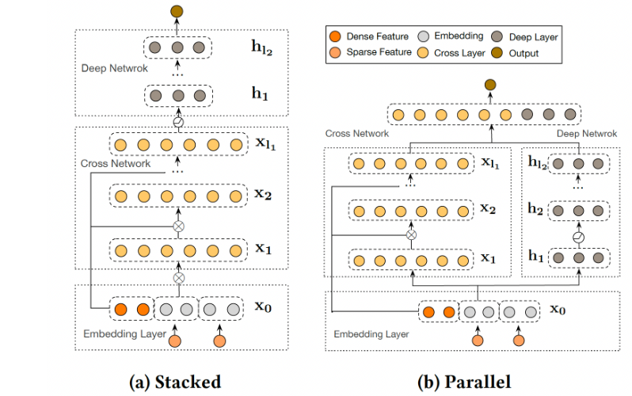

`DCN-V2` 首先通过 `cross layer` 学习输入的显式特征交互，然后与深度网络相结合从而学习互补的隐式交互。`DCN-V2` 的核心是 `cross layer` ，它继承了 `DCN` 中 `cross network` 的简单结构，然而在学习显式的和有界的交叉特征方面的表达能力显著增强。根据他们如何结合显式部分和隐式部分来组织相关工作。

- 并行结构：一个工作方向是联合训练两个并行网络，其灵感来自于 `wide and deep` 模型，其中 `wide` 组件将原始特征的交叉作为输入，而 `deep` 组件是一个 `DNN` 模型。然而，为 `wide` 组件选择交叉特征又回到了线性模型的特征工程问题。尽管如此， `wide and deep` 模型已经激发了许多工作从而采用这种并行的架构并改进 `wide` 部分。`DeepFM` 通过在 `wide` 组件采用 `FM` 模型从而自动进行 `feature interaction learning` 。
- 堆叠结构：另一个工作方向是在 `embedding layer` 和 `DNN` 模型之间引入一个 `interaction layer` ，该 `interaction layer` 创建了显式的特征交叉。这个 `interaction layer` 在早期阶段捕捉到了特征交互，并促进了后续隐层的学习。

`Cross Network`：`DCN-V2` 和核心在于 `cross layer`，它创建了显式的特征交叉。其中第$l+1$个 `cross layer`如下所示：
$$
\vec{\mathbf{x}}_{l+1} = \vec{\mathbf{x}}_0 \odot (\mathbf{W}_l\vec{\mathbf{x}}_{l} + \vec{\mathbf{b}}_{l}) + \vec{\mathbf{x}}_{l}
$$
$\odot$ 为逐元素乘法。

`Deep and Cross Combination`：我们提出了两种结构：

- `Stacked Structure`：输入 $\vec{\mathbf{x}}_0$被馈入 `cross network`，然后是 `deep network`，最后是输出层输出$\vec{\mathbf{x}}_{\text{final}}$ 。
- `Parallel Structure` （如 `Figure 1b`）：输入$$\vec{\mathbf{x}}_0$$被并行馈入到 `cross network` 和 `deep network`，然后这两个网络的输出拼接起来作为最终输出$\vec{\mathbf{x}}_{\text{final}}$.

`DCN-V2` 结构简单，计算瓶颈在于 `matrix-vector` 乘法，这使得我们可以利用矩阵近似技术来降低成本：通过两个低秩矩阵$\mathbf{U},\mathbf{V}\in \mathbb{R}^{d\times r}$来逼近稠密矩阵$\mathbf{W}\in\mathbb{R}^{d\times d}$​。因此，我们定义第$l+1$个 `cross layer` 的低秩版本为：
$$
\vec{\mathbf{x}}_{l+1} = \vec{\mathbf{x}}_0 \odot \left(\mathbf{U}_l(\mathbf{V}^T_l\vec{\mathbf{x}}_{l}) + \vec{\mathbf{b}}_{l}\right) + \vec{\mathbf{x}}_{l}
$$

## `DeepFM`

`FM` 将 `pairwise` 特征交互建模为特征之间潜在向量的内积，并显示出非常有希望的结果。虽然理论上 `FM` 可以建模高阶特征交互，但是实际上由于复杂性太高，因此通常只考虑二阶特征交互。

`DeepFM`模型能够以端到端的方式同时学习低阶特征交互和高阶特征交互，并且除了原始特征之外无需任何手动特征工程。论文的主要贡献如下：

- 论文提出了一种新的神经网络模型 `DeepFM`，它集成了 `FM` 和 `DNN` 架构。`DeepFM` 建模了像 `FM` 这类的低阶特征交互，也建模了像 `DNN` 这类的高阶特征交互。和 `Wide & Deep` 模型不同，`DeepFM` 可以在没有任何特征工程的情况下进行端到端的训练。
- `DeepFM` 可以有效地训练，因为它的 `wide` 部分和 `deep` 部分共享相同的输入和 `embedding` 向量，这和 `Wide & Deep` 不同。

`DeepFM` 模型由两种组件构成：`FM` 组件、`deep` 组件，它们共享输入。这种共享输入使得`DeepFM` 可以同时从原始特征中学习低阶特征交互和高阶特征交互，完全不需要执行特征工程

### 模型结构

假设输入包含 `sparse` 特征和 `dense` 特征。设原始特征为向量$\vec{\mathbf{x}}$，其中：
$$
\vec{\mathbf{x}}=<\vec{\mathbf{x}}_{\text{sparse}}^1,\cdots,\vec{\mathbf{x}}_{\text{sparse}}^K,\vec{\mathbf{x}}_{\text{dense}}>
$$
其中$\vec{\mathbf{x}}_{\text{sparse}}^i$为 `field i` 的 `one-hot` 向量，$\vec{\mathbf{x}}_{\text{dense}}$为经过归一化的 `dense` 特征，$<\cdot>$为向量拼接。对于特征 `j` （即$x_j$）：

- 标量$\omega_j$用于对它的一阶特征重要性进行建模，即 `FM` 组件左侧的 `+` 部分。
- 向量$\vec{\mathbf{v}}_j$用于对它的二阶特征重要性进行建模，即 `FM` 组件右侧的 `x` 部分。
- 向量$\vec{\mathbf{v}}_j$也作为 `deep` 组件的输入，从而对更高阶特征交互进行建模，即 `deep` 组件。

最终模型联合了 `FM` 组件和 `deep` 组件的输出：
$$
\hat{y} = \text{sigmoid}(\hat{y}_{\text{FM}}+\hat{y}_{\text{DNN}})
$$
`FM` 组件：该部分是一个 `FM` ，用于学习一阶特征和二阶交叉特征。`FM` 组件由两种操作组成：加法 `Addition` 和内积 `Inner Product`：
$$
\hat{y}_{\text{FM}} = \sum_{i=1}^d(\omega_i\times x_i)+\sum_{i=1}^d\sum_{j=i+1}(\vec{\mathbf{v}}_i\cdot\vec{\mathbf{v}}_j)\times x_i\times x_j
$$

`deep` 组件：该部分是一个全连接的前馈神经网络，用于学习高阶特征交互。假设 `embedding` 层的输出为：$\vec{\mathbf{h}}^0=[\vec{\mathbf{e}}_1,\cdots,\vec{\mathbf{e}}_F]$，其中$\vec{\mathbf{e}}_i$为`field i` 的 `embedding` 向量，$\vec{\mathbf{h}}^0$为前馈神经网络的输入。则有：
$$
\vec{\mathbf{h}}^{l+1}=\sigma(\vec{\mathbf{W}}^l\vec{\mathbf{h}}^l+\vec{\mathbf{b}}^l)
$$
最终有：$\hat{y}_{\text{DNN}}=\sigma(\vec{\mathbf{w}}_{\text{dnn}}\vec{\mathbf{h}}^L+b_{\text{dnn}})$

- `FNN`：`FNN` 虽然也用到了 `FM` 模型，但是它仅使用 `FM` 模型来初始化 `FNN` 然后来微调模型。这使得 `FNN` 的 `embedding` 层参数严重受制于 `FM` 模型，从而降低模型效果。另外 `FNN` 仅捕捉高阶特征交互。与之相比，`DeepFM` 不需要预训练，而是端到端的学习低阶特征交互和高阶特征交互。
- `PNN`：虽然 `IPNN` 更可靠，但是由于 `Product` 层的输出连接到第一个隐层的所有神经元，所以计算复杂度较高。同时 `IPNN` 会忽略低阶特征交互。与之相比，`DeepFM` 中的 `Product` 层（即 `FM` 组件）的输出仅仅连接到输出层。
- `Wide&Deep`：虽然 `Wide&Deep` 也可以对低阶特征和高阶特征同时建模，但是 `wide` 部分需要人工特征工程，而这需要业务专家的指导。与之相比，`DeepFM` 直接处理原始特征，不需要任何业务知识。

当设置正确的 `dropout` 比例（从 `0.6~0.9` ）时，模型可以达到最佳性能。这表明向模型添加一定的随机性可以增强模型的鲁棒性。

## `NFM`

`FM` 的缺点：模型使用一阶特征、二阶交叉特征的线性组合，模型简单，表达能力较弱。`DNN` 的缺点：在信息检索和数据挖掘任务中，大多数数据都是天然稀疏的。尽管 `DNN` 具备从 `dense` 数据中学习 `pattern` 的强大能力，但是目前还不清楚如何配置网络从而使得模型能够从 `sparse` 数据中有效的学习 `pattern` 。

`NFM`，它通过建模高阶和非线性特征交互来强化 `FM`。通过在神经网络建模中设计一种新的操作。论文第一次将 `FM` 纳入神经网络框架之下。

- 通过在 `Bi-Interaction layer` 之上堆叠非线性层，`NFM`能够加深 `deepen` 浅层线性 `FM`，有效地建模高阶和非线性特征交互以提高 `FM` 的表达能力。
- 与传统的深度学习方法在底层 `low level`简单地拼接、或平均 `embedding` 向量相比，`NFM` 使用 `Bi-Interaction pooling` 编码了更多有信息 `informative` 的特征交互，极大地促进了后续 `deep layer` 来学习有意义的信息。

`NFM` 无缝地结合了 `FM` 在建模二阶特征交互中的线性、以及神经网络在建模高阶特征交互中的非线性。

`《Neural collaborative filtering》`，该论文表明：简单地拼接用户 `embedding` 向量和 `item embedding` 向量会导致协同过滤的结果非常差。为了解决这个问题，必须依靠后续的 `deep` 层来学习有意义的交互函数`interaction function` 。

### 模型结构

给定经过`one-hot` 编码之后的输入向量$\vec{\mathbf{x}}\in\mathbb{R}^n$，其中特征$x_i=0$表示第$i$个特征不存在。则 `NFM` 的预测结果为：
$$
\hat{y}_{\text{NFM}}(\vec{\mathbf{x}})=\omega_0+\vec{\mathbf{w}}\cdot\vec{\mathbf{x}}+f(\vec{\mathbf{x}})
$$
类似 `FM`，`NFM` 的第一项为全局偏置，第二项为一阶特征。与 `FM` 不同，`NFM` 的第三项$f(\vec{\mathbf{x}})$对交叉特征进行建模，它是一个多层前馈神经网络，包含 `embedding`层、`Bi-Interaction` 层、`Hidden` 层、输出层。

`embedding` 层将每个`feature` 映射到一个 `dense vector representation`，即特征$i$映射到向量$\vec{\mathbf{v}}_i\in\mathbb{R}^k$。一旦得到 `embedding` 向量，则输入$\vec{\mathbf{x}}=(x_1,\cdots,x_n)^T$就可以表示为：
$$
\mathcal{V}_{\vec{\mathbf{x}}}=\{x_1\vec{\mathbf{v}}_1,\cdots,x_n\vec{\mathbf{v}}_n\}
$$
由于输入$\vec{\mathbf{x}}$的稀疏性，$\mathcal{V}_{\vec{\mathbf{x}}}$只需要保存非零的特征$\mathcal{V}_{\vec{\mathbf{x}}}=\{x_i\vec{\mathbf{v}}_i|x_i \ne 0\}$。

`Bi-Interaction` 层对输入的$\mathcal{V}_{\vec{\mathbf{x}}}$执行池化操作，将一组 `embedding` 向量转换为一个向量，该操作称作 `Bi-Interaction pooling` 操作：
$$
f(\mathcal{V}_{\vec{\mathbf{x}}})=\sum_{i=1}^n\sum_{j=i+1}^nx_i\vec{\mathbf{v}}_i\odot x_j\vec{\mathbf{v}}_j
$$
其中：$\odot$是逐元素乘法；$f(\mathcal{V}_{\vec{\mathbf{x}}})$是一个$k$维向量，它在 `embedding` 空间编码了二阶交叉特征。

$$
f(\mathcal{V}_{\vec{\mathbf{x}}})=\frac{1}{2}\left[\left(\sum_{i=1}^nx_i\vec{\mathbf{v}}_i\right)^2-\sum_{i=1}^n(x_i\vec{\mathbf{v}}_i)^2\right]
$$

`Hidden` 层是一组全连接层，用于捕获高阶特征交叉：$\vec{\mathbf{h}}_L=\sigma(\mathbf{W}_L\vec{\mathbf{h}}_{L-1}+\vec{\mathbf{b}}_L)$

至于全连接层的结构（即每一层的 `size` ），可以自由选择塔式`tower` 、常数`constant` 、菱形`diamond` 等等。

输出层用于输出预测得分：$f(\vec{\mathbf{x}})=\vec{\mathbf{h}}_L\cdot \vec{\mathbf{w}}_f$

## `AFM`

`AFM` 的作者认为 `FM` 可能会因为它对所有特征交互使用相同权重来建模而受到阻碍。在实际应用中，不同的预测变量通常具有不同的预测能力，并且并非所有特征都包含用于估计目标的有用信号。例如，和无用特征的交互甚至可能引入噪声并对性能产生不利影响。因此，应该为不太有用的特征的交互分配较低的权重，因为它们对预测的贡献较小。然而，`FM` 缺乏区分特征交互重要性的能力，这可能导致次优预测。

论文通过区分特征交互的重要性来改进 `FM`。作者设计了一个叫做注意力分解机 `Attentional Factorization Machine: AFM` 的新模型，它利用了神经网络建模的最新进展（即注意力机制），从而使得不同特征交互对预测有不同的贡献。更重要的是，特征交互的重要性是从数据中自动学习的，无需任何人类领域知识`human domain knowledge` 。

### 模型结构

`AFM` 模型和 `NFM` 模型一脉相承，其底层架构基本一致。给定经过`one-hot` 编码之后的输入向量$\vec{\mathbf{x}}\in\mathbb{R}^n$，其中特征$x_i=0$表示第$i$个特征不存在。则 `NFM` 的预测结果为：
$$
\hat{y}_{\text{NFM}}(\vec{\mathbf{x}})=\omega_0+\vec{\mathbf{w}}\cdot\vec{\mathbf{x}}+f(\vec{\mathbf{x}})
$$
类似 `FM`，`AFM` 的第一项为全局偏置，第二项为一阶特征。与 `FM` 不同，`NFM` 的第三项$f(\vec{\mathbf{x}})$对交叉特征进行建模，包含 `embedding`层、`Pair-wise Interaction` 成对交叉层、`Attention-based Pooling` 层、输出层。

`embedding` 层将每个`feature` 映射到一个 `dense vector representation`，即特征$i$映射到向量$\vec{\mathbf{v}}_i\in\mathbb{R}^k$。一旦得到 `embedding` 向量，则输入$\vec{\mathbf{x}}=(x_1,\cdots,x_n)^T$就可以表示为：
$$
\mathcal{V}_{\vec{\mathbf{x}}}=\{x_1\vec{\mathbf{v}}_1,\cdots,x_n\vec{\mathbf{v}}_n\}
$$
由于输入$\vec{\mathbf{x}}$的稀疏性，$\mathcal{V}_{\vec{\mathbf{x}}}$只需要保存非零的特征。

`Pair-wise Interaction` 层将$m$​个向量扩充为$m\times(m-1)/2$​个交叉向量，每个交叉向量是两个 `embedding` 向量的逐元素积。$m\le n$​为$\vec{\mathbf{x}}$​中非零元素数量。假设输入$\vec{\mathbf{x}}$​的非零元素下标为$\mathcal{X}$​，对应的 `embedding` 为$\Psi=\{x_i\vec{\mathbf{v}}_i\}_{i\in\mathcal{X}}$​，则 `Pair-wise Interaction` 层的输出为：
$$
f(\Psi)=\{(\vec{\mathbf{v}}_i\odot\vec{\mathbf{v}}_j)x_ix_j\}_{(i,j)\in\mathcal{R}_x}
$$
$\mathcal{R}_x=\{(i,j)\}_{i\in\mathcal{X},j\in\mathcal{X},j>i}$​表示成对下标集合。一旦得到`Pair-wise Interaction` 层的$m\times(m-1)/2$​个交叉向量，则可以通过一个 `sum pooling` 层来得到一个池化向量：
$$
\vec{\mathbf{v}}_{\text{pool}}=\sum_{(i,j)\in\mathcal{R}_x}(\vec{\mathbf{v}}_i\odot\vec{\mathbf{v}}_j)x_ix_j
$$
它刚好就是 `Bi Interaction` 层的输出 。因此 `Pair-wise Interaction层` + `sum pooling 层` = `Bi Interaction 层`。

`Attention-based Pooling` 层：与 `Bi Interaction pooling` 操作不同，`Attention-based Pooling` 操作采用了 `attention` 机制：
$$
f_{\text{Att}}(f(\Psi)) =\sum_{(i,j)\in\mathcal{R}_x}(\vec{\mathbf{v}}_i\odot\vec{\mathbf{v}}_j)\times x_ix_j\times a_{i,j}
$$
其中$a_{i,j}$是交叉特征$(i,j)$的`attention score` ，可以理解为交叉特征$(i,j)$的权重。

学习$a_{i,j}$的一个方法是直接作为模型参数来学习，但这种方法有个严重的缺点：对于从未在训练集中出现过的交叉特征，其 `attentioin score` 无法训练。为解决该问题，论文使用一个 `attention network` 来训练$a_{i,j}$。`attention network` 的输入为$m\times(m-1)/2$个交叉特征向量，输出为$a_{i,j}$。
$$
\begin{array}{c}a_{i,j}^{\prime}=\vec{\mathbf{h}}^T\text{relu}(\mathbf{W}(\vec{\mathbf{v}}_i\odot\vec{\mathbf{v}}_j)x_ix_j+\vec{\mathbf{b}})\\
a_{i,j} = \frac{\exp(a_{i,j}^{\prime})}{\sum_{(i,j)\in\mathcal{R}_x}\exp(a_{i,j}^{\prime})}\end{array}
$$
其中$\mathbf{W}\in\mathbb{R}^{t\times k},\vec{\mathbf{b}}\in\mathbb{R}^t,\vec{\mathbf{h}}\in\mathbb{R}^t$都是模型参数，$t$为 `attention network` 的隐向量维度，称作 `attention factor` 。输出层用于输出预测得分：
$$
f(\vec{\mathbf{x}})=\vec{\mathbf{p}}^T\left(\sum_{(i,j)\in\mathcal{R}_x}(\vec{\mathbf{v}}_i\odot\vec{\mathbf{v}}_j)\times x_ix_j\times a_{i,j}\right)
$$

## `xDeepFM`

`xDeepFM`基于深度交叉网络 `DCN`，旨在有效地捕获有界阶次`bounded degree` 的特征交互。然而，作者将在论文中论证 `DCN` 将导致一种特殊的交互形式。因此，论文设计了一种新颖的压缩交互网络 `compressed interaction network: CIN` 来代替 `DCN` 中的交叉网络。`CIN` 显式地学习特征交互，交互的阶次`degree` 随着网络深度的增加而增长。

`DNN` 在 `bit-wise level` 对特征交互进行建模，这与传统的 `FM` 框架在 `vector-wise level` 对特征交互进行建模不同。因此，在推荐系统领域，`DNN` 是否确实是表达高阶特征交互的最有效模型仍然是一个悬而未决的问题。论文的贡献如下：

- 提出了一种名为 `eXtreme Deep Factorization Machine: xDeepFM` 的新模型。`xDeepFM` 可以有效地联合学习显式高阶特征交互和隐式高阶特征交互，并且不需要手动特征工程。
- 在 `xDeepFM` 中设计了一个压缩交互网络 `compressed interaction network: CIN`。`CIN` 可以显式地学习高阶特征交互。论文表明特征交互的阶次`degree` 在每一层都会增加，并且特征在 `vector-wise level` 而不是 `bit-wise level` 交互。

### 模型结构

 `xDeepFM` 模型引入了一种新的网络 `Compressed Interaction Network:CIN`，该网络显式的在 `vector-wise` 级别建模特征交互。其优点有：通过 `CIN` 网络显式的在 `vector-wise` 级别学习高阶特征交互。通过 `DNN` 网络，`xDeepFM` 也能够隐式的学习任意低阶和高阶的特征交互。

如果一个 `field` 中只有一个取值，则该 `field` 的 `embedding` 就是对应 `one-hot` 中 `1` 对应的 `embedding` 的取值。如果一个 `field` 中有多个取值（如：用户最近一个月看过的电影），则该 `field` 的 `embedding` 就是对应 `one-hot` 中所有 `1` 对应的 `embedding` 的累加。

假设一个$k$层的 `cross network`，我们忽略偏置项，第$i+1$层定义为：$\vec{\mathbf{x}}_{i+1}=\vec{\mathbf{x}}_{0}\vec{\mathbf{x}}_{i}^T\vec{\mathbf{w}}_{i+1}+\vec{\mathbf{x}}_{i}$。则可以用数学归纳法证明：`cross network` 的输出$\vec{\mathbf{x}}_{k}$是$\vec{\mathbf{x}}_{0}$的一个标量乘积。即：$\vec{\mathbf{x}}_{k}=\alpha_k\times\vec{\mathbf{x}}_{0}$。其中
$$
\alpha_{i+1}=\alpha_i\times(\vec{\mathbf{w}}_{i+1}\cdot\vec{\mathbf{x}}_{0}+1)\in\mathbb{R},\quad\alpha_0=1
$$
注意：标量乘积仅仅意味着向量的方向相同，但是并不意味着线性关系。`cross network` 能够有效的学到高阶特征交互，其计算复杂度相对于 `DNN` 来讲可以忽略不计，但是有两个严重不足：网络输出形式过于单一，仅仅是$\vec{\mathbf{x}}_{0}$的标量乘积。基于 `bit-wise` 级别学习特征交互。

### `CIN`

`xDeepFM` 的 `CIN` 参考了 `cross network` 的思想，但是具有以下特点：

- 和 `cross network` 相同，`CIN` 也可以显式建模高阶特征交互，且网络复杂度并没有随着交互阶数的增加而指数增长。
- 和 `cross network` 不同，`CIN`基于 `vector-wise` 级别学习特征交互，且网络的表达能力更强输出形式更多。

假设所有的 `embedding` 向量维度$D$，假设 `field i` 的 `embedding` 为$\vec{\mathbf{e}}_i\in\mathbb{R}^D$。假设有$m$个 `field`，将所有 `embedding` 拼接成矩阵：
$$
\mathbf{X}^0=\left[\begin{array}{cccc}\vec{\mathbf{e}}_1^T\\
\cdot\\
\cdot\\
\vec{\mathbf{e}}_m^T\end{array}\right]\in\mathbb{R}^{m\times D}
$$
矩阵的第$i$行就是`field i` 的 `embedding`：$\vec{\mathbf{x}}_i^0=\vec{\mathbf{e}}_i$。`CIN` 的第$k$层输出也是一个矩阵$\mathbf{X}^k\in\mathbb{R}^{H_k\times D}$，其中$H_k$为输出向量的数量，其中$H_0=m$：
$$
\vec{\mathbf{x}}_h^k=\sum_{i=1}^{H_{k-1}}\sum_{j=1}^mW_{i,j}^{k,h}(\vec{\mathbf{x}}_i^{k-1}\odot\vec{\mathbf{x}}_j^0),\quad 1\le h\le H_k
$$
其中：$\odot$为向量的逐元素积。$\mathbf{W}^{k,h}\in\mathbb{R}^{H_{k-1}\times m}$为权重向量，它用于为 `vector-wise` 的交叉特征 赋予不同的权重$\vec{\mathbf{x}}_i^{k-1}\odot\vec{\mathbf{x}}_j^0$。由于$\mathbf{X}^k$是通过$\mathbf{X}^{k-1}$和$\mathbf{X}^0$计算得到，因此 `CIN` 显式的建模特征交互，并且特征交互的阶数随着`CIN` 网络的深度加深而加深。

`CIN` 的建模过程非常类似卷积神经网络`CNN` 。首先引入临时三维张量$\mathbf{Z}^{k+1}\in\mathbb{R}^{H_k\times m\times D}$，它是$\mathbf{X}^k$和$\mathbf{X}^0$的外积。

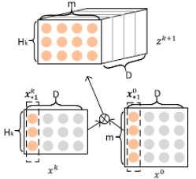

然后将三维张量$\mathbf{Z}^{k+1}$视为一张图片，将$\mathbf{W}^{k+1,h}\in\mathbb{R}^{H_k\times m}$视为一个卷积核，沿着 `embedding` 维度进行卷积得到 `featuremap` ，即向量$\vec{\mathbf{x}}^{k+1}_h\in\mathbb{R}^D$。

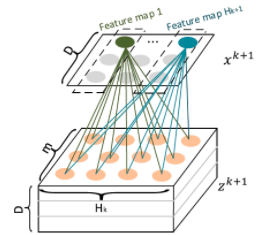

使用$H_{k+1}$个卷积核执行卷积，得到的 `featuremap` 组成输出张量$\mathbf{X}^{k+1}\in\mathbb{R}^{H_{k+1}\times D}$。因此 `CIN` 网络将$H_k\times m$个交叉向量压缩到$H_{k+1}$个向量，这就是网络名称中的 `compressed` 的由来。

令$T$表示网络深度，每层输出$\mathbf{X}^k\in\mathbb{R}^{H_k\times D}, 1\le k\le T$都和输出单元相连。首先对每层的 `feature map` 应用 `sum pooling`：
$$
p_h^k=\sum_{j=1}^D\vec{\mathbf{x}}_h^{k}, h=1,2,\cdots,H_k
$$
这里池化仍然是沿着 `embedding` 维度进行。因此得到该层的池化向量：
$$
\vec{\mathbf{p}}^k=(p_1^k,\cdots,p_{H_k}^k)^T
$$
拼接所有层的输出池化向量，则有：
$$
\vec{\mathbf{p}}^+=<\vec{\mathbf{p}}^1,\cdots,\vec{\mathbf{p}}^T>\in\mathbb{R}^{\sum_iH_i}
$$
该向量作为 `CIN` 网络的输出向量。输出向量输入到 `sigmoid` 输出层，得到 `CIN` 网络的输出得分：
$$
\hat{y} = \frac{1}{1+\exp(\vec{\mathbf{p}}^+\cdot\vec{\mathbf{w}}^+)}
$$
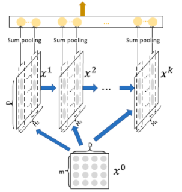

卷积、池化操作都是沿着 `embedding` 维度进行，而不是沿着其它方向。原因是：我们希望对特征之间的高阶特征交叉显式建模。根据 `CIN` 网络的基本原理，卷积必须对$\mathbf{Z}^{k+1}$​的 `embedding` 维度进 行。

$$
\vec{\mathbf{x}}_h^k=\sum_{i=1}^{H_{k-1}}\sum_{j=1}^mW_{i,j}^{k,h}(\vec{\mathbf{x}}_i^{k-1}\odot \vec{\mathbf{x}}_j^0)
$$
为了得到显式的交叉特征，池化也必须对$\mathbf{X}^k$的`embedding` 维度进行。设第$k$层第$h$个`feature map` 的参数$\mathbf{W}^{k,h}\in\mathbb{R}^{H_{k-1}\times m}$，因此第$k$层的参数数量为$H_k\times H_{k-1}\times m$。

`xDeepFM` 结合了 `CIN` 网络和 `DNN` 网络，分别对特征交互显式、隐式的建模，二者互补。模型输出为：
$$
\hat{y} = \sigma(\vec{\mathbf{w}}_{\text{linear}}\cdot\vec{\mathbf{x}}+\vec{\mathbf{w}}_{\text{dnn}}\cdot\vec{\mathbf{x}}_{\text{dnn}}+\vec{\mathbf{w}}_{\text{cin}}\cdot\vec{\mathbf{p}}^++b)
$$
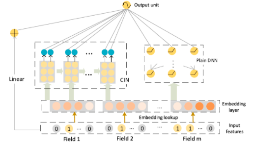

其中$\sigma(\cdot)$为激活函数；$\vec{\mathbf{w}}_{\text{linear}},\vec{\mathbf{w}}_{\text{dnn}},\vec{\mathbf{w}}_{\text{cin}}$分别为线性部分、`DNN` 部分、`CIN` 部分的输出层权重参数；$\vec{\mathbf{x}},\vec{\mathbf{x}}_{\text{dnn}},\vec{\mathbf{x}}_{\text{cin}}$分别为模型的原始输入特征、`DNN` 网络提取的特征、`CIN` 网络提取的特征。模型损失函数为负的对数似然函数：
$$
\mathcal{L} = -\frac{1}{N}\sum_{i=1}^N\left[y_i\log\hat{y}_i+(1-y_i)\log(1-\hat{y}_i)\right]
$$
模型训练目标：损失函数 + 正则化项
$$
\mathcal{J} = \mathcal{L}+\lambda||\Theta||
$$
其中$\lambda$为正则化系数；$\Theta$为所有参数，包括线性部分、`CIN`部分、`DNN` 部分。

## `ESMM`

常规的 `CVR` 预估模型采用和 `CTR` 预估模型类似的深度学习方法，但是在具体应用中面临几个特殊的问题：

- 样本选择偏差 `SSB` 问题：传统的 `CVR` 模型是在点击样本上训练的，但是推断是在曝光样本上进行的。这导致训练样本和推断样本不一致，降低了模型的泛化能力。
- 数据稀疏 `DS` 问题：点击数据通常要比曝光数据少得多，因此 `CVR` 任务的样本数通常远小于 `CTR` 任务的样本数。这导致 `CVR` 模型很容易陷入过拟合。

在 `ESMM` 中，作者引入两个辅助任务：曝光后`post-view` 点击率`click-through rate: CTR` 预估任务、曝光后 `post-view` 点击转化率 `clickthrough& conversion rate: CTCVR` 预估任务。

- `ESMM` 不是直接使用点击样本训练 `CVR` 模型，而是将 `pCVR` 视为中间变量，乘以 `pCTR` 等于 `pCTCVR`。`pCTCVR` 和 `pCTR` 都是用所有曝光样本在整个曝光空间上估计的，因此派生的 `pCVR` 也适用于整个曝光空间。这表明 `SSB` 问题已经消除。
- 此外，`CVR` 网络的 `feature representation` 参数与 `CTR` 网络共享，而 `CTR` 用更丰富的样本进行训练。这种 `parameter transfer learning` 有助于显著地缓解 `DS` 问题。
- `ESMM` 模型借鉴了多任务学习的思想，基于该顺序引入两个辅助任务：`CTR` 预测任务、`CTCVR` 预测任务。模型由两个子网络构成：左侧的 `CVR` 网络和右侧的 `CTR` 网络，二者均采用 `BASE` 模型相同的结构。模型同时输出`pCTR,pCVR,pCTCVR` 三路输出，其中：`pCVR` 输出由左侧的 `CVR` 网络输出、`pCTR` 输出由右侧的 `CTR` 网络输出、`pCTCVR` 输出将 `CVR` 和 `CTR` 网络输出的乘积作为输出

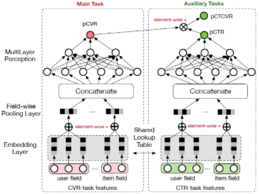

假设观察到的所有样本集合为：$\mathcal{S}=\{(\vec{\mathbf{x}}_1,y_1,z_1),\cdots,(\vec{\mathbf{x}}_N,y_N,z_N)\}$。其中$\vec{\mathbf{x}}\in\mathcal{X}$为特征，$y\in\mathcal{Y}$点击`label`，$z\in\mathcal{Z}$为转化`label`。

- `CVR` 建模是预估$\text{pCVR}=p(z=1|y=1,\vec{\mathbf{x}})$ 
- `CTR` 建模是预估 $\text{pCTR}=p(y=1|\vec{\mathbf{x}})$
- `CTCVR` 建模是预估$\text{pCTCVR}=p(y=1,z=1|\vec{\mathbf{x}})$

它们之间满足：$p(y=1,z=1|\vec{\mathbf{x}})=p(y=1|\vec{\mathbf{x}})\times p(z=1|y=1,\vec{\mathbf{x}})$

大多数传统 `CVR` 模型是上图左侧所示的 `DNN` 模型。传统 `CVR` 模型直接估计$p(z=1|y=1,\vec{\mathbf{x}})$，模型训练样本仅包含点击样本：$\mathcal{S}_c=\{(\vec{\mathbf{x}}_1,y_1,z_1|y_1=1),\cdots,(\vec{\mathbf{x}}_M,y_M,z_M|y_M=1)\}$。其中 `M` 为所有点击样本数量，$\mathcal{S}_c\sub\mathcal{S}$。这会带来以下问题：

- `SSB`：设$\mathcal{S}_c$的特征空间为$\mathcal{X}_c$，则 `CVR` 模型近似转化为：
  $$
  p(z=1|y=1,\vec{\mathbf{x}};\vec{\mathbf{x}}\in\mathcal{X})\backsimeq q(z=1|\vec{\mathbf{x}};\vec{\mathbf{x}}\in\mathcal{X}_c)
  $$
  因此训练期间都是在$\mathcal{X}_c$上训练。而推断期间给定一个特征$\vec{\mathbf{x}}\in\mathcal{X}$，我们需要计算：假设该曝光被点击的条件下其转化率。即计算$q(z=1|\vec{\mathbf{x}};\vec{\mathbf{x}}\in\mathcal{X})$。这里存在两个问题：

  - $\mathcal{X}_c$仅仅是$\mathcal{X}$的一个很小的部分，它很容易受到一些随机的噪声点击的影响。因此其分布很不稳定。
  - 空间$\mathcal{X}_c$的分布和$\mathcal{X}$差异较大，这使得训练样本的分布偏离了预测样本的分布，降低了`CVR` 模型的泛化能力。

- `DS`：由于点击事件发生次数比曝光事件发生次数少得多，因此 `CVR` 训练样本极其稀疏。

- 反馈延迟 `delayed feedback`：即单次曝光的点击和转化之间可能间隔很长时间。如：给用户推荐一款商品，用户点击之后可能过了两周才购买。

与基准 `DNN` 模型不同，`ESMM` 在整个曝光空间建模。根据：
$$
p(z=1|y=1,\vec{\mathbf{x}})=\frac{p(y=1,z=1|\vec{\mathbf{x}})}{p(y=1|\vec{\mathbf{x}})}
$$
其中$p(y=1,z=1|\vec{\mathbf{x}})$和$p(y=1|\vec{\mathbf{x}})$在所有曝光的数据空间$\mathcal{S}$上建模，因此可以有效解决样本选择偏移问题。

在 `ESMM` 中，`CVR` 网络的 `embedding` 和 `CTR` 网络的 `embedding` 字典共享，这是典型的特征表达迁移学习。由于 `CTR` 任务的训练样本要比 `CVR` 任务多得多，这种参数共享机制使得 `CVR` 网络能够从未点击的曝光样本中学习，有效缓解了数据稀疏性问题。

`ESMM` 模型的损失函数综合考虑了 `CTR` 和 `CTCVR` 两个辅助任务：
$$
\mathcal{L}(\theta_{\text{cvr}},\theta_{\text{ctr}})=\sum_{i=1}^Nl(y_i,f(\vec{\mathbf{x}}_i;\theta_{\text{ctr}}))+\sum_{i=1}^Nl(y_1\&z_i,f(\vec{\mathbf{x}}_i;\theta_{\text{ctr}})\times f(\vec{\mathbf{x}}_i;\theta_{\text{cvr}})
$$
其中$\theta_{\text{cvr}},\theta_{\text{ctr}}$为 `CTR`和 `CVR` 网络参数，$l(\cdot)$为交叉熵损失函数

在 `ESMM` 模型中，`pCVR` 是一个中间变量，通过乘法的形式使得这三个概率可以同时被训练。另外模型结构也保证了 `pCVR` 一定是在 `0~1` 之间。

## `ESM2` 

尽管 `ESSM` 通过同时处理 `SSB` 和 `DS` 问题从而获得了比传统方法更好的性能，但是由于购买行为的训练样本很少（根据来自淘宝电商平台的大规模真实交易日志，不到 `0.1%` 的曝光行为转化为购买），它仍然难以缓解 `DS` 问题。

具体而言，在点击和购买之间并行`parallel` 地插入不相交的购买相关`purchase-related` 的决定性动作`Deterministic Action: DAction`、以及购买无关的其它动作 `Other Action: OAction` ，形成一个新颖的 “曝光 --> 点击 --> `D(O)Action` --> 购买” 的用户行为序列图 `user sequential behavior graph` 。其中任务关系由条件概率明确地定义。此外，在这个图上定义模型能够利用整个空间上的所有曝光样本以及来自后点击行为`post-click behavior`的额外的丰富`abundant` 的监督信号`supervisory signal` ，这将有效地共同解决 `SSB` 和 `DS` 问题。

`ESM2` 包含三个模块：共享`embedding` 模块 `shared embedding module: SEM`、分解预估模块`decomposed prediction module: DPM`、序列合成模块`sequential composition module: SCM` 。

- 首先，`SEM` 通过线性的全连接层将 `ID` 类型的 `one-hot` 特征向量嵌入到`dense representation` 中。
- 然后，这些 `embedding` 被馈入到后续的 `DPM` 中。在该 `DPM` 中，各个预测子网通过在整个空间上对所有曝光样本进行多任务学习来并行 `parallel` 预估分解的子目标`decomposed sub-target`的概率。
- 最后，`SCM` 根据图上定义的条件概率规则`conditional probability rule defined` ，依次合成`compose`最终的 `CVR` 和一些辅助概率。在图的某些子路径`sub-path` 上定义的 `multiple losses` 用于监督 `ESM2` 的训练。

### 模型结构

定义 `item`$i$的 `post view ctr`$p_i^{ctr}$为：用户浏览到 `item`$i$的情况下点击它的条件概率。这由有向图中的路径 “曝光 --> 点击” 来描述。从数学上讲，这可以写成：
$$
p_i^{ctr} = p(c_i = 1|v_i = 1) = y_{1,i}
$$
其中：$c_i\in\{0, 1\}$ 表示 `item`$i$是否被点击。$v_i\in\{0, 1\}$表示 `item`$i$是否浏览

定义 `item`$i$的`click-through DAction CVR`$p_i^{ctavr}$为：用户浏览到 `item`$i$的情况下执行 `DAction` 动作的条件概率。这由有向图中的路径 “曝光 --> 点击 --> `DAction`” 来描述。
$$
p_i^{ctavr} = p(a_i = 1|v_i = 1)=\sum_{c_i\in\{0,1\}} p(a_i = 1|v_i = 1, c_i) \times p(c_i|v_i = 1)= y_{2,i}y_{1,i}
$$
其中： $a_i\in\{0, 1\}$表示 `item`$i$是否被执行 `DAction` 动作。这里假设：如果用户未点击`item`$i$，则不会发生下一步的 `DAction` 动作。即：$p(a_i=1|v_i=1,c_i=0)=0$。$y_{2,i}=p(a_i=1|v_i=1, c_i=1)$表示路径 “点击 --> `DAction`” 。考虑到点击$c_i=1$一定意味着浏览$v_i=1$，因此 简化为：$y_{2,i}=p(a_i=1|c_i=1)$

定义 `item` 的`CVR`$p_i^{cvr}$为：在用户已点击`item`$i$的条件下买`item`$i$条件概率。这由有向图中的路径 “点击 --> `D(O)Action` --> 购买” 来描述。从数学上讲，这可以写成：
$$
p_i^{cvr} = p(b_i = 1|c_i = 1)=\sum_{a_i\in\{0,1\}} p(b_i = 1|c_i = 1, a_i) \times p(a_i|c_i = 1)= y_{4,i}(1-y_{2,i}) + y_{3,i}y_{2,i}
$$
$y_{3,i}=p(b_i=1|c_i=1, a_i=1)=p(b_i=1|a_i=1)$表示有向图中的路径 “ `DAction` -> 购买” 。这里我们假设`DAction`$a_i=1$一定意味着点击$c_i=1$。$y_{4,i}=p(b_i=1|c_i=1, a_i=0)=p(b_i=1|a_i=0)$表示有向图中的路径 “ `OAction` -> 购买” 。这里我们假设`OAction`$a_i=0$一定意味着点击$c_i=1$。

定义 `item`$i$的 `click-through CVR` $p_i^{cvr}$为：用户浏览到 `item`$i$的情况下购买它的概率。这由有向图中的路径 “曝光 --> 点击 --> `D(O)Action` --> 购买” 来描述。从数学上讲，这可以写成：
$$
p_i^{cvr} = p(b_i=1|v_i=1)=\sum_{c_i}p(b_i=1|v_i=1,c_i)\times p(c_i|v_i=1)\\
=\sum_{c_i}\sum_{a_i}p(b_i=1|v_i=1, c_i, a_i)\times p(a_i|v_i=1, c_i)\times p(c_i|v_i=1)
$$
考虑到如果没有点击就没有任何购买，即：$\forall a_i\in\{0,1\} p(b_i=1|v_i=1, c_i=0, a_i) =0$。则上式简化为：
$$
p_i^{cvr} = p(b_i=1|v_i=1)\\
=\sum_{a_i}p(b_i=1|c_i=1, a_i)\times p(a_i|c_i=1)\times p(c_i=1|v_i=1)\\
=y_{1,i}\times [y_{4,i}(1-y_{2,i}) + y_{3,i}y_{2,i}]
$$
因此，上式可以通过将有向图 “曝光 --> 点击 --> `D(O)Action` --> 购买” 分解为 “曝光 --> 点击”、以及 “点击 --> `D(O)Action` --> 购买”，并根据链式法则 `chain rule`整合之前所有的公式$p_i^{ctcvr}=p_i^{ctr}\times p_i^{cvr}$从而得出。

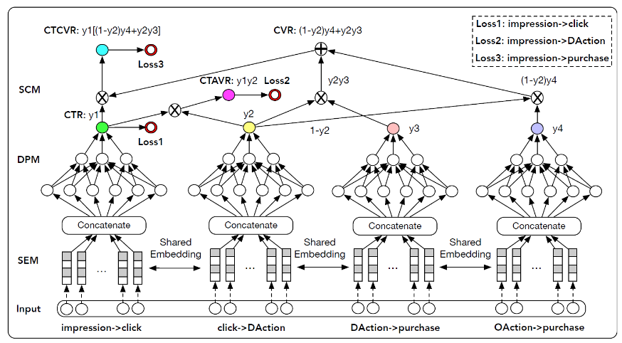

以$y_{2,i}$为例，仅使用点击样本直接训练$y_{2,i}$会遇到 `SSB` 问题。 实际上根据前面的推导，$y_{2,i}$是从$p_i^{ctr}$和$p_i^{ctavr}$派生的中间变量`intermediate variable`。由于$p_i^{ctr}$和$p_i^{ctavr}$都是使用所有曝光样本在整个空间上建模的，因此派生的$y_{2,i}$也适用于整个空间，因此在我们的模型中没有 `SSB` 。另一方面， 给定用户的日志，$p_i^{ctr},p_i^{ctavr},p_i^{ctcvr}$的 `ground truth label` 是可用的，这些 `label` 可用于监督这些子目标。

## `DIN`

当涉及到 `CTR` 预估任务时，用户兴趣通常是从用户行为数据中捕获的。`Embedding & MLP` 方法通过将用户行为的 `embedding` 向量转换为固定长度的向量来学习某个用户所有兴趣的 `representation`。换句话讲，用户的多样化兴趣被压缩成一个固定长度的向量，这限制了 `Embedding & MLP` 方法的表达能力。

为了使 `representation` 足以表达用户的多样化兴趣，固定长度向量的维度需要极大地扩展。不幸的是，这会极大地增加模型参数的规模，并加剧有限数据下模型过拟合的风险。此外，这也会增加计算和存储的负担，这种负担对于工业级在线系统而言是不能容忍的。

另一方面，在预测目标广告时没有必要将某个用户的所有多样化兴趣压缩到单个向量中，因为只有部分用户兴趣才会影响到该用户的行为（点击或不点击）。

`DIN` 通过考虑历史行为与目标广告的相关性来自适应地计算用户兴趣的 `representation` 向量。通过引入局部激活单元 `local activation unit`，`DIN` 通过软搜索 `soft-searching` 历史行为与目标广告的相关部分来关注相关的用户兴趣，并采用加权`sum` 池化来获得对目标广告的用户兴趣 `representation` 。与目标广告相关性更高的行为将会获得更高的激活权重 `activated weight`，并将主导用户兴趣`representation

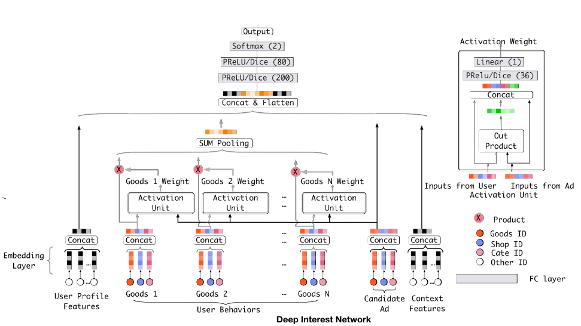

由于输入中包含长度可变的行为序列`ID`，因此基准模型采用一个池化层（如 `sumpooling` ）来聚合 `embedding` 向量序列，从而获得固定尺寸的向量。基准模型在实践中表现良好，但是在池化过程中丢失了很多信息。即：池化操作破坏了用户行为数据的内部结构。

具体而言，局部激活单元作用于用户行为特征（作为加权 `sum` 池化），从而自适应地计算目标广告`A`的用户`representation`$\vec{\mathbf{v}}_u$：
$$
\vec{\mathbf{v}}_U(A)=f(\vec{\mathbf{v}}_A,\vec{\mathbf{e}}_1,\cdots,\vec{\mathbf{e}}_H)=\sum_{i=j}^Ha(\vec{\mathbf{e}}_j,\vec{\mathbf{v}}_A)\vec{\mathbf{e}}_j=\sum_{j=1}^H\beta_j\times\vec{\mathbf{e}}_j
$$
其中：

- $\{\vec{\mathbf{e}}_1,\cdots,\vec{\mathbf{e}}_H\}$为用户U的、长度为H的历史行为 `embedding` 向量的列表。
- $\vec{\mathbf{v}}_A$为广告 的 `embedding` 向量。
- $a(\cdot)$是一个前馈神经网络，它的输出为激活权重$\beta_j\in\mathbb{R}$。在$a(\cdot)$的前馈神经网络中，除了$\vec{\mathbf{v}}_A,\vec{\mathbf{e}}_j$这两个 `embedding` 作为输入之外，我们还将它们的外积 `out product` 作为输入，这是有助于显式建模相关性。

局部激活单元与 `NMT` 任务中开发的注意力方法具有相似的思想。然而，与传统的注意力方法不同，我们放松了$\sum_i\beta_i = 1$的约束，这是为了保留用户兴趣的强度。也就是说，我们放弃了对$\sum_i\beta_i$的输出使用 `softmax` 归一化。相反， 的值在某种程度上被视为激活用户兴趣强度的近似`approximation` 。

###### 自适应正则化

当添加细粒度的、用户访问过的商品`id` 特征时，模型会严重过拟合。由于 `web-scale` 级别的用户行为数据遵从长尾分布，即：大多数行为特征`ID` 在训练样本中仅出现几次。这不可避免地将噪声引入到训练过程中，并加剧过拟合。缓解该问题地一种简单方式是：过滤掉低频地行为特征`ID` 。这种过滤策略太过于粗糙，因此这里引入了一种自适应地正则化策略：根据行为特征`ID` 出现地频率对行为特征`ID` 施加不同地正则化强度。

定义 为$\mathbb{B}$ `size = b` 的 `mini batch` 样本集合，$n_i$​表示训练集中行为特征`ID=i` 出现的频次，$\lambda$为正则化系数。定义参数更新方程为：
$$
\vec{\mathbf{w}}_i\leftarrow\vec{\mathbf{w}}_i-\eta\left[\frac{1}{b}\sum_{(\vec{\mathbf{x}}_j,y_j)\in\mathbb{B}}\nabla_{\vec{\mathbf{w}}_i}L(f(\vec{\mathbf{x}}_j,y_j))+\lambda\frac{1}{n_i}\vec{\mathbf{w}}_i\times\mathbf{I}_i\right]
$$
其中：$\vec{\mathbf{w}}_i$表示特征 `ID=i` 对应的 `embedding` 向量，它也是`embedding` 参数。$\mathbf{I}_i$用于指示：$\mathbb{B}$中是否有特征 `i` 非零的样本。
$$
\mathbf{I}_i=\left\{\begin{array}{ll}1,&\exists(\vec{\mathbf{x}}_j,y_j)\in\mathbb{B},s.t.x_{j,i}\ne0\\
0,&\text{else}
\end{array}\right.
$$

`GAUC` 的计算如下：
$$
\text{GAUC} = \frac{\sum_{i=1}^n w_i\times \text{AUC}_i}{\sum_{i=1}^n w_i}=\frac{\sum_{i=1}^n \text{impi}\times \text{AUC}_i}{\sum_{i=1}^n \text{impi}}
$$
其中：$\text{AUC}_i$表示用户 `i` 的所有样本对应的 `auc` ； $\text{impi}_i$用户 `i` 的所有样本数；$n$为用户总数

## `DIEN`

目前捕获用户兴趣的模型有两个主要缺陷：

- 包括`DIN` 在内的大多数兴趣模型都将用户行为直接视为兴趣。事实上，用户的显式行为不等于用户的潜在兴趣。因此这些模型都忽略了挖掘用户显式行为背后的真正用户兴趣。
- 考虑到外部环境和用户自身认知的变化，用户兴趣会随着时间动态变化，大多数模型都未考虑这一点。

`DIN` 引入了注意力机制来激活局部的、与目标 `item` 相关的历史行为，并成功地捕获到用户兴趣的多样性特点 `diversity characteristic` 。然而，`DIN` 在捕获序列行为 `sequential behaviors` 之间的依赖关系方面很弱

`DIEN` 中有两个关键模块：一个是从显式的用户行为中提取潜在的时序兴趣`temporal interest` ，另一个是对兴趣演变过程`interest evolving process` 进行建模。深度兴趣演化模型 `DIEN` 有两个关键模块：

- 兴趣抽取层 `interest extractor layer` ：用于从用户的历史行为序列中捕获潜在的时序兴趣 `latent temporal interest`。在兴趣提取层，`DIEN` 选择利用 `GRU` 来建模用户行为之间的依赖关系。遵循兴趣直接导致连续行为的原则，论文提出了辅助损失，它使用下一个行为 `next behavior` 来监督当前隐状态`hidden state` 的学习。论文将这些具有额外监督信息的隐状态称作兴趣状态 `interest state` 。这些额外的监督信息有助于为兴趣 `representation` 捕获更多的语义信息，并推动 `GRU` 的隐状态有效地表达兴趣。
- 兴趣演化层 `interest evolving layer` ：用于建模用户的兴趣演变过程。用户的兴趣是多种多样的，这导致产生兴趣漂移现象：相邻的两次访问中，用户的意图可能完全不同。并且用户的当前行为可能取决于很久之前的行为，而不是前几次行为。在兴趣演变层，`DIEN` 对与目标商品有关的兴趣演变轨迹进行建模。基于从兴趣提取层得到的兴趣序列，`DIEN` 采用带注意力更新门的 `GRU` ( `GRU with attentional update gate:AUGRU` ）来建模针对不同目标商品的特定兴趣演变过程。`AUGRU` 使用兴趣状态和目标商品来计算相关性，从而增强了相关兴趣对于兴趣演变的影响，同时减弱由于兴趣漂移产生的无关兴趣的影响。

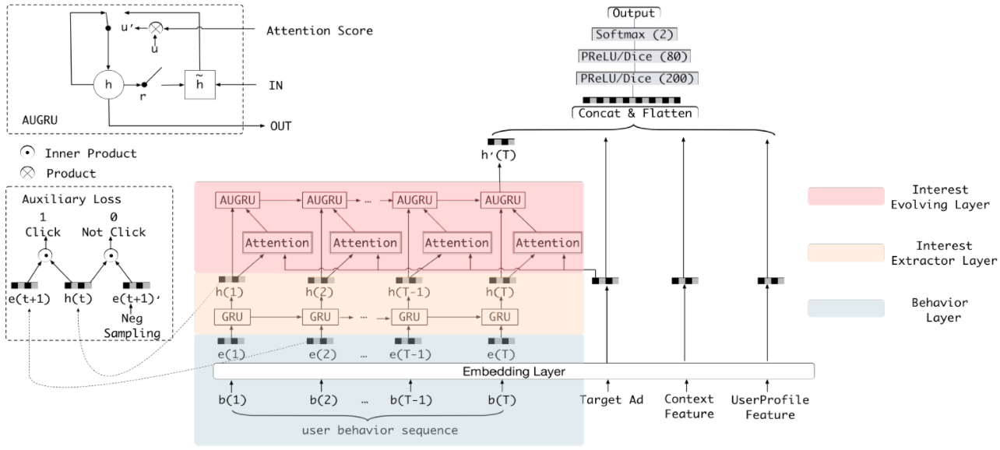

### 模型结构

假设用户画像、用户行为、广告、上下文这四个`field` 的不同特征 `one-hot` 编码拼接之后分别为$\mathbf{x}_p,\mathbf{x}_b,\mathbf{x}_a,\mathbf{x}_c$。通常用户行为特征是一个行为序列，因此有：
$$
\mathbf{x}_b=[\vec{\mathbf{b}}_1,\cdots,\vec{\mathbf{b}}_T],\quad\vec{\mathbf{b}}_t\in\{0,1\}^K
$$
其中$T$为用户行为序列的长度，$K$为所有商品的数量，$\vec{\mathbf{b}}_t$是第$t$个行为的 `one-hot` 向量。

`DIEN` 主要由四部分组成：`Embedding` 层、`Interest Extractor Layer` 兴趣抽取层、`Interest Evolving Layer` 兴趣演化层、`MLP` 网络。

#### 兴趣抽取层

兴趣抽取层就是从用户行为序列中提取背后的一系列兴趣状态。在电商领域用户的行为非常丰富，即使在很短时间内(如两周)，用户历史行为序列的长度也很长。为了在效率和性能之间平衡，论文采用 `GRU` 对行为之间的依赖关系建模：
$$
\begin{array}{cc}
\vec{\mathbf{u}}_t=\sigma(\mathbf{W}_u\vec{\mathbf{i}}_t+\mathbf{U}_u\vec{\mathbf{h}}_{t-1}+\vec{\mathbf{b}}_u)\\
\vec{\mathbf{r}}_t=\sigma(\mathbf{W}_r\vec{\mathbf{i}}_t+\mathbf{U}_r\vec{\mathbf{h}}_{t-1}+\vec{\mathbf{b}}_r)\\
\tilde{\vec{\mathbf{h}}}_t=\tanh(\mathbf{W}_h\vec{\mathbf{i}}_t+\vec{\mathbf{r}}_t\odot\mathbf{U}_h\vec{\mathbf{h}}_{t-1}+\vec{\mathbf{b}}_h)\\
\vec{\mathbf{h}}_t=(1-\vec{\mathbf{u}}_t)\odot\vec{\mathbf{b}}_{t-1}+\vec{\mathbf{u}}_t\odot\tilde{\vec{\mathbf{h}}}_t

\end{array}
$$
其中：$\odot$为逐元素积。$\mathbf{W}_u,\mathbf{W}_r,\mathbf{W}_h\in\mathbb{R}^{n_H\times n_I},\mathbf{U}_u,\mathbf{U}_r,\mathbf{U}_h\in\mathbb{R}^{n_H\times n_H}$为参数矩阵。其中$n_H$为隐向量维度，$n_I$为输入维度。$\vec{\mathbf{b}}_u,\vec{\mathbf{b}}_r,\vec{\mathbf{b}}_h$为偏置参数。$\vec{\mathbf{i}}_t=\mathbf{e}_b[t]$为用户行为序列中的第$t$个行为的 `embedding`，它作为 `GRU` 的输入；$\vec{\mathbf{h}}_t$为第$t$个隐状态。

实际上隐状态$\vec{\mathbf{h}}_t$无法有效的表达用户兴趣。由于目标商品的点击是由最终兴趣触发的，因此损失函数$\mathcal{L}$中使用的 `label` 仅仅监督了最后一个兴趣状态$\vec{\mathbf{h}}_T$，历史兴趣状态$\vec{\mathbf{h}}_t,t\le T$没有得到合适的监督。因此 `DIEN` 提出辅助损失。它利用第$t+1$步的输入来监督第$t$步的兴趣状态$\vec{\mathbf{h}}_t$的学习。除了采用下一个实际产生行为的商品作为正样本之外，`DIEN` 还从正样本之外采样了一些商品作为负样本。因此得到$N$对行为`embedding` 序列：

$$
\{\mathbf{e}_b^i,\hat{\mathbf{e}}^i_b\}\in\mathbb{D}_{\mathcal{B}},\quad i=1,2,\cdots,N
$$
其中：$i$为训练样本编号，$N$为训练样本总数。$\mathbf{e}_b^i$表示用户的历史行为序列，$T$为用户历史行为序列长度，$n_E$为行为 `embedding` 维度。$\mathbf{e}_b^i[t]\in\mathcal{G}$表示用户$i$历史行为序列的第$t$个商品的 `embedding` 向量，$\mathcal{G}$表示全部的商品集合。而$\hat{\mathbf{e}}^i_b$表示负样本采样序列。$\hat{\mathbf{e}}^i_b\in\mathcal{G}-\mathbf{e}_b^i[t]$​表示从用户$i$历史行为序列第$t$个商品以外的所有商品中采样得到的商品的 `embedding`。辅助损失函数为：

$$
\mathcal{L}_{\text{aux}}=-\frac{1}{N}\left[\sum_{i=1}^N\sum_t\log\sigma(\vec{\mathbf{h}}_t^i,\mathbf{e}_b^i[t+1])+\log(1-\sigma(\vec{\mathbf{h}}_t^i,\hat{\mathbf{e}}_b^i[t+1]))
\right]
$$
其中：$\sigma(\vec{\mathbf{x}}_1,\vec{\mathbf{x}}_2)=\frac{1}{1+\exp(-\vec{\mathbf{x}}_1\cdot\vec{\mathbf{x}}_2)}$为 `sigmoid` 激活函数。$\vec{\mathbf{h}}_t^i$表示用户$i$的第$t$个隐状态。

考虑辅助损失之后，`DIEN` 模型的整体目标函数为：
$$
\mathcal{L}=\mathcal{L}_{\text{target}}+\alpha\times\mathcal{L}_{\text{aux}}
$$
其中：$\mathcal{L}_{\text{target}}$为模型的主损失函数；$\alpha$为超参数，用于平衡兴趣表达和`CTR` 预测。

通过引入辅助函数，每个隐状态$\vec{\mathbf{h}}_t$就具有足够的表达能力来表达行为$\mathbf{e}_b[t]$背后的兴趣。所有$T$个兴趣状态$[\vec{\mathbf{h}}_1,\cdots,\vec{\mathbf{h}}_T]$一起构成了兴趣序列，从而作为兴趣演化层的输入。引入辅助函数具有多个优点：

- 从兴趣学习的角度看，辅助损失函数的引入有助于`GRU` 的每个隐状态学到正确的兴趣表示。
- 从 `GRU` 优化的角度看，辅助函数的引入有助于缓解 `GRU` 的长距离依赖问题，降低反向传播的难度。
- 还有不怎么重要的一点：辅助损失函数为 `embedding` 层的学习提供了更多的语义信息，从而产生更好的 `embedding` 表达。

#### 兴趣演化层

令$\vec{\mathbf{i}}_t^{\prime},\vec{\mathbf{h}}_t^{\prime}$为兴趣演化模块的输入向量和隐向量。其中：兴趣演化模块的输入就是兴趣抽取模块的隐向量：$\vec{\mathbf{i}}_t^{\prime}=\vec{\mathbf{h}}_t$。最后一个隐向量$\vec{\mathbf{h}}_T^{\prime}$就是最终的兴趣状态。注意力得分函数定义为：
$$
a_t=\frac{\exp(\vec{\mathbf{h}}_t\mathbf{W}\vec{\mathbf{e}}_a)}{\sum_{j=1}^T\exp(\vec{\mathbf{h}}_j\mathbf{W}\vec{\mathbf{e}}_a)}
$$
其中：$\vec{\mathbf{e}}_a\in\mathbb{R}^{n_A}$是广告 `ad` 各 `field` 的 `embedding` 向量的拼接向量，$n_A$为拼接向量维度。$\mathbf{W}\in\mathbb{R}^{n_H\times n_A}$为参数矩阵，$n_H$为隐向量维度。注意力得分反映了广告 `a` 和输入的潜在兴趣$\vec{\mathbf{h}}_t$之间的关系，关系约紧密则得分越高。

有多种注意力机制来建模兴趣演化过程。

- `AIGRU` ：最简单直接的方式是采用注意力得分来影响兴趣演化层的输入，这被称作 `AIGRU` 。
  $$
  \vec{\mathbf{i}}_t^{\prime}=\vec{\mathbf{h}}_t\times a_t
  $$
  但是 `AIGRU` 效果不是很好，因为即使是零输入也可以改变 `GRU` 的隐状态。即：即使相对于目标商品的兴趣较低，也会影响后面兴趣演化过程的学习。

- `AGRU`：通过使用注意力得分来替代 `GRU` 的更新门，并直接更改隐状态：
  $$
  \vec{\mathbf{h}}_t^{\prime}=(1-a_t)\times\vec{\mathbf{h}}_{t-1}^{\prime}+a_t\times\tilde{\vec{\mathbf{h}}}_t^{\prime}
  $$
  `AGRU` 将注意力机制嵌入到 `GRU` 中，从而降低了兴趣演化过程中与目标商品无关兴趣的影响，克服了 `AIGRU` 的缺陷。

- `AUGRU`：在 `AGRU` 中我们用一个标量$a_t$替代了更新门向量，这会忽略不同维度的差异。因此可以考虑通过注意力得分调整更新门：
  $$
  \begin{array}{cc}\tilde{\vec{\mathbf{u}}}_t^{\prime}=a_t\times \vec{\mathbf{u}}_t^{\prime}\\
  \vec{\mathbf{h}}_t^{\prime}=(1-\tilde{\vec{\mathbf{u}}}_t^{\prime})\odot\vec{\mathbf{h}}_t^{\prime}+\tilde{\vec{\mathbf{u}}}_t^{\prime}\odot\tilde{\vec{\mathbf{h}}}_t^{\prime}
  \end{array}
  $$
  其中$\vec{\mathbf{u}}_t^{\prime}$为原始更新门。

## `DSIN`

用户行为序列是由会话 `session` 组成的。其中会话是在给定时间内用户行为的列表。

- 会话是根据时间来划分的。如：如果两次用户行为超过一定时间间隔，则它们分别属于两个独立的会话。
- 同一个会话中的用户行为是高度同构的，不同会话中的行为是高度异构的。

即用户在单次会话中通常具有明确的、独一`unique` 的意图。而当用户开始新会话时，用户的兴趣可能会急剧变化。受上述观察的启发，论文提出了深度会话兴趣网络 `DSIN`，通过利用用户的多个历史会话来建模用户的序列行为。`DSIN` 包含三个关键部分：

- 第一部分：将用户行为划分为会话，然后使用 `bias encoding` 的自注意力机制对每个会话建模。自注意力机制可以捕获会话内部的相关性，然后提取用户在每个会话的兴趣。这些不同的会话兴趣可能会彼此相关，甚至会遵循某种序列模式。
- 第二部分：不同的会话兴趣可能相互关联，甚至遵循序列模式`sequential pattern` 。论文应用 `Bi-LSTM` 来捕获用户在不同历史会话兴趣的演变 `evolve` 和交互 `interact` 。
- 第三部分：考虑到不同的会话兴趣对目标商品有不同的影响，论文设计了局部激活单元来聚合这些会话兴趣，从而生成用户行为序列的最终表达。

`BaseModel` 基准模型：基准模型采用 `Embedding &MLP` 结构，其中：

- 特征：`BaseModel` 中采用三组特征，每组特征都由一些稀疏特征构成，包括：用户画像、商品画像、用户历史行为：包含用户最近点击商品的商品 `id`。
- `embedding`：用户画像的 `embedding` 为$\mathbf{X}^U\in\mathbb{R}^{N_u\times  d}$，其中$N_u$表示用户画像的稀疏特征数量，$d$为`embedding` 向量维度。商品画像的 `embedding` 为$\mathbf{X}^I\in\mathbb{R}^{N_i\times  d}$，其中$N_i$表示商品画像的稀疏特征数量，$d$为`embedding` 向量维度。用户历史行为的 `embedding` 为：$\mathbf{S}=[\vec{\mathbf{b}}_1,\cdots,\vec{\mathbf{b}}_T]\in\mathbb{R}^{T\times d}$。其中$T$为用户历史行为数量，$\vec{\mathbf{b}}_i$为第$i$个行为的 `embedding` 向量，$d$为`embedding` 向量维度。
- `MLP`：我们将用户画像`embedding`、商品画像`embedding`、用户历史行为`embedding` 拼接、展平然后馈入`MLP` 网络中。在 `MLP` 中，我们采用 `ReLU` 激活函数并使用 `softmax` 输出单元来预测用户点击商品的概率。

`DSIN` 的基础架构类似 `BaseModel` 的 `Embedding&MLP` 架构，但是`DSIN` 模型在 `Embedding` 和 `MLP` 之间还有四个`layer`，从上到下依次为：

- 会话划分层 `session division layer`：将用户行为序列划分为不同的会话。
- 会话兴趣提取层 `sessioin interest extractor layer`：抽取用户的会话兴趣。
- 会话兴趣交互层 `sesion interest interaction layer` ： 捕获用户的会话兴趣序列关系。
- 会话兴趣激活层 `session interest activating layer`： 采用局部激活单元来建模会话兴趣对目标商品的影响。

最后会话兴趣激活层的输出和用户画像`embedding`、商品画像`embedding` 一起馈入 `MLP` 来执行预测。

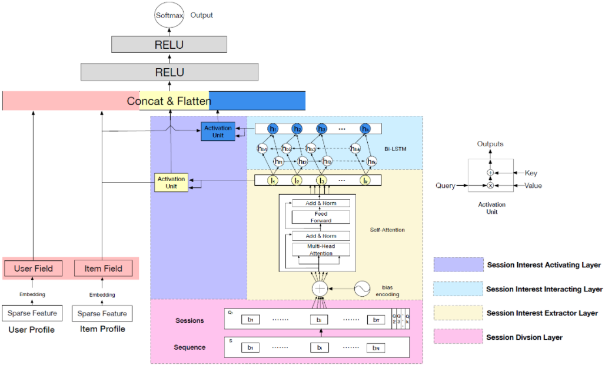

`Session Division Layer`：为了更精确的抽取用户的会话兴趣，我们将用户行为序列$\mathbf{S}=[\vec{\mathbf{b}}_1,\cdots,\vec{\mathbf{b}}_N]\in\mathbb{R}^{N\times d}$划分为会话序列$\mathbf{Q}$，其中第$k$个会话（$1\le k\le K$）为：
$$
\mathbf{Q}_k=[\vec{\mathbf{b}}_{k_1},\cdots,\vec{\mathbf{b}}_{K_T}]\in\mathbb{R}^{T\times d}
$$
其中：$T$为会话中用户行为数量。通常拆分依据是：如果两个相邻的用户行为时间间隔超过，比如说 `30` 分钟，则将它们划分到两个会话中；否则它们同属于同一个会话。

`Session Interest Extractor Layer`：为了捕获同一会话行为之间的内在关系，并且减少无关行为的影响，我们在每个会话中采用 `multi-head self-attention` 机制。另外，我们还对`self-attention` 机制做了一些改进，从而更好地实现会话兴趣提取这一目标。

- `Bias Encoding`：为了利用序列的顺序关系`order relation` ，`self-attention` 机制将位置编码`positional encoding` 应用于 `input embedding` 。此外，会话的顺序关系以及 `bias` 存在于不同的 `representation` 子空间中，也需要被捕获。因此，我们在位置编码的基础上提出了 `bias encoding`$\mathbf{BE}\in\mathbb{R}^{K\times T\times d}$，其中$\mathbf{BE}$中的每个元素定义为：
  $$
  \mathbf{BE}(k, t, c) = w_k^K+w_t^T + w_c^C
  $$
  其中：$\vec{\mathbf{w}}^K\in\mathbb{R}^K$是会话的 `bias` 向量，$\vec{\mathbf{w}}^T\in\mathbb{R}^T$为会话中位置的 `bias` 向量。$\vec{\mathbf{w}}^C\in\mathbb{R}^d$为用户行为`embedding` 的 `unit position` 的`bias` 向量。添加 `bias encoding` 之后，用户的行为会话$\mathbf{Q}$更新为：$\mathbf{Q} = \mathbf{Q} + \mathbf{BE}$

- `Multi-head Self-attention`：`multi-head self-attention` 可以捕获不同 `representation` 子空间中的关系。在数学上，将第$k$个会话沿着 `embedding` 维度方向拆分为$H$个 `head`：
  $$
  \mathbf{Q}_k = [\mathbf{Q}_{k,1};\cdots;\mathbf{Q}_{k,H}]
  $$
  其中 ：$\mathbf{Q}_{k,h}\in\mathbb{R}^{T\times d_h}$为$\mathbf{Q}_k$的第$h$个 `head`，$H$为 `head` 数量，$d_h = \frac{d}{H}$。拼接不同 `head` 的输出然后馈送到一个前馈神经网络：
  $$
  \mathbf{I}_k^Q = \text{FFN}(\text{Concat}(\text{head}_{k,1},\cdots,\text{head}_{k,H})\mathbf{W}^O)\in\mathbb{R}^{T\times d}
  $$
  

  $\text{FFN}(\cdot)$为前馈神经网络，在前馈神经网络中，我们也采用了残差连接和 `layer normalization`。对输出的一组向量进行池化操作，则得到第 个会话兴趣为：
  $$
  \vec{\mathbf{I}}_k = \text{Avg}(\mathbf{I}^Q_k) \in\mathbb{R}^d
  $$

`Session Interest Interacting Layer`：用户的会话兴趣与上下文兴趣保持序列关系`sequential relation` 。建模兴趣的动态变化可以丰富会话兴趣的 `representation`。`Bi-LSTM` 在捕获序列关系方面非常出色，我们很自然地用它来建模 `DSIN` 中会话兴趣的交互

`Session Interest Activating Layer`：和目标`item` 相关的用户会话兴趣对用户的点击意愿的影响更大。需要针对目标 `item` 重新分配用户会话兴趣的权重。注意力机制在 `source`和 `target` 之间进行软对齐 `soft alignment` ，并已被证明是一种有效的权重分配机制。与目标 `item` 相关的自适应会话兴趣为
$$
a_k^I = \frac{\exp\left(\vec{\mathbf{I}}_k\cdot (\mathbf{W}^I\mathbf{X}^I)\right)}{\sum_{k^{\prime}}^K\exp\left(\vec{\mathbf{I}}_{k^{\prime}}\cdot (\mathbf{W}^I\mathbf{X}^I)\right)}\\
\vec{\mathbf{U}}^I = \sum_{k}^Ka_k^I\vec{\mathbf{I}}_k
$$
其中：$\mathbf{X}^I$为目标 `item` 的 `embedding` 向量，$\mathbf{W}^I$为对应权重，$a_k^I$为第$k$个会话的会话兴趣对目标`item` 的注意力得分。

## `DeepMCP`

 `DeepMCP` 模型包含三个部分：一个 `matching subnet`、一个 `correlation subnet`、一个 `prediction subnet`。这三个部分共享相同的 `embedding` 矩阵。

- `matching subnet` 对 `user-ad` 的关系进行建模，并旨在学习有用的用户`representation` 和有用的广告 `representation` 。
- `correlation subnet` 对 `ad-ad` 的关系进行建模，并旨在学习有用的广告 `representation` 。
- `prediction subnet` 对 `feature-CTR` 关系进行建模，并旨在预测在给定所有特征的条件下的 `CTR` 。

当这些 `subnet` 在目标`label` 的监督下联合优化时，学到的特征`representation`既具有良好的预测能力、又具有良好的表达能力。此外，由于同一个特征以不同的方式出现在不同的 `subnet` 中，因此学到的 `representation` 在统计上更加可靠。论文的主要贡献是：

- 论文提出了一种用于 `CTR` 预估的新模型 `DeepMCP`。与主要考虑 `feature-CTR` 关系的经典 `CTR` 预估模型不同，`DeepMCP` 进一步考虑了 `user-ad` 关系和 `ad-ad` 关系。

### 模型结构

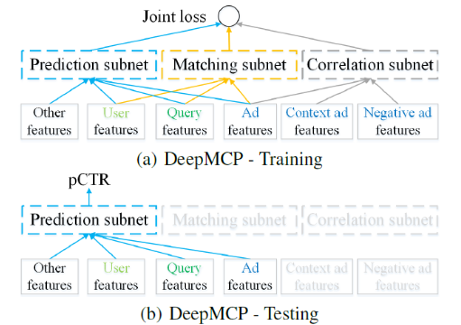

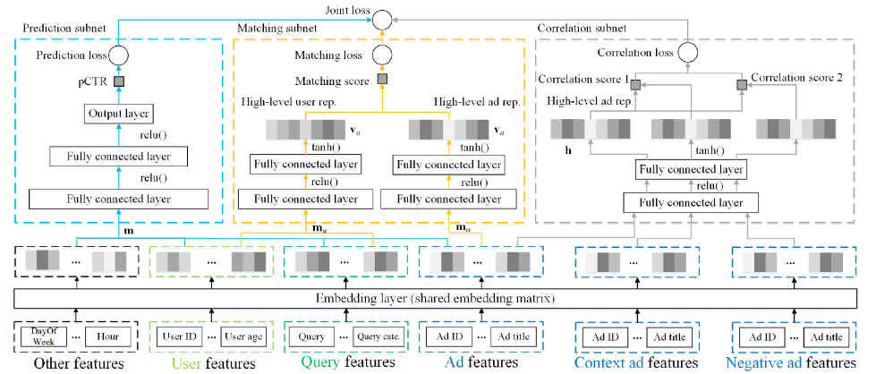

特征分为四组：用户特征（如用户 `ID`、年龄）、`query` 特征（如 `query`、`query category` ）、广告特征（如创意`ID`、广告标题）、其它特征（如一天中的小时、星期）。

`Context ad features` 和 `Negative ad features` 是 `correlation subnet` 中，位于用户点击序列的时间窗口内上下文广告、以及窗口外的负采样广告。它们仅用于 `correlation subnet` 。

### Prediction Subnet

`prediction subnet` 是一个典型的 `DNN` 模型，它对 `feature-CTR` 关系进行建模。它旨在在目标 `label` 的监督下，根据所有特征预估点击率。尽管如此，`DeepMCP` 模型非常灵活，可以使用任何其它`CTR` 预估模型来代替`prediction subnet`，如 `Wide & Deep`、`DeepFM` 等。

#### Matching Subnet

`matching subnet` 对 `user-ad` 的关系进行建模，并旨在学习有用的用户`representation` 和有用的广告 `representation` 。它的灵感来自于网络搜索的语义匹配模型`semantic matching model` 。具体而言，`matching subnet` 包含两个部分：

- 用户部分 `user part`：用户部分的输入是用户特征和 `query` 特征。

  单个特征$x_i\in\mathbb{R}$首先经过 `embedding` 层，然后映射为对应的 `embedding` 向量$\vec{\mathbf{e}}_i\in\mathbb{R}^K$。然后拼接为长向量$\vec{\mathbf{m}}_u\in\mathbb{R}^{N_u}$。然后向量$\vec{\mathbf{m}}_u$经过若干层全连接层`fully connected` 层。对于最后一个 `FC` 层，我们使用 `tanh` 非线性激活函数（而不是 `ReLU`）。用户部分的输出是一个 `high-level` 的用户 `representation` 向量$\vec{\mathbf{v}}_u\in\mathbb{R}^M$。

- 广告部分 `ad part`：广告部分的输入是广告特征。

  同样，我们首先将每个广告特征映射到对应的 `embedding` 向量，然后将单个广告 的多种特征的 `embedding` 拼接为长向量$\vec{\mathbf{m}}_a\in\mathbb{R}^{N_a}$。然后向量$\vec{\mathbf{m}}_a$经过若干层全连接层`FC` 层，从而得到一个 `high-level` 的广告 `representation` 向量 。同样地，对于最后一个 `FC` 层，我们使用 `tanh` 非线性激活函数。

然后我们通过下式计算 `matching score` 为：
$$
s(\vec{\mathbf{v}}_u, \vec{\mathbf{v}}_a) =\frac{1}{1 + \exp(-\vec{\mathbf{v}}_u^T\vec{\mathbf{v}}_a)}
$$
最后一个 `FC` 层的激活函数，因为 `ReLU` 之后的输出将包含很多零，这使得$\vec{\mathbf{v}}_u^T\vec{\mathbf{v}}_a\to 0$。

至少有两种选择来建模 `matching score`：

- `point-wise` 模型：当用户$u$点击广告$a$时，则$s(\vec{\mathbf{v}}_u, \vec{\mathbf{v}}_a)\to 1$；当用户$u$未点击广告$a$时，则$s(\vec{\mathbf{v}}_u, \vec{\mathbf{v}}_a)\to 0$。
- `pair-wise` 模型：如果用户$u$点击了广告$a_i$但是未点击广告$a_j$，则$s(\vec{\mathbf{v}}_u, \vec{\mathbf{v}}_{a_i}) > s(\vec{\mathbf{v}}_u, \vec{\mathbf{v}}_{a_j}) + \delta$，其中$\delta$为 `margin` 超参数。

将 `matching subnet` 的损失函数定义为：
$$
\mathcal{L}_m = -\frac{1}{n}\sum_{i = 1}^n[y(u, a)\log s(\vec{\mathbf{v}}_u, \vec{\mathbf{v}}_a) + (1-y(u, a))\log (1-s(\vec{\mathbf{v}}_u, \vec{\mathbf{v}}_a))]
$$
其中：$n$为样本数量；如果用户$u$点击广告$a$则$y(u, a)=1$，否则$y(u, a)=0$。

`matching subnet` 也是采用是否点击作为`label`，这和 `prediction subnet` 完全相同。二者不同的地方在于：

- `matching subnet` 是 `uv` 粒度，而 `prediction subnet` 是 `pv` 粒度。
- `matching subnet` 通过`representation` 向量的内积来建模用户和广告的相关性，用户信息和广告信息只有在进行内积的时候才产生融合。而 `prediction subnet` 直接建模点击率，用户信息和广告信息在 `embedding layer` 之后就产生融合。

#### Correlation Subnet

`correlation subnet` 对 `ad-ad` 的关系进行建模，并旨在学习有用的广告 `representation` 。在我们的问题中，由于用户的点击广告构成了随时间推移的、具有一定相关性的序列，因此我们使用 `skip-gram` 模型来学习有用的广告`representation` 。给定单个用户点击广告的广告序列$\{a_1,a_2,\cdots,a_L\}$，我们最大化平均对数似然：
$$
ll = \frac{1}{L}\sum_{i=1}^{L}\sum_{-C\le j\le C}\log p(a_{i+j}|a_i)
$$
其中：$L$是广告序列长度，$C$为上下文窗口大小。概率$p(a_{i+j}|a_i)$可以通过不同的方式进行定义，例如 `softmax`、层次 `softmax`、负采样。由于负采样的效率高，我们选择负采样技术将 定义为：
$$
p(a_{i+j}|a_i) = \sigma\left(\vec{\mathbf{h}}_{a_{i+j}}^T\vec{\mathbf{h}}_{a_i})\right)\prod_{q=1}^{Q}\sigma\left(\vec{\mathbf{h}}_{a_{q}}^T\vec{\mathbf{h}}_{a_i}\right)
$$
其中：$Q$为负采样的广告数。`correlation subnet` 的损失函数为负的对数似然：
$$
\mathcal{L}_c =\frac{1}{L}\sum_{i=1}^{L}\sum_{-C\le j\le C}\left[-\log\left[\sigma\left(\vec{\mathbf{h}}_{a_{i+j}}^T\vec{\mathbf{h}}_{a_i})\right)\right] -\sum_{q=1}^Q\log\left[\sigma\left(-\vec{\mathbf{h}}_{a_{q}}^T\vec{\mathbf{h}}_{a_i})\right)\right]\right]
$$
考虑所有用户的$\mathcal{L}_c$则得到 `correlation subnet` 总的损失。离线训练过程：`DeepMCP` 的最终联合损失函数为：
$$
\mathcal{L} = \mathcal{L}_p + \alpha\mathcal{L}_m + \beta\mathcal{L}_c
$$

## `DMR`

推荐系统和许多其他`application` 中，用户并没有清楚地表明他们的意图。因此，从用户行为中捕获用户兴趣对于 `CTR` 预估至关重要

- 可变长度的用户行为特征通常通过简单的均值池化转变为固定长度的向量，这意味着所有行为都同等重要。
- `DIN` 通过加权 `sum` 池化来表示用户兴趣，其中每个用户行为相对于目标 `item` 的权重通过注意力机制自适应学习。
- `DIEN` 不仅提取用户兴趣，而且建模兴趣的动态演变`temporal evolution` 。
- `DSIN` 利用行为序列中的会话信息来建模兴趣演变。

 `DMR`将协同过滤的思想和 `matching` 思想相结合，用于 `CTR` 预估的 `ranking` 任务，从而提高了 `CTR` 预估的性能。`DMR` 包含 `User-to-Item Network` 和 `Item-to-Item Network` 这两个子网来代表 `user-to-item` 的相关性。

- 在 `User-to-Item Network` ，论文通过`embedding` 空间中 `user embedding` 和 `item embedding` 的内积来表达用户和 `item` 之间的相关性。其中 `user embedding` 是从用户行为中抽取而来。

  同时，论文提出一个辅助的`match` 网络 `auxiliary match network` 来推动更大`larger` 的内积从而代表更高的相关性，并帮助更好地拟合 `User-to-Item Network` 。考虑到最近的行为可以更好地反映用户的时间的兴趣`temporal interest` ，论文应用注意力机制来自适应地学习每种行为在行为序列中的权重，并考虑行为在序列中的位置`position` 。辅助 `match` 网络可以视为一种 `match` 方法，其任务是根据用户的历史行为来预测下一个要点击的 `item` ，然后论文在 `DMR` 中共同训练 `matching` 模型和 `ranking` 模型。`DMR` 是第一个在 `CTR` 预估任务中联合训练`matching` 和 `ranking` 的模型。

- 在 `Item-to-Item Network`，论文首先计算用户交互`item` 和目标 `item` 之间的 `item-to-item` 相似度，其中采用考虑了位置信息`position information` 的注意力机制。然后论文将`item-to-item` 相似性相加，从而获得了另一种形式的 `user-to-item` 相关性。

### 模型结构

用户画像`User Profile` 的拼接特征为$\vec{\mathbf{x}}_p$、用户行为`User Behavior` 的拼接特征为$\vec{\mathbf{x}}_b$、`Target Item` 的拼接特征为$\vec{\mathbf{x}}_t$、上下文`Context`的拼接特征为$\vec{\mathbf{x}}_c$。注意，用户行为序列包含很多个`item`，因此用`User Behavior` 的特征是由这些`item` 的特征向量列表拼接而成$\vec{\mathbf{x}}_b = [\vec{\mathbf{e}}_1||\cdots||\vec{\mathbf{e}}_T]$，其中：$T$为用户行为序列的长度，$T$是可变的。$\vec{\mathbf{e}}_t$为第$t$个行为的特征向量，`||` 表示向量拼接。

`User Behavior` 特征和 `Target Item` 特征位于相同的特征空间，并共享相同的 `embedding` 矩阵以降低内存需求。

`DMR` 结构如下图所示：

- 输入特征向量是嵌入`embedded` 的离散特征、和正则化`normalized` 的连续特征的拼接。
- `DMR` 使用两个子网（ `User-to-Item Network` 、`Item-to-Item Network`）以两种形式来建模 `user-to-item` 相关性。
- 两种形式的 `user-to-item` 相关性、用户的动态兴趣`temporal interest`的 `representation` 、以及其它所有特征向量拼接起来，然后馈入到 `MLP` 中。

最终损失由 `MLP` 的 `target loss` 和辅助的 `match network loss` 组成。

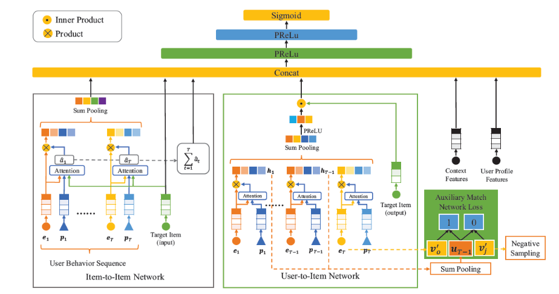

#### User-to-Item Network

`User-to-Item Network` 通过`user representation` 和 `item representation` 的内积来建模用户和目标 `item` 之间的相关性，这可以视作用户和 `item` 之间的一种特征交互。为获得`user representation`，我们求助于 `User Behavior` 特征。

在 `User-to-Item Network` 中，我们使用位置编码作为 `query` 的注意力机制来自适应地学习每个行为的权重，其中用户行为的位置`position` 是行为序列中按发生时间排序的序列编号
$$
a_t = \vec{\mathbf{z}}^T\tanh\left(\mathbf{W}_p\vec{\mathbf{p}}_t + \mathbf{W}\vec{\mathbf{e}}_t + \vec{\mathbf{b}}\right)\\
\alpha_t = \frac{\exp(a_t)}{\sum_{i=1}^T\exp(a_i)
}
$$
其中：$\vec{\mathbf{p}}_t\in\mathbb{R}^{d_p}$为第$t$个位置 `embedding`。$\vec{\mathbf{e}}_t\in\mathbb{R}^{d_e}$为第$t$个行为的特征向量。最终用户的 `representation`$\vec{\mathbf{u}}\in\mathbb{R}^{d_v}$的公式为：
$$
\vec{\mathbf{u}} = g\left(\sum_{t=1}^T\alpha_t\vec{\mathbf{e}}_t\right)
$$
目标 `item` 的 `representation`$\vec{\mathbf{v}}^{\prime}\in\mathbb{R}^{d_v}$直接从 `embedding`$\mathbf{V}^{\prime}=[\vec{\mathbf{v}}^{\prime}_1,\cdots,\vec{\mathbf{v}}^{\prime}_K]\in\mathbb{R}^{k\times d_v}$矩阵 中查找`look up` 。其中$\mathbf{V}^{\prime}$是针对`target item` 的一个独立的 `embedding` 矩阵，它不是和 `embedding` 矩阵$\mathbf{V}$共享。为区分这两个 `embedding` 矩阵，我们称$\mathbf{V}$为`Target Item` 的 `input representation`、称$\mathbf{V}^{\prime}$为`Target Item` 的 `output representation` 。得到用户`representation`$\vec{\mathbf{u}}$和目标 `item` 的 `representation`$\vec{\mathbf{v}}^{\prime}$之后，我们使用向量内积来表示用户和 `item` 的相关性：
$$
r=\vec{\mathbf{u}}^T\vec{\mathbf{v}}^{\prime}
$$
`embedding` 矩阵$\mathbf{V}^{\prime}$中参数的学习完全依赖于相关单元 `relevance unit`$r$。有鉴于此，我们提出了一个辅助`match` 网络，该网络从用户行为中引入`label`，从而监督 `User-to-Item Network` 。辅助 `match` 网络的任务是基于之前的$T-1$个行为来预测第$T$个行为，这是一个极端`extreme` 的多分类任务。遵从前文中用户 `representation`$\vec{\mathbf{u}}$的形式，我们可以从用户的前$T-1$个行为中获取用户 `representation`，记作$\vec{\mathbf{u}}_{T-1}$。则用户具有前面$T-1$个行为的前提下，对 `item` 产生第 个行为的概率为：
$$
p_j = \frac{\exp\left(\vec{\mathbf{u}}_{T-1}^T\vec{\mathbf{v}}_j^{\prime}\right)}{\sum_{i=1}^K\exp\left(\vec{\mathbf{u}}_{T-1}^T\vec{\mathbf{v}}_i^{\prime}\right)}
$$
通过使用交叉熵损失函数，则我们得到辅助 `match` 网络的损失为：
$$
\mathcal{L}_{aux} = -\frac{1}{N_m}\sum_{i=1}^{N_m}\sum_{j=1}^Ky_j^i\log(p_j^i)
$$
$N_m$为辅助 `match` 网络的样本数量，$K$为总的`item` 数量。$y_j^i\in\{0, 1\}$表示辅助 `match` 网络的样本$i$的`target item` 是否为第$i$个 `item` 。 当且仅当第$i$个用户的行为序列中，最后一个 `item` 为 `item`$j$时成立。$p_j^i$表示辅助 `match` 网络的样本$i$的`target item` 为第$j$个 `item` 的预测概率。采用了负采样技术。我们将带负采样的辅助`match` 网络损失函数定义为：
$$
\mathcal{L}_{NS} = -\frac{1}{N_m}\sum^{N_m}_{i=1}\left[\log\sigma\left(\vec{\mathbf{u}}_{T-1}^T\vec{\mathbf{v}}_o^{\prime}\right) + \sum_{j=1}^k\log\sigma\left(-\vec{\mathbf{u}}_{T-1}^T\vec{\mathbf{v}}_j^{\prime}\right) \right]
$$
$\vec{\mathbf{v}}_o^{\prime}$为正样本，$\vec{\mathbf{v}}_j^{\prime}$为负采样的负样本，$k$为负采样数量，它远远小于$K$。最终的损失函数为：
$$
\mathcal{L}_{f} = \mathcal{L}_t + \beta\mathcal{L}_{NS}
$$

#### Item-to-Item Network

首先我们建模用户交互的 `item` 和 `target item` 之间的相似性`similarity` ，然后对这些相似性相加从而得到另一种形式的`user-to-item` 相关性`relevance` 。为了使得相关性的 `representation` 更具有表达性，我们使用 `attention` 机制来建模 `item-to-item` 相似性。给定用户交互的 `item`、`target item`、位置编码作为输入，`item-to-item` 相似性的公式为：
$$
\hat{a}_t = \hat{\vec{\mathbf{z}}}^T\tanh\left(\hat{\mathbf{W}}_c\vec{\mathbf{e}}_c + \hat{\mathbf{W}}_p\vec{\mathbf{p}}_t +\hat{\mathbf{W}}_e\vec{\mathbf{e}}_t + \hat{\vec{\mathbf{b}}}\right)
$$
其中：$\vec{\mathbf{e}}_c$为 `target item` 的特征向量，$\vec{\mathbf{p}}_t$为第$t$个位置 `embedding` ，$\vec{\mathbf{e}}_t$为第$t$个行为的特征向量。用户行为和 `target item` 之间的 `item-to-item` 相似性之和构成了另一种类型的 `user-to-item` 相关性：$\hat{r} = \sum_{t=1}^T\hat{a}_t$

通过加权的 `sum` 池化，`UserBehavior` 特征$\vec{\mathbf{x}}_b$被转换为固定长度的特征向量$\hat{\vec{\mathbf{u}}}$，从而构成了与目标相关的动态兴趣表示：
$$
\hat{\alpha}_t = \frac{\exp(\hat{a}_t)}{\sum_{i=1}^T\exp(\hat{a}_i)},\hat{\vec{\mathbf{u}}} = \sum_{t=1}^T\hat{\alpha}_t\hat{\vec{\mathbf{e}}}_t
$$

用户画像`User Profile` 的拼接特征为$\vec{\mathbf{x}}_p$、用户行为`User Behavior` 的拼接特征为$\vec{\mathbf{x}}_b$、`Target Item` 的拼接特征为$\vec{\mathbf{x}}_t$、上下文`Context`的拼接特征为$\vec{\mathbf{x}}_c$。两种类型的 `user-to-item` 相关性$r,\hat{r}$、以及用户动态兴趣$\hat{\vec{\mathbf{u}}}$将和其它输入特征向量拼接起来从而馈入 `MLP`。`MLP` 的最终输入为：
$$
\vec{\mathbf{c}} = \left[\vec{\mathbf{x}}_p,\vec{\mathbf{x}}_t,\vec{\mathbf{x}}_c,\hat{\vec{\mathbf{u}}},r, \hat{r}\right]
$$

## `MiNet`

目前现有工作主要针对单域 `CTR` 预估，即它们仅将广告数据用于 `CTR` 预估，并且对诸如特征交互、用户历史行为、上下文信息等方面建模。不过，广告通常会以原生内容`natural content`进行展示，这为跨域`CTR`预估`cross-domain CTR prediction` 提供了机会。

`MiNet`利用来自源域 `source domain` 的辅助数据来提高目标域 `target domain` 的 `CTR` 预估性能。论文的研究基于 `UC` 头条，其中源域是新闻（`news domain`）、目标域是广告（`ad domain`）。

跨域 `CTR` 预估的一个主要优势在于：通过跨域的丰富数据可以缓解目标域中的数据稀疏性和冷启动问题，从而提高`CTR` 预估性能。为了有效利用跨域数据，论文考虑以下三种类型的用户兴趣：

- 跨域的长期兴趣：每个用户都有自己的画像特征。基于跨域数据（即用户和他/她互动的所有新闻、广告），我们能够学习语义上更丰富、统计上更可靠的用户特征 `embedding` 。
- 源域的短期兴趣：对于要预估`CTR` 的每个目标广告，在源域中都有相应的短期用户行为（如，用户刚刚查看的新闻）。尽管新闻的内容可能和目标广告的内容完全不同，但是它们之间可能存在一定的相关性。基于这种关系，我们可以将有用的知识从源域迁移`transfer` 到目标域。
- 目标域的短期兴趣：对于要预估`CTR` 的每个目标广告，在目标域中还存在相应的短期用户行为。用户最近点击过的广告可能会对用户在不久的将来点击哪些广告有很大的影响。

尽管上述想法看起来很有希望，但是它面临着一些挑战：

- 首先，并非所有点击的新闻对于目标广告的`CTR` 有指示作用`indicative` 。

- 同样地，并非所有点击的广告都能提供关于目标广告 `CTR` 的有用信息。
- 第三，模型必须能够将知识从新闻域迁移到广告域。
- 第四，针对不同的目标广告，三种类型的用户兴趣的相对重要性可能会有所不同。例如：如果目标广告和最近点击的广告相似，那么目标域的短期兴趣应该更为重要。如果目标广告和最近点击的新闻、广告都不相关，那么长期兴趣应该更为重要。
- 最后，目标广告的`representation` 和三种类型用户兴趣的`representation` 具有不同的维数。维数的差异`discrepancy` 自然地强化或削弱某些 `representation` 的影响，这是不希望的。

为解决这些挑战，论文提出了混合兴趣网络 `Mixed Interest Network: MiNet`。在 `MiNet` 中

- 跨域的长期兴趣是通过拼接用户画像特征 `embedding`$\vec{\mathbf{p}}_u$来建模的。用户画像特征 `embedding` 是基于跨域数据共同学习，从而实现知识迁移的。
- 源域的短期兴趣是通过向量$\vec{\mathbf{a}}_s$来建模的，它聚合了最近点击的新闻的信息。
- 目标域的短期兴趣是通过向量$\vec{\mathbf{a}}_t$来建模的，它聚合了最近点击的广告的信息。

另外，`MiNet` 包含 `item-level` 和 `interest-level` 两个`level` 的注意力。

- `item-level` 注意力同时应用于源域和目标域，它们可以自适应地从最近点击的新闻/广告中提取有用的信息（从而应对挑战 `1` 和 `2` ）。

  我们还引入了一个迁移矩阵`transfer matrix` ，从而将知识从新闻迁移到广告（从而应对挑战 `3`）。此外，长期兴趣基于跨域数据来学习，这也可以进行知识迁移（从而应对挑战 `3`）。

- `interest-level` 注意力动态调整针对不同目标广告时，三种类型用户兴趣的重要性（从而应对挑战 `4`），从而自适应地融合不同的兴趣 `representation`。

  此外，具有适当激活函数的`interest-level` 注意力也可以处理维度差异问题（从而应对挑战 `5` ）。

### 模型结构

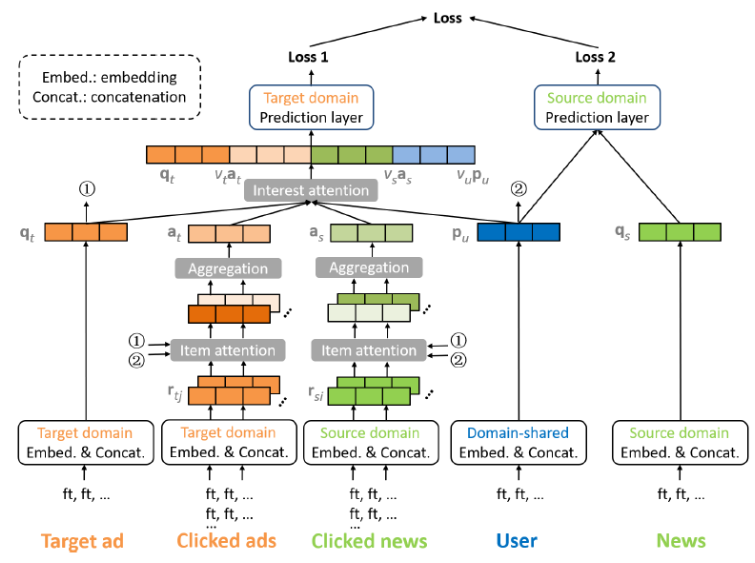

#### 跨域的长期兴趣

对于每个广告样本，我们将其特征拆分为用户特征、广告特征。我们获取所有广告特征，并拼接对应的 `embedding` 向量，从而获取目标域中的广告的 `representation` 向量$\vec{\mathbf{r}}_t\in\mathbb{R}^{D_t}$。同样地，我们可以在源域中获得新闻 `representation` 向量$\vec{\mathbf{r}}_s\in\mathbb{R}^{D_s}$。对于用户，我们通过相应的用户特征 `embedding` 向量进行拼接，从而获得长期兴趣 `representation` 向量$\vec{\mathbf{p}}_u\in\mathbb{R}^{D_u}$。

#### 源域目标的短期兴趣

最近点击的新闻的 `representation` 向量的集合为$\{\vec{\mathbf{r}}_{s,i}\}_i$。由于点击新闻的数量可能会有所不同，因此我们需要聚合这些新闻。具体而言，聚合的 `representation$\vec{\mathbf{a}}_s$为：

$$
\vec{\mathbf{a}}_s = \sum_i\alpha_i\vec{\mathbf{r}}_{s,i}
$$
剩下的问题是如何计算权重$\alpha_i$。基于注意力机制，$\alpha_i$的计算为：

$$
\hat{\alpha}_i =\vec{\mathbf{h}}_s^T\text{relu}(\mathbf{W}_s\vec{\mathbf{r}}_{s,i}), \alpha_i = \frac{\exp(\hat{\alpha_i})}{\sum_j\exp(\hat{\alpha}_j)}
$$
上式仅单独考虑每条被点击的新闻$\vec{\mathbf{r}}_{s,i}$，它没有捕获新闻和目标广告之间的关系。此外，上式也未考虑目标用户。

我们提出 `item-level` 注意力，$\alpha_i$的计算为：
$$
\hat{\alpha}_i = \vec{\mathbf{h}}_s^T\text{relu}(\mathbf{W}_s[\vec{\mathbf{r}}_{s,i}||\vec{\mathbf{q}}_{t}||\vec{\mathbf{p}}_{u}||(\mathbf{M}\vec{\mathbf{r}}_{s,i}\odot\vec{\mathbf{q}}_{t})])
$$
上式考虑了以下方面：源域中点击的新闻$\vec{\mathbf{r}}_{s,i}$。目标域中的目标广告$\vec{\mathbf{q}}_{t}$。目标用户$\vec{\mathbf{p}}_{u}$。点击新闻和目标广告之间的迁移交互 `transferred interaction`$\mathbf{M}\vec{\mathbf{r}}_{s,i}\odot\vec{\mathbf{q}}_{t}$。其中$\mathbf{M}$为迁移矩阵 `transfer matrix`。

#### 目标域的短期兴趣

给定用户，对于每个目标广告，该用户在目标域中也具有近期行为。用户最近点击的广告对用户不久将来点击的广告有很大的影响。令最近点击的广告的 `representation` 向量集合为$\{\vec{\mathbf{r}}_{t,j}\}_j$，我们计算聚合的 `representation`$\vec{\mathbf{a}}_t$为：
$$
\hat{\beta}_j=\vec{\mathbf{h}}_t^T\text{relu}(\mathbf{W}_t[\vec{\mathbf{r}}_{t,j}||\vec{\mathbf{q}}_{t}||\vec{\mathbf{p}}_{u}||(\vec{\mathbf{r}}_{t,j}\odot\vec{\mathbf{q}}_{t})])
$$
聚合的 `representation` 反映了用户在目标域中的短期兴趣。

### Interest-Level Attention

在获得三种类型的用户兴趣$\vec{\mathbf{p}}_{u}\in\mathbb{R}^{D_u}, \vec{\mathbf{a}}_{s}\in\mathbb{R}^{D_s},\vec{\mathbf{a}}_{t}\in\mathbb{R}^{D_t}$之后，我们将它们一起用于预估目标广告$\vec{\mathbf{q}}_{t}\in\mathbb{R}^{D_t}$的 `CTR`。尽管$\vec{\mathbf{p}}_{u}, \vec{\mathbf{a}}_{s},\vec{\mathbf{a}}_{t}$都代表了用户兴趣，但是它们反映了不同的方面`aspect`，并且具有不同的维度。因此，我们不能使用加权和的方式来融合它们。

一种可能的解决方案是将所有可用信息拼接起来作为一个长的输入向量：
$$
\vec{\mathbf{m}} = [\vec{\mathbf{q}}_{t}||\vec{\mathbf{p}}_{u}||\vec{\mathbf{a}}_{s}||\vec{\mathbf{a}}_{t}]
$$
但是，这样的解决方案找不到针对目标广告$\vec{\mathbf{q}}_{t}$最有用的用户兴趣信号。例如，如果短期兴趣$\vec{\mathbf{a}}_{s},\vec{\mathbf{a}}_{t}$和目标广告$\vec{\mathbf{q}}_{t}$不相关，则长期兴趣$\vec{\mathbf{p}}_{u}$应该更有信息价值。但是现在这里$\vec{\mathbf{m}}$中$\vec{\mathbf{p}}_{u}, \vec{\mathbf{a}}_{s},\vec{\mathbf{a}}_{t}$具有相等的重要性。

因此，我们没有使用$\vec{\mathbf{m}}$，而是使用如下的$\vec{\mathbf{m}}_t$：
$$
\vec{\mathbf{m}}_t =[\vec{\mathbf{q}}_{t}||v_u\vec{\mathbf{p}}_{u}|v_s|\vec{\mathbf{a}}_{s}||v_t\vec{\mathbf{a}}_{t}]
$$
其中$v_u,v_s,v_t$是动态权重，它们根据不同的用户兴趣信号的取值来调整其重要性。具体而言，这些权重的计算为：
$$
v_u = \exp\left(\vec{\mathbf{g}}_{u}^T\text{relu}(\mathbf{V}_u[\vec{\mathbf{q}}_{t}||\vec{\mathbf{p}}_{u}||\vec{\mathbf{a}}_{s}||\vec{\mathbf{a}}_{t}]) +b_u\right)\\
v_s = \exp\left(\vec{\mathbf{g}}_{s}^T\text{relu}(\mathbf{V}_s[\vec{\mathbf{q}}_{t}||\vec{\mathbf{p}}_{u}||\vec{\mathbf{a}}_{s}||\vec{\mathbf{a}}_{t}]) +b_s\right)\\
v_t = \exp\left(\vec{\mathbf{g}}_{t}^T\text{relu}(\mathbf{V}_t[\vec{\mathbf{q}}_{t}||\vec{\mathbf{p}}_{u}||\vec{\mathbf{a}}_{s}||\vec{\mathbf{a}}_{t}]) +b_t\right)
$$
可以看到，这些权重是根据所有可用信息来计算的，以便在给定其它类型的用户兴趣的条件下考虑特定类型用户兴趣对于目标广告的贡献

在目标域，我们让输入向量$\vec{\mathbf{m}}_t$通过具有 `ReLU` 激活函数的几个全连接层`FC layer`，从而利用高阶特征交互以及非线性变换。

为了便于长期兴趣$\vec{\mathbf{p}}_{u}$的学习，我们还为源域创建了一个输入向量，即$\vec{\mathbf{m}}_s =[\vec{\mathbf{q}}_{s}||\vec{\mathbf{p}}_{u}]$。其中$\vec{\mathbf{q}}_{s}\in\mathbb{R}^{D_s}$为目标新闻特征的 `embedding` 向量的拼接。同样地，我们让$\vec{\mathbf{m}}_s$经过几个 `FC` 层和一个 `sigmoid` 输出层。最后，我们获得了目标新闻的预估 `CTR`$\hat{y}_s$。类似地，我们得到源域中的损失函数$\mathcal{L}_s$。最终我们的损失函数为：$\mathcal{L} = \mathcal{L}_t + \gamma\mathcal{L}_s$

## `DSTN`

这一系列方法独立地考虑每个目标广告，但是忽略了可能影响目标广告 `CTR` 的其它广告。在本文中，我们从两个角度探讨辅助广告`auxiliary ad` 。

- 空域 `spatial domain`角度：我们考虑在同一个页面上出现的、目标广告上方展示的上下文广告 `contextual ad` 。背后的直觉是：共同展示的广告可能会争夺用户的注意力。
- 时域`temporal domain` 角度：我们考虑用户的历史点击和历史未点击广告。背后的直觉是：历史点击广告可以反映用户的偏好，历史未点击广告可能一定程度上表明用户的不喜欢。

这两个角度包含了三种类型的辅助数据`auxiliary data`（如下图所示）：同一个页面上出现的、目标广告上方展示的上下文广告`contextual ad`；用户的历史点击广告`clicked ad`；用户的历史未点击广告`unclicked ad`。

为有效利用这些辅助数据，我们必须解决以下问题：

- 由于每种类型辅助广告的数量可能会有所不同，因此模型必须能够适应所有可能的情况。

- 由于辅助广告不一定和目标广告相关，因此模型应该能够提取有用的信息并抑制辅助数据中的噪声。

- 每种类型辅助广告的影响程度可能会有所不同，并且模型应该能够区分它们的贡献。

- 模型应该能够融合所有可用的信息。

主要贡献：

- 论文探索了三种类型的辅助数据，从而提高目标广告的 `CTR` 预估。这些辅助数据包括：展示在同一个页面上的、目标广告上方的上下文广告，用户历史点击广告，用户历史未点击广告。
- 论文提出了有效融合这些辅助数据来预测目标广告 `CTR` 的 `DSTN` 模型。`DSTN` 模型能够学习辅助数据和目标广告之间的交互，并强调更重要的 `hidden information` 。

经过 `embedding` 过程之后，样本的 `representation`$\vec{\mathbf{x}}$是所有 `embedding` 向量的拼接，每个 `emebdding` 向量对应于一个 `field` 。在 `embedding` 之后：

- 每个目标广告`target ad` 获得了一个 `embedding` 向量$\vec{\mathbf{x}}_t\in\mathbb{R}^{D_t}$
- 上下文广告集合获得了$n_c$个`embedding` 向量$\{\vec{\mathbf{x}}_{c,i}\in\mathbb{R}^{D_c}\}_{i=1}^{n_c}$，其中$n_c$为上下文广告数量
- 历史点击广告集合获得了$n_l$个 `embedding` 向量$\{\vec{\mathbf{x}}_{l,j}\in\mathbb{R}^{D_l}\}_{j=1}^{n_l}$，其中$n_l$为历史点击广告数量。
- 历史未点击广告集合获得了$n_u$个`embedding`向量$\{\vec{\mathbf{x}}_{u,q}\in\mathbb{R}^{D_u}\}_{q=1}^{n_u}$，其中$n_u$为历史未点击广告数量。

注意：$\vec{\mathbf{x}}_t$包含了用户 `embedding`、广告 `embedding` 、上下文 `embedding` （如 `query` ）。$\vec{\mathbf{x}}_{l,j},\vec{\mathbf{x}}_{u,q}$仅包含广告 `embedding`、上下文 `embedding` ，而不包含用户 `embedding` 。$\vec{\mathbf{x}}_{c,i}$仅包含广告 `embedding`，而不包含用户 `embedding`、上下文`embedding` 。因为上下文广告和目标广告都是同一个用户、同一个上下文（如 `query` ）。

由于不同用户的辅助广告数量$n_c,n_l,n_u$可能千差万别。我们需要解决的第一个问题是：将每种类型的、可变长度的辅助实例`auxiliary instance` 处理未固定长度的向量。$n_c$个上下文广告的聚合 `representation`向量$\vec{\mathbf{x}}_c$、$n_l$个历史点击广告的聚合 `representation`向量$\vec{\mathbf{x}}_l$、$n_u$个历史未点击广告的聚合 `representation` 向量$\vec{\mathbf{x}}_u$表示为：
$$
\vec{\mathbf{x}}_c = \sum_{i=1}^{n_c}\vec{\mathbf{x}}_{c,i},\vec{\mathbf{x}}_l = \sum_{j=1}^{n_l}\vec{\mathbf{x}}_{l,j}, \vec{\mathbf{x}}_u = \sum_{q=1}^{n_u}\vec{\mathbf{x}}_{u,q}
$$
如果某种类型的辅助广告完全缺失（例如，根本没有上下文广告）则我们将全零向量作为其聚合`representation` 向量。将目标广告的 `representation`$\vec{\mathbf{x}}_t$、不同类型辅助广告的 `representation`$\vec{\mathbf{x}}_c,\vec{\mathbf{x}}_l,\vec{\mathbf{x}}_u$拼接为$\vec{\mathbf{m}} = [\vec{\mathbf{x}}_t||\vec{\mathbf{x}}_c||\vec{\mathbf{x}}_l||\vec{\mathbf{x}}_u]$，因此，`DSTN-Pooling` 模型最终的设计为：

- 首先拼接各个`representation` 从而获得临时 `representaion`$\vec{\mathbf{m}}$。
- 然后将$\vec{\mathbf{m}}$通过若干个带 `ReLU` 激活函数的全连接层`FC layer`，从而利用高阶特征交互以及非线性变换。

在 `DSTN-Pooling` 模型中，当给定用户在给定位置展示不同的目标广告时只有$\vec{\mathbf{x}}_t$发生变化，而所有的辅助`representation` 都保持不变。这意味着辅助 `representation`$\vec{\mathbf{x}}_c,\vec{\mathbf{x}}_l,\vec{\mathbf{x}}_u$仅用作静态基础信息。而且，由于$\vec{\mathbf{x}}_c,\vec{\mathbf{x}}_l,\vec{\mathbf{x}}_u$是通过 `sum` 池化生成的，因此有用的信息很容易被淹没在噪声中。例如，如果目标广告是关于咖啡的，但是大多数历史点击广告是关于衣服的、少部分历史点击广告是关于咖啡的。那么，虽然关于衣服的这些历史点击广告对于目标广告的贡献很小，但是 `sum` 的结果显然是由这些关于衣服的历史点击广告所主导

`DSTN-Self Attention` 模型：鉴于 `DSTN-Pooling` 的上述限制，我们考虑采用自注意力机制，即 `DSTN-Self Attention` 模型。以上下文辅助广告为例，其聚合`representation` 向量建模为：
$$
\vec{\mathbf{x}}_c = \sum_{i=1}^{n_c}\alpha_{c,i}\vec{\mathbf{x}}_{c,i}
$$
其中$\alpha_{c,i}$为第$i$个上下文广告 `representation` 的注意力系数，它计算为：
$$
\alpha_{c,i} = \frac{\exp(\beta_{c,i})}{\sum_{j=1}^{n_c}\exp(\beta_{c,j})},\beta_{c,i} = f(\vec{\mathbf{x}}_{c,i})
$$
其中$f(\cdot)$为一个函数，$f(\cdot)$的一个可能的实现方式是采用多层感知机`MLP` 。

自注意力机制的优点在于：可以根据 `self-attention` 来加权不同的辅助广告$\vec{\mathbf{x}}_{c,i}$，从而可以强调有用的信息并抑制噪声。但是，它仍然具有以下局限性：

- 权重$\beta_{c,i}$仅仅基于上下文辅助广告$\vec{\mathbf{x}}_{c,i}$来计算，它并未捕获这个上下文辅助广告和目标广告$\vec{\mathbf{x}}_{t}$之间的关系。
- 归一化的注意力系数$\alpha_{c,i}$通过$\vec{\mathbf{x}}_{c,i}$之间的相对重要性来计算，并且$\sum_{i=1}^{n_c}\alpha_{c,i} = 1$。结果，即使所有的上下文辅助广告和目标广告无关，由于归一化的存在，最终的注意力系数$\alpha_{c,i}$仍然很大。
- 每种类型辅助广告的绝对数量也很重要，但是归一化并未捕获这种效果。

`DSTN-Interactive Attention`：鉴于 `DSTN-Self Attention` 的上述限制，我们考虑引入每种类型辅助广告和目标广告之间的显式交互，即 `DSTN-Interactive Attention` 模型，以上下文辅助广告为例，其聚合`representation` 向量建模为：
$$
\vec{\mathbf{x}}_c = \sum_{i=1}^{n_c}\alpha_{c,i}\vec{\mathbf{x}}_{c,i}\\
\alpha_{c,i} = \exp(\vec{\mathbf{h}}^T\text{relu}(\mathbf{W}_{t,c}[\vec{\mathbf{x}}_t||\vec{\mathbf{x}}_{c,i}] + \vec{\mathbf{b}}_{t,c,1}) + b_{t,c,2})
$$
和 `DSTN-Self Attention` 相比，这里的$\alpha_{c,i}$现在是目标广告$\vec{\mathbf{x}}_{t}$和上下文辅助广告$\vec{\mathbf{x}}_{c,i}$的函数。

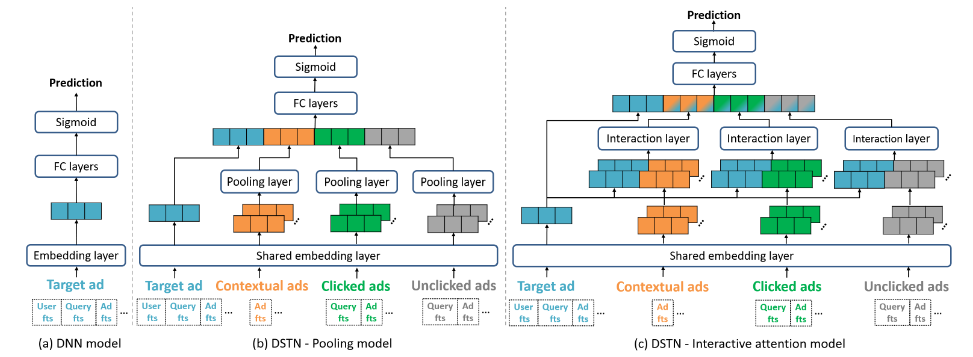

## `BST`

在 `DIN` 中，模型使用注意力机制来捕获候选 `item` 和用户历史点击`item` 之间的相似性，也没有考虑用户行为序列背后的序列性质`sequential nature` 。用户行为序列中 `item` 之间的 `'dependency'` 也可以通过 `Transformer` 来提取。因此，我们在淘宝上提出了用于电商推荐的 `BST`。

`BST` 遵循流行的 `Embedding&MLP` 范式，其中历史点击`item` 和相关的特征首先被嵌入到低维向量中，然后被馈送到 `MLP` 。具体而言，`BST` 将用户行为序列（包括`target item` 和其它特征`Other Features`）作为输入。其中`Other Features` 包括：用户画像特征、上下文特征、`item` 特征、以及交叉特征。

- 首先，这些输入特征被嵌入为低维向量。为了更好地捕获行为序列中 `item` 之间的关系，可以使用 `transformer layer` 来学习序列中每个 `item` 的更深层`representation` 。
- 然后，通过将`Other Features`的 `embedding` 和 `transformer layer` 的输出进行拼接，并使用三层 `MLP` 来学习 `hidden features` 的交互作用。
- 最后，使用 `sigmoid` 函数生成最终输出。

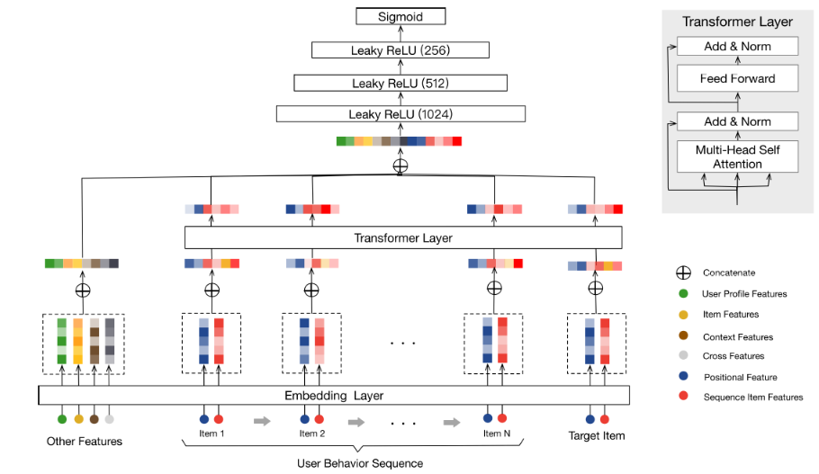

用户行为序列中每个 `item` （包括目标`item`）的 `embedding` 。我们使用两种类型的特征来表示一个 `item`：`Sequence Item Features`（红色）、`Positional Features`（深蓝色）。

- `Sequence Item Features` 包括 `item id` 和 `category id`。
- `Positional Features` 对应于下面的 `positional embedding` 。

注意，`item`$v_i$的 `position value` 计算为：$\text{pos}(v_i) = t(v_t) - t(v_i)$。其中：$v_t$为 `target item`，$v_i$为用户行为序列中第 个 `item` 。$t(v_t)$表示推荐时间 `recommending time`，而$t(v_i)$表示用户点击 `item` 的时间戳。

我们将`Other Features` 的 `embedding` 和应用于 `target item` 的 `Transformer layer` 的输出进行拼接，然后使用三个全连接层来进一步学习这些 `dense features` 之间的交互

## `SIM`

如何设计一种可行的解决方案来对长的用户行为序列数据`long sequential user behavior data` 进行建模。 `SIM` 采用了 `DIN` 的思想，并且仅捕获与特定候选 `item` 相关的用户兴趣。在 `SIM` 中，用户兴趣是通过两个级联 `cascaded`的搜索单元`search unit` 来提取的：

- 通用搜索单元 `General Search Unit: GSU`：充当原始的、任意长的行为序列数据的通用搜索，并具有来自候选 `item` 的 `query` 信息，最终得到和候选`item` 相关的用户行为序列子集`Sub user Behavior Sequence: SBS` 。
- 精准搜索单元`Exact Search Unit: ESU`：对候选 `item` 和 `SBS` 之间的精确关系进行建模。在这里，我们可以轻松应用 `DIN` 或 `DIEN` 提出的类似方法。

论文主要贡献：

- 提出了一种新的范式 `SIM`，用于长的用户行为序列数据进行建模。级联的两阶段搜索机制的设计使得 `SIM` 具有更好的能力，可以在可扩展性`scalability` 和准确性`accuracy` 方面为长期的`life-long` 用户行为序列数据建模。
- 将长的用户行为序列数据建模的最大长度提高到 `54000`，比已发布的 `SOTA` 行业解决方案 `MIMN` 大 `54` 倍。

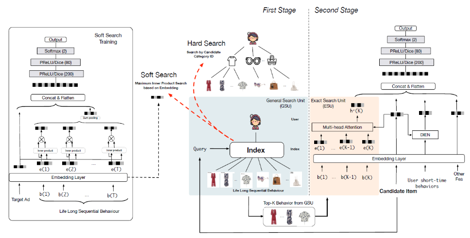

### General Search Unit

给定用户行为的列表$\mathbf{B} = [\mathbf{b}_1;\cdots;\mathbf{b}_T]$，其中$\mathbf{b}_i$为第$i$个用户行为，$T$为用户行为列表的长度。通用搜索单元计算每个行为$\mathbf{b}_i$相对于候选 `item` 的相关性得分 `relevant score`$r_i$，然后选择得分 `top-K` 的相关`relevant` 行为作为行为子序列 `sub behaviour sequence` 。硬搜索和软搜索的区别在于相关的分 的计算：
$$
r_i = I(c_i = c_a), \text{hard-search}\\
r_i = (\mathbf{W}_b\vec{\mathbf{e}}_i)\cdot(\mathbf{W}_a\vec{\mathbf{e}}_a),\text{soft-search}
$$
其中：$I(\cdot)$为示性函数，$c_i$表示第$i$个行为$\mathbf{b}_i$的类目，$c_a$为 `target item` 的类目。$\vec{\mathbf{e}}_i$为第$i$个行为$\mathbf{b}_i$的`embedding` 向量，$\vec{\mathbf{e}}_a$为 `target item` 的 `embedding` 向量。

对于软搜索，`GSU` 和 `ESU` 共享相同的 `embedding` 参数。

硬搜索 `hard-search`：硬搜索模型是非参数`non-parametric` 的。只有和候选`item` 相同类目`category` 的行为被挑选出来，然后得到一个子行为序列并发送给 `ESU` 。硬搜索非常简单，稍后在实验中我们证明它非常适合在线 `serving` 。

软搜索`soft-search`：在软搜索模型中，首先将$\mathbf{b}_i$编码为`one-hot` 向量，然后嵌入到低维向量$\vec{\mathbf{e}}_i$中。

需要注意的是：长期`long-term`数据和短期`short-term`数据的分布是不同的。因此，在软搜索模型中直接使用从短期用户兴趣建模中学到的参数可能会误导长期用户兴趣建模。所以在本文中，软搜索模型的参数是在基于长期行为数据的辅助 `CTR` 预估任务下训练的，如上图左侧的软搜索训练`soft search training` 所示。用户整体行为序列的`representation`$\vec{\mathbf{u}}_r$可以通过将$r_i$和$\vec{\mathbf{e}}_i$相乘得到：
$$
\vec{\mathbf{u}}_r = \sum_{i=1}^Tr_i\vec{\mathbf{e}}_i
$$
行为 `representation`$\vec{\mathbf{u}}_r$和 `target Ad` 向量$\vec{\mathbf{e}}_a$然后拼接起来，作为后续多层感知机 `Multi-Layer Perception: MLP` 的输入，从而建模辅助任务。

### Exact Search Unit

我们从长期用户行为中选择和 `target item` 最相关的 `top-K` 子用户行为序列$\mathbf{B}^{*} = [\mathbf{b}_1^*;\cdots;\mathbf{b}_K^*]$。为了进一步从相关行为中建模用户兴趣，我们引入了精确搜索单元`ESU` 。`target item` 和选出来的 `K` 个用户行为的时间间隔$\mathbf{D} = [\mathbf{\Delta}_1;\cdots;\mathbf{\Delta}_K]$用于提供时间距离`temporal distance` 信息。

$\mathbf{B}^*$和$\mathbf{D}$被编码为 `embedding` 矩阵$\mathbf{E}^* = [\vec{\mathbf{e}}_1^*;\cdots;\vec{\mathbf{e}}_K^*]$和 `embedding` 矩阵$\mathbf{E}^t= [\vec{\mathbf{e}}_1^t;\cdots;\vec{\mathbf{e}}_K^t]$。 其中，$\vec{\mathbf{e}}_i^*$和$\vec{\mathbf{e}}_i^t$的拼接作为第$i$个行为的最终 `representation` ，记作$\vec{\mathbf{z}}_j = \text{concat}(\vec{\mathbf{e}}_j^*,\vec{\mathbf{e}}_j^t)$。我们利用 `multi-head attention` 来捕获用户的多样化兴趣：
$$
\text{att}_i(j) = \text{Softmax}(\mathbf{W}_{i,z}\vec{\mathbf{z}}_j)\cdot(\mathbf{W}_{i,a}\vec{\mathbf{e}}_a)\\
\vec{\mathbf{z}}^i = \sum_{j = 1}^K \text{att}_i(j)\vec{\mathbf{z}}_j
$$
最终的用户长期`diverse` 兴趣表示为：$\vec{\mathbf{u}}_l = \text{concat}(\vec{\mathbf{z}}^1;\cdots;\vec{\mathbf{z}}^H)$，其中$H$为 `head` 数量。然后$\vec{\mathbf{u}}_l$被馈入到 `MLP` 中用于点击率预估。最终模型同时使用了长期用户行为和短期用户行为，其中：

- 长期用户行为使用 `ESU` 来抽取长期用户兴趣`representation`$\vec{\mathbf{u}}_l$。
- 短期用户行为使用 `DIEN` 来抽取短期用户兴趣`representation`$\vec{\mathbf{u}}_s$。

长期用户兴趣`representation`$\vec{\mathbf{u}}_l$、短期用户兴趣`representation`$\vec{\mathbf{u}}_s$、以及`Other feature representation` 一起拼接作为后续 `MLP` 的输入。最后，我们在交叉熵损失函数下同时训练 `GSU` 和 `ESU` ：
$$
\mathcal{L} = \alpha\mathcal{L}_{G} + \beta\mathcal{L}_{E}
$$
其中：如果 `GSU` 为软搜索模型，则$\alpha=\beta=1$。如果 `GSU` 使用硬搜索模型，那么$\alpha=0$。$\mathcal{L}_E$为 `ESU` 单元的损失，这也是`SIM` 模型主任务的目标损失。$\mathcal{L}_G$为 `GSU` 单元的损失。

- 如果 `GSU` 为硬搜索，则由于硬搜索没有参数，因此不考虑其损失。
- 如果 `GSU` 为软搜索，则它是 `SIM` 模型辅助任务的目标损失。辅助任务也是一个 `CTR` 预估任务，只是它采用了更简单的架构（没有 `multi-head`、没有 `DIEN` ）、更少的特征（没有短期用户行为、没有 `Other feature` ）。

对于软搜索模型和硬搜索模型，我们对从阿里巴巴在线展示广告系统收集的工业数据进行了广泛的离线实验。我们观察到软搜索模型生成的 `top-K` 行为数据与硬搜索模型的结果极为相似。换句话讲，软搜索的大部分 `top-K` 行为通常属于 `target item` 相同类目`category` 的。

## `MV-DNN`

`CF` 在提供高质量推荐之前需要大量的网站交互 `interaction` 的历史记录。这个问题被称作用户冷启动问题`user cold start problem` 。在一个新建的在线服务中，由于用户与网站的历史交互很少或者没有历史交互，因此问题变得更加严重。因此，传统的 `CF` 方法通常无法为新用户提供高质量的推荐。

另一方面，`content-based` 推荐方法从每个用户或/和 `item` 中提取特征，并使用这些特征进行推荐。例如，如果两个新闻`News` 和 共享相同的主题`topic`，并且用户喜欢新闻 ，则系统可以向用户推荐新闻 。

在实践中，研究表明：`content-based` 方法可以很好地处理新 `item` 的冷启动问题。然而，当应用于对新用户的推荐时，其有效性是有问题的。因为 `user-level` 特征通常更难获取，并且`user-level` 特征通常是是从用户在线个人画像`user online profiles`中的有限信息生成的，而这些信息无法准确地捕获实际的用户兴趣。

论文提出从用户的浏览和搜索历史中提取丰富的特征来建模用户的兴趣。潜在的假设是：用户的历史在线活动`historical online activities` 反映了用户的背景 `background` 和偏好`preference` ，因此提供了关于用户可能感兴趣的 `item` 和主题 `topic` 的精确洞察 `precise insight`。

作者认为 `MV-DNN` 是多视图学习配置`setup` 中一种通用的深度学习方法。具体而言，在包含新闻`News` 、`Apps`、`Movie/TV` 日志的数据集中，作者不是为每个领域建立独立的模型来简单地将用户特征映射到领域内的 `item` 特征，而是建立新的多视图模型来发现潜在空间中用户特征的单个映射，从而与来自所有领域的 `item` 特征共同进行了优化。`MV-DNN` 使得我们能够学到更好的用户 `representation` ，它利用更多的跨域数据，并利用来自所有领域的用户偏好数据从而解决数据稀疏性问题。

论文在实验中表明：这种多视图扩展同时提高了所有领域的推荐质量。此外，值得一提的是，深度学习模型中的非线性映射使得我们能够在潜在空间中找到用户的紧凑表示`compact representation`，这使得存储学到的用户映射 `user mapping` 以及在不同任务之间共享信息变得更加容易。

在这项工作中我们提出了 `DSSM` 的扩展，其中包含有两个以上的数据视图，我们称之为多视图 `DNN` 模型 `Multi-view DNN: MV-DNN` 。在这种配置 `setting`下我们有 个视图，其中一个中心视图`pivot view` 称作 ，其它 个辅助视图 `auxiliary views` 记作 。

- 每个 都有它自己的领域输入 `domain input` ，其中 为第 个视图的样本数、 为第 个视图的输入维度。
- 每个视图 都有自己的非线性映射层，从而将 映射到共享的语义空间 `shared semantic space` 。

## `CAN`

然而，推荐系统中的`target item` 和 “用户历史点击” 等特征是高度相关的，即存在对最终预测目标（如点击率）的特征协作效应 `feature collective effect` ，称作 `feature co-action` 。

## `AutoInt`

`AutoInt`提出了一种基于多头自注意力机制的方法。具体而言：

- `categorical` 特征和 `numerical` 特征首先被嵌入到低维空间中，这降低了输入特征的维度，同时允许不同类型的特征通过向量运算（如求和和内积）来交互。
- 然后，`AutoInt` 提出了一个新的交互层 `interacting layer` ，以促进不同特征之间的交互。在每个交互层内，允许每个特征与所有其他特征进行交互，并能够通过多头注意力机制自动识别相关特征以形成有意义的高阶特征。此外，多头机制将一个特征投射到多个子空间中，因此它可以在不同的子空间中捕获不同的特征交互。

论文贡献：

- 论文提议研究显式学习高阶特征交互的问题，同时为该问题找到具有良好解释能力的模型。
- 论文提出了一种基于自注意力神经网络的新方法，它可以自动学习高阶特征交互，并有效地处理大规模高维稀疏数据

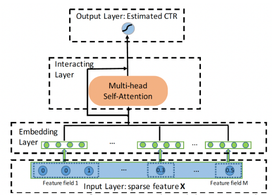

`Input Layer`：我们首先将用户画像和 `item` 属性表示为一个稀疏向量，它是所有 `field` 的拼接：
$$
\vec{\mathbf{x}} = [\vec{\mathbf{x}}_1||\cdots||\vec{\mathbf{x}}_M]
$$
其中：$M$为 `feature fields` 的总数；$||$为向量拼接。如果第$i$个 `field` 是 `categorical` 特征，则$\vec{\mathbf{x}}_i$为 `one-hot` 向量。如果第$i$个 `field` 是 `numerical` 特征，则$\vec{\mathbf{x}}_i$为标量

`Embedding Layer`：我们用一个低维向量来表示每个 `categorical` 特征，即：
$$
\vec{\mathbf{e}}_i = \mathbf{V}_i\vec{\mathbf{x}}_i
$$
很多时候，`categorical` 特征可以是多值的，即，$\vec{\mathbf{x}}_i$是一个 `multi-hot` 向量。因此，我们将 `multi-valued feature field` 表示为相应 `feature embedding vectors`的平均值：
$$
\vec{\mathbf{e}}_i = \frac{1}{q}\mathbf{V}_i\vec{\mathbf{x}}_i
$$
其中：$\vec{\mathbf{x}}_i$是它的 `multi-hot` 向量。为了允许 `categorical` 特征和 `numerical` 特征之间的交互，我们也在同一个低维特征空间中表示 `numerical` 特征。我们将 `numerical` 特征表示为：
$$
\vec{\mathbf{e}}_m = \vec{\mathbf{v}}_mx_m
$$
其中：$\vec{\mathbf{v}}_m$为 `field`$m$的 `embedding` 向量，$x_m$为一个标量。最终，`embedding layer` 的输出将是多个嵌入向量的拼接。

`Interacting Layer`：我们采用注意力机制来确定哪些特征组合是有意义的。以特征$m$为例，我们首先定义在特定的注意头$h$下，特征$m$和特征$k$的相关性如下：
$$
\alpha_{m,k}^h = \frac{\exp(\phi^h(\vec{\mathbf{e}}_m,\vec{\mathbf{e}}_k))}{\sum_{l=1}^M\exp(\phi^h(\vec{\mathbf{e}}_m, \vec{\mathbf{e}}_l))}
$$

其中：$\phi^h(\cdot,\cdot)$为注意力函数，可以通过神经网络或者简单的内积来定义注意力函数，这里我们使用内积的方式。然后，我们通过$\alpha^h_{m,k}$所指导的所有相关特征来更新特征$m$在子空间$h$中的 `representation`：
$$
\hat{\vec{\mathbf{e}}}_m^h = \sum_{i = 1}^M\alpha_{m,i}^h\mathbf{W}_V^h\vec{\mathbf{e}}_i
$$
我们通过使用多个头来创建不同的子空间，分别学习不同的特征交互。我们收集在所有子空间学到的组合特征如下：
$$
\hat{\vec{\mathbf{e}}}_m = \hat{\vec{\mathbf{e}}}_m^1||\cdots||\vec{\mathbf{e}}_m^H
$$
为了保留先前学到的组合特征，包括原始特征（即，一阶特征），我们在网络中加入了标准的残差连接：
$$
\vec{\mathbf{e}}^{res}_m = \text{Relu}(\hat{\vec{\mathbf{x}}}_m  + \mathbf{W}_{res}\vec{\mathbf{e}}_m)
$$
通过这样的交互层，每个特征的 `representation`$\vec{\mathbf{e}}_m$将被更新为一个新的、高阶的 `representation`$\vec{\mathbf{e}}_m^{res}$。

`Output Layer`：交互层的输出是一组特征向量$\{\vec{\mathbf{e}}_m^{res}\}_{m=1}^M$。对于最终的 `CTR` 预估，我们简单地将它们全部拼接起来，然后应用非线性投影：

`AutoInt` 是以 `hierarchical` 的方式学习特征交互，即从低阶交互到高阶交互，所有的低阶特征交互都由残差连接来承载。

网络深度的影响：我们考虑不同交互层的数量的影响。注意，当交互层的数量为零时，意味着不考虑组合特征。

- 如果使用一个交互层，即考虑到特征交互，在两个数据集上的性能都会大幅提高，这表明组合特征对于预测来说是非常有参考价值的。
- 随着交互层数量的进一步增加，即高阶组合特征被考虑在内，模型的性能进一步提高。
- 当层数达到三层时，性能变得稳定，表明增加更高阶特征对预测没有参考价值。

## `Fi-GNN`

许多基于深度学习的模型被提出来从而学习高阶特征交互，这些模型遵循一个通用的范式：简单地拼接 `field embedding` 向量，并将其馈入 `DNN` 或其他专门设计的模型，从而学习交互。例如 `FNN, NFM, Wide&Deep, DeepFM` 等。然而，这些基于 `DNN` 的模型都是以 `bit-wise` 的、隐式的方式来学习高阶特征交互，这缺乏良好的模型解释。

## `FwFM`

假设有$m$个 `unique` 特征$\{f_1,\cdots,f_m\}$，以及$n$个不同的`fields`$\{F_1,\cdots,F_n\}$。每个特征$f_i$仅属于一个 `field`，记做$F(i)$。

给定数据集$\mathcal{S} = \{y_s,\vec{\mathbf{x}}_s\}_{s=1}^N$，其中：$y_s\in\{1, -1\}$为 `label` 表示是否点击；$\vec{\mathbf{x}}_s\in\{0,1\}^m$为二元特征向量，$x_s^i = 1$表示特征$f_i$是 `active` 的。

> 例如，假设有两个 `field` ：性别、学历，那么 n=2 。假设有六个特征：男性女性博士硕士本科本科以下$f_1$=男性,$f_2$=女性,$f_3$=博士,$f_4$=硕士,$f_5$=本科,$f_6$=本科以下 ，那么$f_1,f_2$属于性别这个 `field`，$f_3\sim f_6$属于学历这个 `field`，它们的取值都是 `0` 或 `1` 。

`LR` 模型为：
$$
\min_{\vec{\mathbf{w}}}\lambda||\vec{\mathbf{w}}||_2^2 + \sum_{s=1}^N\log\left(1 + \exp(-y_s\Phi(\vec{\mathbf{w}},\vec{\mathbf{x}}_s)\right)
$$
其中：$\Phi(\vec{\mathbf{w}},\vec{\mathbf{x}}) = w_0 + \sum_{i=1}^mx_iw_i$ 。

`Poly2`：然而，线性模型对于诸如 `CTR` 预估这样的任务来说是不够的，在这些任务中，特征交互是至关重要的。已有研究表明，`Degree-2 Polynomial: Poly2` 模型可以有效地捕获特征交互。`Poly2` 模型考虑将$\Phi$替换为：
$$
\Phi_{p}(\vec{\mathbf{x}}, \vec{\mathbf{x}}) = w_0 + \sum_{i=1}^mx_iw_i = \sum_{i=1}^m\sum_{j=i + 1}^m x_ix_jw_{h(i,j)}
$$
`FM`：`Factorization Machine: FM` 为每个特征学习一个 `embedding` 向量$\vec{\mathbf{v}}_i\in\mathbb{R}^K$，其中$K$为一个小的整数。`FM` 将两个特征$i$和$j$之间的交互建模为它们相应的 `embedding` 向量$\vec{\mathbf{v}}_i$和$\vec{\mathbf{v}}_j$之间的内积：
$$
\Phi_{F}\left((\vec{\mathbf{w}},\mathbf{v}), \vec{\mathbf{x}}\right) = w_0 + \sum_{i = 1}^mx_iw_i +\sum_{i=1}^m\sum_{j=i + 1}^mx_ix_j<\vec{\mathbf{v}}_i,\vec{\mathbf{v}}_j>
$$
`FFM`：然而，`FM` 忽略了这样一个事实：当一个特征与其他不同 `field` 的特征交互时，其行为可能是不同的。`Field-aware Factorization Machines: FFM` 通过为每个特征（如$i$）学习$n-1$个 `embedding` 向量来显式地建模这种差异，并且只使用相应的 `embedding` 向量$\vec{\mathbf{v}}_{i,F(j)}$与来自 `field`$F(j)$的另一个特征$j$交互：
$$
\Phi_{F}\left((\vec{\mathbf{w}},\mathbf{v}), \vec{\mathbf{x}}\right) = w_0 + \sum_{i = 1}^mx_iw_i +\sum_{i=1}^m\sum_{j=i + 1}^mx_ix_j<\vec{\mathbf{v}}_{i,F(j)},\vec{\mathbf{v}}_{j,F(i)}>
$$
`FwFM`：我们提出对不同 `field pair` 的不同交互强度进行显式的建模，其中 `feature pair`$(i,j)$的交互被建模为：
$$
x_ix_j<\vec{\mathbf{v}}_i,\vec{\mathbf{v}}_j>r_{F(i),F(j)}
$$
其中：$r_{F(i),F(j)}\in\mathbb{R}$是用于建模 `field pair`$(F(i),F(j))$之间交互强度的权重。

线性项：我们认为，`embedding` 向量$\vec{\mathbf{v}}_i$捕获到关于特征$i$的更多信息，因此我们提出使用$x_i\vec{\mathbf{v}}_i$来在线性项中代表每个特征。我们为每个特征学习一个线性权重$\vec{\mathbf{w}}_i$，因此 `FwFM` 的线性项变为：
$$
\sum_{i=1}^mx_i<\vec{\mathbf{v}}_i,\vec{\mathbf{w}}_i>
$$
这需要$mK$个参数。

## `FM2`

提出了一个新的模型，将 `field pair` 的交互表达为一个矩阵。与 `FM` 和 `FwFM` 类似，我们为每个特征学习一个 `embedding` 向量。 我们定义一个矩阵$\mathbf{M}_{F(i),F(j)}$来表示 `field`$F(i)$和 `field`$F(j)$之间的交互：
$$
\Phi_{FmFM}\left((\vec{\mathbf{w}},\mathbf{v}), \vec{\mathbf{x}}\right) = w_0 + \sum_{i = 1}^mx_iw_i +\sum_{i=1}^m\sum_{j=i + 1}^mx_ix_j<\mathbf{M}_{F(i),F(j)}\vec{\mathbf{v}}_{i,F(j)},\vec{\mathbf{v}}_{j,F(i)}>
$$
下图展示了 `feature pair`$(i,j)$和$(i,k)$的交互，其中$i,j,k$来自于三个不同的 `field` 。计算可以分解为三步：

- `Embedding Lookup`：从 `embedding table` 中查找 `feature embedding` 向量$\vec{\mathbf{v}}_i,\vec{\mathbf{v}}_j,\vec{\mathbf{v}}_k$。
- 转换：将$\mathbf{M}_{F(i),F(j)}$和$\mathbf{M}_{F(i),F(k)}$分别与$\vec{\mathbf{v}}_i$相乘，得到中间向量$\vec{\mathbf{v}}_{i,F(j)} = \mathbf{M}_{F(i),F(j)}\vec{\mathbf{v}}_i$用于 `field`$F(j)$、$\vec{\mathbf{v}}_{i,F(k)}$用于 `field`$F(k)$。
- 点乘：最终的交互项将是$\vec{\mathbf{v}}_{i,F(j)}\cdot\vec{\mathbf{v}}_j$以及$\vec{\mathbf{v}}_{i,F(k)}\vec{\mathbf{v}}_k$。

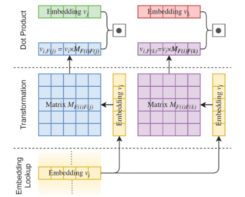

## `FiBiNet`

论文主要贡献：

- 受 `SENET` 在计算机视觉领域的成功启发，论文使用 `SENET` 机制来动态地学习特征的权重。
- 论文引入了三种类型的双线性交互层 `Bilinear-Interaction layer` ，以一种精细的方式学习特征交互。而之前的工作用 `Hadamard` 积或内积来计算特征交互。
- 为了进一步提高性能，论文将经典的深度神经网络组件与浅层模型相结合，构成一个深度模型。

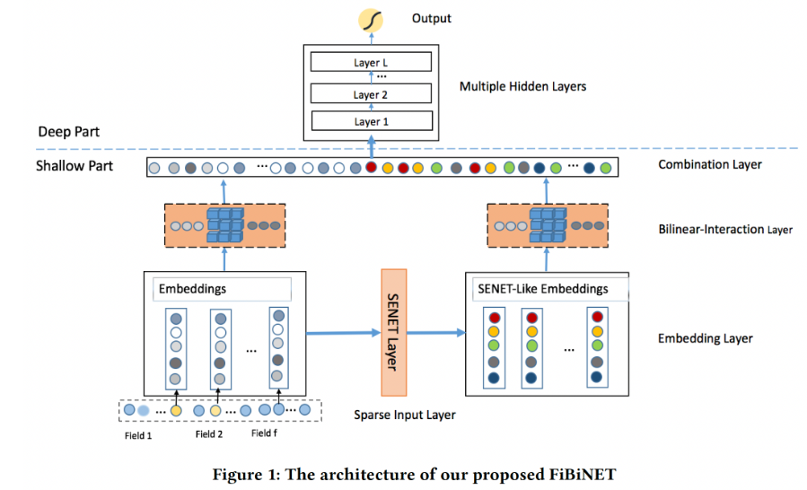

`embedding layer` 的输出是由 `field embedding` 向量所拼接而来：$\vec{\mathbf{e}} = \vec{\mathbf{e}}_1||\cdots||\vec{\mathbf{e}}_f\in\mathbb{R}^{fk}$，其中$f$ 为 `field` 数量，$k$为 `field embedding` 维度。

`SENET Layer`：以 `feature embedding` 作为输入，`SENET` 针对 `field embedding` 产生权重向量$\vec{\mathbf{a}}\in\mathbb{R}^f$，然后用向量$\vec{\mathbf{a}}$来重新缩放原始的 `embedding`$\vec{\mathbf{e}}$从而得到一个新的 `embedding`：
$$
\vec{\mathbf{v}} = \vec{\mathbf{v}}_1||\cdots||\vec{\mathbf{v}}_f, \vec{\mathbf{v}}_i = a_i\times \vec{\mathbf{e}}_i
$$
`SENET` 由三个步骤组成：`squeeze step` 、`excitation step` 、`re-weight step` 。

- `squeeze`：这一步是用来计算每个 `field embedding` 的 `summary statistics` 的。具体而言，我们使用一些池化方法（如 `max/mean`）从而将原始的 `embedding`$\vec{\mathbf{e}}$挤压为一个统计向量$\vec{\mathbf{z}}=(z_1,\cdots,z_f)$，其中$z_i$为一个标量，表示第$i$个特征表示的全局信息。

- `excitation`：这一步可以用来基于统计向量$\vec{\mathbf{z}}$来学习每个 `field embedding` 的权重。我们使用两个全连接层来学习权重：

  - 第一个全连接层是一个降维层，参数为$\mathbf{W}_1$，降维率$r$是一个超参数，非线性函数为$\sigma_1$。
  - 第一个全连接层是一个升维层，参数为$\mathbf{W}_2$，非线性函数为$\sigma_2$。

  $$
  \vec{\mathbf{a}} = \sigma_2(\mathbf{W}_2(\sigma_1(\mathbf{W}_1\vec{\mathbf{z}})))
  $$

  其中：$\mathbf{W}_1\in\mathbb{R}^{f\times \frac{f}{r}}, \mathbf{W}_2\in\mathbb{R}^{\frac{f}{r}\times f}$。

- `re-weight`：`SENET` 的最后一步是 `reweight`

`Bilinear-Interaction Layer`：`Interaction layer` 用于计算二阶的特征交互。特征交互的经典方法是内积和 `Hadamard` 积，其形式分别为：$\{(\vec{\mathbf{v}}_i\cdot\vec{\mathbf{v}}_j)x_ix_j\}_{(i,j)\in\mathcal{R}_x}$以及$\{(\vec{\mathbf{v}}_i\odot\vec{\mathbf{v}}_j)x_ix_j\}_{(i,j)\in\mathcal{R}_x}$，其中$\mathcal{R}_x =\{(i,j)\}_{i,j \in\{1,\cdots,f\},j > i}$。

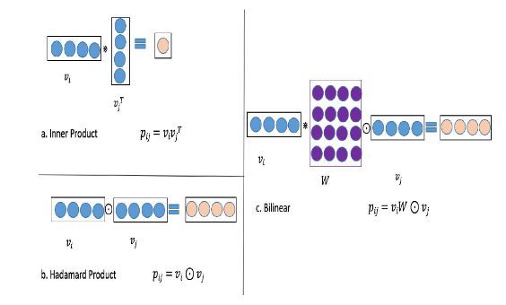

我们在`Interaction layer` 提出了三种类型的双线性函数，并称这一层为 `Bilinear-Interaction layer` 。以第$i$个 `field embedding`$\vec{\mathbf{v}}_i$和第$j$个`field embedding`$\vec{\mathbf{v}}_j$为例，特征交互的结果$p_{i,j}$可以计算为：

`Field-All Type`：$p_{i,j} = (\mathbf{W}\vec{\mathbf{v}}_i)\odot\vec{\mathbf{v}}_j\in\mathbb{R}^k$。其中：$\mathbf{W}$为权重矩阵，它在所有的 `field interaction pair` 之间共享。

`Field-Each Type`：$p_{i,j} = (\mathbf{W}_i\vec{\mathbf{v}}_i)\odot\vec{\mathbf{v}}_j\in\mathbb{R}^k$其中：$\mathbf{W}_i$为权重矩阵，每个 `field` 都有一个。

`Field-Interactoin Type`：$p_{i,j} = (\mathbf{W}_{i,j}\vec{\mathbf{v}}_i)\odot\vec{\mathbf{v}}_j\in\mathbb{R}^k$其中：$\mathbf{W}_{i,j}$为权重矩阵，每个 `field interaction pair` 都有一个。

`Bilinear-Interaction layer` 可以从原始 `embeddign`$\vec{\mathbf{e}}$输出一个 `interaction vector`$\vec{\mathbf{p}} = \vec{\mathbf{p}}_1||\cdots||\vec{\mathbf{p}}_f$，从`SENET-like embedding`$\vec{\mathbf{v}}$中输出一个`interaction vector`$\vec{\mathbf{q}} = \vec{\mathbf{q}}_1||\cdots||\vec{\mathbf{q}}_f$。

`Combination Layer`：`combination layer` 将 `interaction vector`$\vec{\mathbf{p}}$和$\vec{\mathbf{q}}$拼接起来：
$$
\vec{\mathbf{c}} =\vec{\mathbf{p}}_1||\cdots||\vec{\mathbf{p}}_f||\vec{\mathbf{q}}_1||\cdots||\vec{\mathbf{q}}_f = \vec{\mathbf{c}}_1||\cdots||\vec{\mathbf{c}}_{2f}
$$

## `AutoFIS`

`AutoCross` 在一个树状结构的空间中搜索有效的交互。但是树型模型在 `multi-field categorical data` 的推荐系统中只能探索所有可能的特征交互中的一小部分，所以它们的探索 `exploration` 能力受到限制

受最近用于神经架构搜索的 `DARTS` 的启发，论文 `AutoFIS` 提出了一个两阶段的方法 `AutoFIS` ，用于自动选择因子分解模型中的低阶特征交互和高阶特征交互：

- 在搜索阶段，`AutoFIS` 不是在一组离散的候选特征交互上进行搜索，而是通过引入一组架构参数 `architecture parameters` （每个特征交互一个）从而将 `choice` 松弛为连续的，这样就可以通过梯度下降学习每个特征交互的相对重要性。架构参数与神经网络权重由 `GRDA` 优化器（一种容易产生稀疏解的优化器）联合优化，这样训练过程可以自动丢弃不重要的特征交互（架构参数为零）而保留那些重要的特征交互。
- 之后，在 `re-train` 阶段，`AutoFIS` 选择架构参数值非零的特征交互，用选定的特征交互重新训练模型，同时将架构参数作为注意力单元 `attention unit` ，而不是交互重要性的指标。

## `AFN`

但在 `FM/HOFM` 中仍有两个关键问题需要回答：

- 首先，我们应该考虑交叉特征的最大阶次是什么？虽然较大的阶次可以建模更复杂的特征交互，并且似乎是有益的，但交叉特征的数量会随着最高阶次的增加而呈指数级增长，从而导致高的计算复杂度。这限制了高阶交叉特征的实际使用。
- 其次，在最高阶数下有用的交叉特征集合是什么？必须认识到，并非所有的特征都包含针对估计目标的有用信号，不同的交叉特征通常具有不同的预测能力。不相关的特征之间的交互可以被认为是噪音，对预测没有贡献，甚至会降低模型的性能。

`AFN`认为现有的因子分解方法未能适当地回答上述两个问题。通常而言，现有的因子分解方法是按照列举、以及过滤的方式来建模特征交互：首先定义最大阶次，然后枚举最大阶次以内的所有交叉特征，最后通过训练来过滤不相关的交叉特征。这个过程包括两个主要的缺点：

- 首先，预设最大阶数（通常较小）限制了模型在寻找有 `discriminative` 的交叉特征方面的潜力，因为要在表达能力和计算复杂性之间进行 `trade-off` 。
- 其次，考虑所有的交叉特征可能会引入噪音并降低预测性能，因为并非所有无用的交叉特征都能被成功过滤掉。

`AFN`，从数据中自适应地学习任意阶次的交叉特征及其权重。其关键思想是：将 `feature embedding` 编码到一个对数空间中，并将特征的幂次转换为乘法。`AFN` 的核心是一个对数神经转换层 `logarithmic neural transformation layer` ，由多个 `vector-wise` 对数神经元组成。每个对数神经元的目的是：在可能有用的特征组合中，自动学习特征的幂次（即，阶次）。在对数神经转换层上，`AFN` 应用前馈神经网络来建模 `element-wise` 的特征交互。与 `FM/HOFM` 不同的是，`AFN` 能够自适应地从数据中学习有用的交叉特征，而且最大阶次可以通过数据自动学到。

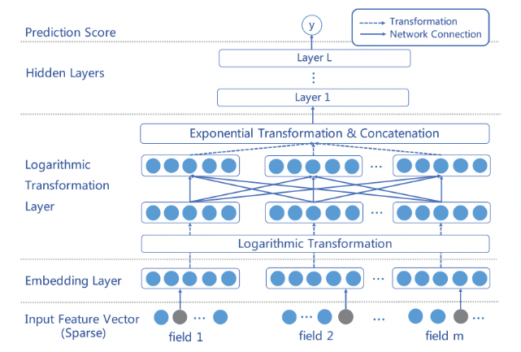

`Input Layer and Embedding Layer`：`AFN` 的 `inpyt layer` 同时采用 `sparse categorical feature` 和 `numerical feature`。最后，`embedding layer` 的输出是 `positive feature embedding` 的一个集合：$\vec{\mathbf{e}}=\{\vec{\mathbf{e}}_1,\cdots,\vec{\mathbf{e}}_m\}$。

`Logarithmic Transformation Layer`：`AFN` 的核心是对数转换层，它学习交叉特征中每个 `feature field`的幂（即阶次）。该层由多个 `vector-wise` 的对数神经元组成，第$j$个 `vector-wise` 对数神经元的输出为：
$$
\vec{\mathbf{y}}_j = \exp\left(\sum_{i=1}^mw_{i,j}\ln\vec{\mathbf{e}}_i\right)=\vec{\mathbf{e}}_1^{w_{i,j}}\odot\cdots\odot\vec{\mathbf{e}}_m^{w_{m,j}}
$$
对上式的主要观察是：每个对数神经元$\vec{\mathbf{y}}_j$的输出能够代表任何交叉特征。例如，当$w_{1,j}=w_{2,j}=1$，而$w_{i,j}=0, 3\le i\le m$时，我们有$\vec{\mathbf{y}}_j = \vec{\mathbf{e}}_1\odot \vec{\mathbf{e}}_2$，这是前两个原始 `feature field` 的二阶交叉特征。因此，我们可以使用多个对数神经元来获得任意阶次的不同 `feature combination` 作为该层的输出。

`Feed-forward Hidden Layers and Prediction`：在对数转换层上，我们堆叠了几个全连接层从而组合所得到的交叉特征。我们首先将所有的交叉特征拼接起来作为前馈神经网络的输入：
$$
\vec{\mathbf{z}}_0 = \vec{\mathbf{y}}_1||\cdots||\vec{\mathbf{y}}_N
$$
然后我们将$\vec{\mathbf{z}}_0$馈入到$L$个隐层

## `FGCNN`

理论上， `DNN` 能够从原始特征中学习任意的特征交互。然而，由于与原始特征的组合空间相比，有用的特征交互通常是稀疏的，要从大量的参数中有效地学习它们是非常困难的。

在 `CTR` 预测中，原始特征的不同排列顺序并没有不同的含义。例如，特征的排列顺序是 `(Name, Age, Height, Gender)` 还是 `(Age, Name, Height, Gender)` 对描述样本的语义没有任何区别，这与图像和句子的情况完全不同。如果只使用 `CNN` 抽取的邻居模式 `neighbor pattern` ，许多有用的 `global feature interaction` 就会丢失。这也是为什么 `CNN` 模型在 `CTR` 预测任务中表现不佳的原因。为了克服这一局限性，作者采用了 `CNN` 和 `MLP` ，两者相互补充，学习 `global-local` 特征交互来生成特征。

在论文中，作者为 `CTR` 预测任务提出了一个新的模型，即 `Feature Generation by Convolutional Neural Network: FGCNN`，它由两个部分组成：特征生成 `Feature Generation` 、深度分类器 `Deep Classifier` 。

- 在特征生成中，作者设计了一个 `CNN+MLP` 的结构用来从原始特征中识别和生成新的重要特征。更具体地说，`CNN` 被用来学习 `neighbor feature interaction`，而 `MLP` 被用来重新组合它们从而提取 `global feature interaction` 。在特征生成之后，特征空间可以通过结合原始特征和新特征来进行扩充。
- 在深度分类器中，几乎所有 `SOTA` 网络结构（如 `PIN`、`xDeepFM`、`DeepFM`）都可以被采用。

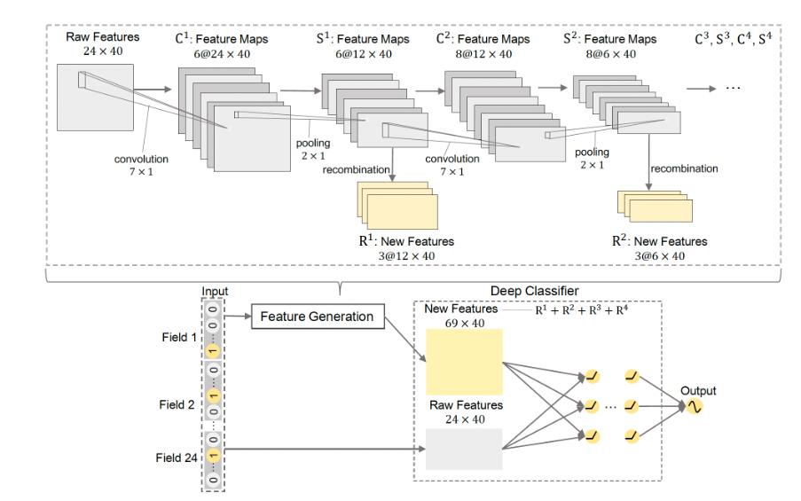

每个样本可以表示为一个 `embedding` 矩阵$\mathbf{E} = (\vec{\mathbf{e}}_1,\cdots,\vec{\mathbf{e}}_m)\in\mathbb{R}^{m\times k}$。为了避免更新参数时梯度方向的不一致，我们将为深度分类器引入另一个 `embedding` 矩阵$\mathbf{E}^{\prime}$，而$\mathbf{E}$用于特征生成。

卷积层：每个样本通过 `feature embedding` 被表示为 `embedding` 矩阵$\mathbf{E}$。为方便起见，将 `embedding` 矩阵 `reshape` 为$\mathbf{E}^1 \in\mathbb{R}^{m\times k \times 1}$作为第一个卷积层的输入矩阵，即通道数为`1` 。为了捕获 `neighbor feature interaction` ，用非线性激活函数的卷积层对$\mathbf{E}$进行卷积，卷积层的输出记做 $\mathbf{C}^1\in\mathbb{R}^{m\times k\times m_c^1}$ 。

池化层：在第一个卷积层之后，应用一个 `maxpooling` 层来捕获最重要的特征交互，从而减少参数的数量。那么第一个池化层的输出为$\mathbf{S}^1$。第$i$个池化层的池化结果将是第$i + 1$个卷积层的输入：$\mathbf{E}^{i + 1} = \mathbf{S}^i$。

`Recombination Layer`：$\mathbf{S}^1$包含了 `neighbor feature` 的模式。我们引入了一个全连接层来重新组合局部的 `neighbor feature pattern` 并生成重要的新特征。我们将$\mathbf{S}^1$展平为一维向量$\vec{\mathbf{s}}^1$，生成的新特征为：
$$
\mathbf{R}^1 = \tanh(\mathbf{W}^1\vec{\mathbf{s}}^1 + \vec{\mathbf{b}}^1)
$$
拼接：新的特征可以通过多次执行 `CNN+Recombination` 来产生。假设有$N$组卷积层、池化层、以及重组层。通过 `Feature Generation` 生成的所有的新特征为：
$$
\mathbf{R} = (\mathbf{R}^1, \cdots,\mathbf{R}^N)
$$
原始特征和新特征的拼接为：$\mathbf{E}_c = (\mathbf{E}^{\prime}, \mathbf{R})$。被馈入深度分类器中，其目的是进一步学习原始特征和新生成特征之间的交互。

## `AutoCross`

## `InterHAt`

模型会影响重要的交叉特征的评估。不同的交叉特征可能对 `CTR` 具有冲突的影响，必须全面分析。

`InterHAt` 通过一种新颖的 `hierarchical attention` 机制显式地量化任意阶次的特征交互的影响，聚合重要的特征交互以提高效率，并根据学到的特征显著性来解释推荐决策。

为了适应特征交互在不同语义子空间中的多义性，`InterHAt` 利用具有`multi-head self-attention` 的 `Transformer` 来全面研究不同的潜在特征交互。作者利用 `Transformer` 来检测特征交互的复杂多义性，并学习一个多义性增强的 `feature list` ，该列表用作 `hierarchical attention layer` 的输入。论文贡献如下：

- 论文提出使用 `InterHAt` 进行 `CTR` 预测。具体而言，`InterHAt` 采用 `hierarchical attention` 来精确定位对点击有很大贡献的重要的单个特征、或不同阶次的交互特征。然后，`InterHAt` 可以基于各阶特征交互为 `CTR` 预测组成 `attention-based` 解释。
- `InterHAt` 利用具有 `multi-head self-attention` 的 `Transformer` ，从而在不同潜在语义子空间中彻底分析特征之间可能的交互关系。
- `InterHAt` 预测 `CTR` 时无需使用需要大量计算成本的深层 `MLP` 。相反，它聚合了特征，因此节省了枚举指数级数量的特征交互的指开销。

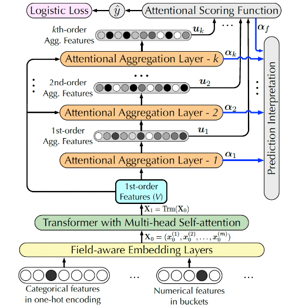

每个样本可以表示为一个 `embedding` 矩阵$\mathbf{E} = (\vec{\mathbf{e}}_1,\cdots,\vec{\mathbf{e}}_m)\in\mathbb{R}^{m\times k}$。

`Multi-head Transformer`：在 `CTR` 预测任务重，我们将特征朝着不同极性（消极或积极）的协同效应（即，特征交互）定义为多义性 `polysemy` 。因此，我们为 `InterHAt` 采用了一个 `Multi-head Transformer` 从而捕获丰富的 `pair-wise` 特征交互，并且学习不同语义子空间中特征交互的多义性。给定输入矩阵$\mathbf{E}$，`Transformer head`$i$的 `representation`$\mathbf{H}_i$被定义为：
$$
\mathbf{H}_i=\operatorname{softmax}_i\left(\frac{\mathbf{Q}\mathbf{K}^T}{\sqrt{d_k}}\right)\mathbf{V}\in\mathbb{R}^{m\times d_k}
$$
`hidden feature`$\mathbf{H}_i$的组合构成了 `augmented representation matrix`$\mathbf{X}_1$，该矩阵保留了每个特征的固有信息和多义信息。我们拼接$\{\mathbf{H}_i\}$，然后馈入到一个带 `ReLU` 的前馈层从而学习非线性：
$$
\mathbf{X}_1 = \text{Relu}([\mathbf{H}_1||\cdots||\mathbf{H}_h]\mathbf{W}_m)
$$
`Hierarchical Attention`： `augmented representation matrix`$\mathbf{X}_1$作为 `hierarchical attention layer` 的输入。`hierarchical attention layer` 学习特征交互并同时产生解释。为了生成第$i + 1$阶的交叉特征$\mathbf{X}_{i + 1}$，我们首先将第$i$阶的交叉特征$\mathbf{X}_i = (\vec{\mathbf{x}}_i^1,\cdots,\vec{\mathbf{x}}_i^m)$聚合到向量$\vec{\mathbf{u}}_i$：
$$
\vec{\mathbf{u}}_i = \text{AttetionalAgg}(\mathbf{X}_i) = \sum_{j=1}^m\alpha_i^j\vec{\mathbf{x}}_i^j
$$
然后我们根据$\vec{\mathbf{u}}_i$和$\mathbf{X}_1$来计算$\mathbf{X}_{i + 1}$：$\vec{\mathbf{x}}^j_{i + 1} = \vec{\mathbf{u}}_i \odot \vec{\mathbf{x}}_1^j  + \vec{\mathbf{x}}_i^j $。其中：$\odot$表示 `Hadamard product` 。

最后，我们联合所有的 `attentional aggregation`$\mathbf{U} = (\vec{\mathbf{u}}_1,\cdots,\vec{\mathbf{u}}_k)$来预测点击率。$\mathbf{U}$收集了$k$阶的所有的组合特征的语义。目标函数和优化：最终的预测函数为$\hat{y} = g(\mathbf{U})$：
$$
\hat{y} = g(\mathbf{U}) = \operatorname{sigmoid}(\text{MLP}(\vec{\mathbf{u}}_f))\\
\vec{\mathbf{u}}_f = \operatorname{AttentionalAgg}(\mathbf{U})=\sum_{j=1}^k\alpha_f^j\vec{\mathbf{u}}_j\\
\alpha_f^j = \frac{\exp(\vec{\mathbf{c}}_f\cdot \text{Relu}(\mathbf{W}_f\vec{\mathbf{u}}_j))}{\sum_{i=1}^k\exp(\vec{\mathbf{c}}_f\cdot\text{Relu}(\mathbf{W}_f\vec{\mathbf{u}}_i))}
$$
可解释性：我们使用注意力分布$(\vec{\mathbf{\alpha}}_1,\cdots,\vec{\mathbf{\alpha}}_k, \vec{\mathbf{\alpha}}_f)$作为理解 `CTR` 预测结果的重要因素，其中：

- $\vec{\mathbf{\alpha}}_f$为 `final attentional aggregation layer` 的注意力分布，其中的 `top` 权重确定了那些阶次的交叉特征$\mathbf{X}_i$对于预测结果最重要。
- $\vec{\mathbf{\alpha}}_i$为第$i$个 `attentional aggregation layer` 的注意力分布，其中的 `top` 权重决定了哪些单个 `feature field`$\vec{\mathbf{x}}_i^j$对于交叉特征$\mathbf{X}_i$最重要。

注意，注意力机制仅突出了特征的显著性，因此不期望它生成完全人类可读的解释。

## `xDeepInt`

`xDeepInt` 中，作者提出了一个高效的基于神经网络的模型，称为 `xDeepInt`，以显式地学习 `vector-wise` 特征交互和 `bit-wise` 特征交互的组合。在多项式回归的启发下，作者设计了一个新颖 `Polynomial Interaction Network: PIN` 层来显式地捕捉有界阶次的 `vector-wise` 交互。为了以可控的方式同时学习 `bit-wise` 交互和 `vector-wise` 交互，作者将 `PIN` 与 `subspace-crossing` 机制相结合，这大大提升了模型性能，并带来更多的灵活性。`bit-wise` 交互的阶次随着子空间的数量而增长。论文贡献如下：

- 论文设计了一个名为 `xDeepInt` 的新型神经网络架构，它显式地同时建模了 `vector-wise` 交互和 `bit-wise` 交互，免除了联合训练的 `DNN` 和非线性激活函数。所提出的模型是轻量级的，但是比许多现有的结构更复杂的模型产生了更好的性能。
- 在高阶多项式逻辑回归的启发下，论文设计了一个 `Polynomial-Interaction-Network: PIN` 层，它可以递归地学习高阶的、显式的特征交互。通过调整 `PIN` 层的数量来控制交互的阶次。作者进行了一项分析，以证明 `PIN` 的多项式逼近的属性。
- 论文引入了一个 `subspace-crossing` 机制来建模 `PIN` 层内不同 `field` 之间的 `bit-wise` 交互。 `PIN` 层和 `subspace-crossing` 机制的结合使我们能够控制 `bit-wise` 交互的阶次。随着子空间数量的增加，模型可以动态地学习更细粒度的 `bit-wise` 特征交互。

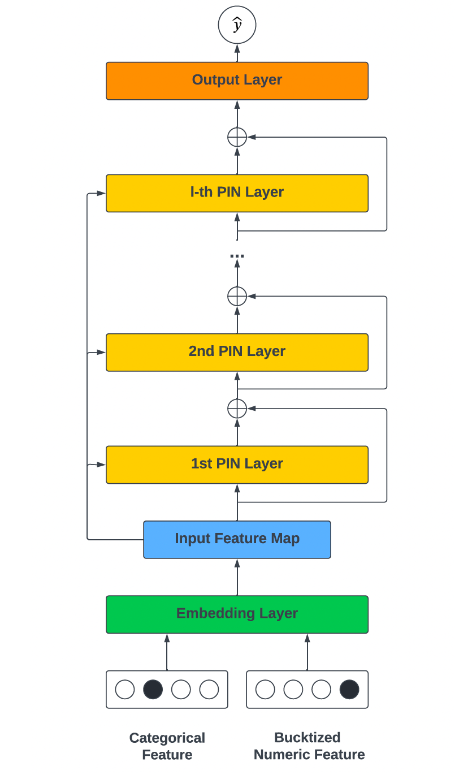

我们堆叠 � 个 `embedding` 向量，从而获得 `input feature map`$\mathbf{X}_0$：
$$
\mathbf{X}_0 = [\vec{\mathbf{e}}_1,\cdots,\vec{\mathbf{e}}_F]\in\mathbb{R}^{K\times F}
$$
`Polynomial Interaction Network: PIN`： `PIN` 的公式如下：
$$
\mathbf{X}_l = f(\mathbf{W}_{l-1},\mathbf{X}_{l-1},\mathbf{X}_0) = \mathbf{X}_{l-1}\odot(\mathbf{X}_0\mathbf{W}_{l-1}) + \mathbf{X}_{l-1} = \mathbf{X}_{l-1}\odot(\mathbf{X}_0\mathbf{W}_{l-1} + \mathbf{1})
$$
其中：$\odot$为 `Hadamard product` ；$\mathbf{1}\in\mathbb{R}^{K\times F}$为全一的矩阵。

第$l$个 `PIN` 层的输出，是所有阶次小于等于$l-1$的 `vector-wise` 交互的加权和。`PIN` 层的结构是根据以下几个方面启发而来：

- 首先， `PIN` 有一个递归结构。当前层的输出建立在上一层的输出、以及一阶 `feature map` 的基础上，确保高阶特征交互是建立在前几层的低阶特征交互之上。
- 其次，我们使用 `Hadamard product` 来建模显式的 `vector-wise` 交互。相比内积的形式，`Hadamard product` 保留了更多的信息。
- 然后，我们建立一个 `field aggregation layer`$\text{Agg}_l(\mathbf{X})=\mathbf{X}\mathbf{W}_{l}$，它在 `vector-wise level` 上使用线性变换$\mathbf{W}_{l}$来组合 `feature map` 。`field aggregation feature map` 的每个向量可以被看作是由 `input feature map` 的加权和所构建而成。
- 然后，针对当前层，我们取 `field aggregation feature map` 以及上一层输出之间的 `Hadamard product` 。这一操作使我们能够在现有的$l-1$阶特征交互的基础上探索所有可能的$l$阶多项式特征交互。
- 最后，我们利用残差连接，从而允许组合不同阶次的 `vector-wise` 的特征交互，包括第一个 `feature map` 。随着层数的增加，特征交互的阶次也在增加。`PIN` 的递归结构能够限制多项式特征交互的阶次。

`subspace-crossing` 机制：`PIN` 建模 `vector-wise` 交互，然而它无法建模 `bit-wise` 交互。为了建模 `bit-wise` 交互，我们提出了 `subspace-crossing` 机制。假设我们把 `embedding` 空间拆分$h$个子空间，那么 `input feature map`$\mathbf{X}_0$就由$h$个子矩阵来表示：
$$
\mathbf{X}_0 = \left[\begin{array}{cccc}\mathbf{X}_{0,1}\\
\cdot\\
\cdot\\
\mathbf{X}_{0,h}\end{array}\right]
$$

其中：$\mathbf{X}_{0,i}\in\mathbb{R}^{\frac{K}{h}\times F}$。然后，我们在 `field` 维度上堆叠所有子矩阵，并构建一个堆叠的 `input feature map`：
$$
\mathbf{X}_0^{\prime}=[\mathbf{X}_{0,1},\cdots,\mathbf{X}_{0,h}]
$$
通过将每个 `field` 的 `embedding` 向量分割成 ℎ 个子向量并将它们堆叠在一起，我们可以将不同 `embedding` 维度的 `bit` 进行对齐，并在堆叠的 `sub-embedding` 上创建 `vector-wise` 交互。因此，我们将$\mathbf{X}_0^{\prime}$馈入 `PIN`：
$$
\mathbf{X}_l^{\prime} = \mathbf{X}_{l-1}^{\prime}\odot(\mathbf{X}_0^{\prime}\mathbf{W}_{l-1}^{\prime} + \mathbf{1})
$$
在普通的 `PIN` 层中，`feature map` 的 `field aggregation` 、`Hadamard product` 的乘法交互都是 `vector-wise level` 的。`subspace-crossing` 机制所增强的 `PIN` 将 ℎ 个被对齐的子空间作为输入，从而鼓励 `PIN` 通过交叉不同子空间的特征来捕获显式的 `bit-wise` 交互。子空间的数量 ℎ 控制着 `bit-wise` 交互的复杂性，较大的 ℎ 有助于模型学习更复杂的特征交互

## AutoDis

虽然在文献中没有很好的研究，但 `embedding` 模块也是深度 `CTR` 模型的一个关键因素：

- `embedding` 模块是后续 `FI` 模块的基石，直接影响 `FI` 模块的效果。
- 深度 `CTR` 模型中的参数数量大量集中在 `embedding` 模块，自然地对预测性能有很高的影响。

在实践中，现有的数值特征的 `representation` 方法可以归纳为三类：

- `No Embedding`：直接使用原始特征取值或转换，而不学习 `embedding` 。
- `Field Embedding`：为每个 `numerical field` 学习单个 `field embedding` 。
- `Discretization`：通过各种启发式离散化策略将数值特征转换为 `categorical feature` ，并分配 `embedding` 。

然而，前两类可能会由于 `representation` 的低容量而导致性能不佳。最后一类也是次优的，因为这种基于启发式的离散化规则不是以 `CTR` 模型的最终目标进行优化的。

`AutoDis` 由三个核心模块组成：`meta-embedding` 、`automatic discretization` 和`aggregation` ，从而实现高的模型容量、端到端的训练、以及 `unique representation` 等特性。具体而言：

- 首先，论文为每个 `numerical field` 精心设计了一组 `meta-embedding` ，这些 `meta-embedding` 在该`field` 内的所有特征取值之间是共享的，并从 `field` 的角度学习全局知识，其中 `embedding` 参数的数量是可控的。
- 然后，利用可微的 `automatic discretization` 模块进行 `soft discretization` ，并且捕获每个数值特征和 `field-specific meta-embedding` 之间的相关性。
- 最后，利用一个 `aggregation` 函数从而学习 `unique Continuous-But-Different representation` 。

虽然 `Discretization` 在工业界被广泛使用，但它们仍然有三个限制：

- `Two-Phase Problem: TPP`：离散化过程是由启发式规则或其他模型决定的，因此它不能与 `CTR` 预测任务的最终目标一起优化，导致次优性能。
- `Similar value But Dis-similar embedding: SBD`：这些离散化策略可能将类似的特征（边界值）分离到两个不同的桶中，因此它们之后的 `embedding` 明显不同。
- `Dis-similar value But Same embedding: DBS`：现有的离散化策略可能将明显不同的元素分组同一个桶中，导致无法区分的 `embedding`。使用同一个例子（`Age field` ），`18` 和 `40` 之间的数值在同一个桶里，因此被分配了相同的 `embedding` 。然而，`18` 岁和 `40` 岁的人可能具有非常不同的特征。

## `MDE`

为了在推荐中利用 `heterogeneous object popularity` ，提出了 `mixed dimension(MD) embedding layer` ，其中一个 `specific-object` 的 `embedding` 维度随着该`object` 的 `popularity` 而变化，而不是保持全局统一。论文的案例研究和理论分析表明：`MD embedding` 的效果很好，因为它们不会在`rare embedding` 上浪费参数，同时也不会欠拟合 `popular embedding` 

## `NIS`

`NIS` ，这是一种新颖的方法，为模型输入组件的每个离散特征自动寻找 `embedding size` 和 `vocabulary size` 。`NIS` 创建了一个由 `Embedding Blocks` 集合组成的搜索空间，其中 `blocks` 的每个组合代表不同的 `vocabulary and embedding` 配置。最佳配置是通过像 `ENAS` 这样的强化学习算法在单个 `training run` 中搜索而来。

此外，作者提出一种新的 `embedding` 类型，称之为 `Multi-size Embedding : ME` 。 `ME` 允许将较大尺寸（即，维度）的 `embedding` 向量分配给更常见的、或更 `predictive` 的 `feature item` ，而将较小尺寸的 `embedding` 向量分配给不常见的、或没有`predictive` 的 `feature item` 。这与通常采用的方法相反，即在词表的所有 `item` 中使用同样维度的 `embedding` ，这称之为 `Single-size Embedding: SE` 。

## `AutoEmb`

因为 `embedding size` 通常决定了待学习的模型参数的数量、以及由 `embedding` 所编码信息的容量。

- 一方面，较小的 `embedding size` 往往意味着较少的模型参数和较低的容量。因此，当`popularity`小的时候，它们可以很好地工作。然而，当随着`popularity`的增加， `embedding` 需要编码更多的信息，较低的容量会而限制其性能。
- 另一方面，更大的`embedding size` 通常表示更多的模型参数和更高的容量。它们通常需要足够的数据从而被良好地训练。因此，当`popularity`小的时候，它们不能很好地工作；但随着`popularity`的增加，它们有可能捕获更多的信息。

在 `embedding layer` 为不同的 `user/item` 实现不同的 `embedding size` 。这里面临着巨大的挑战：

- 首先，现实世界的推荐系统中的 `user/item` 的数量非常大，而且`popularity`是高度动态的，很难为不同的 `user/item` 手动选择不同的 `embedding size` 。
- 其次，在现有的 `DLRSs` 中，`first hidden layer` 的输入维度通常是统一的和固定的，它们很难接受来自 `embedding layer` 的不同维度。

作者试图解决这些挑战，从而建立了一个基于端到端的可微的 `AutoML` 框架（即，`AutoEmb` ），它可以通过自动的、动态的方式利用各种 `embedding size` 。

`AutoEmb` 仅聚焦于 `user id` 和 `item id` 的 `embedding size` 优化，而没有考虑其他的 `categorical feature` 。并且论文描述的算法仅应用 `streaming recommendation setting` 。

论文的思想比较简单：为每个 `id` 分配$N$个候选的 `embedding size`，然后用强化学习进行择优。难以落地，因为最终得到的模型，参数规模几乎增长到$N$倍。

换一个思路：给定一个 `baseline model`，我们可以将 `baseline model` 的 `embedding size` 划分为$N$个子维度（类似于 `NIS`），然后由控制器来选择需要横跨几个子维度。这种方法和 `NIS` 的区别在于：

- `NIS` 的控制器是独立的自由变量，每个变量代表对应的概率。虽然控制器没有包含 `item` 的 `popularity` 信息，可以自由变量的 `update` 次数就代表了 `item` 出现的频次，因此隐式地包含了 `popularity` 信息。
- 而这个思路里，控制器的输入包含了 `item` 的 `popularity` 信息，可以给予控制器一定的指导。
