#### 

## LLM & RL

生成式语言模型中的一些**关键概念**在强化学习范式下，具体的定义如下：

- **动作**`Action`：动作指模型在每个时间步生成的一个Token。例如，当模型从词表中选择下一个输出词时，这一选择就是一个动作。
- **动作空间**：动作空间是语言模型的**词表**（Vocabulary），即所有可能的Token的集合，通常包含约10万级的词元。
- **智能体**`Agent`：智能体是负责决策的实体，即LLM。它负责接受文本输入并生成一系列文本或其概率分布。
- **策略**`Policy`：策略是LLM对应的模型**参数**，决定了模型生成文本的具体规则和行为。
- **状态**`State`：状态是模型当前的输入上下文，通常由已生成的Token序列构成。例如，在针对Prompt为“你是谁？”的生成过程中，状态会随着生成的Token动态更新，形成如“你是谁？”、“你是谁？我”、“你是谁？我是”等状态。
- **回合**`Episode`：回合是**一次完整**的文本生成过程，从初始输入（例如一个问题或指令）开始，到模型生成结束（通常以特殊符号或表示）。
- **价值**`Value`：价值表示在特定状态下或采取特定动作后，模型未来所能获得的**预期回报**。它衡量当前动作（Token或词）的选择质量及其后续可能动作的潜在影响，通常由单独的价值网络进行估计。

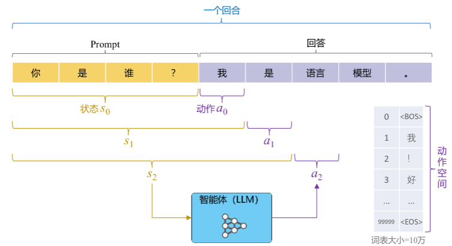

RLHF训练可以分为**两个阶段**：

- 阶段一（SFT，**训练奖励模型**）：根据用户输入（Prompt），生成多种候选回答，并由人工对这些回答进行偏好标注。这些标注数据作为训练样本，用于监督学习训练奖励模型，使其能够预测不同回答的偏好得分。
- 阶段二（RL，基于PPO的**强化学习**）：联合策略模型、参考模型、奖励模型和价值模型，基于PPO等RL算法进行强化学习训练。通过迭代优化，策略模型逐步提升生成内容的质量，更加符合人类的需求和价值观。 两个阶段的**样本**如下：
- 奖励模型样本：奖励模型的训练依赖于**偏好数据集**（Prompt + 回答）
- PPO训练的样本：该阶段的训练样本**仅需要Prompt**即可，无需回答。

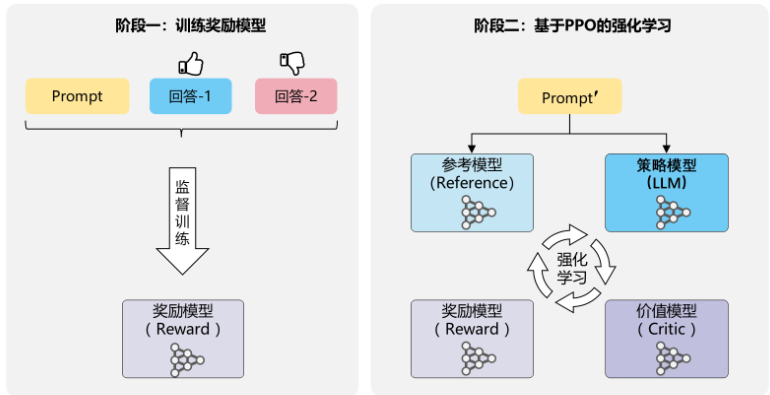

奖励模型在RLHF训练中起着关键作用，与价值模型共同指导策略模型的优化方向。奖励模型的核心**作用**是为特定Prompt对应的回答结果输出一个奖励分数，用于指导策略模型的优化。 通常，奖励模型是在经过SFT的LLM基础上进行小幅**改造**而来。由于SFT之后的模型已具备丰富的语言处理能力，直接复用其底层的Transformer结构可以显著减少训练时间和数据需求。

- **共享**底层结构：奖励模型复用了LLM的底层结构及其权值，包括所有的Transformer Decoder层和Embedding层，从而确保两者具备一致的隐藏状态表示能力。这种共享设计不仅**降低**了训练复杂度，还显著减少了从零训练所需的计算资源和数据需求。
- **替换**输出头：将LLM原有的顶层线性层`LM Head`**替换**为全新的线性层`Reward Head`。LLM的最后一层通常是一个线性投影层（LM Head），其输入维度为隐藏状态大小（hidden_size），输出维度为词表大小（vocab_size），用于生成对应于全词表的logits值（概率分布）。而奖励模型只需输出一个分数值，因此，LLM的输出头被替换为一个全新的线性层，该层的输出维度为1，用于生成奖励分数。

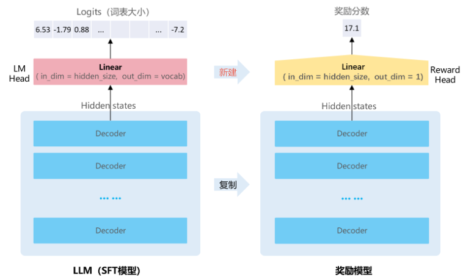

奖励模型输入由一条Prompt + 其对应的一条回答（Response）**拼接**而成，构成一个完整的序列。

- 从第一个动作a0=“青”到最后一个动作`a5=<eos>`，回答序列中的每个Token都被视为一个独立的动作。
- 奖励模型输出一组奖励分数$r_,r_1, \cdots, r_5$，分别对应生成回答序列中每个Token位置，用于表示各位置生成Token的质量评分。

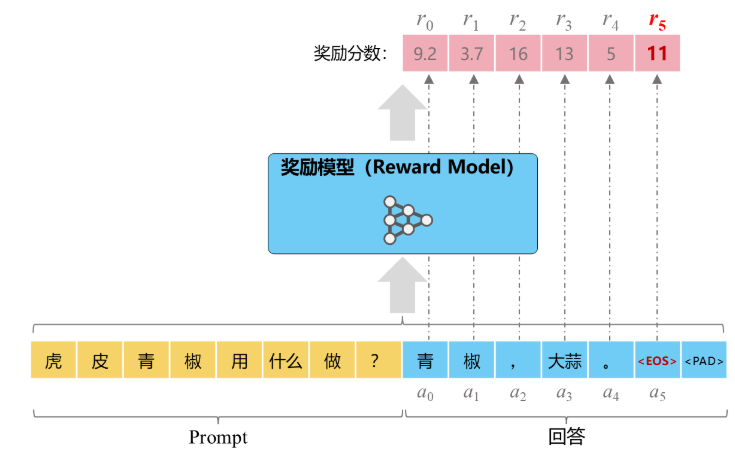

**奖励模型`RM`的目标**是利用偏好数据集训练出能够拟合人类反馈的评分函数，以准确评估生成文本的质量。**Loss**通常采用基于对比的**负对数似然**形式，这与DPO算法中的奖励建模过程类似。
$$
\mathcal{L}_{\text{RM}} = -\mathbb{E}_{(x, y_w, y_l)\sim\mathcal{D}}\left[\log\sigma(r(x, y_w) - r(x, y_l))\right]
$$
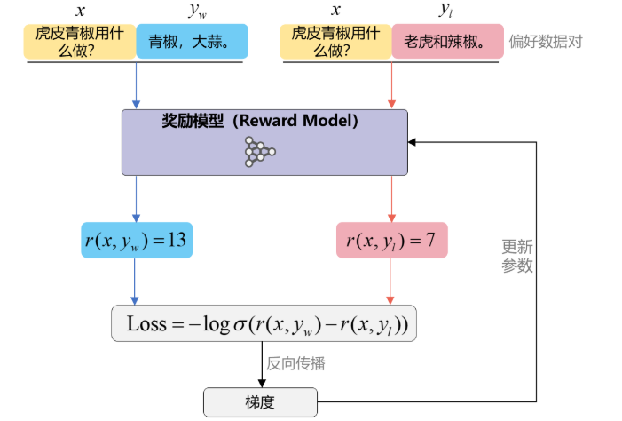

其中，$y_w$和$y_l$是针对同一个Prompt生成的**两个回答**，且$y_w$优于$y_l$，这包含了人类反馈信息。训练**步骤**如下：

- **计算奖励分数**：奖励模型分别对两个回答进行推理，得到两个奖励评分，即奖励模型恰好对优质回答$y_w$的评分更高，这与人类反馈大体一致。
- 计算**Loss**：根据两个奖励分数的差异
- **梯度更新**：通过反向传播计算梯度，并更新奖励模型的参数。
- **重复迭代**多次：读取下一批偏好样本，按照上面的流程，重复迭代。随着参数逐步更新，奖励模型在所有偏好数据上的评分逐渐与人类的偏好趋于一致。

RLHF的第二阶段需要加载**四个模型**进行强化学习训练。这四种模型的角色和**相互关系**如下：

- **策略模型**`Policy Model, Actor`：RLHF训练的**核心**，负责根据输入的Prompt生成回答At。策略模型需平衡两个目标：一方面，通过奖励模型和价值模型引导优化以符合人类偏好；另一方面，通过参考模型施加KL约束，限制生成内容与初始行为分布的偏离，避免过度激进或不稳定的回答。
- **参考模型**`Reference Model`：为策略模型提供稳定的行为**基准**，通过计算策略模型与参考模型输出之间的KL距离，可以在训练过程中对策略模型施加约束，防止其过度偏离参考模型的概率分布。这样可以避免策略模型偏离SFT模型太远，确保生成行为的稳定性，从而有效防止策略模型因过度追求奖励而出现“奖励欺骗”现象。
- **奖励模型**`Reward Model, RM`：为策略模型生成的回答分配**即时奖励**Rt，模拟人类偏好反馈。奖励模型与价值模型协作，共同引导策略模型朝着人类偏好的方向优化。
- **价值模型**`Value Model, Critic`：**全面评估**策略模型生成的回答，预测在特定状态下执行某动作的**长期回报**，计算价值估计$V_t$。

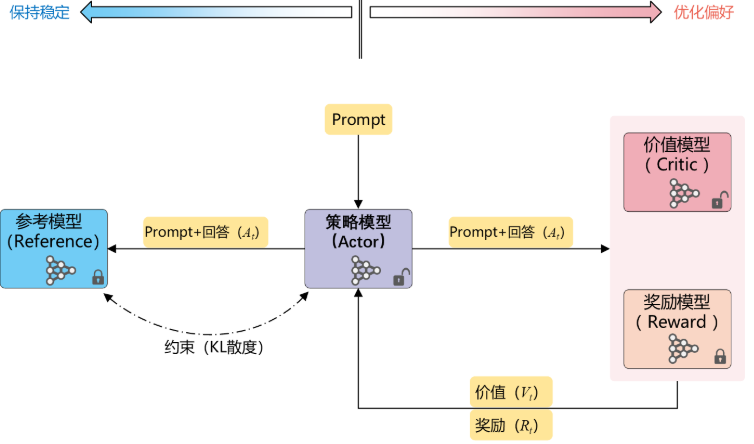

通常，在通用&低成本场景下，可以简化模型设计，RLHF涉及的四种模型拥有类似的结构，主要区别在于各模型的头部（Head）。这些模型可以基于SFT模型进行**改造和初始化**：

- **策略模型**：结构与SFT模型**完全一致**，包含N层Transformer Decoder和LM Head。在参数初始化时，通常直接复制SFT模型的所有参数。在随后的PPO训练中，策略模型的参数会**持续更新**。
- **参考模型**：结构与SFT模型一致，包含N层Decoder和LM Head。参数初始化时，同样直接复制SFT模型的所有参数。但在后续的PPO训练中，参考模型的参数始终保持**冻结**（不更新）。因此，在PPO训练的初始时刻，参考模型与策略模型完全一致，在策略模型的优化过程中，参考模型为策略模型提供了一个稳定的行为参考基准。
- **奖励模型**：与SFT模型的底层Decoder部分结构一致，但将头部结构**替换**为Reward Head。在参数初始化时，仅复制SFT模型的底层Decoder（N层），而Reward Head的参数通常随机初始化。在随后的PPO训练中，奖励模型的参数始终保持**冻结**。
- **价值模型**：结构类似于奖励模型，包含N层Decoder和Value Head。在参数初始化时，可以复制奖励模型的所有参数，有时也可基于SFT模型进行改造。在随后的PPO训练中，价值模型的参数会**持续更新**。

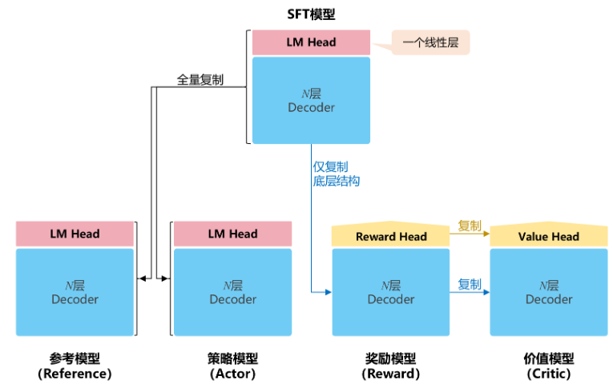

价值模型与奖励模型需要为每个Token输出标量数值。为满足这一需求，TRL库实现了`AutoModelForCausalLMWithValueHead`类，如图所示，该模型采用了**双头**结构，即包含两个输出头部——语言模型头`LM Head`和价值头`Value Head`。以回答序列长度为3、词表大小为151936为例，两个头部的**输出**如下：

- **Logits**：形状为`(3, 151936)`的矩阵，表示每个Token在词表中的概率分布。
- **价值向量**：形状为`(3, 1)`的向量，表示每个Token的价值估计。

通过这种双头结构设计，模型的核心模块仅需执行一次推理，这显著**降低**了计算成本和显存消耗

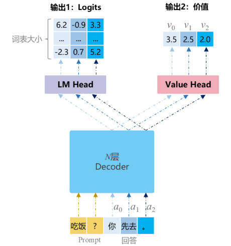

在RLHF中，通过**共享**同一个底座（N层Decoder），可以显著**降低**显存开销。这是因为参考模型、奖励模型、策略模型和价值模型之间具有较高的**相似性**。采用LoRA微调技术，四种模型可以共用同一底座，同时保持底座参数冻结（不更新）。具体而言，参考模型仅用于评估对比，**不参与**训练；奖励模型在RLHF的第一阶段（奖励建模）中进行训练；而策略模型和价值模型则在第二阶段（策略优化）中进行训练。因此，为奖励模型、策略模型和价值模型分别配备了**独立的LoRA**模块，通过组合相应的LoRA模块、Head和共享的底座，即可动态组装所需的模型。在训练过程中，仅更新LoRA模块和Head部分的参数。**四种模型共享**相同的底座（N层Decoder）。该底座参数**常驻GPU**并保持冻结状态，而LoRA模块和Head部分则根据PPO训练的不同环节，可动态加载到GPU中或动态swap。

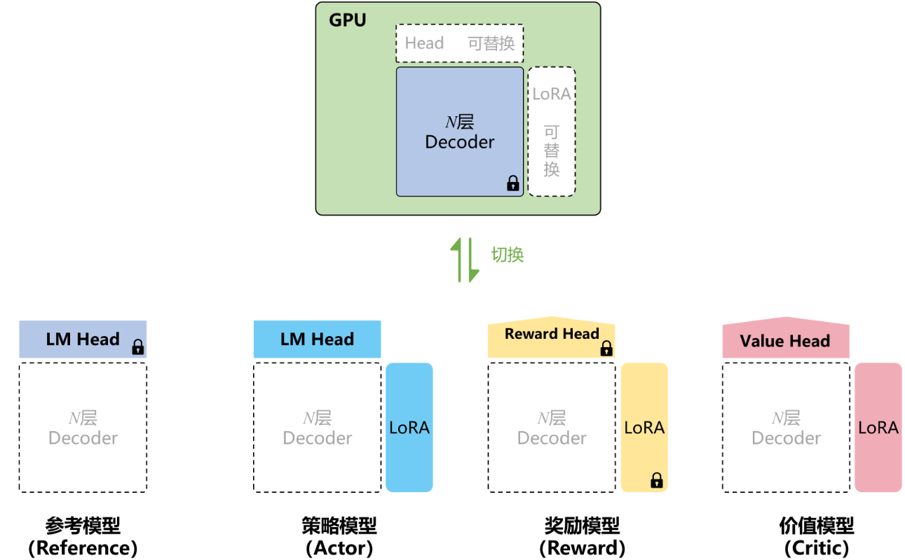

涉及的四个模型具有不同的**输入与输出**（图中未展示等特殊Token）。

- 所有四个模型中，只有策略模型执行了**生成**过程。策略模型根据输入的Prompt（或上下文）生成了三个Token，即三个动作（[你]、[先去]、[。]）。其余三个模型（参考模型、奖励模型、价值模型）均以Prompt和策略模型生成的回答为基础，执行相应的计算：
- **参考模型**：输出回答对应的对数概率`LogProbs`，与策略模型输出的对数概率计算出**KL距离**，确保策略模型不会偏离基准分布过远。
- **奖励模型**：对生成的回答`策略模型的动作`进行逐Token的奖励打分，生成**即时奖励**$r_t$。通常只使用最后一个Token对应的奖励分数，即与 Token对应的奖励分数。
- **价值模型**：对生成的回答`策略模型的动作`进行逐Token的价值估计，用于评估每个动作的**长期回报**$V_t$。

| 模型     | 输入                      | 输出                               |
| -------- | ------------------------- | ---------------------------------- |
| 策略模型 | Prompt（或上下文）        | 回答及其对应的对数概率（LogProbs） |
| 参考模型 | Prompt（或上下文） + 回答 | 回答对应的对数概率（LogProbs）     |
| 奖励模型 | Prompt（或上下文） + 回答 | 回答对应的每个 token 的奖励值      |
| 价值模型 | Prompt（或上下文） + 回答 | 回答对应的每个 token 的价值估计    |

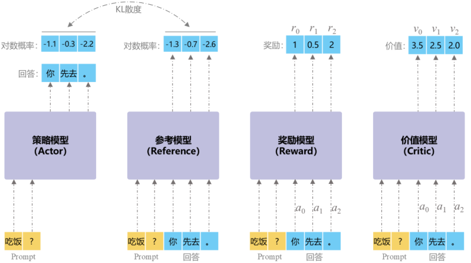

在基于GAE算法计算Advantage时，需要用到奖励模型估计的奖励分数。在此基础上，可以对奖励分数进行调整。策略模型和参考模型均会**输出Logits**，并进一步转换为**对数概率**`LogProbs`。这里假设批次大小为1，词表大小为7，回答对应的Token序列长度为3。Prompt为“吃饭？”，其Token化后为[吃饭]和[？]。回答为“你先去。”，其Token化后为[你]、[先去]和[。]。此处忽略[EOS]等特殊Token。

- 策略模型**生成**回答Token：以Prompt作为策略模型的输入，生成回答（response）以及对应的**Logits**，response包括三个Token：[你]、[先去]和[。]。注意，在实际RLHF训练中，该步骤已在经验采集（Make Experience）环节完成。
- 计算**对数概率**：在步骤`1`中，策略模型已经生成了Logits，即一个形状为（序列长度=3，词表大小=7）的矩阵。进一步，可以将该矩阵转换为**对数概率**`LogProbs`矩阵。
- **参考模型**生成对数概率：以Prompt和response作为输入，参考模型推理并生成Logits，**截取**对应于response部分的Logits，进而可得到参考模型的对数概率矩阵。
- 抽取`**Gather**`：以步骤`1`中策略模型生成的三个回答Token为**索引**，在策略模型和参考模型的对数概率矩阵中，分别提取出对应Token的对数概率值。通过这一操作，可以得到三个Token的**对数概率**值——策略模型的`logprob`和参考模型的`ref_logprob`。全词表范围下的对数概率矩阵形状为（序列长度=3，词表大小=7），而抽取后的`logprob`和`ref_logprob`形状为（3，1）。
- **KL距离**计算：如图所示，对`logprob`和`ref_logprob`进行**逐位置相减**，最终得到策略模型和参考模型之间的KL距离。

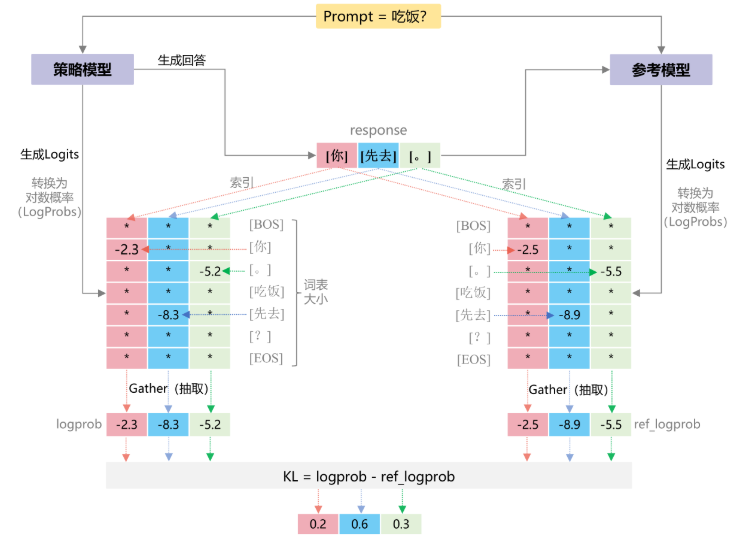

整体结构主要分为经验收集和多轮PPO训练**两个部分**，即图中左右两个半区。在基于PPO算法进行RLHF训练时，这两个部分以**循环**的方式进行多次迭代。

- **缓冲区**：图中间的缓冲区用于存储左半区收集的经验数据。这些数据将被切分成多个**小批量**（mini-batch），以支持右半区进行多次训练和参数更新。
- **模型版本**的区别：左半区的策略模型和价值模型可视为**旧模型**，主要用于生成样本及相关计算。右半区的策略模型和价值模型则会在训练过程中进行多次迭代更新，因此可称为**新模型**。本质上，左右两个半区的模型（策略模型和价值模型）是同一个模型的**不同状态版本**，但为了便于理解，图中额外在右半区重复绘制了策略模型和价值模型。

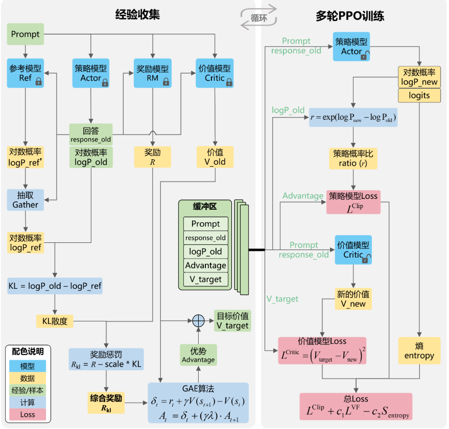

**拒绝采样**`Rejection Sampling`微调：是一种基于数据**筛选**的模型微调策略，旨在通过人工或模型标注对模型生成的样本进行筛选，剔除低质量的样本，仅保留优质样本用于进一步微调，Anthropic、Meta等公司均曾利用该技术对语言模型进行优化。

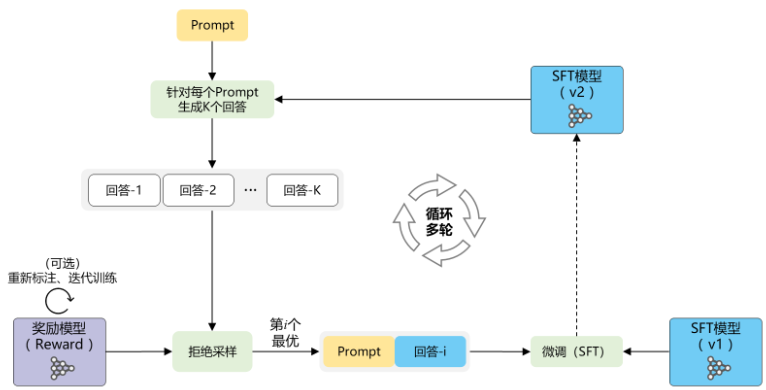

**RLAIF**（Reinforcement Learning from AI Feedback，基于AI反馈的强化学习）是一种以**AI反馈**为基础的强化学习方法。RLAIF与RLHF在整体流程上具有较高的相似性，其主要**区别**在于偏好样本的标注环节。RLHF依赖人类进行偏好标注，而RLAIF则通过AI完成此过程。

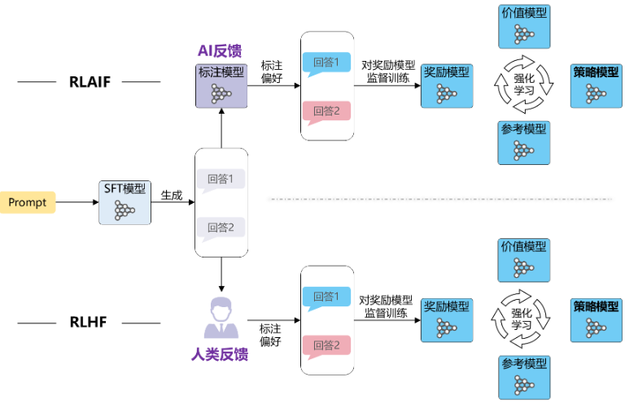

**CAI**`Constitutional AI, 基于宪法的AI`是一种用于大模型训练的RLAIF类型的算法，该算法以一套预先制定的**宪法原则**为指导，通过结合AI反馈和自我批评机制，得以更加高效地提升模型的有用性和无害性。 CAI的训练过程：

- **自我批评与回答修订**：初始模型根据输入的Prompt生成回答，随后依据随机选取的一条宪法原则对回答进行**批评与修订**。模型可以自动识别回答中可能存在的潜在有害、不道德或不合规内容，并根据批评结果对回答进行自我修订。该过程可以多次迭代，通过逐步优化，使生成的回答更加符合预期。
- **训练监督学习模型`SL-CAI`**：修订后的回答与人类标注的有用性样本共同组成监督学习数据集，用于训练监督学习模型`SL-CAI`。通过对预训练语言模型进行微调，SL-CAI能够生成更贴近目标分布的回答，从而显著降低后续强化学习阶段的探索成本。
- **生成回答与AI标注**：使用SL-CAI模型针对相同的Prompt生成多组候选回答，采用独立的反馈模型（例如预训练模型）对这些候选回答进行**AI标注**。反馈模型会基于随机选取的一条宪法原则为回答打分。此阶段的AI标注机制有效降低了对人工标注的依赖。
- **训练奖励模型**：将AI标注数据与人工标注数据混合，形成偏好数据集，并以此训练奖励模型，或称为偏好模型`Preference Model，RM`。
- **强化学习优化目标模型`RL-CAI`**：在强化学习阶段，利用奖励模型提供奖励信号，通过强化学习算法对目标模型进行优化。此阶段逐步增强模型在无害性和有用性上的表现，同时减少模型在敏感问题上的逃避倾向，确保其行为更加透明和可靠。

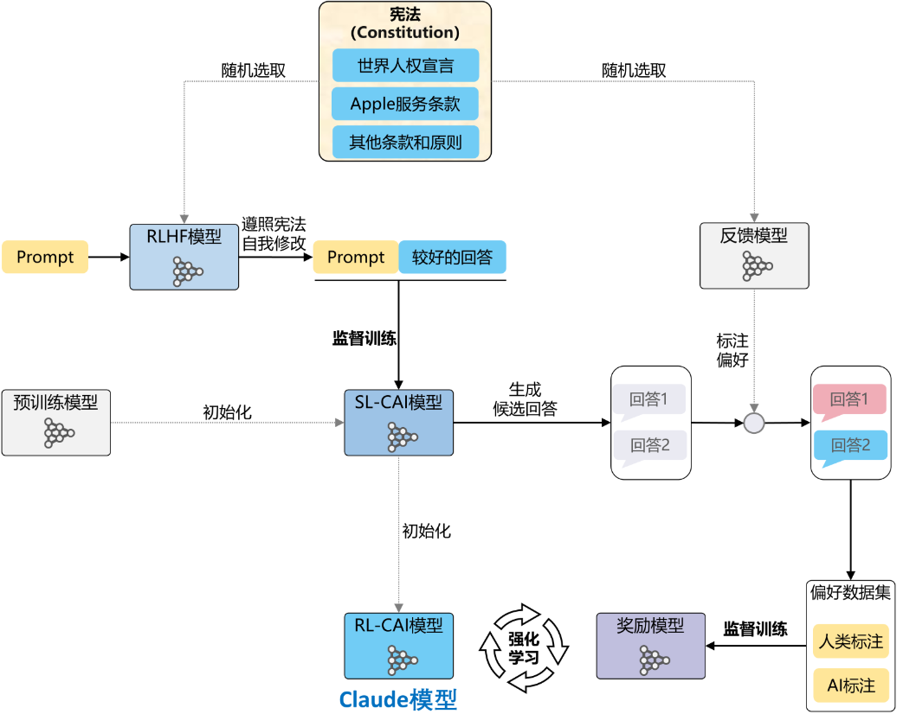

**RBR**`Rule Based Rewards，基于规则的奖励`是一种基于规则的偏好建模方法，该方法通过人工标注数据训练出一个RBR奖励模型，将AI反馈融入传统的RLHF流程中。自GPT-4推出以来，OpenAI就将RBR作为其安全系统的**核心**组成部分，并已应用于包括GPT-4o mini等模型。

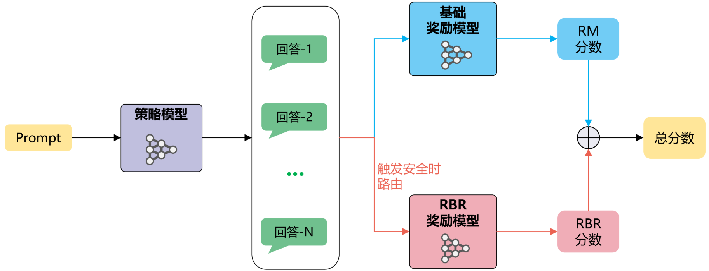

#### 逻辑推理能力优化

**MCTS**每次迭代的**四个关键步骤**： MCTS算法通过构建决策树逐步探索问题的解空间，其核心思想是从当前状态出发，通过**模拟**或推演评估状态的价值，并利用评估结果指导后续的搜索方向。MCTS通过**重复迭代**上述四个步骤，不断扩展和完善搜索树，进而逐步提升对各状态的评估精度。随着推演迭代次数的增加，算法**逐渐**倾向于选择更优的路径，从而不断优化决策质量。

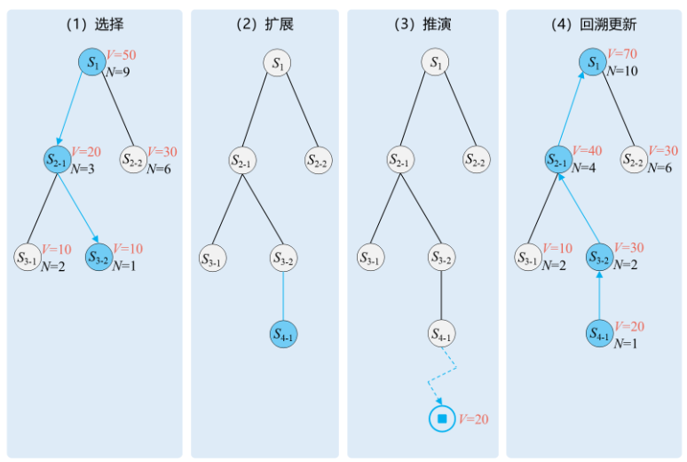

由模型（通常为参考模型）生成多个候选输出（例如N个），然后依据某种评价标准，从中**挑选**出质量**最优**的一个作为最终输出。

**多数投票**（Majority Vote）的核心思想是：针对一个给定的Prompt，模型进行多次推理，生成多条不同的推理路径，每条路径可能产生一个最终答案，通过统计最终答案的出现频率，将**频率最高**的答案作为最终输出。

| 类型  | 总位数 | 符号位 | 指数位 | 尾数位 / 整数位 |
| ----- | ------ | ------ | ------ | --------------- |
| FP64  | 64     | 1      | 11     | 52 (尾数)       |
| FP32  | 32     | 1      | 8      | 23 (尾数)       |
| TF32  | 19     | 1      | 8      | 10 (尾数)       |
| BF16  | 16     | 1      | 8      | 7 (尾数)        |
| FP16  | 16     | 1      | 5      | 10 (尾数)       |
| INT64 | 64     | 1      | –      | 63 (整数值)     |
| INT32 | 32     | 1      | –      | 31 (整数值)     |
| INT8  | 8      | 1      | –      | 7 (整数值)      |
| UINT8 | 8      | 0      | –      | 8 (整数值)      |
| INT4  | 4      | 1      | –      | 3 (整数值)      |

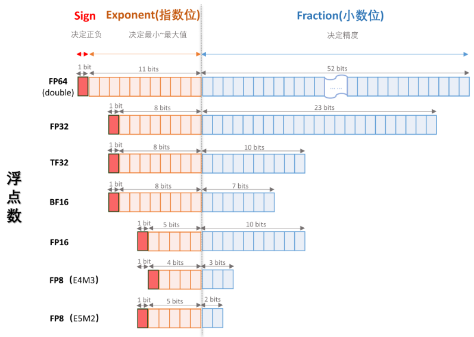

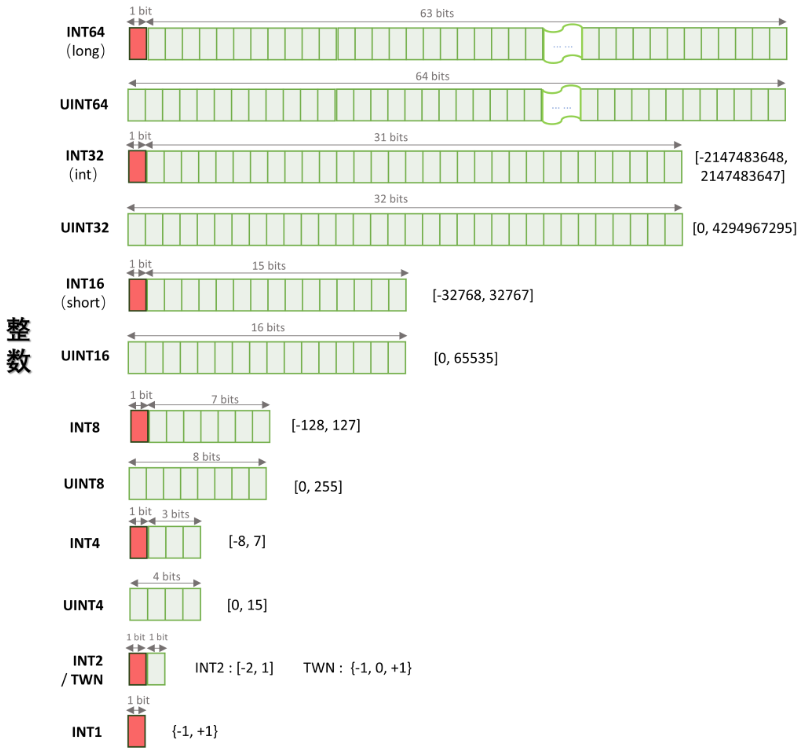

**常规训练**（上方）：每层的激活值（Activation）都**完整保存**，便于反向传播时直接使用，但显存占用大，不适合大模型。

**梯度重计算**（下方）：只保存**关键层**的激活值（如 Activation 1 和 3），在反向传播时，对中间未保存的激活值（如 2 和 4）进行重新前向计算，以此节省显存。总结：梯度重计算（Gradient Checkpointing）通过以**多算换空间**的方式降低显存使用，适合训练大模型时节省资源，但代价是训练时间略有增加。

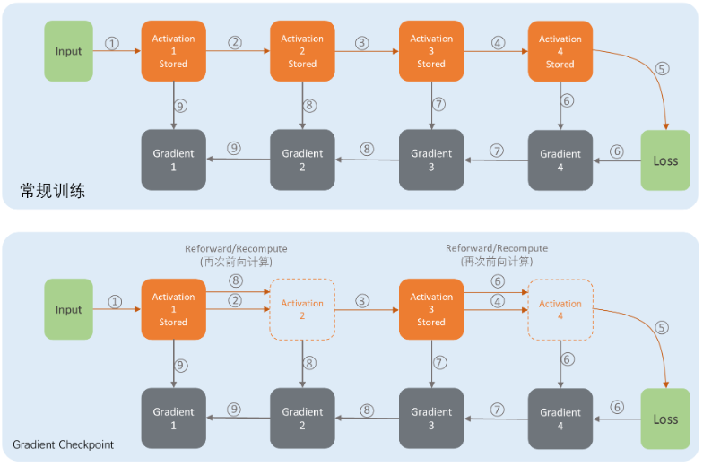

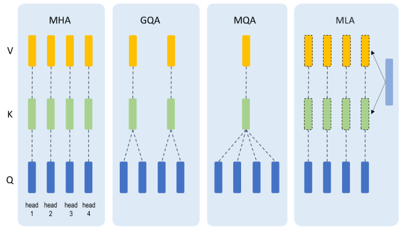

`Pre-norm`：在**子层**（如自注意力或前馈网络）**输入前**先执行`LayerNorm`，然后经过子层并与原始输入进行**残差连接**，可提升**梯度流动**和深层模型的**训练稳定性**。`Post-norm`：在子层输出后与原始输入进行**残差连接**，再执行`LayerNorm`，是**Transformer**的经典结构，但在深层网络中可能导致**梯度衰减**和训练不稳定

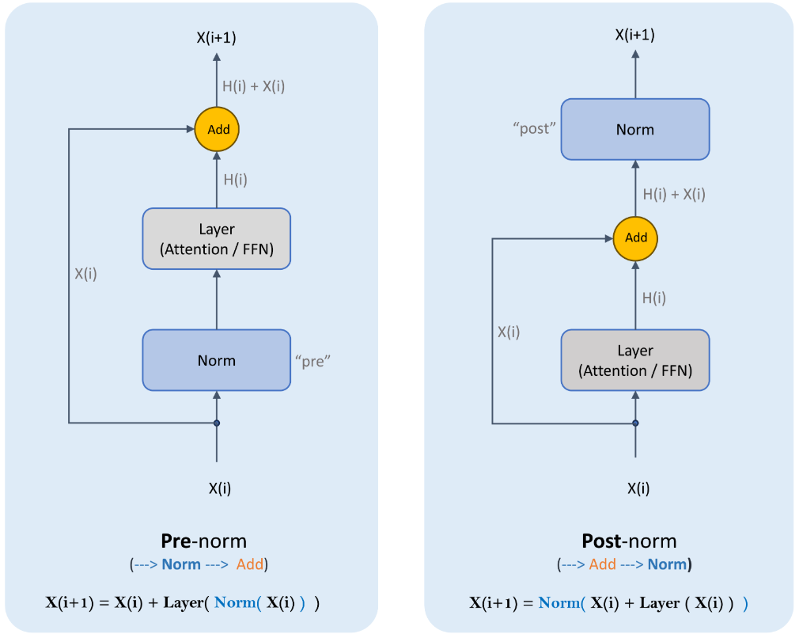

`BatchNorm`：对每个小批量中的每个通道进行标准化（减去均值、除以标准差），再加上可学习的**缩放**和**偏移**参数。`LayerNorm`：对每个**样本**的所有**特征维度**进行**标准化**（减去均值、除以标准差），同样使用可学习的**缩放**和**偏移**参数。

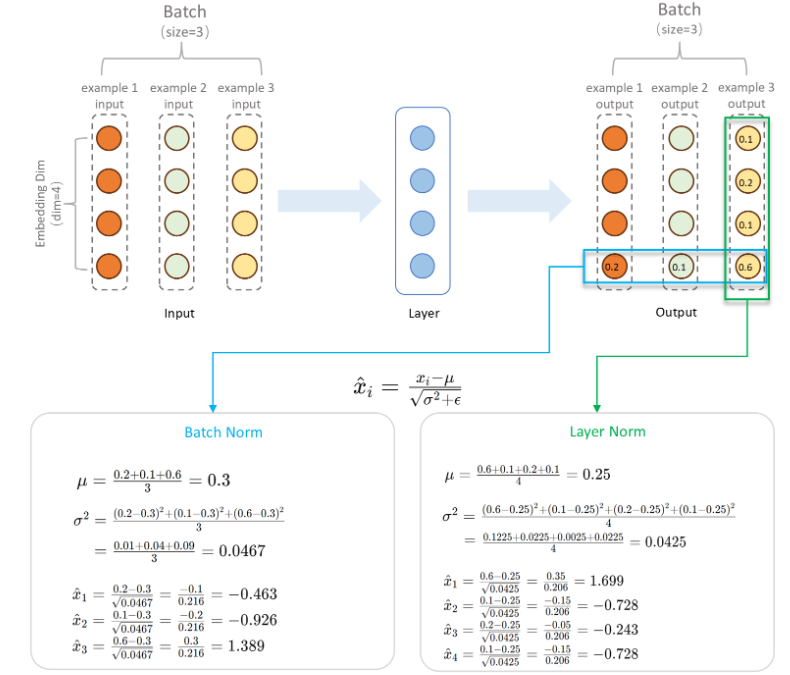

`RMSNorm`Root Mean Square Layer Normalization是一种归一化方法，仅基于输入特征的均方根值进行规范化，不计算均值偏移。

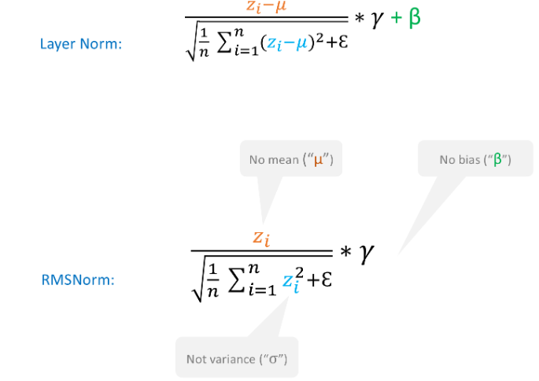

基本结构：SwiGLU 是 Gated Linear Unit（GLU）的变体，将输入向量通过**两条**线性映射，一路直接输出，一路经过 SiLU（Swish）激活后作为门控信号，两者逐元素相乘得到最终输出。激活**优势**：用 SiLU（Swish-1）替换原 GLU 中的 sigmoid，使门控更平滑、梯度更稳定，有助于加速训练收敛并提升下游任务表现。

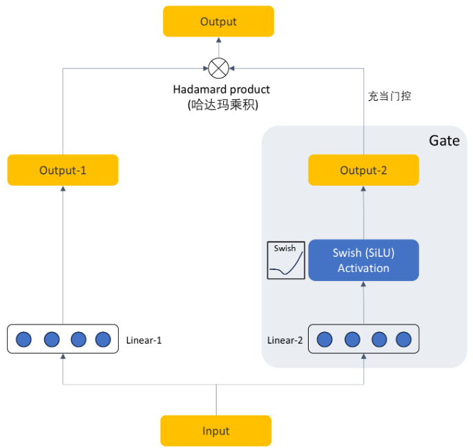

`RoPE`，Rotary Position Embedding，**旋转**位置编码，原理：对 Transformer 中的 Query 和 Key 隐藏向量应用旋转变换（基于正弦、余弦函数），将位置信息编码为向量的**相位差**。相对位置：旋转操作天然地保留了向量之间的相对角度差异，使模型能够捕捉**相对位置**信息而不依赖绝对位置索引。优点：无需额外参数、计算开销低；在长序列场景下相较于传统绝对位置编码具有更好的泛化和性能。

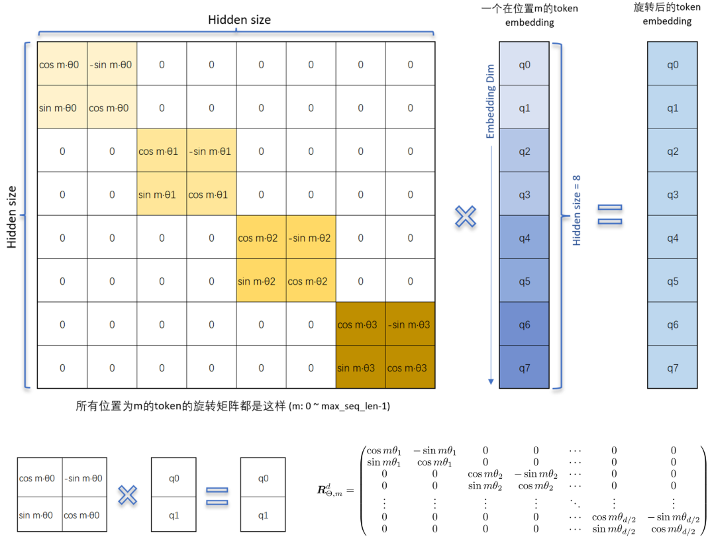